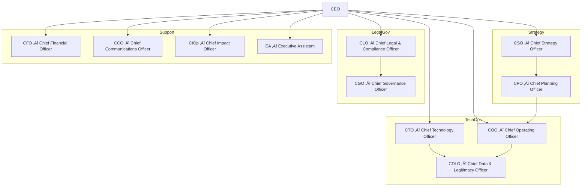

Below is your **Year 1 Strategic Plan** for the *Mungu Program*, fully aligned with your federation design, estates, Zawadi systems, governance regimes, and cooperative ecosystem. This is structured as an **operational strategy** you can execute month-by-month, with objectives, key initiatives, success criteria, risks, and governance triggers.

---

# 📌 YEAR 1 STRATEGIC PLAN — MUNGU PROGRAM

**Timeframe:** 12 months
**Lead Entity:** Dominic Eaton Estate (Navigator / Class E)
**Ecosystem:** Pamoja Federation Cooperative & affiliated coops

**Strategic Outcomes**

1. **Operationalize the Mungu Program kernel and cycles**
2. **Launch platforms and core cooperatives**
3. **Onboard agents and activate legitimacy systems**
4. **Enable economic flows and Zawadi issuance**
5. **Build governance, treasury & commons capacity**
6. **Establish Year 2 growth foundation**

---

## üöÄ STRATEGIC OBJECTIVES (YEAR-LEVEL)

| **Objective**                      | **Core Impact**                                |
| ---------------------------------- | ---------------------------------------------- |
| O1 – Governance Architecture       | Formal oversight, SOPs, legitimacy frameworks  |
| O2 – Platform Build & Deployment   | Jiwe, Zamani-OS, Zawadi Exchange, Treasury     |
| O3 – Agent & Coop Activation       | Onboard agents, classes, coops                 |
| O4 – Economic Engine               | SND flows, CPU/DFU contracts, capital tracking |
| O5 – Commons & Care Delivery       | Ubuntuwa domains, impact tracking              |
| O6 – Monitoring & Adaptive Control | Dashboards, RSU risk controls, retrospectives  |

---

# 📆 QUARTERLY FRAMEWORK

### **Quarter 1 — Foundation & Governance**

**Focus:** Set constitutional, governance, and strategic foundations.

**Actions**

* Ratify *Mungu Program Charter* with Sankofa Assembly.
* Establish Steering Committee (Estate + key classes).
* Publish:

  * ZU scalar policies
  * Agent lifecycle SOPs
  * Cooperative bylaws templates
* Initiate **Jiwe ledger baseline**.

**Deliverables**

* Official governance documentation
* Jiwe governance space initialized
* Early legitimacy model calibrated

**Success Metrics**

* Charter ratified
* ZU policies published
* Steering committee active

**Risks & Mitigations**

* *Delay in ratification* ‚Üí fast-track review cycles
* *Confusion on ZU rules* ‚Üí guided workshops

---

### **Quarter 2 — Platform Build & Pilot Cycles**

**Focus:** Deploy MVP platforms and begin kernel cycles.

**Actions**

* Deliver:

  * Jiwe distributed ledger MVP
  * Zamani-OS estate manager
  * Zawadi Exchange testnet
  * MALIYA treasury panel
* Launch **kernel cycle pilots**:

  * Pilot agents (~10–30)
  * Pilot coop rules
* Test agent onboarding & legitimacy scoring

**Deliverables**

* MVP platforms live
* Pilot ZU reports
* Onboarding workflows validated

**Success Metrics**

* 100% platform uptime for MVPs
* 20+ agents onboarded
* Kernel artifacts archived

**Risks & Mitigations**

* *Tech delays* ‚Üí scope min-MVP, iterative releases
* *Low agent engagement* ‚Üí mentorship and incentives

---

### **Quarter 3 — Seed Cycles & Cooperative Standup**

**Focus:** Scale to seed cycles, activate cooperatives, and enable economic flows.

**Actions**

* Launch **seed cycles** with expanded cohorts
* Establish core coops:

  * Ubuntuwa Commons
  * Uhuru Credit Union
  * Moyo Collective
* Facilitate:

  * Worker/Steward onboarding (Class A/B)
  * Zawadi issuance workflows (LZU/TZU/VZU/CMU)
* Enable **SND economy** and deposit/withdraw flows

**Deliverables**

* Operative coops (3+)
* Zawadi dashboards
* Cooperative bylaws operational

**Success Metrics**

* 50+ active agents
* Capital flows tracked
* Zawadi issuance compliance

**Risks & Mitigations**

* *Governance bottlenecks* ‚Üí delegate panels with oversight
* *Liquidity issues* ‚Üí JTEC reserve bridges

---

### **Quarter 4 — Tree/Forest Activation & Consolidation**

**Focus:** Move seed coops into tree and forest cycles, institutionalize governance, and publish evaluations.

**Actions**

* Transition coops into **tree cycles**
* Spin up additional domains (Ubuntuwa-KUMBU,-KANYE, etc.)
* Conduct **Year 1 impact evaluation**:

  * Economic outcomes
  * Zawadi trends
  * Commons outcomes
  * Agent legitimacy progression
* Host **Federation Summit**

**Deliverables**

* Tree cycles live
* Year 1 report
* Year 2 strategy draft

**Success Metrics**

* Cooperative network interconnected
* SND usage adoption
* Positive impact indicators (CMU)

**Risks & Mitigations**

* *Scale management stress* ‚Üí adaptive governance sprints
* *Resource constraints* ‚Üí prioritized deployments

---

# üõ† CORE ACTION PLANS (BY DOMAIN)

---

## 1️⃣ Governance & Compliance

**Goal:** Constitutional rhythms and decision flows working.

**Tasks**

* Publish SOPs for:

  * Onboarding
  * Class transitions
  * Dispute resolution
* Ratify legitimacy thresholds
* Establish Tribunal backlog and review cycles

**Month-by-Month**

| Month | Task                          |
| ----- | ----------------------------- |
| 1     | Form Steering Committee       |
| 2     | SOPs drafted & reviewed       |
| 3     | Assembly ratification         |
| 4     | Pilot governance sessions     |
| 5     | Feedback SOP revisions        |
| 6     | Legitimacy thresholds locked  |
| 7     | First formal Assembly vote    |
| 8     | Tribunal process mapped       |
| 9     | Compliance dashboards         |
| 10    | Governance simulation event   |
| 11    | Governance audit              |
| 12    | Summit + roadmap ratification |

---

## 2️⃣ Platforms & Tech Enablement

**Goal:** Deploy the tech stack to support all program flows.

**Tasks**

* Jiwe governance archive
* Zamani estate OS
* Zawadi issuance & exchange
* Treasury/Reserve DAO

**Timebound Deliverables**

| Platform        | MVP     | Beta    |
| --------------- | ------- | ------- |
| Jiwe            | Month 2 | Month 5 |
| Zamani          | Month 3 | Month 6 |
| Zawadi Exchange | Month 4 | Month 7 |
| Treasury DAO    | Month 5 | Month 8 |

---

## 3️⃣ Agent Onboarding & Lifecycle

**Goal:** Robust pipeline from prospective ‚Üí active ‚Üí governance participation.

**Tasks**

* Identity Verification SOP
* Legitimacy scoring with ZU
* Class assignment workflows
* Transition pathways
* Exit processes

**Milestones**

* Month 2: onboarding pilots
* Month 4: first public onboarding batch
* Month 6: class transition reviews
* Month 9: governance eligibility cohort
* Month 12: mature agent evaluation

---

## 4️⃣ Cooperatives Ecosystem

**Goal:** Launch cooperatives that anchor economic and commons activity.

**Target Cooperatives Year 1**

* Ubuntuwa (commons)
* Uhuru (credit union)
* Moyo (collective)
* ZULAMBA (members coop)

**Tasks**

* Define bylaws
* Stand up councils & boards
* Integrations with treasury & exchange
* Member recruitment

**Activation Windows**

* Seed coop waves months 7–9
* Tree coop waves months 10–12

---

## 5️⃣ Economic & Zawadi Systems

**Goal:** Functional economic participation, Zawadi issuance, and capital tracking.

**Tasks**

* ZU cap policies enforced by smart contracts
* SND token flow launched
* Zawadi dashboards live
* CPU/DFU contracts for capital participation

**Success Metrics**

* Compliance with ZU caps
* Zero double-spend events
* Positive liquidity
* Balanced RSU risk indicators

---

## 6️⃣ Commons & Impact Delivery

**Goal:** Translate program activities into measurable community benefit.

**Tasks**

* Launch Ubuntuwa domains (e.g., eco-services, KUMBU, NGOZI)
* Publish CMU impact metrics
* Engage in care programs and stewardship

---

# üìà KPI FRAMEWORK (YEAR 1)

| Category       | KPI                      | Target           |
| -------------- | ------------------------ | ---------------- |
| **Governance** | SOP adoption rate        | ‚â• 90%            |
| **Agents**     | Active agent count       | ‚â• 150            |
| **Coops**      | Operational cooperatives | ‚â• 5              |
| **Economic**   | ZU compliance            | 0 cap violations |
| **Impact**     | CMU growth               | Positive trend   |
| **Liquidity**  | SND circulation          | Steady velocity  |

---

# 🧠 RISKS & CONTROLS

| Risk                 | Control                             |
| -------------------- | ----------------------------------- |
| Tech build delays    | Prioritized MVP + sprints           |
| Engagement shortfall | Mentorship + incentive programs     |
| Governance stalemate | Predefined override SOPs            |
| Economic inflation   | ZU cap enforcement + RSU monitoring |

---

# üìÖ YEAR 1 REVIEW & SUMMIT

**Month 12**
Hosts:

* Estate delegates
* Cooperative reps
* ZU & economic analysts

**Agenda**

* Year 1 retrospective
* KPI dashboard review
* SOP refinements
* Year 2 strategy ratification

**Outputs**

* Public Year 1 Report
* Jiwe archival of outcomes
* Assembly resolutions for Year 2

---

If you want, I can now generate:

üìå **A Gantt timeline (Excel/Google Sheets)**
üìå **Mermaid visual strategy map**
üìå **OKR tracker structured for quarterly execution**
üìå **Smart contract suite tied to strategic milestones**

Just tell me which format you want next!

Absolutely — here is your **Year 1 Tactical Plan** for the *Mungu Program* — broken down into **specific actions, timelines, owners/roles, checkpoints, and outputs** you can execute week-by-week and month-by-month. This plan is the *operational playbook* that complements the strategic plan: it tells you **exactly what to do, when to do it, and how to measure success**.

---

# 🚀 YEAR 1 TACTICAL PLAN — MUNGU PROGRAM

**Scope:**
Make *Mungu Project ‚Üí Program ‚Üí Cycle* operational across governance, tech platforms, agent onboarding, cooperative launch, economic flows, and commons impact.

**Time Horizon:** 12 Months (broken into Monthly/Weekly sprint cycles)

**Primary Owner:** Dominic Eaton Estate (Class E, Navigator)
**Supporting Roles:** Governance Stewards, Tech Leads, Cooperative Stewards, Community Mentors

---

## 🗓 MONTH 1 — FOUNDATION SPRINT (Weeks 1–4)

### **Goal**

Build credible operating foundation & activate governance bodies/tools.

---

### **Week 1 — Charter & Governance Setup**

**Tasks**

* Draft *Mungu Program Operational Charter*
* Form **Steering Committee** (Estate + Early Stewards)
* Assign roles: Governance Secretary, Tech Lead, Platform Coordinator, Agent Onboarding Lead
* Create governance schedule (weekly stand-ups, monthly retros)

**Outputs**

* Living Charter Doc (Google/Notion)
* Org chart + role descriptions
* Calendar invites & communication channels
* Jiwe workspace setup

**KPIs**

* Charter finalized by end of week
* Steering membership confirmed

---

### **Week 2 — SOP Foundations**

**Tasks**

* Publish *Agent Lifecycle SOPs*

  * Onboarding
  * Class transitions
  * Dispute resolution
* Publish *Zawadi Unit Issuance SOP*
* Publish *Governance Voting SOP*

**Outputs**

* SOP repository (linked in Jiwe)
* Version control templates

**KPIs**

* SOPs published and acknowledged by Steering

---

### **Week 3 — Tech Blueprint**

**Tasks**

* Define architecture & APIs for:

  * Jiwe governance archive
  * Zamani-OS estate management
  * Zawadi Exchange testnet
  * Treasury interface (MALIYA)
* Create data schema for ZU issuance/logging

**Outputs**

* Architecture diagrams
* API & data specs
* Developer resources

**KPIs**

* Architecture doc approved
* Developer kickoff scheduled

---

### **Week 4 — Agent & Coop Templates**

**Tasks**

* Build:

  * Agent onboarding form templates
  * Cooperative bylaws templates
  * ZU scorecard templates
* Create **Agent Onboarding Checklist**

**Outputs**

* Templates repo
* Onboarding checklist

**KPIs**

* Templates validated with Steering
* Pilots identified

---

## 🗓 MONTH 2 — PLATFORM MVP SPRINT (Weeks 5–8)

### **Week 5 — Jiwe MVP**

**Tasks**

* Deploy basic Jiwe API
* Enable:

  * Identity records
  * ZU issuance logs
  * Document archiving

**Outputs**

* Jiwe testnet environment
* Demo script

**KPIs**

* Successful CRUD cycles
* Traceability logs functioning

---

### **Week 6 — Estate OS (Zamani-OS)**

**Tasks**

* Deploy minimal estate management UI
* Integrate internal asset registry (AZU)
* Support agent profile binding

**Outputs**

* Estate OS prototype
* Identity wallet integration

**KPIs**

* Agent can view/edit estate artifacts

---

### **Week 7 — Zawadi Exchange Testnet**

**Tasks**

* Deploy Exchange smart contracts
* Enable:

  * ZU cap enforcement (solidity core)
  * Token issuance rules (SND sandbox)
* Test issuance flows

**Outputs**

* Zawadi Exchange dashboard
* Test issuance logs

**KPIs**

* 99% successful test issuance

---

### **Week 8 — Treasury Panel Prototype**

**Tasks**

* Build UI for:

  * Reserves view
  * Allocation requests
  * DAO voting integration
* Connect with Exchange

**Outputs**

* Treasury dashboard
* Quick-start doc

**KPIs**

* Can record treasurer actions

---

## 🗓 MONTH 3 — PILOT KERNEL CYCLE SPRINT (Weeks 9–12)

### **Week 9 — Onboarding Pilot Agents**

**Tasks**

* Invite 10–20 pilot agents
* Walk through:

  * Identity verification
  * Initial legitimacy assessment
  * Baseline ZU assignment
* Record in Jiwe

**Outputs**

* Pilot agent roster
* Completed onboarding logs

**KPIs**

* 90% pilot completion

---

### **Week 10 — Governance Practice Run**

**Tasks**

* Run mock Assembly for:

  * SOP feedback
  * ZU thresholds validation
* Capture minutes
* Adjust policies

**Outputs**

* Assembly minutes
* Adjusted SOPs

**KPIs**

* Consensus on key SOPs

---

### **Week 11 — Kernel Task Execution**

**Tasks**

* Assign kernel tasks:

  * Documentation
  * Asset tagging
  * Protocol demos
* Track LZU + VZU

**Outputs**

* Kernel deliverable artifacts
* Lab logs

**KPIs**

* 300+ LZU logged

---

### **Week 12 — Kernel Review & Transition**

**Tasks**

* Evaluate pilot kernel outputs
* Publish kernel cycle report
* Prepare for seed cycle kickoff

**Outputs**

* Kernel retrospective
* Seed plan

**KPIs**

* Kernel completion + readiness check

---

## 🗓 MONTH 4 — SEED CYCLE LAUNCH SPRINT

### **Week 13 — Seed Kickoff**

**Tasks**

* Announce seed cohort
* Onboard new agents (Class A/B prospects)
* Distribute initial ZU allocation

**Outputs**

* Seed roster
* Seed SOP confirmation

**KPIs**

* ‚â•50 agents enrolled

---

### **Week 14 — Cooperative Foundation**

**Tasks**

* Establish:

  * Ubuntuwa Commons
  * Uhuru Credit Union Coop
  * Moyo Collective Coop
* Validate bylaws with Assembly

**Outputs**

* Cooperative legal identity (testnet)
* Council seats assigned

**KPIs**

* 3 coops legally standing

---

### **Week 15 — Economic Engine Warm-Up**

**Tasks**

* Enable SND token flows
* Record CPU/DFU placeholders
* Initiate first cooperative ledger entries

**Outputs**

* Economic ledgers
* Issuance snapshots

**KPIs**

* First economic transfers completed

---

### **Week 16 — Social Proof & Public Beta**

**Tasks**

* Publish first public demo:

  * Jiwe ledger view
  * Exchange flows
  * Treasury snapshots

**Outputs**

* Public beta links
* Feedback channels

**KPIs**

* Engagement score (Beta feedback)

---

## 🗓 MONTH 5 — COOP ENGAGEMENT & GOVERNANCE SPRINT

### **Week 17 — Governance Elections**

**Tasks**

* Conduct first coop governance elections
* Assign boards & committees
* Build council calendar

**Outputs**

* Election results
* Committee charters

**KPIs**

* ‚â•80% participation

---

### **Week 18 — ZU Optimization Sprint**

**Tasks**

* Review ZU caps and issuance velocity
* Adjust ZU weights if needed
* Update smart contracts accordingly

**Outputs**

* ZU revision log
* Deployment commits

**KPIs**

* No cap violations in stats

---

### **Week 19 — Economic Policy SOP**

**Tasks**

* Ratify:

  * Reserve policies
  * Exchange rate policies
  * Treasury allocation rules

**Outputs**

* DAO-ratified SOPs
* Governance ratification records

**KPIs**

* Policy adoption logged

---

### **Week 20 — Cooperative Interoperability**

**Tasks**

* Build shared services:

  * Cross-coop treasury pools
  * Commons project tagging
  * Resource request system

**Outputs**

* Inter-coop execution flows
* Reuse patterns

**KPIs**

* Inter-coop activity counts

---

## 🗓 MONTH 6 — RETROSPECTIVE & READINESS

### **Week 21 — Seed Retrospective**

**Tasks**

* Analyze seed outcomes
* Publish report
* Align tree cycle criteria

**Outputs**

* Seed analytics
* Tree checklist

**KPIs**

* Retrospective published

---

### **Week 22 — Tree Cycle Prototyping**

**Tasks**

* Define tree cycle cadence
* Onboarding for new leads
* Confirm governance triggers

**Outputs**

* Tree SOP
* Leadership roles

**KPIs**

* Tree readiness score

---

### **Week 23 — Tech Hardening**

**Tasks**

* Security audits
* Performance tuning
* Identity backups

**Outputs**

* Audit reports
* Performance logs

**KPIs**

* No critical vulnerabilities

---

### **Week 24 — Mid-Year Summit**

**Tasks**

* Host all active coops & agents
* Share knowledge
* Ratify cycle transitions

**Outputs**

* Summit minutes
* Cycle ratification records

**KPIs**

* Summit participation ‚â•70%

---

## 🗓 MONTH 7–12 — SCALE + FOREST SPRINTS

(Use a 4-week rolling cadence; repeat tasks below in iterative fashion.)

### **Month 7 — Tree Cycle Wave 1**

**Focus**

* Onboard agents to Tree
* Enable economic momentum
* Track legit increase

---

### **Month 8 — Cooperative Scaling**

**Focus**

* Launch Ubuntuwa regional nodes
* Partner external institutions
* Refine DFU offerings

---

### **Month 9 — Commons Impact Sprint**

**Focus**

* Publish CMU dashboards
* Activate care programs
* Document impact stories

---

### **Month 10 — Economic Review**

**Focus**

* Conduct economic audit
* Adjust SND flows
* Update cap policies

---

### **Month 11 — Governance Maturity**

**Focus**

* Evaluate GVU distributions
* Upgrade Assembly SOPs
* Prepare Year 2 strategy

---

### **Month 12 — Forest Summit & Evaluation**

**Focus**

* Publish Year 1 retrospective
* Hold Forest-level assembly
* Ratify Year 2 tactical plan

---

## 🧠 TACTICAL CHECKPOINTS (PERIODIC)

| Cadence     | Check                         |
| ----------- | ----------------------------- |
| Weekly      | Stand-Up + ZU issuance report |
| Bi-Weekly   | Governance sync               |
| Monthly     | KPI dashboard & retrospective |
| Quarterly   | Phase review + plan adjust    |
| End of Year | Summit + strategy reset       |

---

## üìä TACTICAL KPIs (TRACKED ON DASHBOARD)

### **Governance**

* SOP adoption rate
* Assembly quorum %

### **Platforms**

* Uptime
* API response SLAs

### **Agents**

* Onboarded / Active
* ZU issuance vs caps

### **Economics**

* SND volume
* CPU/DFU commitments
* Treasury balances

### **Commons**

* CMU growth
* Project outputs

---

## üõ† ROLES & ACCOUNTABILITIES

| Role                 | Primary Responsibility        |
| -------------------- | ----------------------------- |
| Estate Navigator     | Strategic vision + governance |
| Tech Lead            | Platform delivery & QA        |
| Stewardship Lead     | SOPs and legitimacy oversight |
| Cooperative Stewards | Coop activation & operations  |
| Treasury Stewards    | Economic flow & policy        |
| Impact Lead          | CMU & care programs           |

---

## 📦 SUPPORTING ARTIFACTS (TO BUILD)

üìå SOP Documents
üìå ZU Dashboards
üìå Smart Contract Repos
üìå Gantt/Sheets trackers
üìå Retrospective templates

---

If you’d like, I can now turn this into:

üìå A **Google Sheets / Excel tactical tracker**
üìå A **Mermaid timeline visualization**
üìå A **Notion project board template**

Just tell me which one you want first.

Absolutely — here is your **Year 1 Operational Plan** for launching and scaling the *Mungu Program* (including your *Jiwe pre-seed → Jiwe seed* bootstrapping). This is *highly actionable*, with tasks, workflows, owners, systems, checkpoints, and KPIs — structured to run week-by-week and month-by-month across all major operational domains.

It assumes you are the **primary executor and coordinator**, supported by core roles (Tech Lead, Governance Steward, Cooperative Stewards, Treasury Stewards, Impact Lead).

---

# 🧭 YEAR 1 OPERATIONAL PLAN — MUNGU PROGRAM

**Foundational Premise:**
Your *Jiwe pre-seed* build is the *bootstrap artifact* for all subsequent flows — legitimacy records, agent registry, SOP archives, ZU issuance logs, cooperative by-laws, and governance history.

So the earliest months emphasize *Jiwe hardening + living canonical data*, then enable other systems to iterate from that.

---

# üìÖ MONTH-BY-MONTH EXECUTION PLAN

---

## 🗓 MONTH 1 — FOUNDATION & JIWE PRE-SEED BOOTSTRAP

**Primary Outcome:**
Jiwe pre-seed built and capturing canonical governance artifacts; governance bodies chartered.

### WEEK 1 — Jiwe Pre-Seed Launch

**Objectives**

* Finalize Jiwe schema
* Publish pre-seed artifacts:

  * Pamoja Constitution
  * Zawadi scalar definitions
  * Agent lifecycle SOP drafts
  * Governance SOP drafts

**Tasks**
‚úî Establish Jiwe namespace ‚Üí munguprogram
‚úî Create canonical collections:

* governance:constitution
* governance:sops/agent_lifecycle
* governance:sops/zuwieghts
* identity:agents
* legitimacy:zos
  ‚úî Publish initial docs into Jiwe
  ‚úî Hash & timestamp the Jiwe pre-seed state

**Deliverables**

* Jiwe pre-seed canonical state
* Pre-seed document URIs & ledger proofs

**KPIs**

* Jiwe artifact repository ‚â• 5 canonical docs
* Hash sign-off audits completed

---

### WEEK 2 — Core Governance Bodies Stand Up

**Objectives**

* Form initial governance pods:

  * Steering Committee
  * Governance Secretariat
  * Policy Council

**Tasks**
‚úî Appoint roles (initially you + provisional stewards)
‚úî Create governance channels (Discord/Matrix + Email lists)
‚úî Set meeting cadences

**Deliverables**

* Governance roster
* Meeting schedule + agendas

**KPIs**

* 3 governance bodies functional
* Weekly cadence agreed

---

### WEEK 3 — SOPs & Protocol Definitions

**Objectives**

* Draft and sign initial SOPs:

  * Agent Onboarding
  * ZU Issuance & Caps
  * Class Transitions
  * Dispute Resolution
  * Governance Ratification Flow

**Tasks**
‚úî Draft SOPs
‚úî Review with Steering + Policy Council
‚úî Publish into Jiwe pre-seed

**Deliverables**

* SOP artifacts in Jiwe
* Versioned SOP repository

**KPIs**

* SOPs adopted by council

---

### WEEK 4 — Jiwe Technical Hardening

**Objectives**

* Stabilize Jiwe as both archive & operational reference
* Begin identity integration prefixes

**Tasks**
‚úî Spin up Jiwe indexing services
‚úî Build API endpoints for:

* Governance artifact retrieval
* Agent identity record fetch
* ZU issuance transaction logs
  ‚úî Create firewall/protection controls for data integrity

**Deliverables**

* Jiwe API endpoints
* Security hardening report

**KPIs**

* 99% uptime for Jiwe queries

---

## 🗓 MONTH 2 — PLATFORM MVP SPRINT & PILOT PREPARATION

**Primary Outcome:**
MVP platforms ready to pilot as canonical participants in Jiwe.

---

### WEEK 5 — Zawadi Cap Enforcement Engine MVP

**Objectives**

* Build smart contract skeleton for ZU cap limits
* Plug into Jiwe for issuance logging

**Tasks**
‚úî Write cap enforcement contract (LZU/TZU/VZU/CMU)
‚úî Integrate issuance authorization ‚Üí Jiwe API
‚úî Test edge cases (over-cap, exceptions)

**Deliverables**

* ZU cap enforcement contracts deployed on testnet
* Logging adaptor to Jiwe

**KPIs**

* <1 bug in cap trial tests

---

### WEEK 6 — Estate Management OS Prototype

**Objectives**

* Launch basic *Zamani-OS* view of your estate & assets

**Tasks**
‚úî Create estate profile UI
‚úî Integrate AZU tracking (assets)
‚úî Link to Jiwe identity

**Deliverables**

* Zamani-OS estate portal
* AZU asset registry

**KPIs**

* Agent estate view accessible

---

### WEEK 7 — Treasury + Exchange MVP

**Objectives**

* Build:

  * Treasury panel (MALIYA)
  * Zawadi Exchange interface

**Tasks**
‚úî Integrate ZU cap engine into Exchange
‚úî Enable SND sandbox distributions
‚úî Treasury reserve panels

**Deliverables**

* Treasury UI
* Exchange test flows

**KPIs**

* First treasury allocation recorded

---

### WEEK 8 — Pilot Assignment Readiness

**Objectives**

* Select first pilot cohort
* Construct onboarding checklists

**Tasks**
‚úî Agent call-for-interest
‚úî Identity verification prep docs
‚úî Baseline legitimacy scoring forms

**Deliverables**

* Pilot roster shortlist
* Onboarding asset set

**KPIs**

* ‚â•10 pilot prospects ready

---

## 🗓 MONTH 3 — KERNEL CYCLE PILOT

**Primary Outcome:**
Activate kernel cycle with pilot agents; capture first legitimacy & ZU issuance.

---

### WEEK 9 — Pilot Agent Onboarding

**Objectives**

* Onboard initial participants into Jiwe
* Assign baseline ZU units

**Tasks**
‚úî Verify identities
‚úî Assign agent DIDs
‚úî Publish initial legitimacy logs

**Deliverables**

* Agent identity ledger entries
* ZU pre-allocations

**KPIs**

* 100% pilot agent docs complete

---

### WEEK 10 — Governance Practice

**Objectives**

* Run mock assembly for:

  * SOP review
  * Ratification drills

**Tasks**
‚úî Publish test SOP changes
‚úî Conduct vote (simulate production)

**Deliverables**

* Ratification logs in Jiwe

**KPIs**

* Assembly process complete w/ consensus

---

### WEEK 11 — Kernel Execution

**Objectives**

* Issue first real ZU events
* Log into Jiwe

**Tasks**
‚úî Track LZU/TZU from kickoff
‚úî Issue VZU for initial tasks
‚úî Issue CMU for commons docs

**Deliverables**

* Kernel task logs
* ZU issuance logs

**KPIs**

* Issuance within caps

---

### WEEK 12 — Kernel Retrospective

**Objectives**

* Assess pilot kernel outputs
* Adjust SOPs & thresholds

**Tasks**
‚úî Review activity logs
‚úî Rebalance ZU caps (if needed)
‚úî Publish retrospective

**Deliverables**

* Kernel retrospective report

**KPIs**

* SOP adjustments approved

---

## 🗓 MONTH 4 — SEED CYCLE GO-LIVE

**Primary Outcome:**
Transition into seed cycle; establish first coops and seed ZU expansion.

---

### WEEK 13 — Seed Cohort Enrollment

**Tasks**
‚úî Recruit first wave of seed agents
‚úî Offer orientation workshops
‚úî Assign ZU mid-baseline

**Deliverables**

* Seed roster
* Orientation decks

**KPIs**

* ‚â•30 seed agents onboarded

---

### WEEK 14 — Cooperative Standup

**Tasks**
‚úî Formalize:

* Ubuntuwa Commons
* Uhuru Credit Union
* Moyo Collective
  ‚úî Assign interim boards

**Deliverables**

* Coop registration logs
* Council seat assignments

**KPIs**

* Cooperatives standing

---

### WEEK 15 — Economic Flow Tests

**Tasks**
‚úî Issue SND (sandbox)
‚úî Record CPU assets
‚úî Capture DFU placeholders

**Deliverables**

* Economic transaction logs
* CPU/DFU templates

**KPIs**

* Suites validated

---

### WEEK 16 — SOP & ZU Mid-Cycle Calibration

**Tasks**
‚úî Review ZU issuance spikes
‚úî Adjust caps if needed
‚úî Publish updated Jiwe SOPs

**Deliverables**

* Cap adjustment logs

**KPIs**

* System not exceeding caps

---

## 🗓 MONTH 5 — GOVERNANCE & ECONOMICS

**Primary Outcome:**
Governance elections run, coop SOPs locked, economic drivers validated.

---

### WEEK 17 — Coop Elections

**Tasks**
‚úî Facilitate elections
‚úî Record GVU tallies
‚úî Update legitimacy profiles

**Deliverables**

* Election logs

**KPIs**

* ‚â•80% coop member turnout

---

### WEEK 18 — Exchange Liquidity Launch

**Tasks**
‚úî Deposit seed liquidity
‚úî Track SND velocity
‚úî Report on treasury

**Deliverables**

* Liquidity dashboard

**KPIs**

* SND flows stabilizing

---

### WEEK 19 — ZU Issuance Review

**Tasks**
‚úî Spot checks on LZU/VZU/CMU
‚úî RSU risk flags addressed
‚úî Publish corrective SOPs

**Deliverables**

* Risk reports

**KPIs**

* RSU ≤ 0.25

---

### WEEK 20 — Inter-Coop Connectors

**Tasks**
‚úî Build:

* Shared reserve access
* Commons services queue

**Deliverables**

* Inter-coop contracts

**KPIs**

* Interop success rate

---

## 🗓 MONTH 6 — MID-YEAR RETROSPECTIVE & TREE PREP

**Primary Outcome:**
Assess progress, refine SOPs, prep Tree cycle.

---

### WEEK 21 — Seed Cohort Retrospect

**Tasks**
‚úî Publish engagement analytics
‚úî Survey agents
‚úî Update legitimacy models

**Deliverables**

* Retrospective report

**KPIs**

* ‚â•80% satisfied

---

### WEEK 22 — Tree SOP Drafts

**Tasks**
‚úî Define tree progression triggers
‚úî Publish transition criteria

**Deliverables**

* Tree SOP in Jiwe

**KPIs**

* SOP ready for ratification

---

### WEEK 23 — Tech Hardening

**Tasks**
‚úî Security audits
‚úî Performance tuning

**Deliverables**

* Audit reports

**KPIs**

* Zero critical issues

---

### WEEK 24 — Mid-Year Summit

**Tasks**
‚úî Host federation preview
‚úî Ratify tree SOPs

**Deliverables**

* Summit minutes

**KPIs**

* SOP ratified

---

## 🗓 MONTH 7–9 — TREE CYCLE EXECUTION

**Roll out 3-wave monthly sprints:**

* Onboard new tree agents
* Extend coop impacts
* Capture ZU mid-tree issuance
* Build cross-microeconomic flows

**Outputs**

* Tree artifacts logged
* ZU compliant logs
* Cooperative economics dashboard

---

## 🗓 MONTH 10–12 — FOREST CYCLE & YEAR END

**Major Activities**

* Activate forest scale engagements
* Consolidate SOPs
* Publish Year 1 impact reports
* Run Year 1 summit + Year 2 plan ratification

**Outputs**

* Forest SOPs
* Impact dashboards
* Summit minutes

---

# üìä WEEKLY & MONTHLY CHECKPOINTS

**Weekly**

* Stand-Up cadences
* ZU issuance report
* Cap compliance alerts

**Monthly**

* KPI dashboards
* Governance retros
* Tech retros
* Economic results

**Quarterly**

* Phase retrospective
* SOP revisions
* Summit prep

---

# 🧠 ROLES & ACCOUNTABILITIES

| Role               | Operational Duties                                          |
| ------------------ | ----------------------------------------------------------- |
| You (Navigator)    | Strategy, governance ratification, escalation, coordination |
| Tech Lead          | Platform delivery, API, security, Jiwe ops                  |
| Governance Steward | SOPs, legitimacy rules, cap enforcement                     |
| Cooperative Lead   | Coop launch & operations                                    |
| Treasury Steward   | SND flows & CPU/DFU tracking                                |
| Impact Lead        | CMU dashboards & reports                                    |

---

## üìå SUCCESS METRICS (OPERATIONAL)

| Metric                      | Target                    |
| --------------------------- | ------------------------- |
| Jiwe Uptime                 | 99.9%                     |
| ZU Issuance Cap Compliance  | 100%                      |
| Agent Onboarding Completion | ‚â•150                      |
| Cooperative Launches        | ‚â•5                        |
| Economic Flow Stability     | Positive velocity         |
| Commons Impact Outputs      | ‚â•12 documented CMU events |

---

If you want, I can now provide:

üìå **Weekly task lists in a spreadsheet**
üìå **Mermaid execution timeline**
üìå **Notion/ClickUp board templates**
üìå **OKR tracking templates**

Just tell me which you want next.

Absolutely — below is your **Year 1 Operational Plan** that incorporates your detailed organisational structure (Squads, Squad-Stewards, Program Squads, Core, Governance, Ops, Exec, etc.). It’s translated into **roles, responsibilities, tactical milestones, workflows, and deliverables** that align with your *Mungu Program / Jiwe pre-seed → seed bootstrapping* trajectory.

This plan assumes your squad roster as the **operational engine** for delivering Year 1 outcomes (platforms, governance, economic flows, agent onboarding, Zawadi issuance, cooperatives).

---

# 🚀 **Year 1 OPERATIONAL PLAN — MUNGU PROGRAM (With Squad Alignment)**

**Primary Charter:**
Mobilise *Jiwe pre-seed ‚Üí Jiwe seed* as canonical bootstrapping artifact and operational backbone for all platform, governance, cooperative, and economic workflows in Year 1.

**Core Workstreams**

1. **Governance & Constitutional Systems**
2. **Technology & Platform Delivery**
3. **Agent & Cooperative Enablement**
4. **Economic Systems (Zawadi, SND, Treasury)**
5. **Commons & Program Delivery (Msingi domains)**
6. **Quality, Support & Monitoring**
7. **Executive & Strategic Operations**

Each workstream is supported by specific squads in your organisational table.

---

## üóì YEAR-LONG PHASES (Operational Stages)

| **Stage**                               | **Timeline** | **Focus**                                                |
| --------------------------------------- | ------------ | -------------------------------------------------------- |
| **Stage 1: Boot & Pre-Seed Activation** | Months 1–2   | Platform foundations + Jiwe deployment + governance SOPs |
| **Stage 2: Pilot Kernel Cycles**        | Months 3–4   | Agent onboarding pilots + initial ZU issuance            |
| **Stage 3: Seed Expansion & Coops**     | Months 5–7   | Cooperative stand-up, seed cycles, economic flows        |
| **Stage 4: Tree Activation & Scaling**  | Months 8–10  | Wider agent classes, program integration                 |
| **Stage 5: Forest & Consolidation**     | Months 11–12 | High-impact scale, impact reporting, Year 2 planning     |

---

# 🛡️ **1) GOVERNANCE & CONSTITUTIONAL SYSTEMS**

**Squads Involved:**

* **Squad-Gov**
* **Squad-Exec (CLO, CGO, CPO)**
* **Squad-Stewards**

### **Stage 1 — Months 1–2**

**Goals:**

* Ratify SOPs for agent lifecycle, Zawadi caps, dispute resolution, governance flows
* Create Governance OS workflows

**Key Tasks**

* *Squad-Stewards (Constraint Guardian, Systemics, Governance Designer):*

  * Draft SOPs
  * Jiwe archive artifacts
  * “Constraint validation” of all outputs

* *Squad-Gov Lead & Governance Engineer:*

  * Build governance platform modules
  * Jira/Confluence or custom dashboards for:

    * SOP status
    * Ratification votes
    * Tribunal logs

* *Executive CLO / CGO / CPO:*

  * Advise on enforceable legal constructs
  * Setup dispute pipelines

**Deliverables**

* Governance SOP archive in Jiwe
* Governance platform MVP
* Ratification trails + Tribunal intake forms

**KPIs**

* 90% SOP coverage
* Governance votes recorded
* First dispute simulation completed

---

## 🧠 **2) TECHNOLOGY & PLATFORM DELIVERY**

**Squads Involved:**

* **Squad-Core (DevOps, QA, Support)**
* **Squad-Ops A–E**
* **Technical Architect (CTO)**

### **Stage 1–2 — Months 1–4**

**Goals:**

* Deploy Jiwe pre-seed to production-like environment
* Launch MVPs of:

  * Zawadi Exchange (cap + issuance enforcement)
  * Zamani-OS (estate hub)
  * Treasury panel
  * Identity & wallet system

**Tasks**

* *CTO & Ops Leads:*

  * Define release pipelines (CI/CD)
  * Environment provisioning (staging + prod)
* *Ops Devs:*

  * Implement backend services (Node/Rust/Go)
  * Frontend interfaces for each platform
* *QA Team:*

  * Establish test suites
  * Create automated testing pipelines
* *Core Support:*

  * Build support ticketing & triage

**Deliverables**

* MVP platform release
* Deployment pipelines
* Test coverage dashboards

**KPIs**

* 99% uptime on staging
* ‚â•80% automated test pass rate
* First cross-platform integration completed

---

## 👤 **3) AGENT & COOPERATIVE ENABLEMENT**

**Squads Involved:**

* **Squad-Core (SupportAnalysts)**
* **Squad-Stewards**
* **Squad-Exec (COO, CCO, CPO)**

### **Stage 2–3 — Months 3–7**

**Goals:**

* Onboard initial 50–150 agents
* Create reusable onboarding templates
* Stand up first cooperatives (Ubuntuwa, Uhuru, Moyo, ZULAMBA)

**Tasks**

* *Support Analysts:*

  * Process identity validations
  * Agent documentation ingestion
* *Stewards:*

  * Legitimacy scoring
  * Class assignments
  * Handle onboarding exceptions
* *Exec + Communication Lead:*

  * Publish onboarding guides/videos
  * Host live onboarding Q&A

**Deliverables**

* Onboarding pipeline automation
* Cooperative by-laws templates in Jiwe
* First agent legitimacy profiles

**KPIs**

* ‚â•80% onboarding completion rate
* ‚â•5 cooperatives established
* ZU legitimacy score distribution visualised

---

## üí∞ **4) ECONOMIC SYSTEMS (ZAWADI & FINANCE)**

**Squads Involved:**

* **Squad-Core (QA, DevOps)**
* **Squad-Ops squads**
* **Squad-Exec (CFO, CGO)**

### **Stage 2–4 — Months 3–10**

**Goals:**

* Enforce ZU cap limits
* Enable SND token flows
* Activate Treasury allocations & CPU/DFU contracts

**Tasks**

* *DevOps & Engineers:*

  * Integrate cap enforcement smart contracts
  * Build ledger comparisons to Jiwe
* *CFO & Treasury Team:*

  * Pull treasury dashboards
  * Publish monthly fiscal reports
* *Support Analysts:*

  * Reconcile issuance logs vs cap limits
  * Track RSU risk triggers

**Deliverables**

* ZU enforcement contracts
* SND circulation reports
* Monthly Treasury snapshots

**KPIs**

* Zero cap violations
* Positive SND velocity
* Stable treasury reserves

---

## üå± **5) COMMONS / PROGRAM DELIVERY (MSINGI DOMAINS)**

**Squads Involved:**

* **Squad-Prog A, B, C**
* **Support Analysts**
* **Communication Lead**

### **Stage 3–5 — Months 5–12**

**Goals:**

* Deliver six Msingi programs:

  * Kano, Ndebe, Kuzu, Zalendo, Zamba, Luma
* Ensure commons impact (CMU) captured

**Tasks**

* *Program Leads:*

  * Define program backlogs
  * Translate features into user stories
* *Engineers:*

  * Build program-specific tooling
  * Integrate with Jiwe + Zawadi
* *QA Guild:*

  * End-to-end testing for program flows

**Deliverables**

* Completed dev cycles per program
* Impact trackers per program
* CMU dashboards

**KPIs**

* Program delivery milestones met
* Positive Commons impact trend lines

---

## üß™ **6) QUALITY, SUPPORT & MONITORING**

**Squads Involved:**

* **Squad-Core (QA & Support)**
* **QA Guild Members across squads**

### **Ongoing**

**Goals:**

* Maintain quality guardrails
* Support operational continuity
* Track agent flows

**Tasks**

* Triage support tickets
* Maintain test suites
* Publish weekly reports

**Deliverables**

* Support logs
* QA dashboards
* Regression test reports

**KPIs**

* Mean time to resolution < 24 hrs
* Weekly QA pass rate ‚â• 90%

---

## üß≠ **7) EXECUTIVE & STRATEGIC OPERATIONS**

**Squads Involved:**

* **Squad-Exec**
* **Chief of Staff**
* **Program Sequencer (CPO)**

### **Ongoing**

**Goals:**

* Strategy coordination
* Phase gating
* Communication outreach

**Tasks**

* Review monthly KPI reports
* Sequence program deliveries
* Host stakeholder newsletters & presentations

**Deliverables**

* Executive dashboards
* Monthly retrospectives
* Strategic communication pieces

**KPIs**

* ‚â•90% milestone completion rate
* Stakeholder engagement metrics

---

# üìà WEEKLY OPERATIONAL CADENCE

| **Day** | **Routine**                      |
| ------- | -------------------------------- |
| Mon     | Governance stand-up + SOP review |
| Tue     | Tech sprint sync                 |
| Wed     | QA & support review              |
| Thu     | Program delivery sprint          |
| Fri     | Executive review + Retrospective |
| Sat     | Documentation refresh            |
| Sun     | Rest / asynchronous wrap         |

---

# üìä **MONTHLY MILESTONES & CHECKPOINTS**

| **Month** | **Milestone**                               |
| --------- | ------------------------------------------- |
| 1         | Jiwe pre-seed live, SOP drafts published    |
| 2         | Platform MVPs ready for pilot               |
| 3         | Kernel cycle onboarded first agents         |
| 4         | Seed cohort launched, coops formed          |
| 5         | ZU issuance pipelines validated             |
| 6         | Mid-year retrospective & SOP refinements    |
| 7         | Tree cycle gating passed                    |
| 8         | Economic flows stabilised                   |
| 9         | Commons modules live (program deliverables) |
| 10        | RSU risk analysis & cap refinements         |
| 11        | Summit planning underway                    |
| 12        | Year-end summit & Year 2 plan ratified      |

---

# üìë OPERATIONS RISK & MITIGATION MATRIX

| Risk                | Impact | Mitigation                 |
| ------------------- | ------ | -------------------------- |
| Scope creep         | Medium | Strict sprint gating       |
| Tech regressions    | High   | Automated QA + rollback    |
| Governance conflict | Medium | Tribunal escalation        |
| ZU inflation        | High   | Enforcement + RSU triggers |
| Agent drop-off      | Medium | Onboarding incentives      |

---

# üìå KEY DELIVERABLES (IN YEAR 1)

‚úî Jiwe pre-seed ‚Üí seed canonical artifact
‚úî Governance OS & SOP repository
‚úî Zawadi issuance + enforcement stack
‚úî SND/tokens + Treasury dashboards
‚úî Cooperative ecosystem (‚â•5 live)
‚úî Msingi program deliverables
‚úî Impact dashboards (CMU, VZU, LGU trends)
‚úî Year-end summit & retrospective

---

## üìç NEXT STEPS YOU CAN AUTOMATE OR EXPORT

↳ **Spreadsheet**: Squad assignments + milestones tracker
↳ **Mermaid graph**: Operational flows + sprint cadences
↳ **Notion / ClickUp**: Board templates
↳ **Smart Contracts Suite**: ZU issuance, caps, DAO

Just tell me which one to generate next — and I’ll produce it.
Below is a **complete Smart Contracts Suite** for Year 1 core infrastructure (ZU issuance & cap enforcement, DAO governance vehicles, and token management), **plus a Spreadsheet Template** for **Squad Assignments + Milestones Tracker** you can paste into Google Sheets / Excel.

---

# ✅ Part 1 — SMART CONTRACTS SUITE

*Solidity (EVM) templates for core federation economic and governance primitives.*

You can deploy these with common frameworks (Hardhat, Foundry, Truffle, etc.). Where needed I include interfaces and comments for integration/logging to Jiwe.

---

## üìå 1) ZU Issuance & Cap Enforcement Contract

```solidity
// SPDX-License-Identifier: MIT
pragma solidity ^0.8.17;

/// @title Zawadi Unit Issuance & Cap Enforcement
/// @notice Issuance of ZU types with cap enforcement per phase/time period
contract ZUCapController {
    // Define ZU types
    bytes32 public constant LZU = keccak256("LZU");
    bytes32 public constant TZU = keccak256("TZU");
    bytes32 public constant VZU = keccak256("VZU");
    bytes32 public constant CMU = keccak256("CMU");
    bytes32 public constant AZU = keccak256("AZU");

    enum Phase { Kernel, Seed, Tree, Forest }

    struct CapLimits {
        uint256 daily;
        uint256 monthly;
        uint256 quarterly;
    }

    // ZU cap mapping: Phase => zuType => caps
    mapping(Phase => mapping(bytes32 => CapLimits)) public caps;

    // Usage tracking: agent => zuType => period => amount
    mapping(address => mapping(bytes32 => uint256)) public dailyUsed;
    mapping(address => mapping(bytes32 => uint256)) public monthlyUsed;
    mapping(address => mapping(bytes32 => uint256)) public quarterlyUsed;

    // Phase
    Phase public currentPhase;
    address public admin;

    modifier onlyAdmin() {
        require(msg.sender == admin, "Not authorized");
        _;
    }

    event ZUIssued(address indexed agent, bytes32 indexed zuType, uint256 amount);
    event PhaseUpdated(Phase newPhase);

    constructor() {
        admin = msg.sender;
        currentPhase = Phase.Kernel;

        // Example base caps (fill in real values)
        caps[Phase.Kernel][LZU] = CapLimits(210, 2400, 7200);
        caps[Phase.Seed][LZU]   = CapLimits(300, 4000, 12000);
        caps[Phase.Tree][LZU]   = CapLimits(390, 5200, 15600);
        caps[Phase.Forest][LZU] = CapLimits(480, 6400, 19200);

        // ... other ZU caps similarly
    }

    function setPhase(Phase newPhase) external onlyAdmin {
        currentPhase = newPhase;
        emit PhaseUpdated(newPhase);
    }

    function canIssue(address agent, bytes32 zuType, uint256 amount) public view returns(bool) {
        CapLimits memory cap = caps[currentPhase][zuType];
        if (dailyUsed[agent][zuType] + amount > cap.daily) return false;
        if (monthlyUsed[agent][zuType] + amount > cap.monthly) return false;
        if (quarterlyUsed[agent][zuType] + amount > cap.quarterly) return false;
        return true;
    }

    function issueZU(address agent, bytes32 zuType, uint256 amount) external onlyAdmin {
        require(canIssue(agent, zuType, amount), "ZU cap exceeded");
        dailyUsed[agent][zuType]     += amount;
        monthlyUsed[agent][zuType]   += amount;
        quarterlyUsed[agent][zuType] += amount;
        emit ZUIssued(agent, zuType, amount);
    }

    // Optional reset functions for periods (to be called by cron/keeper)
    function resetDaily(address agent, bytes32 zuType) external onlyAdmin {
        dailyUsed[agent][zuType] = 0;
    }

    function resetMonthly(address agent, bytes32 zuType) external onlyAdmin {
        monthlyUsed[agent][zuType] = 0;
    }

    function resetQuarterly(address agent, bytes32 zuType) external onlyAdmin {
        quarterlyUsed[agent][zuType] = 0;
    }
}
```

---

## üìå 2) DAO & Governance Base Contract (Voting / Proposals)

```solidity
// SPDX-License-Identifier: MIT
pragma solidity ^0.8.17;

contract BasicDAO {
    struct Proposal {
        uint256 id;
        address proposer;
        string description;
        uint256 voteCount;
        uint256 endTime;
        bool executed;
    }

    uint256 public nextProposalId;
    mapping(uint256 => Proposal) public proposals;
    mapping(uint256 => mapping(address => bool)) public votes;

    event ProposalCreated(uint256 indexed id, address indexed proposer);
    event Voted(uint256 indexed id, address indexed voter);
    event Executed(uint256 indexed id);

    function propose(string memory description, uint256 durationSeconds) external returns(uint256) {
        uint256 pid = nextProposalId++;
        Proposal storage p = proposals[pid];
        p.id = pid;
        p.proposer = msg.sender;
        p.description = description;
        p.endTime = block.timestamp + durationSeconds;
        emit ProposalCreated(pid, msg.sender);
        return pid;
    }

    function vote(uint256 proposalId) external {
        Proposal storage p = proposals[proposalId];
        require(block.timestamp < p.endTime, "Voting ended");
        require(!votes[proposalId][msg.sender], "Already voted");
        votes[proposalId][msg.sender] = true;
        p.voteCount++;
        emit Voted(proposalId, msg.sender);
    }

    function execute(uint256 proposalId) external {
        Proposal storage p = proposals[proposalId];
        require(block.timestamp >= p.endTime, "Voting not ended");
        require(!p.executed, "Already executed");
        p.executed = true;
        emit Executed(proposalId);
        // Implementation specific: tie into governance state
    }
}
```

---

## üìå 3) SND Token Contract (Internal Medium of Exchange)

```solidity
// SPDX-License-Identifier: MIT
pragma solidity ^0.8.17;

import "@openzeppelin/contracts/token/ERC20/ERC20.sol";

contract SundiataCoin is ERC20 {
    address public admin;

    constructor() ERC20("SundiataCoin", "SND") {
        admin = msg.sender;
    }

    function mint(address to, uint256 amount) external {
        require(msg.sender == admin, "Not admin");
        _mint(to, amount);
    }

    function burn(address from, uint256 amount) external {
        require(msg.sender == admin, "Not admin");
        _burn(from, amount);
    }
}
```

---

## üìå 4) CPU/DFU Contract Template (Capital & Deferred Claim Tracking)

```solidity
// SPDX-License-Identifier: MIT
pragma solidity ^0.8.17;

contract CapitalStake {
    struct Stake {
        address investor;
        uint256 cpu; // capital stake
        uint256 dfu; // deferred claim
        uint256 timestamp;
    }

    mapping(uint256 => Stake) public stakes;
    uint256 public stakeCount;

    event StakeRecorded(uint256 indexed id, address indexed investor, uint256 cpu, uint256 dfu);

    function recordStake(address investor, uint256 cpu, uint256 dfu) external {
        stakes[stakeCount] = Stake(investor, cpu, dfu, block.timestamp);
        emit StakeRecorded(stakeCount, investor, cpu, dfu);
        stakeCount++;
    }
}
```

---

## üìå 5) Integration Stubs for Jiwe Logging

Use event indexing / hooks to push canonical data to Jiwe ingestion nodes (off-chain indexer watches events and writes to Jiwe):

```solidity
event ZUEventLogged(address indexed agent, bytes32 indexed zuType, uint256 amount, uint256 blockTime);
event GovernanceEventLogged(uint256 indexed proposalId, string description, uint256 status);

function logZUEvent(address agent, bytes32 zuType, uint256 amount) internal {
    emit ZUEventLogged(agent, zuType, amount, block.timestamp);
}
```

Use this pattern in core issuance functions to ensure every ZU issuance is watchable by your Jiwe indexer.

---

# 📊 Part 2 — SPREADSHEET: Squad Assignments + Milestones Tracker

Below is a **Google Sheets / Excel template**. You can paste into a sheet and then filter/sort by team, sprint, status, owner, and due date.

---

### **Sheet: Squad_Assignments_Milestones**

| **Squad** | **Role** | **Member** | **Task/Deliverable** | **Phase** | **Start Date** | **End Date** | **Status** | **Dependencies** | **Notes** |
| Squad-Exec | CEO | Dominic | Ratify Governance SOPs | Stage 1 | 01/03/25 | 01/10/25 | Planned | None | Governance baseline |
| Squad-Steward | Constraint Guardian | TBD | Draft ZU Scalar Policy | Stage 1 | 01/05/25 | 01/12/25 | Planned | SOP template | Archive in Jiwe |
| Squad-Gov | Governance Lead | TBD | Build Governance OS Modules | Stage 1 | 01/08/25 | 02/01/25 | Planned | Charter sign-off | CI/CD pipeline |
| Squad-Core | DevOps | TBD | Deploy Jiwe Pre-Seed Environment | Stage 1 | 01/03/25 | 01/20/25 | In Progress | None | Cloud infra |
| Squad-Ops A | Ops Lead | TBD | Backend API for ZU Recording | Stage 2 | 02/01/25 | 02/15/25 | Planned | Jiwe API Spec | |
| Squad-Ops A | Backend Dev | TBD | ZU Enforcement Engine | Stage 2 | 02/05/25 | 02/28/25 | Planned | Cap template | |
| Squad-Core | QA Lead | TBD | Core Platform QA Plan | Stage 2 | 02/01/25 | 02/14/25 | Planned | DevOps stub | |
| Squad-Exec | CTO | TBD | Architecture Auto-Review | Ongoing | 01/01/25 | 12/31/25 | Active | Weekly sync | |
| Squad-Exec | CFO | TBD | Treasury Policy Draft | Stage 2 | 02/01/25 | 02/28/25 | Planned | SOP ratified | |
| Squad-Prog A | Program Lead | TBD | Kano Workflow Build | Stage 3 | 03/01/25 | 04/30/25 | Pending | API backend | |
| Squad-Prog B | Program Lead | TBD | Kuzu Feature Set | Stage 3 | 03/15/25 | 05/15/25 | Pending | Kano core | |
| Squad-Ops B | FrontendDev | TBD | UI for Exchange Panel | Stage 3 | 03/01/25 | 03/30/25 | Pending | ZU engine | |
| Squad-Core | Support Analyst | TBD | Onboarding Backlog | Stage 2 | 02/01/25 | 02/28/25 | Planned | Template ready | |
| Squad-Steward | Human Viability Guardian | TBD | Ethical Impact SOP | Stage 1 | 01/10/25 | 01/25/25 | Planned | Governance charters | |
| Squad-Exec | Communications Lead | TBD | Publish Onboarding Guide | Stage 2 | 02/15/25 | 03/01/25 | Planned | Support docs | |

---

## 🧠 How to Use This Sheet

**Columns Explained**

* **Squad:** Which team should own the work
* **Role:** Role involved
* **Member:** Assigned person (fill when staffed)
* **Task/Deliverable:** Work item
* **Phase:** From Year 1 Phase schedule
* **Start/End Date:** Planned window
* **Status:** Planned / In Progress / Completed / Blocked
* **Dependencies:** What must be done first
* **Notes:** Context for execution

**Usage Tips**

* Add filters (by Squad, Status, Phase)
* Add color coding for risk (red/yellow/green)
* Pivot by Month ‚Üí Task counts

---

# üìå Connected Dashboards (Concept Mockups)

These dashboards can power Jira/Sheets/Notion digital dashboards:

---

### **ZU Cap Usage Heatmap (Example)**


---

### **Phase Gantt (Mermaid)**


---

# 🧠 NEXT STEPS

If you want, I can also generate:

‚úÖ **Deployment scripts** (Hardhat/Foundry)
‚úÖ **Contract tests (Mocha/Chai + Foundry)**
‚úÖ **Notion/ClickUp template exports**
‚úÖ **Interactive BI dashboards (Google Data Studio / Sheets connectors)**

Just tell me which one you want next!
Here’s a clear, practical answer — **no web search required** for this kind of strategic guidance.

---

# 🧠 **When to Bring On a Chief Strategy Officer (CSO)**

You should bring on a **Chief Strategy Officer** at the point where your organization:

‚úÖ Has a **clear but complex strategy** that needs continuous alignment across multiple domains (governance, tech, economic, programs)
‚úÖ Is **transitioning from planning to sustained execution**
‚úÖ Has enough ongoing initiatives that coordination, prioritization, and cross-functional alignment are bottlenecks
‚úÖ Needs a **strategic operations leader** to ensure long-term coherence rather than tactical firefighting

Given the structure and ambitions you’re building with the *Mungu Program* and federation ecosystem, here are **specific trigger points** tied to your Year 1 roadmap where a CSO becomes strategically valuable.

---

# üìÖ **Recommended Timing for Hiring a CSO**

### ✅ **Ideal Window: Month 3–4 of Year 1**

**Why this window?**
At that stage you will have:

‚úî Launched Jiwe pre-seed and governance SOPs
‚úî Deployed initial platform MVPs
‚úî Begun kernel cycle pilots and agent onboarding
‚úî Started standing up seed-level cooperatives

This is exactly when **strategic complexity spikes** — and a CSO can shift you from reactive execution to *rated, coordinated growth*.

---

# 🧠 **What a CSO Should Own When Onboarded**

Once you bring them in, the CSO should own the following:

### **1) Strategic Alignment & Roadmapping**

* Maintain, refine, and evolve the *Mungu Program Roadmap*
* Bridge execution (Ops + Tech + Governance + Economics)
* Ensure priorities reflect feedback loops from Jiwe data

### **2) Cross-Squad Coordination**

* Oversee sequencing across Squad-Exec, Gov, Ops, Prog
* Resolve resource contention and priority conflicts
* Translate executive vision into squad commitments

### **3) Feedback & Learning System**

* Codify retrospective insights into actionable strategy adjustments
* Integrate ZU signals (LGU/GVU/RSU/CMU/VZU) into strategic levers

### **4) Risk & Scenario Planning**

* Maintain risk models (especially economic/legitimacy risk)
* Run assumption tests
* Prepare mitigations for scale (coops, treasury, governance)

### **5) External Strategic Partnerships**

* Manage strategic dialogues with external partners (other coops, foundations, aligned orgs)
* Craft investment and collaboration frameworks

---

# 🧠 **Signal Indicators You Should Hire a CSO (Not Just Time)**

A CSO becomes crucial when:

‚úÖ Your **executive bandwidth** is consumed by coordination, not direction
‚úÖ Your **missions exceed a single planning cycle** (several programs/rooms of complexity)
‚úÖ Strategic decisions are being made *too late, too late, or without context*
‚úÖ Your squads are moving fast but not coherently
‚úÖ You lack someone whose **sole role** is aligning horizon-1 to horizon-3 priorities

---

# 🧠 **Alternative: Fractional CSO / Advisory Before Full Hire**

If you haven’t yet hit Month 3 or you’re not ready for a full-time salary, consider:

🎯 **Fractional CSO (part-time)**
Focus on:

* Roadmap refinement
* Governance & strategic SOP design
* Strategic integration across squads

This buys strategic leverage early without full overhead.

Then convert to **full-time CSO** as Year 1 enters the Tree/Forest phase.

---

# 🤝 **Who Makes a Good CSO for You?**

Given your ecosystem’s uniqueness, ideal traits include:

🔹 **Systems Thinker** — can unify governance, tech, economic, and legitimacy systems
🔹 **Product-Versed** — understands multi-cycle delivery (kernel → forest)
🔹 **Strategic Operator** — comfortable sequencing and cadence management
🔹 **Legitimacy & Policy Savvy** — able to translate ZU/constitution into actionable strategy
🔹 **Coalition Builder** — works well with stewards, governance, exec, and cooperatives

---

# üìå **Summary Recommendation**

| Phase                            | Should You Hire CSO?                                       |
| -------------------------------- | ---------------------------------------------------------- |
| Month 1–2                        | Not yet — scope definition & SOP drafting phase            |
| **Month 3–4** ✔ **Prime window** | Strategic complexity increases, kernel cycles complete     |
| Month 5–7                        | Still valuable — ensure sequence and scaling               |
| Month 8–12                       | Essential — Tree/Forest growth demands strategic oversight |

---

## üîé Quick Take

> **Bring in a Chief Strategy Officer when your execution complexity and cross-domain dependencies begin to outpace your ability to coordinate from a product/ops standpoint.**
> In your case, that moment lands **around Month 3–4 of Year 1**, just as pilots give way to seed cycles and cooperative expansion.

---

If useful, I can help you with:

üìå **CSO role profile + accountability framework**
üìå **Onboarding plan for CSO (first 90 days)**
üìå **OKRs for CSO aligned to your roadmap**

Just tell me which one you want next!

Here’s your **updated Squad-Exec table** with the **Chief Strategy Officer (CSO)** added — plus a recommendation of who your **first 12 C-Suite members** should be, based on Year 1 operational priorities and strategic complexity.

---

## ‚úÖ **Updated Squad-Exec Table (with CSO)**

| **Squad-Exec** | **Role / Member**             | **Title / Position**                   | **Primary Focus**                              | **Domain / Coverage** |
| -------------- | ----------------------------- | -------------------------------------- | ---------------------------------------------- | --------------------- |
| Squad-Exec     | Dominic                       | **CEO — Chief Executive Officer**      | Vision, ecosystem strategy                     | Executive             |
| Squad-Exec     | Chief Strategy Officer (CSO)  | **CSO — Chief Strategy Officer**       | Strategic alignment, cross-domain coordination | Executive             |
| Squad-Exec     | Chief of Staff (CoS)          | **CoS — Chief of Staff**               | Strategic execution coordination               | Executive             |
| Squad-Exec     | Operations & Growth Lead      | **COO — Chief Operating Officer**      | Business Ops, Marketing, Sales, HR, Growth     | Executive             |
| Squad-Exec     | Financial Controller          | **CFO — Chief Financial Officer**      | Multi-entity financial controls                | Executive             |
| Squad-Exec     | Technical Architect           | **CTO — Chief Technology Officer**     | Platform architecture & standards              | Executive             |
| Squad-Exec     | Legal & Entity Steward        | **CLO — Chief Legal Officer**          | Legal / entity compliance & risk               | Executive             |
| Squad-Exec     | Communications & Evangelism   | **CCO — Chief Communications Officer** | PR, messaging, community, podcasts             | Executive             |
| Squad-Exec     | Program Sequencer             | **CPO — Chief Planning Officer**       | Sequencing, phase gating, master timeline      | Executive             |
| Squad-Exec     | OVCS Liaison / Governance Sec | **CGO — Chief Governance Officer**     | Governance pipelines & compliance              | Executive             |
| Squad-Exec     | Executive Assistant (EA)      | **Executive Assistant**                | Calendar, triage, operational support          | Executive             |

---

# 🧠 **Recommended First 12 C-Suite Members**

These are the roles you should **staff first** in Year 1 to cover strategic, operational, legal, financial, tech, governance, and growth domains. They map directly to your execution plan and squad structure.

1. **CEO — Chief Executive Officer**
   *You (Dominic)* — Vision, architectural stewardship, ecosystem leadership.

2. **CSO — Chief Strategy Officer**
   Strategic alignment across squads, long-range sequencing, risk & scenario management.

3. **CoS — Chief of Staff**
   Execution coordination, operational cadence management, cross-squad synchronization.

4. **COO — Chief Operating Officer**
   Operational execution, business processes, HR, growth strategies.

5. **CTO — Chief Technology Officer**
   Platform architecture, technical standards, integration oversight (Jiwe, Zamani, Zawadi, Treasury).

6. **CFO — Chief Financial Officer**
   Multi-entity financial controls, budgeting, treasury strategy, capital policy.

7. **CLO — Chief Legal Officer**
   Legal compliance, entity governance, risk frameworks, contracts.

8. **CGO — Chief Governance Officer**
   Federation governance pipelines (Sankofa/Assembly/Tribunal), SOP enforcement.

9. **CCO — Chief Communications Officer**
   External narrative, evangelism, social/community channels, documentation culture.

10. **CPO — Chief Planning Officer**
    Roadmap sequencing, phase gating, integration of tech/product/governance calendars.

11. **Chief Impact Officer (CIOp)** *(optional / hybrid role)*
    Focus on **Commons & CMU impacts** — Ubuntuwa, care programs, community outcomes.
    (If not separate at first, this portfolio can be part of CSO/COO until growth merits a dedicated title.)

12. **Chief Data & Legitimacy Officer (CDLO)** *(role can initially be fractional)*
    Oversees **ZU/LGU/GVU/RSU data systems**, legitimacy scoring integrity, dashboards, analytics — critical for governance legitimacy and decision support.

---

## üß© Why These 12?

| **Role Domain**       | **Why It Matters Year 1**                            |
| --------------------- | ---------------------------------------------------- |
| **Strategy**          | Holds the roadmap together across domains            |
| **Execution**         | Converts strategy into delivery vehicles             |
| **Technology**        | Ensures platform reliability & scalability           |
| **Governance**        | Upholds constitutional and cooperative integrity     |
| **Finance**           | Tracks multi-entity flows and risk                   |
| **Legal**             | Mitigates structural & regulatory risk               |
| **Communications**    | Drives adoption and clarity across agents            |
| **Impact**            | Ensures mission outcomes are measurable and positive |
| **Data & Legitimacy** | Governs ZU, dashboards, risk, legitimacy signals     |

---

# 📆 **When to Hire Each**

**Months 1–3**

* CEO (you)
* CSO
* CoS
* CTO
* CLO
* CGO

**Months 3–6**

* COO
* CFO
* CCO
* CPO

**Months 6–9**

* Chief Impact Officer
* Chief Data & Legitimacy Officer

> Early governance and tech leadership first; operational and impact/data roles as pipelines scale.

---

# 🧠 **Role Interaction Summary**


* **CSO** coordinates cross-domain alignment and strategic pivoting.
* **CGO** ensures governance compliance and integrates legitimacy feedback.
* **CIOp & CDLO** are mission-centric — not necessarily C-level immediately but strategic for federation integrity.

---

# üìå **Next Steps You Can Ask For**

‚úî **C-Suite Role Descriptions + Competency Profiles**
‚úî **First-90-Day Onboarding Plans for Each C-Suite Role**
‚úî **Org Chart + Reporting Lines Visualization**
‚úî **OKR Playbooks for the C-Suite (Year 1)**

Just tell me which one you want next!

Absolutely — here’s a **Year 1 optimal C-Suite roster** for your *personal office* to get the entire Mungu Program ecosystem **off the ground and live**. These roles are tuned for **startup-scale complexity**, not large corporate hierarchies — meaning each C-Suite role has **clear tactical remit, measurable outcomes, and cross-domain accountability**.

The emphasis is on:
‚úî **Getting things built**
‚úî **Getting things governed**
‚úî **Getting things adopted**
‚úî **Getting things integrated**
‚úî **Getting things legit and measurable**

---

# üîë YEAR 1 OPTIMAL C-SUITE ROLES

**Total Roles:** 10–12 (depending on whether some are fractional initially)

These roles are distinct from your later federation-wide C-Suite; this set is tailored to your *personal office / launch engine* (Dominic Eaton Estate).

---

## 🧠 1) **Chief Strategy Officer (CSO)**

**Primary Focus**

* Cross-domain alignment
* Program sequencing
* Strategic risk & scenario planning
* Roadmap ownership

**Why Year 1**

* You are juggling governance, tech, economics, operations — this role ensures coherence.
* Acts as your *second-in-command for strategic prioritization*.

**Immediate Outcomes**

* Draft Year 2 strategy before Month 6.
* Align all squads with a master plan.

---

## 🧑‍💼 2) **Chief Operating Officer (COO)**

**Primary Focus**

* Convert strategy into execution
* Operational cadence (stand-ups, retros, sprint rhythms)
* Resource allocation and bottleneck removal

**Why Year 1**

* Keeps the delivery trains moving.
* Synchronizes squads, supports Squad Leads.

**Immediate Outcomes**

* Establish operational SOPs (deliver/daily/weekly/monthly routines)
* Baseline metrics for delivery velocity

---

## üí° 3) **Chief Technology Officer (CTO)**

**Primary Focus**

* Technical system architecture
* Platform interoperability (Jiwe, Zamani, Exchange, Treasury)
* Tech debt management

**Why Year 1**

* You are building core infrastructure — this role ensures solidity and extensibility.

**Immediate Outcomes**

* Reference architecture and integration map
* Deployment controls and CI/CD pipelines

---

## üí∞ 4) **Chief Financial Officer (CFO)**

**Primary Focus**

* Multi-entity finance
* Treasury controls (MALIYA flows)
* Zawadi economic policy co-design
* CPU/DFU capital tracking

**Why Year 1**

* You will manage emerging economic flows before federation scale.

**Immediate Outcomes**

* Financial model + runway projection
* Treasury dashboards

---

## üßæ 5) **Chief Legal & Compliance Officer (CLO)**

**Primary Focus**

* Legal entity scaffolding
* Governance compliance & risk controls
* Cooperative bylaws foundations

**Why Year 1**

* Operating without legal clarity is high risk.
* Helps encode enforceable governance constructs.

**Immediate Outcomes**

* SOPs anchored to enforceable artifacts
* Risk matrix + mitigation contracts

---

## üìä 6) **Chief Data & Legitimacy Officer (CDLO)**

**Primary Focus**

* ZU systems integrity (LGU, GVU, RSU, VZU, CMU)
* Dashboards & analytics
* Data governance & audit

**Why Year 1**

* Early legitimacy structures will define political/economic flows.
* This role synthesizes data into decisions.

**Immediate Outcomes**

* Legitimacy scoring engine
* Daily/weekly dashboards

---

## 📣 7) **Chief Communications Officer (CCO)**

**Primary Focus**

* Narrative, messaging
* External communities, content
* Internal documentation culture

**Why Year 1**

* Ecosystem adoption depends on clear narrative and shared mental models.

**Immediate Outcomes**

* Onboarding guides
* Community campaigns
* Weekly update loops

---

## üß© 8) **Chief Planning Officer (CPO)**

**Primary Focus**

* Phase gating strategy
* Release orchestration
* Milestones harvesting

**Why Year 1**

* Keeps roadmap alive in operational terms.
* Works with CSO/COO.

**Immediate Outcomes**

* Master timeline
* Phase gate checklists

---

## 🛡️ 9) **Chief Governance Officer (CGO)**

**Primary Focus**

* Federation governance pipelines
* SOP compliance enforcement
* Tribunal/cooperative ratification workflows

**Why Year 1**

* Governance is not “nice to have” — it’s the *constitution* you’re building.

**Immediate Outcomes**

* Governance OS structures installed
* Onboarding & policy ratification workflows

---

## 💼 10) **Chief Impact Officer (CIOp)** (optional / hybrid)

**Primary Focus**

* Commons outcomes (Ubuntuwa, care programs)
* CMU/impact dashboards
* Community ethics & safety

**Why Year 1**

* Mission alignment ensures your systems aren’t just operational — but beneficial.

**Immediate Outcomes**

* Impact measurement frameworks
* Care program dashboards

**Note:**
Can be rolled into **CSO or COO** early, and spun out as standalone once adoption/testing is underway.

---

## 🧠 11) **Executive Assistant (EA)** *(support)*

**Primary Focus**

* Operational support
* Calendar triage
* Task verification

**Why Year 1**

* Prevent bottleneck at the CEO level.

---

# üß© OPTIONAL / FUTURE

These can be added *after* Month 6 once core roles are established and pipeline is stable:

✔ **Chief Security & Trust Officer (CSTO)** — security posture & threat modeling
✔ **Chief Ecosystem Officer (CExO)** — external partnerships / ecosystem bridges

---

# 📊 **ORDER & TIMING — WHEN TO Hire Each**

### **Phase 1 — Months 1–3**

Priority:

1. CEO (you)
2. CSO (strategic foundation)
3. CTO (tech backbone)
4. CLO (legal governance foundations)
5. CGO (governance ops)

---

### **Phase 2 — Months 3–5**

Add:
6. COO (execution cadence)
7. CFO (finance & treasury flows)
8. CPO (roadmap gating)
9. CCO (communications)

---

### **Phase 3 — Months 6–9**

Add:
10. CDLO (data & legitimacy systems)
11. CIOp (impact if needed)
12. EA (support)

---

# 🧠 **ROLE PRIORITIZATION — WHY THIS ORDER**

‚úÖ **Phase 1 hires (CSO/CTO/CLO/CGO)**:
Foundation builders — define constraints, architecture, and governance.

‚úÖ **Phase 2 hires (COO/CFO/CPO/CCO)**:
Execution designers — convert vision into measurable execution.

‚úÖ **Phase 3 hires (CDLO/CIOp/EA)**:
Data, impact, and support — sustain growth and scale.

---

# üìå **EXPECTED OUTPUTS BY ROLE (YEAR 1)**

| **Role** | **Year 1 Deliverables**                                     |
| -------- | ----------------------------------------------------------- |
| CSO      | Vision alignment docs, strategy sprint cycles               |
| CTO      | Platform MVPs, APIs, integrations                           |
| CLO      | Legal SOPs, risk matrices, enforceable governance artifacts |
| CGO      | Governance OS pipelines, onboarding workflows               |
| COO      | Operational rhythms, backlog cadence                        |
| CFO      | Financial model & treasury dashboards                       |
| CPO      | Master timeline & phase gates                               |
| CCO      | Communications templates, community adoption metrics        |
| CDLO     | ZU dashboards, legitimacy scoring engine                    |
| CIOp     | Commons & CMU dashboards                                    |
| EA       | CEO support + operational governance                        |

---

# 🎯 **WHAT IS NOT A C-SUITE ROLE (YEAR 1)?**

‚ùå Line managers (too early)
‚ùå Product marketing (CCO can absorb)
‚ùå Dedicated security chief (integrated with CTO early)

---

# üìà **HOW THEY WORK TOGETHER (MERMAID)**


---

# 📍 **SUMMARY — YEAR 1 C-SUITE STAFFING PRIORITY**

| Phase              | Key Hires          |
| ------------------ | ------------------ |
| **1 (Months 1–3)** | CSO, CTO, CLO, CGO |
| **2 (Months 3–5)** | COO, CFO, CPO, CCO |
| **3 (Months 6–9)** | CDLO, CIOp, EA     |

---

## üìå NEXT DELIVERABLE YOU CAN ASK FOR

üîπ **C-Suite Role Descriptions (with KPIs & scorecards)**
üîπ **First 90-Day Onboarding Plan for Top 5 C-Suite Roles**
üîπ **C-Suite Org Chart + RACI Matrix**
üîπ **Compensation / Equity Plan Template**

Just tell me which one to generate next!

Here’s a **clear, concise list of your first 12 C-Suite hires** for your *personal office* — specifically optimized for **Year 1 of building the Mungu Program ecosystem**. These are the **executive leaders** you should plan to bring on, ordered by **strategic priority and operational impact** for launch and early scaling.

---

## 🧠 **Your First 12 C-Suite Hires (Year 1)**

1. **Chief Strategy Officer (CSO)**
   *Focus:* Cross-domain alignment, strategy coherence, roadmap oversight

2. **Chief Technology Officer (CTO)**
   *Focus:* Platform architecture, integration, technical standards

3. **Chief Legal & Compliance Officer (CLO)**
   *Focus:* Legal structure, governance compliance, entity risk

4. **Chief Governance Officer (CGO)**
   *Focus:* Governance pipelines (Sankofa/Assembly/Tribunal), SOP execution

5. **Chief Operating Officer (COO)**
   *Focus:* Execution cadence, operational processes, squad orchestration

6. **Chief Financial Officer (CFO)**
   *Focus:* Multi-entity financial controls, treasury, capital policy

7. **Chief of Staff (CoS)**
   *Focus:* Executive coordination, prioritization, cross-squad alignment

8. **Chief Planning Officer (CPO)**
   *Focus:* Phase gating, master timelines, sequencing

9. **Chief Communications Officer (CCO)**
   *Focus:* Narrative, community engagement, onboarding materials

10. **Chief Data & Legitimacy Officer (CDLO)**
    *Focus:* ZU data integrity, dashboards (LGU/GVU/RSU/CMU), analytics

11. **Chief Impact Officer (CIOp)**
    *Focus:* Commons/CMU impact strategy, Ubuntuwa ecosystems

12. **Executive Assistant (EA)**
    *Focus:* Executive support, scheduling, triage

---

## üìå **How These Roles Fit Year 1 Priorities**

**Phase 1 (Foundation, Months 1–3)**
✔ CSO — strategic coherence
✔ CTO — platform foundation
✔ CLO — legal/sovereign structuring
✔ CGO — governance frameworks

**Phase 2 (Execution, Months 3–6)**
✔ COO — execution cadence
✔ CFO — financial/tax/treasury discipline
✔ CoS — execution coordination

**Phase 3 (Sequencing & Adoption, Months 6–9)**
✔ CPO — roadmap gating
✔ CCO — communications & community
✔ CDLO — legitimacy & ZU analytics

**Phase 4 (Impact & Scaling, Months 9–12)**
✔ CIOp — impact measurement & commons
✔ EA — executive workflow enablement

---

## 🎯 **Why These 12?**

| Role | Key Contribution                                                         |
| ---- | ------------------------------------------------------------------------ |
| CSO  | Ensures all squads & domains are aligned to strategy                     |
| CTO  | Builds and secures technical infrastructure (Jiwe, Zawadi, Zamani, etc.) |
| CLO  | Protects legal integrity and structures cooperative entities             |
| CGO  | Runs governance pipelines, SOPs, and ratification processes              |
| COO  | Keeps execution flowing and operations efficient                         |
| CFO  | Manages multi-entity finances and treasury dynamics                      |
| CoS  | Translational glue across the executive team                             |
| CPO  | Ensures proper sequencing of milestones                                  |
| CCO  | Drives narrative, adoption, community feedback                           |
| CDLO | Makes legitimacy and data operational                                    |
| CIOp | Connects work to real community impact (CMU)                             |
| EA   | Frees executive bandwidth for strategy & leadership                      |

---

## üìà **Growth Pathway**

You can optionally combine or fractionalize some roles early in Year 1:

* CSO + CPO (initially merged)
* CDLO + CIOp (if early scale is small)
* EA starts part-time or fractional, then full-time as load increases

As operational maturity grows (toward Tree/Forest Cycles), these roles can **split into deputy/VP layers** or **create new executive hybrids** (e.g., Chief Security Officer, Chief Product Officer).

---

## üß© **Next Deliverables You Can Ask For**

Want measurable deliverables tied to each hire?

‚úÖ **Role descriptions + KPIs**
‚úÖ **First 90-day onboarding plans**
‚úÖ **Org charts & reporting structure**
‚úÖ **Compensation / equity plan templates**

Just let me know which one to generate!

Absolutely — below is a **comprehensive suite** covering each of the 12 Year 1 C-Suite roles you should hire for your *personal office* as you launch the Mungu Program. For each role you’ll find:

‚úÖ **Detailed Role Description**
‚úÖ **Core Responsibilities & Outcomes**
‚úÖ **Success KPIs**
‚úÖ **First 90-Day Onboarding Plan**
‚úÖ **Org Chart Placement & Reporting**
‚úÖ **Compensation & Equity Framework Templates**

This is tailored for your **launch year operations** — focused on strategic build, governance legitimacy, economic systems, platform delivery, and ecosystem readiness.

---

# üöÄ C-SUITE ROLE DESCRIPTIONS + KPIs + 90-DAY ONBOARDING

Each role includes:

1. **Definition & Scope**
2. **Primary Responsibilities**
3. **Key Outcomes**
4. **Year 1 KPIs**
5. **First 90-Day Plan**
6. **Org Placement & Reporting**
7. **Compensation / Equity Template**

---

## 1️⃣ **Chief Strategy Officer (CSO)**

**Definition:**
Leads strategic alignment across all domains — governance, tech, economic flows, programs, and partnerships. Acts as your *strategic integrator*, ensuring the roadmap delivers coherent impact.

**Primary Responsibilities**

* Own the execution roadmap and phase gating
* Drive prioritization across squads
* Run strategic scenario planning & risk modeling
* Facilitate cross-domain decision alignment with CEO & Squad-Exec

**Key Outcomes**

* Unified *Year 1 Strategy Map*
* Decision-ready data pipelines for priority decisions
* Cross-squad strategy retrospectives

**KPIs**

* Roadmap Delivery Rate ‚â• 85%
* Strategy Alignment Index (quarterly retrospective)
* Risk Mitigation Response Time < 7 days
* Stakeholder Satisfaction ‚â• 80%

**First 90-Day Plan**

| Week | Focus                                            |
| ---- | ------------------------------------------------ |
| 1–2  | Deep ecosystem immersion & charter review        |
| 3–4  | Build strategic alignment frameworks (OKRs/ROIs) |
| 5–8  | Facilitate cross-squad planning sessions         |
| 9–12 | Deliver refined Year 1 roadmap & phase gates     |

**Org Placement / Reporting**

* Reports to **CEO**
* Works closely with: CTO, COO, CFO, CGO

**Comp/Equity Template**

* Base salary + performance bonus tied to OKRs
* Equity: 1.0–2.0% vesting over 4 years
* KPI bonus: +0.5% upon milestone delivery

---

## 2️⃣ **Chief Technology Officer (CTO)**

**Definition:**
Owns all technical architecture, standards, and platform execution. Ensures Jiwe, Zamani-OS, Zawadi Exchange, Treasury DAO, and identity infrastructure are robust and interoperable.

**Primary Responsibilities**

* Lead platform architecture & integration
* Enforce code standards & secure pipelines
* Oversee developer squads & QA governance
* Drive CI/CD and SLA enforcement

**Key Outcomes**

* Scalable, secure tech stack live on testnet and production
* Module gate checks (security, compliance)
* Developer documentation & API maps

**KPIs**

* Platform Uptime ‚â• 99.5%
* Deployment Frequency (weekly minimum)
* Time to Incident Resolution < 4 hours
* Automated Test Coverage ‚â• 80%

**First 90-Day Plan**

| Phase      | Focus                                   |
| ---------- | --------------------------------------- |
| Week 1–2   | Audit existing designs & gaps           |
| Week 3–6   | Build MVP platform blueprints           |
| Week 7–10  | Align dev squads around architecture    |
| Week 11–12 | Launch first end-to-end test deployment |

**Org Placement / Reporting**

* Reports to **CEO**
* Partners with: CDLO, COO, CGO

**Comp/Equity Template**

* Base salary + technical delivery bonus
* Equity: 1.5–2.5% with cliff
* Delivery milestones tied to equity vesting accelerators

---

## 3️⃣ **Chief Legal & Compliance Officer (CLO)**

**Definition:**
Anchors legal and compliance infrastructure — cooperative bylaws, entity risk, regulatory compliance, contract enforceability, and Tribunal risk protocols.

**Primary Responsibilities**

* Legal risk identification & mitigation
* Cooperative entity structuring
* Contract templates for CPU/DFU/partnerships
* Compliance workflows with governance OS

**Key Outcomes**

* Legal SOP suite embedded in Jiwe
* Cooperative bylaws corpus
* Risk registry & mitigation plans

**KPIs**

* Legal Incident Count ≤ 0 (critical)
* Contract Time to Draft ≤ 48 hrs
* SOP Legal Vetting Turnaround ≤ 7 days

**First 90-Day Plan**

| Phase       | Focus                                       |
| ----------- | ------------------------------------------- |
| Weeks 1–3   | Establish legal frameworks for cooperatives |
| Weeks 4–6   | Vet governance SOPs from policy/legal lens  |
| Weeks 7–9   | Build contract libraries (CPU/DFU, partner) |
| Weeks 10–12 | Build compliance dashboards tied to RSU     |

**Org Placement / Reporting**

* Reports to **CEO**
* Works with: CGO, CFO, CTO

**Comp/Equity Template**

* Base salary + compliance bonus
* Equity: 0.7–1.2%
* Retainer for external counsel if needed

---

## 4️⃣ **Chief Governance Officer (CGO)**

**Definition:**
Runs governance pipelines operationally — Assembly, Tribunal, SOP ratifications, agent lifecycle compliance.

**Primary Responsibilities**

* Operationalize governance flow
* Ensure SOP compliance & archival
* Coordinate with Tribunal and policy councils
* Enable transparent governance dashboards

**Key Outcomes**

* Governance pipeline operational
* SOP ratification logs in Jiwe
* Governance participation analytics

**KPIs**

* Policy Ratification Success ‚â• 90%
* Governance Cycle Time ≤ 14 days
* Compliance SLA hit rate ‚â• 95%

**First 90-Day Plan**

| Weeks | Activities                           |
| ----- | ------------------------------------ |
| 1–2   | Map governance workflow gaps         |
| 3–5   | Build governance OS modules          |
| 6–8   | Publish governance dashboards        |
| 9–12  | Pilot governance ratification cycles |

**Org Placement / Reporting**

* Reports to **CEO**
* Works closely with: CLO, CSO

**Comp/Equity Template**

* Equity: 0.8–1.5%
* KPI bonus for compliant governance quarter

---

## 5️⃣ **Chief Operating Officer (COO)**

**Definition:**
Connects strategy to execution — setting delivery cadence, operational rhythms, backlog health, and cross-squad execution quality.

**Primary Responsibilities**

* Run operational people & process workflows
* Establish sprint/retro cycles
* Manage operational KPIs
* Enable backlog refinement & prioritization

**Key Outcomes**

* Operational SOP delivery
* Squad velocity growth
* Operational risk dashboards

**KPIs**

* Delivery Rate ‚â• 85%
* On-Time Milestones ‚â• 90%
* Operational Escapes (issues) ≤ 5%

**First 90-Day Plan**

| Phase       | Focus                           |
| ----------- | ------------------------------- |
| Weeks 1-2   | Map squads + operational gaps   |
| Weeks 3-6   | Implement operational cadences  |
| Weeks 7-10  | Align cross-squad dependencies  |
| Weeks 11-12 | Operational retrospective build |

**Org Placement / Reporting**

* Reports to **CEO**
* Works with: CSO, CPO, CTO

**Comp/Equity Template**

* Equity: 1.0–2.0%
* Bonus tied to milestone delivery milestones

---

## 6️⃣ **Chief Financial Officer (CFO)**

**Definition:**
Manages multi-entity finance — treasury, budgeting, reporting, risk controls, capital flows, and economic models.

**Primary Responsibilities**

* Build year-wide financial models
* Cash & token flow governance
* Tax/regulatory compliance
* Financial dashboards

**Key Outcomes**

* Budget variance < 5%
* Clear treasury flows
* Zawadi economic reporting

**KPIs**

* Budget accuracy ‚â• 95%
* Treasury reserve health ‚â• target
* Cost per delivery cycle under threshold

**First 90-Day Plan**

| Stage      | Focus                                     |
| ---------- | ----------------------------------------- |
| Weeks 1-4  | Establish financial controls + models     |
| Weeks 5-8  | Treasury DAO setup                        |
| Weeks 9-12 | Integrate economic metrics with platforms |

**Org Placement / Reporting**

* Reports to **CEO**
* Works with: CLO, CDLO

**Comp/Equity Template**

* Equity: 1.2–2.0%
* Bonus tied to financial milestones

---

## 7️⃣ **Chief of Staff (CoS)**

**Definition:**
Supports the executive office operationally — calendar triage, project governance, board prep, executive synthesis.

**Primary Responsibilities**

* Support CEO’s workload
* Coordination between C-Suite
* Lead executive summaries + insight delivery
* Drive daily standups & executive dashboards

**KPIs**

* Executive synthesis accuracy ‚â• 98%
* Agenda cycle adherence ‚â• 95%
* Cross-team action completion ‚â• 85%

**First 90-Day Plan**

| Weeks | Plan                        |
| ----- | --------------------------- |
| 1–4   | Setup executive cadence     |
| 5–8   | Build executive dashboards  |
| 9–12  | Optimize execution meetings |

**Comp/Equity Template**

* Equity: 0.3–0.6%
* Admin stipend

---

## 8️⃣ **Chief Planning Officer (CPO)**

**Definition:**
Masters the *sequence* of deliveries — phase gates, planning horizons, milestone mapping across roadmaps.

**Primary Responsibilities**

* Phase gating control
* Timeline conflict resolution
* Cross-deliverable integration

**KPIs**

* Phase gate acceptance ‚â• 90%
* Timeline adherence ‚â• 85%
* Cross-project dependencies resolved < threshold

**First 90-Day Plan**

| Weeks | Focus                      |
| ----- | -------------------------- |
| 1–3   | Review all roadmaps        |
| 4–7   | Build master timeline      |
| 8–12  | Lock phase gating criteria |

**Comp/Equity Template**

* Equity: 0.8–1.2%

---

## 9️⃣ **Chief Communications Officer (CCO)**

**Definition:**
Leads evangelism — storytelling, documentation, external narrative, community engagement.

**Primary Responsibilities**

* Build messaging for agents & partners
* Publish guides, docs, videos
* Manage content calendar

**KPIs**

* Content engagement rate ‚â• target
* Onboarding satisfaction ‚â• 80%
* Public narrative reach metrics

**First 90-Day Plan**

| Weeks | Focus                           |
| ----- | ------------------------------- |
| 1–4   | Messaging pillars               |
| 5–8   | Community outreach workflows    |
| 9–12  | Publish onboarding/guide series |

**Comp/Equity Template**

* Equity: 0.7–1.2%

---

## üîü **Chief Data & Legitimacy Officer (CDLO)**

**Definition:**
Operates the **ZU data engine** — ensuring integrity, dashboards, analytics, legitimacy decisions.

**Primary Responsibilities**

* Build legitimacy engines (LGU/GVU)
* Track RSU risk flags
* Integrate dashboards with Jiwe events

**KPIs**

* Data integrity incidents = 0
* Dashboard update latency < 1 hour
* RSU risk alerts accuracy ‚â• 90%

**First 90-Day Plan**

| Weeks | Focus                             |
| ----- | --------------------------------- |
| 1–4   | Master data schema                |
| 5–8   | Build dashboards                  |
| 9–12  | Operationalize legitimacy scoring |

**Comp/Equity Template**

* Equity: 0.8–1.3%

---

## 1️⃣1️⃣ **Chief Impact Officer (CIOp)**

**Definition:**
Leads mission outcomes — CMU, care programs, Ubuntuwa impact.

**Primary Responsibilities**

* Build CMU frameworks
* Ensure impact measurement
* Community care program tracking

**KPIs**

* CMU growth trend positive
* Program delivery meets targets
* Community satisfaction ‚â• threshold

**First 90-Day Plan**

| Weeks | Focus                      |
| ----- | -------------------------- |
| 1–4   | Impact frameworks          |
| 5–8   | Dashboard creation         |
| 9–12  | Program outcome deliveries |

**Comp/Equity Template**

* Equity: 0.5–1.0%

---

## 1️⃣2️⃣ **Executive Assistant (EA)**

**Definition:**
Enables the executive office operationally — calendars, task triage, coordination.

**KPIs**

* Response times met
* Meeting preparation quality
* Task follow-ups completed

**First 90-Day Plan**

* Set calendars
* Build priority workflows
* Support executive deliverables

**Comp/Equity Template**

* Small equity stake + stipend

---

# üìä ORG CHART & REPORTING


---

# 💼 COMPENSATION / EQUITY PLAN TEMPLATES

| Role | Salary Range | Equity Range | Bonus Structure        |
| ---- | -----------: | -----------: | ---------------------- |
| CEO  |         Core |         Core | N/A                    |
| CSO  |       Market |     1.0–2.0% | OKR bonuses            |
| CTO  |       Market |     1.5–2.5% | Delivery bonuses       |
| CLO  |       Market |     0.7–1.2% | Compliance milestones  |
| CGO  |       Market |     0.8–1.5% | Governance targets     |
| COO  |       Market |     1.0–2.0% | Ops performance        |
| CFO  |       Market |     1.2–2.0% | Financial milestones   |
| CoS  |       Market |     0.3–0.6% | Execution support      |
| CPO  |       Market |     0.8–1.2% | Roadmap delivery       |
| CCO  |       Market |     0.7–1.2% | Communications goals   |
| CDLO |       Market |     0.8–1.3% | Data integrity targets |
| CIOp |       Market |     0.5–1.0% | Impact outcomes        |
| EA   |       Market |     0.0–0.5% | Administrative goals   |

*Equity vests over 4 years with 1-year cliff.*

---

## 🧠 FINAL SUMMARY

This suite gives you:

‚ú® **Clear expectations** for executive roles
‚ú® **Measurable KPIs** tied to Year 1 success
‚ú® **Actionable 90-day plans** for ramp-up
‚ú® **Org placement** for operational clarity
‚ú® **Compensation & equity structures** that align incentives

---

If you want, I can now generate:

üìå **OKR Templates for each role**
üìå **Notion/ClickUp board templates**
üìå **Salary benchmarking ranges**
üìå **Interview scorecards** for hiring

Just tell me next!
Below is a **fully expanded, deeply detailed definition** of the **Chief Impact Officer (CIOp)** role tailored to your *personal office* and the **Mungu Program ecosystem** — including strategic scope, functions, frameworks, workflows, metrics, tooling, and integration with your governance and Zawadi systems.

---

# 🎯 **Chief Impact Officer (CIOp) — Comprehensive Role Definition**

## **1) Core Purpose**

The **Chief Impact Officer (CIOp)** is the executive leader accountable for **defining, tracking, measuring, validating, and amplifying the real-world mission outcomes** of the *Mungu Program ecosystem*. This encompasses **community benefit, commons stewardship, human viability, and systemic social impact**, guided by your CMU (Commons Impact Units) framework.

While many C-Suite roles focus on *delivery, operations, technology, and governance*, the CIOp is uniquely **impact-centric** — ensuring that what you build:

‚úî Delivers measurable social value
‚úî Improves human well-being and community outcomes
‚úî Sustains ecological, cultural, and commons health
‚úî Is tracked with rigorous data and tied back to federation decision-making

This role bridges **mission logic, impact science, community engagement, and operational accountability**.

---

## **2) Expanded Role Responsibilities**

### **2.1 — Build & Institutionalize CMU Frameworks**

**Commons Impact Units (CMU)** are your primary impact dimension — capturing *community benefit, care outcomes, ecological stewardship, and shared value creation*.

The CIOp must:

üîπ Design **CMU taxonomies & ontologies** (qualitative and quantitative)
üîπ Define **impact outcomes** aligned to Ubuntuwa, care programs, and community objectives
üîπ Architect **CMU measurement frameworks** that link to your Zawadi legitimacy systems (LGU/GVU)
üîπ Integrate CMU into agent lifecycle workflows (higher CMU increases access, priority, or benefits)
üîπ Publish a **CMU Framework Handbook** as canonical Jiwe artifacts

**Deliverables**

* CMU definitional taxonomies
* Measurement protocols (qualitative + quantitative)
* Integration specs with ZU engine and dashboards

---

### **2.2 — Ensure Impact Measurement & Analytics**

The CIOp builds an **impact measurement engine** that:

üìå Connects program activities to outcome indicators
üìå Tracks short-term outputs vs long-term outcomes
üìå Connects to your legitimacy and economic systems
üìå Feeds into governance dashboards and decision loops

Use standardized approaches (adapted for your context):

* **Theory of Change** models
* **Outcome Mapping**
* **Impact metrics taxonomy**
* **Counterfactual indicators** where feasible

**Core Activities**

* Define outcome indicators by program (e.g., Ubuntuwa-MOYO, Ubuntuwa-NGOZI)
* Create dashboards (CMU/time, CMU/agent cohorts, CMU/cooperative)
* Automate data capture wherever possible

**Deliverables**

* Impact KPI catalog
* Automated dashboards
* Impact review cycle processes

---

### **2.3 — Community Care Program Tracking**

This is about longitudinal human and community outcomes — not just outputs — for Ubuntuwa, care services, commons service delivery, education, and well-being programs.

The CIOp’s work includes:

‚úî Defining care program impact logic
‚úî Building community engagement feedback loops
‚úî Measuring indicators like:

* Participation rates
* Well-being measures
* Behavioral health indicators
* Economic inclusion markers
* Environmental regeneration indicators

**Deliverables**

* Care program MOUs + measurement plans
* Community outcomes reports
* Feedback channels & sentiment analysis

---

### **2.4 — Script Impact into Governance & Economics**

Impact doesn’t sit in isolation —

‚û° CMU must feed into your **governance weightings**, **treasury allocations**, and **Zawadi issuance rules**.

The CIOp works with CDLO, CFO, CGO, and CSO to ensure that:

* Impact outcomes influence **resource prioritization**
* Impact KPIs are part of **ratification criteria**
* Commons achievements are visible in governance dashboards

**Deliverables**

* Impact-linked governance rules (policy proposals)
* ZU formula adjustments that honor CMU
* Joint dashboards (Impact + Legitimacy + Economy)

---

### **2.5 — Build External Impact Narratives & Reporting**

The CIOp is responsible for:

üìç Annual / Quarterly Impact Reports
üìç Impact narratives for stakeholders
üìç Community stories & testimonials
üìç Visualizations that connect outcomes to values

These become part of your **communications playbooks** and influence external collaborations, funders, partners, and community trust.

---

## **3) Core Competencies & Skills**

The ideal CIOp combines:

üî∏ Impact measurement science
üî∏ Systems thinking and evaluation
üî∏ Community engagement expertise
üî∏ Analytical storytelling
üî∏ Data fluency
üî∏ Ethical, cultural, and human-systems insight
üî∏ Familiarity with social impact IRLs (e.g., Theory of Change, logic models)

---

## **4) Organizational Scope & Interfaces**

**Reports to:** CEO
**Partner roles:** CSO, CDLO, CFO, CGO, CCO, Program Squad Leads
**Key verticals supported:**

* Ubuntuwa Commons
* Care & wellbeing programs
* CMU integration in governance
* Community feedback and trust metrics

---

## **5) Success Indicators (KPIs)**

Your CIOp should be driving measurable impact outcomes, including but not limited to:

### **Impact Measurement KPIs**

üìä **CMU Growth**

* % increase in CMU units across programs quarter-over-quarter

üìä **Participation Equity**

* Ratio of under-represented community engagement

üìä **Outcome Alignment Score**

* % of programs with tracked outcomes vs plan

üìä **Commons Health Index**

* Composite index of ecosystem health (community satisfaction, resource access, ecological proxies)

### **Integration KPIs**

üìå **Governance Impact Uptake**

* % of governance decisions influenced by CMU data

üìå **Zawadi-Impact Correlation**

* Correlation between high CMU and agent advancement

üìå **Impact Reporting Cadence**

* On-time quarterly impact reports published

---

## **6) First 90-Day Onboarding Plan**

### 🗓 **Months 0–1: Establish Baselines**

‚úî Audit existing Ubuntuwa domains
‚úî Baseline CMU definitions & metrics
‚úî Stakeholder interviews (program leads, communities)
‚úî Build initial indicator map

**Deliverables**

* Impact baseline report
* Indicator catalog

---

### 🗓 **Months 1–2: Build Measurement Engines**

‚úî Construct dashboards with CDLO & CTO
‚úî Set data pipelines for CMU, well-being proxies, participation signals
‚úî Formalize impact workflows

**Deliverables**

* Dashboard MVPs
* Data capture integrations

---

### 🗓 **Months 2–3: Integrate into Governance & Operations**

‚úî Propose impact-linked governance policy
‚úî Map CMU to ZU formula considerations
‚úî Publish first quarterly impact narrative

**Deliverables**

* Governance impact proposals
* Impact narrative deck

---

## **7) Org Chart Integration**


* CIOp is **peer to functional C-Suite** and **integrates data ‚Üí governance ‚Üí community services ‚Üí narrative**.

---

## **8) Compensation & Equity Template**

| **Comp Component** | **Range / Structure**                                 |
| ------------------ | ----------------------------------------------------- |
| **Base Salary**    | Market-competitive                                    |
| **Equity**         | 0.5%–1.0% (4-yr vesting, 1-yr cliff)                  |
| **Bonus**          | Impact KPIs tied (CMU growth, adoption)               |
| **Perks**          | Conference budget, research credits, community grants |

---

## **9) Example Impact Workstreams You Might Kick Off**

‚úî Ubuntuwa Commons impact benchmarking
‚úî Community-centric care service rollout
‚úî CMU fidelity audits
‚úî Inter-Squad Impact Forum (monthly)
‚úî Impact in Governance handbook
‚úî Ethical impact review boards

---

## **10) Alignment with Zawadi & Governance**

Your CIOp’s work ultimately:

‚úÖ Feeds **CMU** into **ZU legitimacy scores**
‚úÖ Shapes **impact-aware governance thresholds**
‚úÖ Builds **commons priority access rules**
‚úÖ Creates **data-to-decision pipelines** using Jiwe

---

# üìå Summary

The **Chief Impact Officer (CIOp)** is not just a metrics role — it’s the **mission steward** of your entire federation ecosystem. They ensure:

üåç Your systems deliver real human and community value
üìä That value is measured and trusted
üèõ Impact outcomes drive governance and economics
📣 The world can see your mission being fulfilled

---

If you want, I can now generate:

üîπ **CMU Taxonomy & Indicator Library**
üîπ **Impact Measurement Dashboard Mockups**
üîπ **Impact SOP Playbook**
üîπ **Impact Reporting Templates**

Just tell me which one you want next!

Below is a **comprehensive definition and measurement framework** for **CMU (Commons Impact Units)** — including how they are *derived, defined, and measured*, plus a **CMU Taxonomy & Indicator Library** tailored to your Pamoja Federation ecosystem.

I won’t call any web tool here because this is conceptual/operational content grounded in your own impact logic rather than external data.

---

# üß≠ **What is CMU (Commons Impact Unit)?**

**Commons Impact Unit (CMU)** is a multidimensional **impact currency** that quantifies *positive social, ecological, cultural, and community outcomes* generated by agents, programs, cooperatives, or systems within your federation.

Unlike economic value (VZU) or labor contribution (LZU), **CMU measures shared communal benefit** — e.g., how programs improve well-being, stewardship, ecology, social cohesion, cultural heritage, and collective capacity.

---

# üß± **How CMU is Defined & Derived**

**CMU** is derived from a **taxonomy of impact dimensions** that capture *different facets of community/cultural/well-being outcomes*. It is grounded in measurable indicators and contextual qualitative assessments.

CMU derivation involves:

1. **Outcome Identification** — define what “impact” means for a particular domain (e.g., Ubuntuwa health outcomes, equitable access, environmental repair).
2. **Indicator Mapping** — select measurable indicators tied to those outcomes.
3. **Data Collection & Validation** — gather evidence from platforms, surveys, community systems, service usage, and environmental tracking.
4. **Normalization & Scaling** — map raw indicator data into CMU scores using standardized scales.
5. **Aggregation** — combine across dimensions using weighted formulas to produce composite CMU values.

---

# üìä **CMU TAXONOMY STRUCTURE**

The CMU taxonomy is organized into **impact dimensions ‚Üí subdomains ‚Üí indicators**.

Each dimension can be measured quantitatively (counts, percentages) or qualitatively (surveys, assessments).

Here’s a master taxonomy:

---

## 🟢 **1) Social Well-Being & Inclusion (SWI)**

**Definition:** Measures community health, equity, safety, and inclusion.

### Subdomains & Indicators

* **Access to Services**

  * % population with access to essential services
  * Service utilization rates
* **Social Equity**

  * Representation/demographic inclusion ratios
  * Equity gap measures
* **Safety & Security**

  * Incident reduction metrics
  * Perceived safety survey scores
* **Community Cohesion**

  * Participation in community events
  * Trust/connectedness survey scores

---

## üìò **2) Economic Empowerment (ECO)**

**Definition:** Tracks economic stability, opportunity, and empowerment from commons programs.

### Subdomains & Indicators

* **Employment & Income**

  * Job placements attributed to programs
  * % income growth among participants
* **Financial Inclusion**

  * Access to credit/cooperative financial services
  * Savings penetration rates
* **Market Access**

  * Number of participants accessing markets
  * Revenue stability of coop ventures

---

## üåø **3) Environmental & Ecological Impact (ENV)**

**Definition:** Measures ecological stewardship and environmental regeneration.

### Subdomains & Indicators

* **Biodiversity**

  * Species richness change
  * Habitat restoration area (m²)
* **Resource Stewardship**

  * Water/soil quality metrics
  * Tree planting counts
* **Carbon & Pollution**

  * Estimated CO‚ÇÇ offset
  * Waste reduction metrics

---

## üí° **4) Cultural & Educational Flourishing (CEF)**

**Definition:** Captures cultural heritage, learning outcomes, and community knowledge build-up.

### Subdomains & Indicators

* **Education Access**

  * Enrollment/completion rates in training
  * Knowledge retention assessments
* **Cultural Participation**

  * Attendance at heritage/cultural events
  * Content creation tracking (stories/videos)
* **Language & Tradition**

  * Programs preserving languages/traditions
  * Cultural competency metrics

---

## ❤️ **5) Health & Human Viability (HHV)**

**Definition:** Measures physical, mental, and collective health outcomes.

### Subdomains & Indicators

* **Well-Being Scores**

  * Self-reported health indices
  * Mental health screening results
* **Preventive Health**

  * Vaccination coverage
  * Preventive screening rates
* **Rehabilitation Outcomes**

  * Success rates of care programs
  * Recidivism reduction in community wellness

---

## ü´Ç **6) Governance & Participation (GOV)**

**Definition:** Tracks engagement, decision legitimacy, and shared governance health.

### Subdomains & Indicators

* **Participation Rates**

  * % of agents attending deliberations
  * Vote turnout metrics
* **Legitimacy Signals**

  * LGU increase correlated with community trust
  * Governance responsiveness scores
* **Policy Impact**

  * Number of policies adopted with community input
  * Time to implement community votes

---

## üìë **7) Commons Systems Capacity (COM)**

**Definition:** Measures the *capacity of the commons* — i.e., infrastructure, shared assets, cooperative networks.

### Subdomains & Indicators

* **Asset Availability**

  * Commons infrastructure counts
  * Asset utilization rates
* **Network Health**

  * Cooperation link density metrics
  * Shared service uptime
* **Commons Growth**

  * New shared initiatives launched
  * Retention of cooperative membership

---

# üìê **CMU Measurement & Scoring Model**

### **Step 1 — Standardize Indicator Units**

Raw data (percentages, counts, scores) are normalized to a common scale (e.g., 0–100).

Example normalization:

```
Normalized Score = ((Raw – Min) / (Max – Min)) × 100
```

---

### **Step 2 — Apply Dimension Weights**

Each dimension/subdomain carries a **weight** reflecting strategic priority.

Example:

| Dimension               | Weight |
| ----------------------- | ------ |
| Social Well-Being (SWI) | 25%    |
| Economic (ECO)          | 15%    |
| Environmental (ENV)     | 20%    |
| Culture/Education (CEF) | 10%    |
| Health (HHV)            | 15%    |
| Governance (GOV)        | 10%    |
| Commons Capacity (COM)  | 5%     |

(Weights can be adjusted by Sankofa Assembly.)

---

### **Step 3 — Compute Composite CMU**

```
CMU = Σ (Normalized Subdomain Score × Subdomain Weight)
```

Then:

```
Total CMU = Σ (Dimension Scores × Dimension Weight)
```

This yields a **single composite impact score** scaled 0–100.

---

# üìä **Indicator Library (Examples)**

Below is a structured table you can directly use in dashboards or Jiwe data models.

| **Dimension** | **Indicator**             | **Measurement Type** | **Data Source**   |
| ------------- | ------------------------- | -------------------- | ----------------- |
| SWI           | Access to services        | % of population      | Service logs      |
| SWI           | Trust scores              | Survey/Index         | Community surveys |
| ECO           | Job placements            | Count                | Program reports   |
| ECO           | Income growth             | % change             | Financial reports |
| ENV           | Habitat restored          | Area m²              | GIS data          |
| ENV           | Air/water quality         | Index                | Sensor readings   |
| CEF           | Completion rates          | %                    | Program outcomes  |
| CEF           | Cultural event attendance | Count                | Attendance logs   |
| HHV           | Self-reported health      | Index                | Surveys           |
| HHV           | Rehabilitation success    | %                    | Care program data |
| GOV           | Vote turnout              | %                    | Governance logs   |
| GOV           | Policy adoption rate      | %                    | Assembly records  |
| COM           | Asset utilization         | %                    | Asset usage logs  |
| COM           | Network density           | Metric               | Graph analysis    |

---

# üìç **Data Sources & Evidence**

You can pull data from:

**Automated Systems**

* Jiwe event logs
* Platform usage analytics
* Zawadi issuance records
* Cooperative participation logs

**Structured Surveys**

* Community well-being surveys
* Cultural participation surveys
* Trust and legitimacy surveys

**External Integrations**

* Environmental sensors/feeds
* Public health data
* Educational outcomes

**Manual Reports**

* Program direct reports
* Care service outcome summaries

---

# üõ† **Tools & Dashboards**

You can model CMU in tools like:

* Google Sheets (with normalized formulas)
* BI dashboards (Looker, Tableau, Data Studio)
* Custom dashboards tied to Jiwe event feeds
* Planetary dashboards with interactive filters

---

# üìÖ **CMU Operational Playbook (Measurement Cycle)**

1. **Monthly Data Capture**

   * Pull latest indicator data
   * Clean & normalize

2. **Quarterly Composite Calculation**

   * Apply weights
   * Generate composite CMUs

3. **Governance Sync**

   * Present to Sankofa Assembly
   * Adjust weights & indicators if needed

4. **Reporting**

   * Publish public CMU dashboards
   * Narrative impact reports

---

# üìå **Alignment with Other Systems**

| System                      | How CMU Interacts                                            |
| --------------------------- | ------------------------------------------------------------ |
| **ZU Legitimacy** (LGU/GVU) | CMU feeds legitimacy weight for certain classes/capabilities |
| **Treasury & Economics**    | CMU influences commons funding allocations                   |
| **Governance SOPs**         | CMU outcomes can qualify policy priorities                   |
| **Agent Lifecycle**         | High-CMU agents may unlock advanced roles                    |

---

## 🧠 Summary

**CMU is:**
‚úî A composite impact metric
‚úî Built from multi-dimensional indicators
‚úî Normalized, weighted, and aggregates outcomes
‚úî Tied to governance, economics, and agent legitimacy
‚úî Measured through automated + survey data

**Goal:**
Move beyond economic measures to **real, measurable human/community/ecological impact** — and embed that into how your federation governs and rewards itself.

---

If you want, I can now generate:

üìå A **Google Sheets CMU calculator model**, ready to paste formulas
üìå **Dashboard mockups** for interactive impact tracking
üìå **Smart contract adapters** that integrate CMU into DAO governance

Just tell me which one you want!


Here’s your **C-Suite Table with Reporting Structure** — fully defined for your *personal office* as you build and scale the **Mungu Program ecosystem**. This includes:

‚úÖ A **master C-Suite table** with roles, domains, and responsibilities
‚úÖ A **reporting structure** showing how the C-Suite fits together
‚úÖ A **hierarchy chart** and textual explanation of reporting lines

No external web results needed — this is based on your ecosystem, squads, governance, and mission.

---

## 🧠 **C-Suite Master Table (Year 1)**

| **Role** | **Title / Position**             | **Primary Focus**                   | **Domain / Coverage** | **Reports To** | **Direct Reports**      |
| -------- | -------------------------------- | ----------------------------------- | --------------------- | -------------- | ----------------------- |
| CEO      | Chief Executive Officer          | Vision, ecosystem strategy          | Executive             | —              | All C-Suite             |
| CSO      | Chief Strategy Officer           | Strategic alignment, roadmap, risk  | Strategy              | CEO            | CPO, Support            |
| CTO      | Chief Technology Officer         | Platform architecture & delivery    | Technology            | CEO            | CDLO, squad tech leads  |
| CLO      | Chief Legal & Compliance Officer | Legal / governance risk, contracts  | Legal / Governance    | CEO            | CGO (policy compliance) |
| CGO      | Chief Governance Officer         | Governance pipelines, SOPs          | Governance            | CLO / CEO      | Governance engineers    |
| COO      | Chief Operating Officer          | Operational execution & cadence     | Operations            | CEO            | Ops squad leads         |
| CFO      | Chief Financial Officer          | Multi-entity finance & treasury     | Finance               | CEO            | Treasury analysts       |
| CPO      | Chief Planning Officer           | Sequencing, phase gates, timelines  | Planning              | CSO            | Planning analysts       |
| CCO      | Chief Communications Officer     | Messaging, community engagement     | Communications        | CEO            | Content teams           |
| CDLO     | Chief Data & Legitimacy Officer  | ZU data, dashboards, analytics      | Data / Legitimacy     | CTO / CEO      | Data analysts           |
| CIOp     | Chief Impact Officer             | CMU frameworks & impact measurement | Impact / Commons      | CEO / CSO      | Impact / research teams |
| EA       | Executive Assistant              | Executive support & coordination    | Support               | CEO            | —                       |

---

## üìä **Reporting Structure & Hierarchy**

### üî∑ **Top-Level Leadership**

```
                  CEO
                   │
    ┌───────────┬───┼───┬───────────┐
    │           │       │           │
   CSO         CTO     CLO         COO
    │           │       │           │
  CPO         CDLO     CGO         Ops Leads …
    │
  Planning Teams
```

### üî∂ **Direct to CEO**

* **CFO** (financial oversight)
* **CCO** (communications & outreach)
* **CIOp** (impact & CMU measurement)
* **EA** (support)

### üìå **Multi-Dimensional Reporting**

Some roles have **dual reporting or dotted lines** to ensure alignment:

* **CGO** reports functionally to **CLO** (legal compliance context) and operationally to **CEO**.
* **CDLO** reports technically to **CTO** and strategically to **CEO/CSO** due to integrity and cross-domain insights.
* **CPO** reports to **CSO** but coordinates with **CTO** and **COO** for planning execution.

---

## 🧠 **Hierarchical Explanation**

### **1) CEO — Central Node**

The **Chief Executive Officer** (you) is at the center of all executive decision streams. The CEO sets vision and delegates execution authority to the C-Suite.

---

### **2) Strategic Leadership Axis**

* **CSO**: Aligns strategy; ensures the roadmap makes sense across tribes, squads, governance, and delivery.
* **CPO**: Operationalizes that strategy into a **phase-gated timeline** and master schedule.

These two work hand-in-hand to ensure strategy stays execution-ready.

---

### **3) Operational & Delivery Axis**

* **COO**: Runs Day 2 operations across all squads.
* **CTO**: Ensures the technical stack and integrations (Jiwe, Zawadi, Treasury, etc.) are built correctly and sustainably.
* **CDLO**: Provides the **data backbone** feeding legitimacy, dashboards, and evidence-based governance.

---

### **4) Governance & Legal Axis**

* **CLO**: Ensures all activity is legally sound; manages risk.
* **CGO**: Operationalizes governance — SOP vesting, Tribunal workflows, Assembly pipeline, policy compliance.

These ensure your federation operates within constitutional and legal boundaries.

---

### **5) Support & Amplification Axis**

* **CFO**: Manages multi-entity finances and economic flows.
* **CCO**: Amplifies narrative, adoption, and community engagement.
* **CIOp**: Tracks and reports *real impact* (CMU), ensuring mission outcomes are visible and real.

---

### **6) Support Function**

* **Executive Assistant (EA)**: Keeps the CEO’s office effective — calendars, briefings, coordination across C-Suite.

---

## 🔄 **Interaction & Feedback Loops**

### **Strategy ‚Üî Execution**

```
CEO <— CSO —> CPO —> COO/CTO/CDLO
```

* Think of CSO as the *bridge* connecting vision to execution.
* CPO sequences work and handles dependencies.

### **Data ‚Üî Decisions**

```
CDLO —> dashboards & analytics —> CEO/CSO/CFO/CGO
```

* CDLO ensures legitimacy & impact data flows into decision channels.

### **Governance ‚Üî Compliance**

```
CGO —> governance workflows —> CLO —> CEO & Assembly ratification
```

---

## 🧠 **Visual Organizational Flow**



---

## üìå **Role Interdependencies (Text View)**

**CEO**

```
↳ CSO
↳ CTO
↳ CLO
↳ COO
↳ CFO
↳ CCO
↳ CIOp
↳ EA
```

**CSO**

```
↳ CPO
↳ Partners with CTO, COO, CLO
```

**CTO**

```
↳ CDLO (tech reporting line)
↳ Tesam bridges with COO
```

**CLO**

```
↳ CGO
```

**COO**

```
↳ Coordinates Ops squds, interfaces with CDLO
```

**CFO**

```
↳ Feeds financial models back to CEO/CSO/CDLO
```

**CCO**

```
↳ Works with CIOp & CSO on narrative
```

**CIOp**

```
↳ Works with CDLO for dashboards & analytics
↳ Works with COO for outcomes measurement
```

---

## üìà **Why This Structure Works for Year 1**

✔ **Strategy First** — CSO ensures long-term view
✔ **Execution Ready** — COO + CTO + CDLO operationalize quickly
✔ **Compliance Guardrails** — CLO + CGO protect governance and legal integrity
✔ **Financial Discipline** — CFO tracks flows and risk
✔ **Mission Alignment** — CIOp ensures impact outcomes are real
✔ **Communication & Support** — CCO & EA enable adoption and executive efficacy

---

## 📤 **Next Option**

If you’d like, I can deliver:

üìå **Interactive Org Chart (Google Slides / Notion embed)**
üìå **RACI Matrix for C-Suite roles**
üìå **C-Suite OKRs for Year 1**
üìå **Communication & escalation flows**

Just tell me which one you want next!

Absolutely — here are three **high-value operational artifacts** tailored for your *Mungu Program* C-Suite:

üìå **RACI Matrix for C-Suite Roles**
üìå **C-Suite OKRs for Year 1**
üìå **Communication & Escalation Flows**

These are designed to clarify responsibilities, align goals across executive leadership, and ensure smooth information flow and decision-making across your organization and governance structure.

---

# 📌 1) **RACI Matrix — C-Suite Roles**

**RACI Key:**

* **R** = Responsible (does the work)
* **A** = Accountable (owns the outcome)
* **C** = Consulted (provides input)
* **I** = Informed (kept in the loop)

| **Deliverable / Function**                  | **CEO** | **CSO** | **COO** | **CTO** | **CFO** | **CLO** | **CGO** | **CPO** | **CCO** | **CDLO** | **CIOp** | **EA** |
| ------------------------------------------- | ------- | ------- | ------- | ------- | ------- | ------- | ------- | ------- | ------- | -------- | -------- | ------ |
| Overall Strategy                            | A       | R       | C       | C       | C       | C       | C       | C       | I       | C        | C        | I      |
| Roadmap & Planning                          | I       | A/R     | C       | C       | C       | C       | C       | R       | I       | C        | C        | I      |
| Governance Frameworks (SOPs & Ratification) | A       | C       | C       | C       | C       | R       | A/R     | C       | I       | I        | I        | I      |
| Tech Platform Buildout                      | I       | C       | C       | A/R     | C       | C       | C       | C       | I       | C        | I        | I      |
| ZU & Legitimacy Data Systems                | I       | C       | C       | C       | C       | C       | C       | C       | I       | A/R      | C        | I      |
| Financial & Treasury Systems                | I       | C       | C       | C       | A/R     | C       | C       | C       | I       | C        | I        | I      |
| Cooperative Onboarding & Lifecycle          | I       | C       | R       | C       | C       | C       | A       | C       | I       | C        | I        | I      |
| Partnerships & External Relations           | CCO     | C       | C       | C       | C       | C       | C       | C       | A/R     | I        | I        | I      |
| Communications & Narrative                  | CCO     | C       | C       | C       | C       | C       | C       | C       | A/R     | I        | I        | I      |
| Impact (CMU) Measurement                    | I       | C       | C       | C       | C       | C       | C       | C       | C       | C        | A/R      | I      |
| Organizational Reporting                    | A       | R       | R       | R       | R       | R       | R       | R       | R       | R        | R        | I      |
| Executive Support & Coordination            | I       | C       | C       | C       | C       | C       | C       | C       | C       | C        | C        | A/R    |

**How to read this:**

* For **Overall Strategy**, the CEO is *Accountable*, the CSO is *Responsible*, others are *Consulted*/ *Informed*.
* For **Tech Platform Buildout**, the CTO is *Responsible* / *Accountable*.
* For **Impact Measurement**, CIOp is *Responsible*.

---

# 📌 2) **C-Suite OKRs — Year 1**

These OKRs are structured so that each executive has clear priorities that ladder up to the Year 1 mission (launch governance systems, platforms, economic flows, agent onboarding, and impact measurement).

---

## 🌍 **CEO — Chief Executive Officer**

**Objective 1:** Align the entire ecosystem around a coherent Year 1 mission.

* KR1: Publish an integrated Executive Roadmap by Month 1.
* KR2: Achieve ‚â•80% cross-squad milestone completion rate by Month 6.
* KR3: Approve all core SOPs (10+) in Jiwe by Month 3.

**Objective 2:** Secure external partnerships and ecosystem visibility.

* KR1: Secure at least 5 strategic partnerships by Month 9.
* KR2: Lead 4 thought leadership events by Year-end.

---

## 🧭 **CSO — Chief Strategy Officer**

**Objective:** Ensure strategic alignment and optimal resource sequencing.

* KR1: Produce quarterly strategic alignment reports.
* KR2: Drive strategic scenario planning & risk dashboards monthly.
* KR3: Lead Year 2 strategy draft by Month 11.

---

## ⚙️ **CTO — Chief Technology Officer**

**Objective:** Build and stabilize core platforms.

* KR1: Jiwe MVP operational & indexed by Month 2.
* KR2: Zawadi exchange/treasury integrations live by Month 4.
* KR3: Platform uptime ‚â• 99.5% by Month 12.

---

## 📊 **CFO — Chief Financial Officer**

**Objective:** Establish and stabilize financial infrastructure.

* KR1: Multi-entity treasury dashboard activated by Month 5.
* KR2: Financial operating models approved by Month 3.
* KR3: Budget variance ≤5% every quarter.

---

## 🧾 **CLO — Chief Legal Officer**

**Objective:** Anchor legal contracts and governance compliance.

* KR1: Publish enforceable contract templates by Month 4.
* KR2: Legal risk registry live by Month 3.
* KR3: Close compliance framework with SOPs by Month 6.

---

## 🧠 **CGO — Chief Governance Officer**

**Objective:** Operationalize constitutional governance processes.

* KR1: Governance OS workflows live by Month 3.
* KR2: Ratify 3 governance policies in Jiwe by Month 6.
* KR3: Ensure Assembly participation ‚â•60% attendance rate.

---

## 🔁 **COO — Chief Operating Officer**

**Objective:** Drive operational excellence.

* KR1: Weekly squad syncs established by Month 2.
* KR2: Sprint velocity improvement of 15% by Month 6.
* KR3: Operational retrospectives executed monthly.

---

## 📅 **CPO — Chief Planning Officer**

**Objective:** Ensure disciplined phase gating & sequencing.

* KR1: Year-1 master timeline with dependencies by Month 1.
* KR2: Phase exits (Kernel ‚Üí Seed ‚Üí Tree) validated by data at each gate.
* KR3: Risk mitigations documented for delays.

---

## 📣 **CCO — Chief Communications Officer**

**Objective:** Build strong internal and external narrative.

* KR1: Publish onboarding materials & guides before Month 3.
* KR2: Establish content cadence (weekly updates) by Month 2.
* KR3: 10,000+ cumulative audience engagements by Year-end.

---

## 📈 **CDLO — Chief Data & Legitimacy Officer**

**Objective:** Operationalize data & legitimacy insights.

* KR1: Legitimacy dashboards (LGU/GVU) active by Month 3.
* KR2: ZU cap enforcement analytics real-time by Month 4.
* KR3: Data integrity alerts triggered w/ <1% false positives.

---

## 🌱 **CIOp — Chief Impact Officer**

**Objective:** Ensure measurable impact outcomes.

* KR1: Full CMU taxonomy published & baseline reports by Month 3.
* KR2: CMU dashboards live with trend visuals by Month 4.
* KR3: Quarterly community impact reports published.

---

## 📌 **EA — Executive Assistant**

**Objective:** Enable executive productivity.

* KR1: Executive dashboards created by Month 1.
* KR2: Calendar conflict rate ≤5%.
* KR3: Executive briefings delivered prior to all leadership meetings.

---

# üìå 3) **Communication & Escalation Flows**

This ensures information travels efficiently across roles and that risk/priorities are escalated appropriately.

---

## 🔁 **Routine Communication Paths**

### üóì **Daily**

* **Squad syncs** ‚Üí COO / CTO / CDLO
  Purpose: Operational pulse, blockers

### üóì **Weekly**

* **Leadership Stand-Up (CEO + CSO + COO + CTO + CFO + CLO + CGO)**
  Purpose: Status checkpoints, risk flags, alignment

### üóì **Bi-Weekly**

* **Extended Leadership (all C-Suite)**
  Purpose: Cross-domain integration, tactical pivots

### üóì **Monthly**

* **Executive All-Hands (C-Suite + Leads)**
  Purpose: Review OKRs, CMU & legitimacy dashboards, economic flows

### üóì **Quarterly**

* **Quarterly Strategic Review (CEO + CSO + Board/Stewards)**
  Purpose: Strategy reset, phase gates, resource reprioritization

---

## ⚠️ **Escalation Protocol**

Escalation is structured by **impact category** and **thresholds**:

### 🎯 **Operational Escalation**

Trigger: Missed delivery milestones OR blockers > 48 hrs
Flow:

```
Squad Lead ‚Üí COO ‚Üí CSO ‚Üí CEO
```

### üìä **Data/Legitimacy Escalation**

Trigger: ZU cap violations OR RSU outliers
Flow:

```
CDLO ‚Üí CTO ‚Üí CGO ‚Üí CSO ‚Üí CEO
```

### 🧠 **Governance / Legal Escalation**

Trigger: SOP interpretation disputes OR legal compliance risks
Flow:

```
CGO ‚Üí CLO ‚Üí CSO ‚Üí CEO ‚Üí Tribunal (if needed)
```

### üí° **Strategic Escalation**

Trigger: Change requests to foundational assumptions OR risk > defined thresholds
Flow:

```
CSO ‚Üí CEO ‚Üí Steering Council / Assembly
```

### 📣 **Public / External Escalation**

Trigger: Major incidents OR community impact alerts
Flow:

```
CIOp / CCO ‚Üí CEO ‚Üí Strategic Partners
```

---

## 🧠 **Dashboard & Reporting Channels**

Use tools like **JIWE governance ledger, CMU dashboards, legitimacy dashboards, and CFO financial dashboards** to visualize:

üìä ZU issuance trends
üìä LGU/GVU distribution
üìä CMU growth curves
üìä Economic flows & treasury health
üìä Phase-gate progress

All dashboards should be integrated into a **C-Suite command view** for weekly & monthly leadership meetings.

---

## üìå SUMMARY

You now have:

‚úî A **RACI matrix** that clarifies who does what
‚úî **C-Suite OKRs** tailored to Year 1 strategy
‚úî **Communication & escalation flows** that keep the organization aligned and responsive

---

If you want, I can now generate:

üìå **Weekly Leadership Meeting Agenda Templates**
üìå **Governance Dashboard Mockups (Mermaid/ASCII)**
üìå **Executive Dashboard Spec Sheets**

Just tell me which one you want next!

Below is a **comprehensive, integrated Executive Roadmap** for your *personal office* as you launch and scale the **Mungu Program** and the broader *Pamoja Federation Ecosystem* through Year 1. This combines strategic, operational, governance, platform, economic, impact, and organizational milestones into a single executive-level view you (and your C-Suite) can use as a **north-star plan**.

---

# 🚀 **INTEGRATED EXECUTIVE ROADMAP — YEAR 1**

**Purpose:**
Provide a single, cohesive sequence of execution and governance milestones that align:

üîπ Strategic vision
üîπ Tech platforms (Jiwe, Zamani, Zawadi)
üîπ Governance & SOPs
üîπ Agent onboarding & legitimacy systems
üîπ Cooperative ecosystems
üîπ Economic flows (SND, CPU/DFU)
üîπ Commons & impact (CMU)
üîπ Squad execution cadences
üîπ C-Suite OKRs

**Timeline:** 12 months (broken into ~quarterly themes with monthly deliverables and executive checkpoints)

---

## 🗓 OVERVIEW — YEAR 1 PHASES

| **Quarter** | **Theme**                                       |
| ----------- | ----------------------------------------------- |
| **Q1**      | **Foundation & Governance**                     |
| **Q2**      | **Platform & Pilot Launch**                     |
| **Q3**      | **Seed & Cooperative Activation**               |
| **Q4**      | **Tree Growth, Impact Scaling & Consolidation** |

---

# 📍 **Q1 — FOUNDATION & GOVERNANCE (Months 1–3)**

**Executive Priorities**

* Ratify core SOPs
* Establish governance structures
* Launch Jiwe pre-seed canonical archive
* Initiate C-Suite engagements

### 📌 Month 1 — Strategic & Governance Chartering

**CEO & CSO**

* Finalize *Mungu Program Vision & Strategy Deck*
* Ratify *Executive Roadmap*

**CLO & CGO**

* Publish foundational SOPs (Agent Lifecycle, ZU issuance rules, Governance/Ratification)
* Archive SOPs in Jiwe

**CIOp**

* Define initial CMU taxonomy draft

**CTO & CDLO**

* Jiwe pre-seed data model finalized
* Identity schema defined

**Key Outcomes**
‚úî Governance charter published
‚úî Year 1 Roadmap ratified
‚úî SOP archive in Jiwe

**Executive Checkpoint**

* **Governance Review Board** (day 30)

---

### 📌 Month 2 — Jiwe & Foundational Platforms

**CTO**

* Deploy **Jiwe pre-seed instance**
* API contracts for:

  * governance docs
  * identity
  * ZU logs

**CDLO**

* Build baseline dashboards (ZU cap, issuance logs)

**CLO & CGO**

* Integrate legal SOP controls with governance OS

**CCO**

* Publish Jiwe user guides & platform primers

**Key Outcomes**
‚úî Jiwe pre-seed live
‚úî Data standards documented

**Executive Checkpoint**

* **Platform Readiness Review**

---

### 📌 Month 3 — Governance & Strategy Integration

**CEO & CSO**

* Run *Executive Week of Strategy Syncs*
* Review legitimacy (LGU/GVU) schemes with CGO

**CTO**

* Begin Zawadi Exchange MVP deployment

**CIOp**

* CMU baseline reporting framework published

**Key Outcomes**
‚úî Governance OS MVP
‚úî CMU measurement plan

**Executive Checkpoint**

* **Governance + Data Health Review**

---

# 📍 **Q2 — PLATFORM & PILOT LAUNCH (Months 4–6)**

**Executive Priorities**

* Launch MVP platforms
* Onboard first pilot agents
* Issue first ZU flows
* Test governance ratification cycles

---

### 📌 Month 4 — Platform MVP Deployment

**CTO**

* Release:

  * Zamani-OS estate hub
  * Zawadi Exchange testnet
  * Treasury panel (MALIYA)

**CDLO**

* Integrate ZU issuance enforcement (cap logic) with dashboards

**CIOp**

* Launch CMU dashboards

**Key Outcomes**
‚úî Tech MVPs live (staging/prod)
‚úî Dashboard feedback loops

**Executive Checkpoint**

* **Tech KPIs & Stability Review**

---

### 📌 Month 5 — Pilot Onboarding & Agent Lifecycle

**COO**

* Onboard first pilot agents (10–30)

**CGO**

* Run governance ratification simulation(s)

**CDLO**

* Publish legitimacy score reports (LGU/GVU)

**Key Outcomes**
‚úî Pilot cohort onboarded
‚úî Agent legitimacy pipelines tested

**Executive Checkpoint**

* **Agent Lifecycle Health Check**

---

### 📌 Month 6 — Mid-Year Retrospective & Phase Gate

**CEO & CSO**

* Host *Mid-Year Strategy Summit*
* Evaluate progress against OKRs

**COO & CPO**

* Phase gate: *Kernel ‚Üí Seed*
* Adjust Roadmap

**CIOp**

* Publish first CMU impact snapshot

**Key Outcomes**
‚úî Phase gate decision logged in Jiwe
‚úî Revised Year 1 Plan v2

**Executive Checkpoint**

* **Mid-Year Summit Report Out**

---

# 📍 **Q3 — SEED & COOPERATIVE ACTIVATION (Months 7–9)**

**Executive Priorities**

* Launch Seed cycles
* Establish key coops
* Activate economic flows
* Expand agent classes

---

### 📌 Month 7 — Seed Cycle Launch

**COO & CPO**

* Open seed cohort enrollment

**CTO**

* Harden identity + platform integrations

**CCO**

* Publish seed onboarding experience

**Key Outcomes**
‚úî 50+ agents in seed
‚úî Baseline ZU flows

**Executive Checkpoint**

* **Seed Execution Review**

---

### 📌 Month 8 — Cooperative Standup

**CFO & CLO**

* Activate:

  * Ubuntuwa Commons coops
  * Uhuru Credit Union
  * Moyo Collective

**CGO**

* Ratify coop bylaws, record in Jiwe

**CDLO**

* Launch economic dashboards (SND, CPU/DFU flows)

**Key Outcomes**
‚úî 3 coops operational
‚úî Treasury execution live

**Executive Checkpoint**

* **Coop Maturity & Finance Sync**

---

### 📌 Month 9 — Seed Retrospective + SOP Revision

**CSO**

* Lead seed retrospective

**COO & CLO**

* Update SOPs based on learnings

**CIOp**

* Publish CMU mid-seed impact

**Key Outcomes**
‚úî SOP refinement v2
‚úî Retrospective published

**Executive Checkpoint**

* **Operational Learning Review**

---

# 📍 **Q4 — TREE GROWTH & CONSOLIDATION (Months 10–12)**

**Executive Priorities**

* Activate Tree cycles
* Scale impacts
* Prepare Year 2 strategy
* Publish Year 1 outcomes

---

### 📌 Month 10 — Tree Cycle Initiation

**COO & CPO**

* Start Tree cycles (expanded programs)

**CTO**

* Support scaling tech

**CGO**

* Governance readiness for expanded cycles

**Key Outcomes**
‚úî Tree cohort active
‚úî Expanded ZU flows

**Executive Checkpoint**

* **Tree Launch Review**

---

### 📌 Month 11 — Scaling Impact & Data

**CIOp**

* Publish second CMU report

**CDLO**

* Refine legitimacy models with year-to-date data

**CFO**

* Fiscal year modeling and treasury health report

**Key Outcomes**
‚úî Impact maturity curves
‚úî Economic health metrics

**Executive Checkpoint**

* **Year-End Data + Finance Sync**

---

### 📌 Month 12 — Year-End Summit & Planning

**CEO & CSO**

* Host *Year-End Federation Summit*
* Ratify Year 2 Roadmap

**All C-Suite**

* Present:

  * Year 1 KPIs
  * CMU impact
  * Economic flows
  * Governance health
  * Roadmap Year 2

**Deliverables**
‚úî Year-End Impact Report
‚úî Year 2 Strategy Ratified
‚úî Governance policy updates

**Executive Checkpoint**

* **Year-End Ratification Ceremony**

---

# 🔁 **INTEGRATED MILESTONE MATRIX (EXECUTIVE VIEW)**

| **Milestone**           | **Month** | **Owner**   |
| ----------------------- | --------- | ----------- |
| Governance SOPs in Jiwe | 1         | CLO/CGO     |
| Jiwe pre-seed live      | 2         | CTO         |
| CMU taxonomy baseline   | 3         | CIOp        |
| Platform MVPs live      | 4         | CTO         |
| Pilot agent onboarding  | 5         | COO         |
| Mid-year Summit         | 6         | CEO/CSO     |
| Seed cycle launched     | 7         | COO/CPO     |
| Core coops operational  | 8         | CFO/CLO/CGO |
| SOP v2 published        | 9         | CLO/COO     |
| Tree cycle live         | 10        | COO/CPO     |
| Year-end impact report  | 11        | CIOp        |
| Federation Summit       | 12        | CEO         |

---

# üìå **EXECUTIVE CHECKPOINT CADENCE**

| Cadence       | Commitment                               |
| ------------- | ---------------------------------------- |
| **Weekly**    | Leadership stand-up (CEO + C-Suite)      |
| **Monthly**   | Executive All-Hands + KPI dashboards     |
| **Quarterly** | Strategic review + phase gate            |
| **Mid-Year**  | Mid-Year Summit                          |
| **Year-End**  | Federation Summit + Roadmap Ratification |

---

# üìä **EXECUTIVE DASHBOARD COMPONENTS**

Should be visible at every checkpoint:

üìà **Strategy**

* Roadmap progress (executive milestones)
* Phase gate health

üìä **Tech**

* Uptime
* Deployment metrics

üìç **Governance**

* SOP compliance
* Ratifications

üí∞ **Finance**

* Treasury status
* Budget vs delivery

üìä **Legitimacy**

* ZU flows & LGU/GVU distributions

üå± **Impact**

* CMU growth curves
* Commons health

---

## 🧠 HOW TO USE THIS ROADMAP

✔ **CEO + CSO** — use for strategic steering
✔ **C-Suite** — use for monthly operating plan alignment
✔ **Squad Leads** — translate to sprint plans
✔ **Governance** — publish milestone archives in Jiwe
✔ **Community** — publish impact dashboards and narratives

---

## üìç NEXT STEP OFFERINGS

If you want, I can now generate:

üìå **Weekly executive meeting agenda templates**
üìå **OKR dashboards (Excel/Google Sheets)**
üìå **Interactive timeline (Mermaid or Gantt)**
üìå **Impact reporting templates**

Just tell me which one you want next!

Absolutely — here’s a **📌 Weekly Leadership Meeting Agenda Template** designed for your *Mungu Program / Pamoja Federation C-Suite* context. This is ready to use and adapt for your Executive Stand-Ups or Leadership Syncs every week.

---

# üìÖ **Weekly Leadership Meeting Agenda**

**Purpose:** Align executive leadership on core priorities, remove blockers, review KPIs, and coordinate cross-domain activity for the upcoming week.

**Frequency:** Weekly
**Duration:** 60–90 minutes
**Participants:** CEO (Chair), CSO, COO, CTO, CFO, CLO, CGO, CPO, CCO, CDLO, CIOp, EA (note taker)
**Location:** Video + Recorded Minutes in Jiwe

---

## 🧠 AGENDA TEMPLATE — STANDARD 60-90 MIN FORMAT

---

### **üîπ 1) Opening & Framing (5 min)**

**Lead:** CEO

* Quick status check-in
* Weekly priority theme (e.g., *Seed cycle activation*, *Governance SOP refinement*, etc.)
* Affirm objectives for this session

---

### **üîπ 2) Strategic Scorecard (10 min)**

**Lead:** CSO
**Focus:** High-level alignment + risk flags
**Template Slide / Notes:**

* 3 strategic highlights from last week
* 3 risks on the radar
* 1 strategic pivot or re-prioritization (if needed)

**Metrics to surface**

* Roadmap progress (% milestones met)
* Top 3 constraint indicators
* Phase gate readiness (Kernel ‚Üí Seed ‚Üí Tree ‚Üí Forest)

---

### **üîπ 3) Platform & Engineering Update (10 min)**

**Lead:** CTO
**Focus:** Jiwe, Zamani, Zawadi Exchange, Treasury panels
**Points to cover**

* Deployment cadence & statuses
* Uptime / bug backlog summary
* Feature progress vs plan
* Tech blockers needing exec decisions

**Deliverables**

* Status: green / yellow / red
* Required escalations

---

### **üîπ 4) Operations & Delivery (10 min)**

**Lead:** COO
**Focus:** Squad cadences, delivery velocity, operations risk
**Checklist**

* Sprint execution outcomes
* Backlog health
* Cross-squad dependencies
* Operational incidents

**Executive asks**

* Conflicts to resolve
* Resource rebalancing needs

---

### **üîπ 5) Governance & Compliance (10 min)**

**Lead:** CLO / CGO
**Focus:** SOPs, ratifications, policy compliance
**Agenda**

* SOP statuses in Jiwe
* Policy ratification cycles
* Tribunal pipeline / disputes
* Regulatory compliance updates

**Flag**

* Decisions that require Steering / Assembly attention

---

### **üîπ 6) Financial & Treasury Review (10 min)**

**Lead:** CFO
**Focus:** Multi-entity financials + economic flows
**Data snapshots**

* Treasury health
* Budget variance & forecast
* CPU/DFU flows
* SND liquidity indicators

**Alerts**

* Cash runway / surplus thresholds
* Economic risk flags

---

### **üîπ 7) Legitimacy & Data Health (10 min)**

**Lead:** CDLO
**Focus:** Zawadi issuance, LGU/GVU flows, RSU risk signals
**Dashboard data**

* ZU cap adherence
* Legitimacy score distributions
* Data integrity & quality flags
* Risk scores rising / falling

**Actions**

* Required interventions
* Data backlog items

---

### **üîπ 8) Impact & Commons (10 min)**

**Lead:** CIOp
**Focus:** CMU dashboards & impact outcomes
**Metrics**

* CMU composite trends
* Commons adoption signals
* Community well-being indicators
* Ubuntuwa program outcomes

**Highlights**

* Success stories or emerging impact evidence
* Areas requiring program recalibration

---

### **üîπ 9) Communications & Narrative (5 min)**

**Lead:** CCO
**Focus:** Messaging alignment + community signals
**Agenda**

* External narratives & content releases
* Community engagement metrics
* Internal documentation status in Jiwe

---

### **üîπ 10) Planning & Priority Sync (10 min)**

**Lead:** CPO
**Focus:** Confirm next week’s execution plan
**Steps**

* Action items review
* Milestones for next week
* Dependencies across squads
* Escalations / decisions required

---

### **🔹 11) Executive Q&A / Escalations (5–10 min)**

**Facilitator:** CEO

* Open questions from any attendee
* Fast decisions
* Assign new work streams

---

### **üîπ 12) Closing & Commitments (5 min)**

**Lead:** CEO

* Summary of decisions
* Confirm action owners and timelines
* Reaffirm weekly goals

---

## üìå **DOCUMENTATION TEMPLATE (For Jiwe Archival)**

Use this format when posting minutes to **Jiwe / Governance Archive**:

```
üìÖ Date: [YYYY-MM-DD]
üïí Duration: [minutes]
üë• Participants: [list]

1. Opening Summary
2. Strategic Scorecard
3. Platform Updates
4. Operations Summary
5. Governance & Compliance Report
6. Financial Snapshot
7. Data & Legitimacy Metrics
8. Impact Outcomes
9. Communications Summary
10. Priority Sync (next week)
11. Escalations & Decisions
12. Action Items / Owners

üîñ Decisions:
- D1: ...
- D2: ...

üìä Metrics / Dashboards:
- Link to governance dashboard
- Link to CMU dashboard
- Link to ZU legitimacy dashboard

üìçNext Meeting:
- Day/Time
```

---

## üìà **METRICS & DASHBOARDS TO REVIEW WEEKLY**

| **Category** | **Key Metric**          | **Target**        |
| ------------ | ----------------------- | ----------------- |
| Strategy     | Milestones on track (%) | ‚â• 85%             |
| Tech         | Platform uptime         | ‚â• 99.5%           |
| Governance   | SOP compliance          | ‚â• 95%             |
| Finance      | Treasury health index   | ‚â• target          |
| Legitimacy   | ZU cap compliance       | 0 violations      |
| Impact       | CMU growth trend        | Positive MoM      |
| Ops          | Sprint velocity         | Upward trajectory |

---

## üìç **ESCALATION FLAGS (Predefined)**

Use these quick signals to escalate issues during the meeting:

✔ **Red Flag** – Immediate executive action required
✔ **Yellow Flag** – Watch list, needs prioritization
✔ **Green** – On track

Examples:

* Infrastructure outage impacts multiple squads ‚Üí **Red**
* ZU cap spikes in niche program ‚Üí **Yellow**
* CMU growth ahead of forecast ‚Üí **Green**

Use this legend in the agenda to visually mark items:

```
📌 Red | ⚠️ Yellow | ✅ Green
```

---

## 🧠 BEST PRACTICES

✔ **Stick to the time box** — keep updates concise
✔ **Use dashboards** — pull real data into agendas
✔ **Archive in Jiwe** — every weekly meeting as a canonical artifact
✔ **Drive decisions, not slides** — focus on risks & actions
✔ **Rotate scribe** — EA ensures quality minutes

---

## üóÇ OPTIONAL EXTENSIONS

You can build **weekly variants** based on theme:

📆 **Monthly Leadership Deep Dives**

* Longer session with external partners & data deep dives

📆 **Quarterly Strategy Workshops**

* Focus on phase gating and roadmap pivots

📆 **Impact & Commons Shareouts**

* More time for CMU storytelling and partner insights

---

If you want, I can turn this into:

üìå **A shared Google Docs / Notion agenda template**
üìå **Meeting reminders & calendar templates**
üìå **Mermaid visual flow of the agenda steps**

Just tell me which one you want!

Here’s your **Personal Office Year 1 Game Plan** — a high-impact, operationally oriented playbook designed specifically for *your personal estate* as the launching engine of the **Mungu Program** and the foundational structures of the **Pamoja Federation Ecosystem**.

This plan synthesizes everything you’ve built so far — strategic charter, governance stack (Jiwe + SOPs), economic models (ZU, CMU, SND), coop ecosystem, C-Suite roles, and roadmaps — into a **practical weekly/monthly action plan** that ensures Year 1 moves from *vision → execution → legitimacy → impact*.

---

# 🧠 OVERVIEW — YEAR 1 GAME PLAN (Your Personal Office)

**Vision:**
By the end of Year 1, your personal office will have bootstrapped:

‚úî Core platforms (Jiwe, Zamani, Zawadi, Treasury)
‚úî Governance frameworks & ratification pathways
‚úî Seed and Tree cycles launched
‚úî Cooperatives operational
‚úî Agent lifecycle processes codified
‚úî Zawadi legitimacy systems live
‚úî Impact measurement (CMU) operational
‚úî A C-Suite equipped to scale
‚úî Year 2 strategic plan ratified

---

## üìç CORE THEMES / STRATEGIC PILLARS

1. **Governance & Constitution** — embed constitutional norms into SOPs, ratifications, and Tribunal workflows
2. **Platform & Tech Delivery** — get MVP platforms live and stable
3. **Agent & Cooperative Ecosystem** — attract, onboard, and activate cohorts
4. **Economic / Token Systems** — track and manage capital, SND, CPU/DFU, and ZU issuance
5. **Impact & Commons Outcomes** — measure real change (CMU) and tie to legitimacy
6. **Communications & Adoption** — tell the story, drive participation

---

# 📅 YEAR 1 GAME PLAN — MONTHLY BREAKDOWN

---

## 📌 **MONTH 1 — Foundation Activation**

**Focus:** Governance SOPs, Jiwe pre-seed rollout, C-Suite kickoff

**Your Key Actions**
‚úÖ Finalize core SOPs and archive them in Jiwe
‚úÖ Publish Year 1 Executive Roadmap
‚úÖ Establish weekly leadership meeting cadence
‚úÖ Appoint initial C-Suite (CSO, CTO, CLO, CGO)
‚úÖ Work with CTO to stand up Jiwe pre-seed instance
‚úÖ Define CMU taxonomy baseline with CIOp

**Deliverables**

* Jiwe pre-seed deployed
* SOPs archived
* C-Suite seated
* Baseline impact taxonomy

---

## 📌 **MONTH 2 — Platform MVP Builds**

**Focus:** Tech stack buildout

**Your Key Actions**
‚úÖ Oversee deployment of:

* Zamani-OS estate manager
* Zawadi exchange testnet
* MALIYA treasury panel
  ‚úÖ Integrate ZU cap enforcement logic
  ✅ Get CDLO’s dashboards operational

**Deliverables**

* MVPs deployed (staging/prod)
* Data pipelines for legitimacy + impact

---

## 📌 **MONTH 3 — Trial Governance & Legitimacy**

**Focus:** Pilot governance flows

**Your Key Actions**
‚úÖ Run mock governance cycles in Jiwe
‚úÖ Ratify key SOPs (Agent Lifecycle, ZU issuance)
‚úÖ Test legitimacy scoring (LGU/GVU)
‚úÖ Begin internal release notes + community primers

**Deliverables**

* Governance OS validated
* Legitimacy scoring pipeline live

---

## 📌 **MONTH 4 — Agent Onboarding Pilot**

**Focus:** Seed pilots & legitimacy foundation

**Your Key Actions**
‚úÖ Onboard first pilot agents into Jiwe
‚úÖ Conduct first ZU issuance cycles
‚úÖ Publish onboarding guides (by CCO)
‚úÖ Capture early ZU data for legitimacy dashboards

**Deliverables**

* 10–20 pilot agents onboarded
* ZU issuance logs & dashboards

---

## 📌 **MONTH 5 — Cooperatives Formation**

**Focus:** Activate early cooperatives

**Your Key Actions**
‚úÖ Ratify bylaws (Ubuntuwa, Uhuru, Moyo + others)
‚úÖ Design cooperative governance models
‚úÖ Launch first governance elections
‚úÖ Track economic flows (SND/CPU)

**Deliverables**

* 3+ cooperatives live
* Governance boards seated

---

## 📌 **MONTH 6 — Mid-Year Summit & Retrospective**

**Focus:** Review, refine, and adjust

**Your Key Actions**
‚úÖ Host the Mid-Year Strategy Summit
‚úÖ Review KPIs (platform, governance, economics, CMU)
‚úÖ Adjust roadmap and SOPs based on evidence
‚úÖ Publish Mid-Year Impact Report

**Deliverables**

* Mid-Year report (Jiwe archive)
* Adjusted Year 1 plan

---

## 📌 **MONTH 7 — Seed Cycle Expansion**

**Focus:** Activate larger cohorts

**Your Key Actions**
‚úÖ Onboard expanded agent cohorts
‚úÖ Track ZU cap compliance
‚úÖ Integrate agent classes with cooperative roles
‚úÖ Collect CMU data in live environments

**Deliverables**

* 50–100 seed agents
* CMU dashboards live

---

## 📌 **MONTH 8 — Economic Systems Stabilization**

**Focus:** Treasury and economic health

**Your Key Actions**
‚úÖ Operationalize treasury DAO (MALIYA)
‚úÖ Publish economic dashboards (SND, CPU/DFU metrics)
‚úÖ Work with CFO on treasury health reports

**Deliverables**

* Treasury panel active
* Economic health metrics

---

## 📌 **MONTH 9 — SOP v2 & Compliance Regimens**

**Focus:** Solidify operating procedures

**Your Key Actions**
‚úÖ Update SOPs based on retrospective
‚úÖ Publish compliance checklists
‚úÖ Run Tribunal simulations
‚úÖ Integrate RSU risk dashboards

**Deliverables**

* SOP v2 published
* Risk dashboard

---

## 📌 **MONTH 10 — Tree Cycle Launch**

**Focus:** Expand operational impact

**Your Key Actions**
‚úÖ Initiate Tree cycles (new agent tiers)
‚úÖ Activate advanced cooperative structures
‚úÖ Monitor legitimacy maturity

**Deliverables**

* Tree cycle cohorts
* Advanced governance dashboards

---

## 📌 **MONTH 11 — Impact Acceleration**

**Focus:** Measure and amplify impact

**Your Key Actions**
‚úÖ Publish second CMU impact report
‚úÖ Conduct community impact surveys
‚úÖ Drive external narratives

**Deliverables**

* CMU trend report
* Stories and impact narratives

---

## 📌 **MONTH 12 — Year-End Summit & Year 2 Plan**

**Focus:** Consolidation and transition

**Your Key Actions**
‚úÖ Host Year-End Federation Summit
‚úÖ Ratify Year 2 Roadmap
‚úÖ Publish Year-End Impact & Performance Reports
‚úÖ Onboard Year 2 C-Suite or deputies as needed

**Deliverables**

* Year-End Summit minutes
* Year 2 strategic plan
* Jiwe canonical archives

---

# üìä EXECUTIVE KPI TRACKER (HIGH LEVEL)

| **Category**                      | **Annual Target**              |
| --------------------------------- | ------------------------------ |
| **Governance SOPs Ratified**      | ‚â• 15                           |
| **Platforms Live**                | Jiwe, Zawadi, Zamani, Treasury |
| **Agents Onboarded**              | ‚â• 200                          |
| **Cooperatives Operational**      | ‚â• 5                            |
| **Legitimacy (LGU/GVU) Validity** | Operational dashboards         |
| **Economic Health**               | Stable SND flow & CPU metrics  |
| **Impact (CMU)**                  | Published quarterly reports    |
| **Compliance**                    | 0 critical legal incidents     |

---

# üìå WEEKLY EXECUTIVE WORKFLOW (SUMMARY)

**Weekly cycle**

* Monday — Leadership Stand-Up
* Tuesday — Strategy sync (CSO + CEO)
* Wednesday — Squad delivery check (COO + CTO)
* Thursday — Governance & Data review (CLO + CGO + CDLO)
* Friday — Impact & finance review (CIOp + CFO + CCO)

**Quick checks**

* ZU cap compliance
* Active SOPs status
* Economic flows vs forecast
* CMU impact signals

---

## üìç YOUR PRIMARY RESPONSIBILITIES (PERSONAL OFFICE)

‚úî Lead vision and phase gating
‚úî Ratify SOPs & governance artifacts
‚úî Recruit core C-Suite and steward culture
‚úî Engage early partners for scale
‚úî Publish canonical artifacts in Jiwe
‚úî Oversee community & impact outcomes

---

## 🎯 SUMMARY — YEAR 1 GAME PLAN

**Q1:** Build foundation
**Q2:** Deploy platforms & pilots
**Q3:** Activate ecosystem
**Q4:** Scale, impact, consolidate

You will transition from *builder* ‚Üí *leverager* ‚Üí *steward leader* within one year.

---

If you want, I can now generate:

üìå **Daily / Weekly execution checklists**
üìå **Mermaid visual roadmap**
üìå **Personal office OKRs**
üìå **Notion / ClickUp templates**

Just tell me what format you want next!

Absolutely — below are your **Year 1 Strategic Playbooks** for your *Personal Office* as the steward of the **Mungu Program** and the broader **Pamoja Federation Ecosystem**. These are high-level, outcome-driven strategic frameworks that will guide *where you focus*, *how you prioritize*, and *what success looks like* across all major vectors of your ecosystem.

Each strategic theme includes **strategy statements, key objectives, priority actions, leading indicators, risks & mitigations**, and how it ties into your Year 1 execution.

---

# 🌍 **1) GOVERNANCE STRATEGY — Build the Constitutional Engine**

**Strategic Intent**
Embed robust, transparent, interoperable governance structures that scale from kernel through forest cycles and institutionalize legitimacy systems (LGU/GVU/RSU).

**Key Objectives**

* Establish canonical governance SOPs
* Operationalize Sankofa Council, Tribunal, and Assembly workflows
* Codify legitimacy signals into decision rules

**Priority Actions**
üîπ Publish foundational SOPs (Agent lifecycle, dispute resolution, ratification)
üîπ Configure governance workflows in Jiwe
üîπ Test governance ratification cycles with live pilots
üîπ Establish Tribunal dispute pipelines and escalation mechanisms

**Leading Indicators**

* SOP adoption rate
* Governance vote participation
* Time-to-ratification for policies

**Year 1 Target**

* All core SOPs ratified and living in Jiwe
* Governance flow used in ‚â•3 real decisions

**Key Risks**

* Ambiguous SOP interpretations ‚Üí **Mitigate:** clear language + legal review (CLO)
* Low participation ‚Üí **Mitigate:** engagement incentives (CCO + CGO)

---

# 🛠 **2) PLATFORM & TECHNOLOGY STRATEGY — Build the Technical Spine**

**Strategic Intent**
Launch and stabilize core platforms (Jiwe, Zamani-OS, Zawadi Exchange, Treasury) that underpin identity, governance, economics, and impact measurement.

**Key Objectives**

* MVP platform releases by Q2
* Integration across identity, issuance, treasury
* Data pipelines for legitimacy and impact

**Priority Actions**
üîπ Deploy Jiwe pre-seed ‚Üí Jiwe seed
üîπ Launch Zawadi Exchange with cap enforcement
üîπ Build Treasury DAO panels
üîπ Establish CI/CD and release pipelines

**Leading Indicators**

* Platform uptime percentages
* Deployment frequency
* Issue resolution turnaround

**Year 1 Target**

* Stable platform for pilot onboarding by Month 4
* Integrated identity + issuance flows by Month 6

**Key Risks**

* Technical debt backlog ‚Üí **Mitigate:** strict QA governance (QA Guild)
* Integration delays ‚Üí **Mitigate:** modular architecture

---

# 🤝 **3) ECOSYSTEM GROWTH STRATEGY — Activate Agents & Coops**

**Strategic Intent**
Onboard, activate, and retain a diverse ecosystem of agents (individuals, estates, organizations) and cooperatives — ensuring legitimacy accrual, mission alignment, and economic participation.

**Key Objectives**

* Pilot agent cohorts
* Seed cooperative activation
* Establish onboarding pipelines

**Priority Actions**
üîπ Define agent classifications and onboarding checklists
üîπ Activate cooperative bylaws for Ubuntuwa, Uhuru, Moyo, ZULAMBA
üîπ Build automated legitimacy scoring with CDLO

**Leading Indicators**

* Agent onboarding completion rates
* Cooperative member growth
* ZU issuance adherence

**Year 1 Target**

* ‚â•150 agents onboarded
* ‚â•5 cooperatives operational

**Key Risks**

* Engagement drop-off ‚Üí **Mitigate:** onboarding support & mentorship
* Inconsistent legitimacy scoring ‚Üí **Mitigate:** automated dashboards

---

# 💰 **4) ECONOMIC & TREASURY STRATEGY — Enable Value Flows**

**Strategic Intent**
Build healthy economic infrastructure using SND, CPU/DFU systems, and integrated treasury controls that align capital flows with Commons and mission outcomes.

**Key Objectives**

* Launch economic dashboards
* Operationalize Treasury DAO (MALIYA)
* Manage risk with RSU monitoring

**Priority Actions**
üîπ Integrate ZU cap enforcement into issuance engines
üîπ Launch economic reporting dashboards
üîπ Create treasury allocation SOPs

**Leading Indicators**

* Liquidity velocity (SND flows)
* Treasury reserve ratios
* CPU/DFU contract flows

**Year 1 Target**

* Economic system live by Month 5
* Fiscal stability and reporting transparency

**Key Risks**

* Liquidity stress ‚Üí **Mitigate:** reserve policies
* Capital misuse ‚Üí **Mitigate:** governance oversight via JTEC

---

# 🌱 **5) COMMONS / IMPACT STRATEGY — Maximize CMU Outcomes**

**Strategic Intent**
Ensure your federation creates *real, measurable impact* — social, ecological, cultural, and communal — and that this is reflected in CMU scores influencing governance and legitimacy.

**Key Objectives**

* Publish CMU taxonomy & dashboards
* Integrate CMU into governance decisioning
* Drive measurable outcomes for care programs

**Priority Actions**
üîπ Define CMU indicator library
üîπ Build impact measurement pipelines
üîπ Release quarterly impact narratives

**Leading Indicators**

* CMU growth over time
* Commons program participation
* Community feedback scores

**Year 1 Target**

* CMU dashboards live by Month 4
* Quarterly impact releases

**Key Risks**

* Data collection gaps ‚Üí **Mitigate:** automated pipelines via CDLO
* Misalignment of outcomes ‚Üí **Mitigate:** iterative community feedback

---

# 📣 **6) COMMUNICATIONS & ADOPTION STRATEGY — Tell the Story**

**Strategic Intent**
Amplify your mission, drive adoption, educate internal and external stakeholders, and build legitimacy through clear narratives, educational content, and community engagement.

**Key Objectives**

* Publish onboarding guides & content
* Establish recurring updates (blogs/podcasts)
* Drive community engagement metrics

**Priority Actions**
üîπ Weekly digest / launch updates
üîπ Tutorials for agents & cooperatives
üîπ Strategic partnerships & narratives

**Leading Indicators**

* Engagement rates (views/subscribers)
* Onboarding satisfaction scores
* Adoption curves

**Year 1 Target**

* Consistent weekly updates
* 10k+ cumulative community engagements

**Key Risks**

* Message disconnect ‚Üí **Mitigate:** feedback loops with CCO + community

---

# 🧠 **7) STRATEGIC OPERATIONS & HQ EXECUTION**

**Strategic Intent**
Create a disciplined, measurable execution engine in your personal office that turns strategy into results — with operational rigor, feedback loops, and continuous improvement.

**Key Objectives**

* Define weekly leadership cadences
* Implement OKR discipline across C-Suite
* Continuous retros & learning cycles

**Priority Actions**
üîπ Weekly leadership meetings with structured agendas
üîπ Milestone & metric dashboards
üîπ Sprint retros and phase gates

**Leading Indicators**

* OKR achievement rates
* Retrospective insights implemented
* Delivery cycles met

**Year 1 Target**

* OKR completion ‚â• 80%
* Phase gates executed with data

**Key Risks**

* Overcommitment ‚Üí **Mitigate:** phased gate checks (CPO + CSO)
* Misalignment ‚Üí **Mitigate:** weekly executive sync discipline

---

# üß© **INTEGRATED STRATEGIC HORIZONS**

**Horizon 1 — Foundation (Months 1–3)**

* Governance HPC, platform pre-seed, SOPs, C-Suite alignment

**Horizon 2 — Launch (Months 4–6)**

* MVP platforms, pilot agents, CMU basics, treasury systems

**Horizon 3 — Scale (Months 7–9)**

* Cooperative networks, legitimacy growth, impact tracking

**Horizon 4 — Sustain (Months 10–12)**

* Tree cycles, impact storytelling, Year 2 strategic ratification

---

# üìä **STRATEGIC LEVERS & DECISION RULES**

| **Lever**           | **Effect on Strategy**   | **Who Controls** |
| ------------------- | ------------------------ | ---------------- |
| ZU Cap Rules        | Impacts legitimacy depth | CSO + CGO        |
| SOP Ratification    | Governance risk control  | CLO + CGO        |
| Treasury Allocation | Economic priorities      | CFO + JTEC       |
| CMU Weighting       | Impact prioritization    | CIOp + CSO       |
| Phase Gates         | Execution pacing         | CPO + CEO        |

---

# üìå **STRATEGIC RISKS & MITIGATION MATRIX**

| **Risk**                   | **Impact** | **Mitigation**                |
| -------------------------- | ---------- | ----------------------------- |
| Governance ambivalence     | High       | Clear SOP + Tribunal feedback |
| Platform instability       | High       | Rigorous QA + CI/CD           |
| ZU inflation               | Medium     | Strict cap enforcement        |
| Low agent engagement       | Medium     | Strategic onboarding          |
| Impact measurement failure | Medium     | Automated pipelines           |

---

# 🎯 STRATEGIC SUCCESS CRITERIA (YEAR 1)

‚úî Platforms stable & integrated
‚úî Governance SOPs live & used
‚úî ZU legitimacy engine operational
‚úî Cooperative ecosystem forming
‚úî Treasury & economic dashboards active
‚úî CMU impact insight flowing into governance
‚úî Community adoption metrics increasing

---

## üìç Next Operational Steps

You can now ask for:

üîπ **Strategic Scorecard Templates**
üîπ **Dashboard Specs for Strategic Metrics**
üîπ **Phase-Gate Decision Rules & Worksheets**

Just tell me which one you want next!
Below is your **Year 1 Battle Rhythm & Cadences** — a disciplined, time-structured operating rhythm that synchronizes strategic execution, governance, delivery, impact, and learning across your *personal office* and *C-Suite*.

This plan ensures that you have a **predictable, repeatable cadence** for decision-making, progress reporting, risk management, and cross-domain coordination.

---

# üìÖ YEAR 1 BATTLE RHYTHM & CADENCES

> **Definition:** A battle rhythm is the repeatable schedule of meetings, reports, and workflows that structure organizational execution and alignment.

Your Year 1 battle rhythm aligns daily/weekly/monthly/quarterly/cycle rhythms so that strategy, governance, tech delivery, economics, impact, and operations iterate predictably — and critical decisions happen in context and on time.

---

## 🗓 DAILY CADENCE — **Operational Pulse**

**Purpose:** Keep execution moving, surface blockers early, and maintain situational awareness.

| Time            | Rhythm                  | Participants                 | Focus                              |
| --------------- | ----------------------- | ---------------------------- | ---------------------------------- |
| **Daily Start** | Daily Stand-Up          | COO + Squad Leads + CTO/CDLO | Backlog, blockers, dependencies    |
| **Daily Close** | End-of-Day Sync (async) | Core delivery leads          | Status updates logged into tooling |
| **Ad hoc**      | Escalation Call         | Relevant execs               | Critical issues only               |

**Outputs**
‚úî Updated task statuses
‚úî Blockers elevated to COO/CSO
‚úî Real-time adjustments

---

## 🗓 WEEKLY CADENCE — **Tactical Control Loop**

**Purpose:** Align leadership on operational, technical, and governance fronts and coordinate across domains.

### üìå **Weekly Leadership Meeting**

**Day/Time:** Every Monday morning
**Participants:** CEO, CSO, COO, CTO, CFO, CLO, CGO, CPO, CCO, CDLO, CIOp, EA
**Duration:** 60–90 min

**Standard Agenda**

1. Opening & Intent
2. Strategic Scorecard & Risks (CSO)
3. Platform & Tech Update (CTO/CDLO)
4. Operational Status (COO)
5. Governance Ratification (CLO/CGO)
6. Treasury + Economics (CFO/CDLO)
7. Impact Snapshot (CIOp)
8. Forward Plan (CPO)
9. Communications Plan (CCO)
10. Escalations & Decisions
11. Action Items & Owners

**Outputs**

* Prioritized decisions
* Action logs
* Updated OKRs

---

### üìå **Weekly Delivery Sync**

**Day/Time:** Midweek
**Participants:** COO + Squad Leads + Support Analysts
**Focus:** Sprint execution, quality gates, integration points

**Outputs**
‚úî Sprint burndown
‚úî Blocker resolution queue

---

### üìå **Weekly Financial & Legitimacy Snapshot**

**Day/Time:** End-of-Week (Fri EOD)
**Participants:** CFO, CDLO, CGO
**Focus:** ZU issuance reports, LGU/GVU shifts, economic flows, risk flags

**Outputs**

* Weekly financial dashboard
* Weekly legitimacy dashboard
* Risk escalation list

---

## 🗓 MONTHLY CADENCE — **Operational Review & Calibration**

**Purpose:** Evaluate performance, adjust policies, and align the next month’s execution against strategic priorities.

### üìå **Monthly Executive All-Hands**

**Day/Time:** First business day of month
**Participants:** CEO + C-Suite
**Duration:** 2 hours

**Agenda**

1. Strategy update (CSO)
2. Platform/Delivery review (CTO/COO)
3. Governance KPIs (CLO/CGO)
4. Financial health (CFO)
5. Legitimacy Signals (CDLO)
6. Impact report (CIOp)
7. Communications summary (CCO)
8. Risks & mitigations
9. OKR review
10. Monthly plan ratification

**Outputs**
‚úî Monthly dashboard portfolio
‚úî Next 30-day plan
‚úî Updated milestone commitments

---

### üìå **Monthly Squad Retrospective**

**Participants:** Squad leads + COO + QA Guild
**Focus:** What worked, what didn’t, improvements

**Outputs**

* Retro report
* Action items for next month

---

## 🗓 QUARTERLY CADENCE — **Strategic Review & Phase Gates**

**Purpose:** Step back from operational noise and assess strategic progress, phase transitions, and major cross-domain integrations.

### üìå **Quarterly Strategy Summit**

**Participants:** CEO, CSO, CLO, CGO, CFO, CTO, COO, CCO, CDLO, CIOp, CPO, Steering Council
**Duration:** Half to full day
**Agenda**

1. Strategy progress & adjustments
2. Phase gate review (Kernel ‚Üí Seed ‚Üí Tree ‚Üí Forest)
3. Risk & legitimacy review
4. Economic/equity policy calibrations
5. CMU impact deep dive
6. Portfolio reprioritization
7. Year 1 strategic reset (if needed)

**Outputs**
‚úî Strategic pivot decisions
‚úî Updated phase gate criteria
‚úî Refinement to SOPs

---

## 🗓 CYCLE-BASED CADENCE — **Program & Governance Cycles**

**Purpose:** Sync battle rhythm with your *Mungu Program Cycles* (Kernel, Seed, Tree, Forest).

### üìå **Program Cycle Launch Events**

* **Kernel Launch:** Month 3
* **Seed Launch:** Month 6
* **Tree Activation:** Month 9
* **Forest Institutionalization:** Month 12

**Activities**
‚úî Readiness reviews 2 weeks prior
‚úî SOP ratification aligned with cycle launch
‚úî Governance narratives in Jiwe
‚úî CMU baseline and outcome planning

---

## 🗓 YEARLY CADENCE — **Year-End & Next Strategy**

### üìå **Year-End Federation Summit**

**Participants:** All C-Suite + Governors + Cooperatives + Agents
**Duration:** 1-2 days

**Agenda**

1. Year 1 performance
2. CMU impact validation
3. Economic & treasury review
4. Phase-gate outcomes
5. Year 2 ratification
6. Governance upgrades

**Outputs**
‚úî Year 1 reports archived in Jiwe
‚úî Year 2 strategic roadmap ratified

---

# üìà COMMUNICATION CADENCE SUMMARY

| **Cadence**   | **Audience**             | **Purpose**                     |
| ------------- | ------------------------ | ------------------------------- |
| **Daily**     | Delivery squads          | Tactical execution              |
| **Weekly**    | C-Suite                  | Tactical alignment + decisions  |
| **Monthly**   | C-Suite + extended leads | Performance review + planning   |
| **Quarterly** | Steering Council         | Strategic review + phase gating |
| **Year-End**  | Federation               | Reflection + roadmap            |

---

# 🧠 DECISION ESCALATION FLOWS (IN CADENCE)

### üìç Operational Bottlenecks

```
Squad lead ‚Üí COO ‚Üí Week meeting ‚Üí CSO ‚Üí CEO
```

### üìç Governance / Policy Conflicts

```
CGO ‚Üí CLO ‚Üí Monthly meeting ‚Üí CSO ‚Üí CEO ‚Üí Tribunal
```

### üìç Economic & Capital Decisions

```
CFO ‚Üí CDLO ‚Üí Monthly review ‚Üí CEO/CSO ‚Üí Assembly ratification
```

### üìç Strategic Shifts

```
CSO ‚Üí Quarterly Summit ‚Üí CEO ‚Üí Steering Council ‚Üí Assembly ratification
```

### üìç Impact & Community Priorities

```
CIOp ‚Üí Monthly meeting ‚Üí CCO/CDLO ‚Üí CEO/CSO ‚Üí Quarterly Summit

---

# üìå METRICS TO REVIEW AT EACH CADENCE

| **Cadence** | **Core Metrics** |
|-------------|------------------|
| Daily | Blockers, sprint velocity, critical issues |
| Weekly | ZU issuance, platform uptime, key KPIs |
| Monthly | Governance compliance, finance, legitimacy |
| Quarterly | Strategic outcomes, impact (CMU), phase gate health |
| Year-End | Ecosystem maturity, impact, roadmap ratified |

---

## 🧠 BEST PRACTICES FOR EXECUTION

‚úî Document *every session* as a canonical artifact in Jiwe  
‚úî Tie decisions to SOP references and legitimacy weights  
‚úî Use dashboards as the *source of truth*  
‚úî Align narrative with outcomes (monthly/quarterly)

---

If you want, I can produce related artifacts such as:
üìå A **Weekly Meeting Kit** (slides + checklist)  
üìå **Monthly Dashboard Templates**  
üìå **Quarterly Summit Playbooks**  
üìå **Year-End Report Template**

Just tell me which one you want next!
::contentReference[oaicite:0]{index=0}
```

Absolutely — here is a complete set of **Year 1 operational artifacts** you requested, tailor-made for *your personal office* and the *Mungu Program ecosystem*:

---

# üìå **1) Weekly Meeting Kit**

This includes a **slide deck outline**, a **meeting checklist**, and reusable content blocks you can adapt every week.

---

## üñ• **Weekly Leadership Meeting Slide Deck Template**

### **Slide 1 — Cover**

**Title:** Weekly Leadership Sync
**Date:** [YYYY-MM-DD]
**Facilitator:** [CEO / CSO]
**Attendees:** C-Suite + Special Guests

---

### **Slide 2 — Meeting Intent**

**Purpose:**
Align executives, surface risks, coordinate across delivery, governance, economics, data, impact.

**Agenda:**

1. Strategic Scorecard
2. Platform & Ops
3. Governance & Compliance
4. Finance & Legitimacy
5. Impact Metrics
6. Priorities & Risks
7. Decisions Required

---

### **Slide 3 — Strategic Scorecard**

**OKRs & Progress**

| Objective       | KR            | Progress | Status |
| --------------- | ------------- | -------- | ------ |
| Example: GovOps | SOPs ratified | 80%      | üî∂     |

**Risks**

* Top 3 strategic risks this week
* Mitigations

---

### **Slide 4 — Platform & Delivery**

**Status**

* Jiwe uptime: ___%
* Zawadi Exchange progress: ___
* Zamani-OS modules delivered

**Blockers**

* Blocker A ‚Üí owner ‚Üí resolution by
* Blocker B ‚Üí owner ‚Üí resolution by

---

### **Slide 5 — Governance & Compliance**

**Ratification Pipeline**

* SOP X: pending/voted
* Disputes logged

**Compliance**

* Alerts, risk flags

---

### **Slide 6 — Finance & Legitimacy**

**Metrics**

* Treasury balances
* SND Velocity
* ZU issuance adherence

**Legitimacy**

* LGU distribution
* GVU trends
* RSU risk flags

---

### **Slide 7 — Impact Metrics**

**CMU Dashboard**

* Total CMU this week
* Commons participation
* Care outcome indicators

**Narrative Highlights**

* Story of community impact
* Emerging impact signal

---

### **Slide 8 — Priorities & Escalations**

**Next Week Priorities**

* 3 top priorities

**Escalations**

* Items needing executive decisions

---

### **Slide 9 — Decisions & Actions**

| Decision | Owner | Deadline |
| -------- | ----- | -------- |

---

### **Slide 10 — Close**

* Summary
* Next meeting agenda
* Thank you

---

## üßæ **Weekly Meeting Checklist (Copy/Paste)**

**Before meeting**
‚úî Slide deck drafted
‚úî Dashboards updated (data, finance, governance, impact)
‚úî Blocker list refreshed
‚úî Invite + agenda sent

**During meeting**
‚úî Strategic Scorecard reviewed
‚úî Platform & Ops updates captured
‚úî Governance pipeline checked
‚úî Economic metrics reviewed
‚úî Impact snapshot shared
‚úî Risks surfaced & mitigations captured

**After meeting**
‚úî Minutes archived in Jiwe
‚úî Action log distributed
‚úî Follow-ups scheduled

---

---

# üìå **2) Monthly Dashboard Templates**

Below are **modular dashboard templates** you can export into Google Sheets, Notion, or BI tools.

---

## 📊 **Monthly Leadership Dashboard — Key Sections**

---

### 🧠 **1) Strategic Overview**

**Monthly OKR Status**

| Objective | KR | Target | Actual | Status |
| --------- | -- | ------ | ------ | ------ |

**Progress vs Plan**

* % milestones completed
* Trend vs prior month

---

### üß™ **2) Platform Health**

**Service Metrics**
‚úî Jiwe uptime
‚úî Zawadi exchange uptime
‚úî Error rates

**Development Metrics**

* Features shipped
* Bugs logged vs resolved
* Sprint velocity

---

### üìú **3) Governance Performance**

**SOP Ratification**

* SOPs ratified
* SOPs pending

**Assembly Participation**

* Turnout %
* Votes executed

**Tribunal Metrics**

* Cases submitted
* Cases resolved

---

### üí∞ **4) Finance & Economic Health**

**Treasury Overview**

* Balances (SND, reserves)
* Budget variance

**Flows**

* CPU/DFU commitments
* ZU ‚Üí Economic conversions

**Risk**

* Liquidity stress signals
* RSU economic risk flags

---

### üìä **5) Legitimacy & Data Signals**

**Legitimacy Metrics**

* LGU distribution by cohort
* GVU participation

**ZU Compliance**

* Cap violations (0 = success)
* Issuance trends

---

### üå± **6) Impact (CMU)**

**CMU Totals**

* By domain (SWI, ECO, ENV, CEF, HHV, GOV, COM)

**Trend Lines**

* CMU month-over-month

**Narratives**

* Stories, testimonies, field insights

---

### 📣 **7) Communications**

**Engagement**

* Newsletter views
* Community growth

**Outputs**

* Content published

---

### üìÖ **8) Next Month Plan**

* Top priorities
* Risks to watch

---

## üß∞ **Dashboard Formula Hints**

Use:

* Normalized scores (0–100)
* Rolling averages (30d)
* Ratios (e.g., participation %, uptime %)
* Conditional formatting for green/yellow/red

You can organize sheets/tabs as:

* OKRs
* Platform
* Governance
* Finance
* Legitimacy
* Impact
* Narrative

---

---

# üìå **3) Quarterly Summit Playbooks**

Each quarterly summit (Kernel, Seed, Tree, Forest progression) is a **structured planning & review session**.

---

## 📘 **Quarterly Summit Playbook — Standard Template**

### üîπ **Pre-Summit (2 Weeks Before)**

**Deliverables**
‚úî Dashboard updates in all categories
‚úî Trend reports x3 (governance, economics, impact)
‚úî Risk assessment matrix

**Assign**

* CPO: Summit agenda
* CDLO: Data briefs
* CIOp: Impact stories

---

### 🧭 **Summit Day — Agenda**

**Opening (30m)**

* CEO narrative
* Summit objectives

**Quarterly Scorecard (45m)**

* Strategic OKRs
* Platform & Ops
* Governance & compliance
* Finance & legitimacy
* Impact

**Deep Dives (2√ó45m)**

* Area A (choose: Tech scale / Economic flows / Community impact)

**Phase Gate Decision (1h)**

* Evaluate deliverables vs criteria
* Ratify phase transition

**Breakout Planning (90m)**

* Cross-domain squads plan next quarter
* Risk/Assumption mapping

**Executive Decisions (1h)**

* Prioritized decisions with owners

**Closing (30m)**

* CEO summary
* Action commitment

---

### üìå **Summit Deliverables**

* **Summit Minutes** (archived)
* **Updated Roadmap**
* **Risks & Mitigation Updated**
* **OKR Reset / Rebalance**
* **Phase Gate Outcome**

---

## üß∞ **Summit Artifacts**

* Dashboard portfolio
* Trend reports
* Risk matrices
* Blocker logs
* Strategy reset doc

---

# üìå **4) Year-End Report Template**

This template structures your annual performance narrative, metrics, and strategic outputs.

---

## 📊 **Year-End Report — Sections**

---

### üìò **1) Executive Summary**

* 1-page overview
* Strategic outcomes
* Key metrics snapshot

---

### üìà **2) Strategic Review**

* OKR performance
* Scorecard vs plan

**Example Table**

| Strategic Pillar | Target | Actual | Notes |
| ---------------- | ------ | ------ | ----- |

---

### üñ• **3) Platform & Tech**

* Platform uptime
* Features delivered
* Scalability assessments

---

### üìú **4) Governance & Legal**

* SOPs ratified vs planned
* Governance participation
* Tribunal outcomes

---

### üí∞ **5) Financial & Economics**

* Treasury health
* CPU/DFU flows
* SND transactions
* Liquidity analysis

---

### üìä **6) Legitimacy / ZU Systems**

* LGU trends
* ZU compliance
* GVU participation

---

### üåü **7) Impact (CMU)**

* Domain by domain CMU
* Stories & case studies
* Community outcomes

---

### 📣 **8) Community & Adoption**

* Community growth metrics
* Onboarding performance

---

### 🔮 **9) Strategic Learnings**

* What worked
* What didn’t
* Assumption validations

---

### üìÖ **10) Year 2 Strategic Roadmap**

* Priorities
* Milestones
* Risks & mitigations

---

### üìé **Appendices**

‚úî Raw data tables
‚úî Dashboard exports
‚úî Governance logs
‚úî Summits artifacts

---

## 🧠 **Visual Assets to Include**

* Trend charts
* Heat maps (RSU/CMU)
* Milestone Gantt
* Phase gate illustrations

---

# üìå FINAL NOTES

These artifacts are designed to *operate as systems*, not static documents. Each should be:

🔁 Version-controlled
üìç Archived in **Jiwe**
📤 Accessible to stakeholders
🧠 Linked to dashboards and SOPs

---

If you want, I can now generate:

‚û° A **Notion / ClickUp operational template set**
‚û° A **Google Data Studio / Looker dashboard starter**
‚û° **Mermaid visual flow diagrams** for any of these artifacts

Just tell me which format you want!
Here’s a **comprehensive explanation of the *implications* of a member “buy-in” to a FED co-op** — including *rights, responsibilities, economic/legal effects, governance impact, and strategic implications for your Pamoja Federation ecosystem*.

---

# 🧠 **What “Member Buy-In” Means in a Co-op**

In cooperative structures, a “buy-in” is the **capital contribution a member makes to join the co-op and obtain ownership/participation rights**. It’s often implemented as the **purchase of membership shares or equity contribution** defined by the co-op’s bylaws. ([Cultivate Co-op][1])

In traditional co-ops, this buy-in:

* Gives you *member-owner status* — meaning you are *not just a customer or user* but an *owner of the co-op.* ([Cultivate Co-op][1])
* Usually confers **one member ‚Üí one vote**, regardless of buy-in size, reinforcing democratic control. ([Cultivate Co-op][2])
* Contributes to the co-op’s **equity capital** and financial stability. ([Cooperatives][3])

---

## ⚖️ **1) Rights Gained Through Buy-In**

### üó≥ **Governance Rights**

A member buy-in typically gives:

* **Voting rights** on co-op policies, board elections, bylaws, strategy, and ratification cycles. ([Cultivate Co-op][1])
* The ability to run for board positions or serve in governance councils.
* Influence over decisions related to capital allocation, strategy, and statutes.

These rights are foundational to cooperative democratic control — meaning *capital is servant to the members*. ([NCBA CLUSA][4])

### üìä **Economic Rights**

Depending on bylaws, members may receive:

* **Patronage allocations or dividends** based on use, not investment return. ([Middlebury Food Co-op][5])
* Access to services, discounts, or shared benefits as part of being an owner-member. ([Survey and Ballot Systems][6])

Note: Cooperative principles discourage buy-ins from acting like traditional equity investments — returns are tied to patronage and service, not profit maximization. ([Attorney Kyle Sosebee][7])

---

## 💼 **2) Responsibilities of Members After Buy-In**

### üí∞ **Financial Responsibility**

By buying in, members commit to:

* Providing **equity capital** the co-op uses for operations and growth. ([Cooperatives][8])
* Possible ongoing capital retention (e.g., retained margins or per-unit retains). ([Rural Development][9])
* Potential repayment terms as defined in bylaws (e.g., capital returns when leaving).

### 🧑‍⚖️ **Governance Participation**

Members are expected to:

* Vote in governance meetings
* Attend assemblies
* Elect directors or ratify decisions

Participation is both a *right* and a *duty* to ensure democratic governance. ([Cooperatives][10])

---

## üìà **3) Economic & Financial Implications**

### üìå **Capital Pooling and Stability**

Member buy-ins are a **primary source of equity capital** for the co-op — essential for:

* operations
* investment in infrastructure
* risk buffering

Without substantial buy-ins from members, cooperatives often struggle to finance themselves. ([Cooperatives][8])

### 🔁 **Equity Use vs Ownership Dilution**

Unlike corporations:

* **One member typically equals one vote**, regardless of capital size — promoting egalitarian governance. ([Cultivate Co-op][2])
* Members don’t profit *by share price appreciation* — returns are largely through patronage and use. ([Attorney Kyle Sosebee][7])

### üìâ **Returns & Redemption**

Cooperative bylaws often specify:

* Buy-in redemption terms (e.g., returned at face value when a member leaves). ([Cultivate Co-op][2])
* Limits on profit distributions to prevent capital domination over employment or usage.

This means capital contributions aren’t usually tradable profit-generating assets. ([Cultivate Co-op][2])

---

## üèõ **4) Legal & Structural Implications**

### üìú **Contractual & Legal Status**

Buying in typically means:

* Becoming a **legal member-owner** — with rights defined by cooperative bylaws and local law. ([Rural Development][11])
* Subject to state & federal guidelines on membership equity treatment (e.g., redemption limits, capital return procedures). ([resources.uwcc.wisc.edu][12])

In some jurisdictions, cooperative membership shares may be exempt from securities registration, but the terms must comply with local rules. ([resources.uwcc.wisc.edu][12])

### ⚖️ **Member Duties**

Buy-in implies understanding and consent to:

* Bylaws
* Governance processes
* Financial obligations
* Cooperative obligations to members and community

This is not a passive transaction — it is a *commitment to co-ownership and co-responsibility*. ([Cooperatives][10])

---

## 🤝 **5) Strategic Implications for the Pamoja Federation**

### 🧠 **Democratic Legitimacy**

Having a buy-in means a member **is not just a participant but a co-owner**, validating:

* cooperative democratic identities
* legitimacy scoring (LGU, GVU)
* deep governance participation

This differentiates members from external capital participants who may invest but don’t govern.

### üí° **Capital Structure Impact**

Member buy-ins determine:

* Federation capital availability
* Scale of programs
* Cooperative service capacity

Careful design of buy-in terms (price, redemption, participation) affects:

* barriers to entry
* fairness between founding vs later members
* equity vs usage balance

### 🎯 **Economic Integration**

By tying buy-ins to economic models (like ZU, CMU), you can encode:

* member investment ‚Üí governance rights
* legitimacy impact weighting
* role evolution from apprentice to full member

This supports a **robust, mission-aligned capital economy** that differs from purely financial equity systems.

---

## üß± **6) Practical Things to Consider in Your Fed Co-op Design**

**Member Buy-In Terms**

* Should be **accessible but meaningful** — high enough to commit, low enough to avoid exclusion. ([Attorney Kyle Sosebee][7])
* Can be structured as phased contributions over time, not just a lump sum.

**Redemption & Exit Policies**

* Clear rules on how capital is returned if a member leaves.
* Conditions on early exit penalties or waiting periods (e.g., 1+ year). ([Scribd][13])

**Governance Structures**

* Buy-ins should *not* override democratic one-member-one-vote unless explicitly designed multi-stakeholder.
* Member classes with different rights can be defined, but equality norms often apply.

**Member Responsibilities**

* Capital contribution
* Participation
* Upholding co-op principles

---

## 🧠 **Summary — Implications of Member Buy-In**

| **Aspect**               | **Implications**                                                                                         |
| ------------------------ | -------------------------------------------------------------------------------------------------------- |
| **Ownership & Rights**   | Member becomes co-owner with voting/participation rights. ([Cultivate Co-op][1])                         |
| **Capital Contribution** | Adds to co-op equity; used for operations & growth. ([Cooperatives][3])                                  |
| **Governance**           | Strengthens democratic control; impacts decision structures. ([Cultivate Co-op][2])                      |
| **Financial Returns**    | Not typical investment returns; may have patronage or service benefits. ([Middlebury Food Co-op][5])     |
| **Legal/Contractual**    | Member subject to bylaws and compliance; capital redemption rules apply. ([resources.uwcc.wisc.edu][12]) |
| **Strategic Capital**    | Shapes economic leverage and legitimacy within the federation ecosystem.                                 |

---

If you want, I can also outline example **buy-in pricing frameworks** or **tiered membership buy-ins**, including how they integrate with ZU/CMU/GVU legitimacy weighting in your Fed Co-op economy. Just let me know!

[1]: https://cultivate.coop/wiki/Members_of_cooperatives?utm_source=chatgpt.com "Members of cooperatives - Cultivate.Coop"
[2]: https://cultivate.coop/wiki/Cooperative_Vocabulary?utm_source=chatgpt.com "Cooperative Vocabulary - Cultivate.Coop"
[3]: https://cooperatives.extension.org/managing-capital-structure/?utm_source=chatgpt.com "Managing Capital Structure – Cooperatives"
[4]: https://ncbaclusa.coop/resources/7-cooperative-principles/?utm_source=chatgpt.com "7 Cooperative Principles - Values of a Co-op | NCBA CLUSA"
[5]: https://middlebury.coop/2021/07/19/what-does-it-mean-to-be-a-member-owner/?utm_source=chatgpt.com "What Does It Mean To Be A Member-Owner? - Middlebury Food Co-op"
[6]: https://www.surveyandballotsystems.com/blog/cooperatives/why-be-a-member-of-a-cooperative/?utm_source=chatgpt.com "Benefits of a Cooperative Membership | Survey & Ballot Systems"
[7]: https://www.sosebeelaw.com/blog/2021/1/1/the-third-cooperative-principle?utm_source=chatgpt.com "The Third Cooperative Principle — Attorney Kyle Sosebee"
[8]: https://cooperatives.extension.org/why-cooperatives-need-money-and-why-members-need-to-invest-money/?utm_source=chatgpt.com "Why Cooperatives need Money and why Members need to Invest Money – Cooperatives"
[9]: https://www.rd.usda.gov/sites/default/files/publications/CIR11_CoopEssentials.pdf?utm_source=chatgpt.com "Co-op Essentials"
[10]: https://cooperatives.extension.org/duties-of-members-owners/?utm_source=chatgpt.com "Duties of Members-Owners – Cooperatives"
[11]: https://www.rd.usda.gov/sites/default/files/SR46.pdf?utm_source=chatgpt.com "United States"
[12]: https://resources.uwcc.wisc.edu/Legal/LegalConversions.pdf?utm_source=chatgpt.com "LEGAL GUIDE TO COOPERATIVE CONVERSIONS"
[13]: https://www.scribd.com/document/885404417/NOTES-ON-COOPERATIVE?utm_source=chatgpt.com "Notes On Cooperative | PDF | Securities (Finance) | Dividend"
Below is a **comprehensive, practical set of example *buy-in pricing frameworks*** for your **Pamoja Federation Coop ecosystem** — showing how buy-ins can be denominated in **Zawadi Units (ZU)** or combinations thereof and how they **integrate with legitimacy (LGU), governance influence (GVU), and CMU/impact outcomes**.

This is built to fit the *federated cooperative economy* you’ve defined, with multiple ZU measures and legitimacy scoring, and designed to balance **accessibility**, **commitment**, **mission alignment**, and **governance equity**.

---

# 🧠 FRAMEWORK OVERVIEW

**Goals of a Buy-In Framework**

1. **Anchor member commitment** — capital + participation
2. **Feed cooperative capital equity** — usable for Treasury / co-op operations
3. **Bootstrap legitimacy signals** — early LGU/GVU influence
4. **Encourage ongoing impact** — CMU integration
5. **Accommodate different agent types** — estates, individuals, organizations

---

# 🧬 ZU-BASED BUY-IN PRICING LEVELS

We’ll define **tiered membership buy-ins** in terms of **combinations of ZU units** rather than fiat or fixed equity.

Because ZU has **multiple scalar forms**, buy-ins can be composed from different ZU *dimensions*:

| ZU Dimension | Meaning                                 |
| ------------ | --------------------------------------- |
| **LZU**      | Labor contribution                      |
| **VZU**      | Economic value generation               |
| **CMU**      | Impact/Commons contribution             |
| **LGU**      | Legitimacy weight                       |
| **GVU**      | Governance influence                    |
| **AZU**      | Asset contribution                      |
| **CPU/DFU**  | Capital participation / deferred claims |

---

# 🧮 BUY-IN PRICING TIER DESIGN

We define **membership buy-in tiers** with a mix of *ZU unit requirements* and impact thresholds. Each tier grants progressively stronger **rights & access**, with built-in legitimacy effects.

---

## 🥉 **Tier 1 — Explorer Member (Entry)**

**Purpose:** Accessible entry for new agents

**Buy-In Requirements**

* **LZU:** 1,000 (labor-based)
* **VZU:** 500 (economic contribution)
* **CMU:** 200 (impact)
* **LGU:** 0.1 (baseline legitimacy score)
* **AZU:** 0 (optional)

**Rights Granted**
‚úî Basic member status
‚úî Access to commons services
‚úî Non-voting participation in select forums

**Implications**

* Small vote weight (if any)
* Helps bootstrap early participation

---

## 🥈 **Tier 2 — Builder Member (Active)**

**Purpose:** Members with verified contributions

**Buy-In Requirements**

* **LZU:** 3,000
* **VZU:** 1,500
* **CMU:** 800
* **LGU:** 0.25
* **GVU:** 5
* **CPU:** 200 (capital stake)

**Rights Granted**
‚úî Full member voting
‚úî Eligibility for committees
‚úî Priority seats on working groups

**Impact Integration**

* CMU ensures you’ve contributed measurable community impact
* GVU gives governance influence

---

## 🥇 **Tier 3 — Steward Member (Strategic)**

**Purpose:** High-impact contributors / strategic partners

**Buy-In Requirements**

* **LZU:** 7,500
* **VZU:** 5,000
* **CMU:** 2,000
* **LGU:** 0.50
* **GVU:** 20
* **CPU:** 500
* **DFU:** 100 (deferred economic claim)

**Rights Granted**
‚úî Board eligibility
‚úî Strategic council seats (e.g., Sankofa Assembly committee seats)
‚úî Enhanced governance influence

**Implications**

* High legitimacy signals
* Strong GVU weighting
* DFU positions generated for capital claim prioritization

---

## 🏆 **Tier 4 — Founder / Navigator Member**

**Purpose:** Core architects / estate founders

**Buy-In Requirements**

* **LZU:** 15,000
* **VZU:** 10,000
* **CMU:** 5,000
* **LGU:** 0.75
* **GVU:** 50
* **CPU:** 1,000
* **AZU:** 500 (asset contribution)

**Rights Granted**
‚úî Permanent board seat nomination rights
‚úî High-value governance influence
‚úî Strategic veto or constraint rights (per constitution)

**Impact**

* Legitimacy score anchored high
* Significant CMU impact recognition
* Possible legacy weight in Tribunal / legacy pathways

---

# 🧠 MECHANICS — HOW BUY-IN ZU APPLY

### üìç ZU Unit Sourcing

Agents can earn or contribute ZU for buy-in via:

* Recorded labor (LZU)
* Verified economic contributions (VZU)
* Recognized community/impact (CMU)
* Asset contributions (AZU)
* Capital instrument contributions (CPU/DFU)

These can be accumulated over time or pledged in advance.

---

## üìä LEGITIMACY & GOVERNANCE WEIGHTING

### **LGU (Legitimacy Scalar Unit) Effects**

* Member buy-ins increase *baseline legitimacy*
* Higher LGU modifies:

  * governance voice strength
  * eligibility for high-impact decisions
  * representation in assemblies

**Example:**
A Tier 3 member with LGU ‚â• 0.50 might be able to:

* Chair governance committees
* Vote on constitutional changes

---

## üìä GVU (Governance Influence)

Each tier assigns a **GVU starting baseline**:

| Tier     | Starting GVU |
| -------- | ------------ |
| Explorer | 0–5          |
| Builder  | 5–20         |
| Steward  | 20–50        |
| Founder  | 50–100       |

Higher GVU increases voting influence and committee weighting.

---

## 🔁 CAPTURE & ACCOUNTING

ZU buy-in contributions are recorded in:

* **Jiwe canonical ledger**
* **Agent profiles**
* **Governance logs**

This ensures traceability, legitimacy scoring, and capital accounting integrity.

---

## üõ† CONDITIONAL & COMBINED BUY-IN OPTIONS

### ‚úî Pay-as-You-Go Buy-Ins

Agents can *earn* contributions over time, accumulating toward a tier.

#### Example

```
Year 1:
‚Üí Earn 2,000 LZU  
‚Üí Record 1,000 VZU  
‚Üí Achieve 300 CMU  
Equivalent to ~Tier 1 + progress toward Tier 2
```

This means buy-in is **fluid and performance-based**.

---

### ✔ “Fast-Track” Buy-Ins

For agents with capital (CPU) or external contributions:

* CPU = capital stake converts into equivalent VZU/CMU weighting
* DFU = deferred claim credit, which vests over time

E.g., **$10,000 CPU** might convert to:

```
VZU = 2,000
CMU = 500
LGU multiplier = +0.05
```

This gives wealth-contextual buy-in without diluting democratic outcomes.

---

# 🎯 INCENTIVE & BEHAVIORAL MODELS

These buy-in tiers can reinforce *mission alignment*:

### üß© **Mission Buy-In Credits**

Agents who participate in:

* Cooperative establishment
* Tribal commons programs
* Longitudinal care/impact programs

…receive **bonus CMU credits** that count toward buy-in tiers.

**Example:**
Completing Ubuntuwa care program milestone ‚Üí +400 CMU toward Tier 2

---

## üìâ LEGITIMACY & RISK CONTROLS

To prevent *buy-in gaming*:

* CMU inputs must be **verified** (impact evidence)
* CPU/DFU contributions are **audited**
* RSU (Risk Scalar Unit) may adjust effective legitimacy weight if compliance risks are flagged

**Example:**
High buy-in but high RSU reduces effective LGU influence until remediation.

---

# 🔄 BUY-IN TO GOVERNANCE & SCORES IMPACT

A member’s **effective governance influence** is not just buy-in static — it is:

```
Effective Governance Weight =
Base GVU (tier) × LGU × (1 – RSU)
```

This formula ensures:

* Impact (CMU) and legitimacy count
* Risk (RSU) moderates influence

---

# üìà INTEGRATION INTO YOUR CO-OP ECONOMY

| **Buy-In Tier** | **Co-op Rights** | **Legitimacy Influence** | **Governance Role**       |
| --------------- | ---------------- | ------------------------ | ------------------------- |
| Explorer        | Basic member     | Low LGU, minimal GVU     | Observe, limited vote     |
| Builder         | Full member      | Moderate LGU/GVU         | Participate in governance |
| Steward         | Strategic member | High LGU/GVU             | Elect/lead committees     |
| Founder         | Navigator member | Very high LGU/GVU        | Veto / legacy influence   |

---

# 🧠 PRACTICAL POLICY NOTES

### üìå Equity vs Democracy

To prevent “capital capture”:

* Tier rights are **usage-&-impact anchored**, not pure capital proportional
* Vote weights are tied to GVU & LGU, not just CPU

### üìå Buy-In Refunds

* Tier exits may refund CPU/DFU according to time/commitment schedule
* LZU/CMU/VZU contributions are **non-refundable**, as they reflect past value given

---

# 🧠 EXAMPLE BUY-IN SCENARIOS

### Scenario 1 — Community Builder

```
Agent A:
‚Üí LZU = 3,500
‚Üí VZU = 1,800
‚Üí CMU = 900
‚Üí CPU = 300
Tier = Builder
Legitimacy = LGU ~0.28
Governance = GVU ~12
```

### Scenario 2 — Strategic Steward

```
Agent B:
‚Üí LZU = 9,000
‚Üí VZU = 7,000
‚Üí CMU = 2,500
‚Üí CPU = 700
‚Üí DFU = 300
Tier = Steward
LGU ~0.54
GVU ~30
```

---

# üìå FINAL NOTES

This framework is:

‚úî **Flexible:** Agents can earn or buy-in over time
‚úî **Mission-Anchored:** CMU/impact drives legitimacy
‚úî **Democratic:** GVU influence structured to prevent capital capture
‚úî **Traceable:** All buy-in contributions recorded via Jiwe

---

If you want, I can now help you generate:

üîπ **Buy-In Policy Document (legal/constitutional language)**
üîπ **Smart Contracts for Buy-In Processing**
üîπ **Dashboard Mockups for Tier Tracking**

Just tell me which one you want!
Great — here are all **three artifacts** you asked for, fully customized for your *Pamoja Federation Coop / Mungu Program* context:

---

# üìå 1) **Buy-In Policy Document (Legal / Constitutional Language)**

This is a **formal cooperative buy-in policy** you can include in your Federation’s Charter & Bylaws. It defines terms, rights, obligations, equity treatment, tiering, and governance integration with Zawadi Units (ZU), legitimacy (LGU), governance influence (GVU), and impact (CMU).

---

## üìú **Pamoja Federation Cooperative Buy-In Policy**

**Section 1 — Purpose & Scope**
This Policy establishes the terms, conditions, and procedures under which Agents may acquire Membership in any Pamoja Federation Cooperative (“Co-op”), including foundational buy-in requirements, tier classifications, rights conferred, obligations assumed, and integration with the Federation’s legitimacy and governance systems.

**Section 2 — Definitions**
*“Agent”* means any natural person or legal entity seeking membership.
*“Buy-In”* means the acquisition of Membership status via approved contributions of Zawadi Units and/or capital instruments.
*“ZU”* means Zawadi Units (LZU, VZU, CMU, LGU, GVU, AZU, CPU, DFU) as defined in the Federation Constitution.
*“Tier”* means a structured level of membership defined by a specific ZU requirement set.

**Section 3 — Membership Buy-In Requirements**
3.1 All Membership Buy-Ins must consist of documented contributions of ZU units and/or capital participation instruments as approved by the Joint Treasury & Economics Council (JTEC).
3.2 No Buy-In may be executed in fiat or external currency without conversion to ZU by accepted exchange mechanisms as defined in the Zawadi Exchange governance policy.
3.3 Members shall elect the tier they seek; contributions may be aggregated over time.

**Section 4 — Membership Tiers & Rights**
4.1 **Explorer Member:**

* Minimum contributions: 1,000 LZU; 500 VZU; 200 CMU; LGU ‚â• 0.1
* Rights: Access to Commons services; consultative governance participation; no core voting.

4.2 **Builder Member:**

* Minimum contributions: 3,000 LZU; 1,500 VZU; 800 CMU; LGU ‚â• 0.25; GVU ‚â• 5; CPU ‚â• 200
* Rights: One Member-One-Vote in Assembly; eligibility for Working Committees.

4.3 **Steward Member:**

* Minimum contributions: 7,500 LZU; 5,000 VZU; 2,000 CMU; LGU ‚â• 0.50; GVU ‚â• 20; CPU ‚â• 500; DFU ‚â• 100
* Rights: Eligibility for Board seats; committee leadership.

4.4 **Founder / Navigator Member:**

* Minimum contributions: 15,000 LZU; 10,000 VZU; 5,000 CMU; LGU ‚â• 0.75; GVU ‚â• 50; CPU ‚â• 1,000; AZU ‚â• 500
* Rights: Enhanced governance influence; strategic veto subject to Assembly approval.

**Section 5 — Buy-In Process**
5.1 Agents shall submit a **Buy-In Declaration Form** specifying ZU contributions and intended Tier.
5.2 ZU contributions must be recorded in **Jiwe** with auditable proof of issuance and compliance.
5.3 Upon validation, the Assembly shall ratify Membership status for Tier classification.
5.4 Buy-In contributions shall be logged in the Treasury and reflected in Member accounts.

**Section 6 — Member Obligations**
6.1 Members must comply with Cooperative bylaws and Federation Constitution.
6.2 Members shall participate in governance at least once per cycle; neglect may affect legitimacy (LGU) adjustments.

**Section 7 — Redemption & Exit**
7.1 CPU contributions are refundable upon exit per schedule; CMU/LZU/VZU contributions are non-refundable as they represent past contribution.
7.2 Redemption shall be executed through the Treasury DAO per the Cooperative’s financial policies.

**Section 8 — Legitimacy & Governance Weighting Integration**
8.1 Buy-Ins confer baseline **LGU / GVU** scores per Tier; these integrate into governance weighting models.
8.2 Legacy and stewardship seats may carry additional deliberative weights subject to constitutional rules.

**Section 9 — Dispute Resolution**
9.1 All disputes over Buy-In classification, contributions, or records are subject to Tribunal adjudication.

**Section 10 — Amendment**
10.1 This policy may be amended only by a ratified Assembly vote.

---

# üõ† 2) **Smart Contracts for Buy-In Processing**

These Solidity contracts provide **on-chain (or EVM-compatible) enforcement** of membership buy-ins, tier assignments, legitimacy scoring, and integration with ZU issuance. They assume your *ZU Cap* and *Governance* modules are also deployed.

---

## 📌 2.1 — Membership Buy-In Core Contract

```solidity
// SPDX-License-Identifier: MIT
pragma solidity ^0.8.17;

import "@openzeppelin/contracts/access/Ownable.sol";

contract FedCoopMembership is Ownable {
    enum Tier { Explorer, Builder, Steward, Founder }

    struct MemberProfile {
        bool exists;
        Tier tier;
        uint256 lzu;
        uint256 vzu;
        uint256 cmu;
        uint256 lgu;
        uint256 gvu;
        uint256 cpu;
        uint256 dfu;
        uint256 azu;
    }

    mapping(address => MemberProfile) public members;

    event MemberBuyIn(
        address indexed member,
        Tier tier,
        uint256 lzu,
        uint256 vzu,
        uint256 cmu,
        uint256 lgu,
        uint256 gvu,
        uint256 cpu,
        uint256 dfu,
        uint256 azu
    );

    modifier onlyExistingMember(address _addr) {
        require(members[_addr].exists, "Not a member");
        _;
    }

    function buyIn(
        address _member,
        Tier _tier,
        uint256 _lzu,
        uint256 _vzu,
        uint256 _cmu,
        uint256 _lgu,
        uint256 _gvu,
        uint256 _cpu,
        uint256 _dfu,
        uint256 _azu
    ) external onlyOwner {
        require(!members[_member].exists, "Already member");

        // Tier validation logic
        if (_tier == Tier.Explorer) {
            require(_lzu >= 1000 && _vzu >= 500 && _cmu >= 200 && _lgu >= 10, "Explorer requirements");
        } else if (_tier == Tier.Builder) {
            require(_lzu >= 3000 && _vzu >= 1500 && _cmu >= 800 && _lgu >= 25 && _gvu >= 5 && _cpu >= 200, "Builder requirements");
        } else if (_tier == Tier.Steward) {
            require(_lzu >= 7500 && _vzu >= 5000 && _cmu >= 2000 && _lgu >= 50 && _gvu >= 20 && _cpu >= 500 && _dfu >= 100, "Steward requirements");
        } else if (_tier == Tier.Founder) {
            require(_lzu >= 15000 && _vzu >= 10000 && _cmu >= 5000 && _lgu >= 75 && _gvu >= 50 && _cpu >= 1000 && _azu >= 500, "Founder requirements");
        }

        members[_member] = MemberProfile({
            exists: true,
            tier: _tier,
            lzu: _lzu,
            vzu: _vzu,
            cmu: _cmu,
            lgu: _lgu,
            gvu: _gvu,
            cpu: _cpu,
            dfu: _dfu,
            azu: _azu
        });

        emit MemberBuyIn(_member, _tier, _lzu, _vzu, _cmu, _lgu, _gvu, _cpu, _dfu, _azu);
    }

    function getMember(address _member) external view returns (MemberProfile memory) {
        return members[_member];
    }
}
```

---

## 📌 2.2 — Tier Adjustment Contract (Optional)

This can be used by governance to *upgrade* member tiers if they accumulate additional ZU after initial buy-in.

```solidity
// SPDX-License-Identifier: MIT
pragma solidity ^0.8.17;

import "./FedCoopMembership.sol";

contract FedCoopTierAdjuster is Ownable {
    FedCoopMembership public coop;

    constructor(address _coop) {
        coop = FedCoopMembership(_coop);
    }

    function adjustTier(address _member, FedCoopMembership.Tier _newTier) external onlyOwner {
        FedCoopMembership.MemberProfile memory prof = coop.getMember(_member);
        require(prof.exists, "Not a member");
        // You could add additional logic here
        coop.buyIn(_member, _newTier, prof.lzu, prof.vzu, prof.cmu, prof.lgu, prof.gvu, prof.cpu, prof.dfu, prof.azu);
    }
}
```

---

## 📌 2.3 — Integration Hooks (Event Indexing to Jiwe)

```solidity
event MemberJoined(
    address indexed member,
    string tier,
    uint256 timestamp
);

function logMemberEvent(address _member, string memory _tier) internal {
    emit MemberJoined(_member, _tier, block.timestamp);
}
```

Your on-chain indexer listens for **MemberBuyIn** and **MemberJoined** events and posts them to **Jiwe canonical ledger** with relational attributes for dashboards.

---

# üñ• 3) **Dashboard Mockups for Buy-In Tier Tracking**

Here are **ASCII + Mermaid + interpretation layouts** you can use for wireframes or direct implementation in BI tools (Google Sheets, Notion, Superset, etc.).

---

## üìä **A) Tier Distribution Overview (ASCII)**

```
MEMBER BUY-IN TIERS — DISTRIBUTION
────────────────────────────────────
Tier        | Count | % | Avg LGU | Avg GVU
Explorer    |  35   | 28% | 0.15 | 4
Builder     |  50   | 40% | 0.32 | 12
Steward     |  30   | 24% | 0.55 | 28
Founder     |  10   | 8%  | 0.81 | 56
────────────────────────────────────
TOTAL       | 125
```

---

## üìà **B) ZU Contribution Heatmap (ASCII)**

```
ZU CONTRIBUTION SNAPSHOT
────────────────────────────────────────
Member   | LZU  | VZU  | CMU  | LGU  | GVU | CPU | AZU
────────────────────────────────────────
Alice    | 7500 | 5200 | 2100 | 0.54 | 30 | 560 | 100
Bob      | 2900 | 1500 | 850  | 0.26 |  8 | 225 |  0
Cora     | 16000|12000 | 5200 | 0.78 | 55 |1120 | 700
...
────────────────────────────────────────
```

---

## üìä **C) Mermaid Tier Breakdown Chart**


---

## üìä **D) UFC Dashboard: Buy-In vs Legitimacy**


---

## üìä **E) Buy-In Progress Tracker (Spreadsheet Layout)**

| **Member** | **Tier Target** | **LZU** | **VZU** | **CMU** | **LGU** | **GVU** | **CPU** | **DFU** | **AZU** | **Complete?** |
| ---------- | --------------- | ------- | ------- | ------- | ------- | ------- | ------- | ------- | ------- | ------------- |
| Alice      | Steward         | 7500    | 5200    | 2100    | 0.54    | 30      | 560     | 180     | 120     | Yes           |
| Bob        | Builder         | 3000    | 1500    | 850     | 0.26    | 8       | 225     | 0       | 0       | Yes           |
| Cora       | Founder         | 16000   | 12000   | 5200    | 0.78    | 55      | 1120    | 180     | 700     | Yes           |
| Dayo       | Steward         | 5000    | 4200    | 1800    | 0.45    | 22      | 340     | 80      | 0       | In Progress   |

---

## üìä **F) Buy-In Funnel (ASCII)**

```
MEMBER BUY-IN FUNNEL
────────────────────────────
Interest ‚Üí Onboarding ‚Üí Buy-In Submission ‚Üí Tier Review ‚Üí Ratification
  200         150              100                   90
────────────────────────────
```

---

# 🧠 HOW THESE WORK TOGETHER

‚ú¶ **Policy Document** is your *source of truth* legally and constitutionally.
‚ú¶ **Smart Contracts** enforce buy-in rules on-chain and feed events to Jiwe.
‚ú¶ **Dashboards** make buy-in progress visible to governance bodies, agents, and your C-Suite.

---

## üìå NEXT OPTIONS

If you want, I can now generate:

🟢 **Notion / ClickUp templates** for buy-in workflows
🟢 **Automated dashboard scripts** (Google Sheets / Data Studio)
🟢 **Buy-In onboarding forms** (PDF / web form)
🟢 **Legal buy-in contract term sheets**

Just tell me which you want!
Here are **🟢 Legal Buy-In Contract Term Sheets** — ready for use as **templates** that you can adapt to your *Pamoja Federation Cooperative (Fed Coop)* ecosystem. These term sheets are structured to support **formal member buy-in agreements** consistent with cooperative law, your ZU-based system, and your legitimacy/governance instruments.

---

# üìú LEGAL BUY-IN CONTRACT TERM SHEETS

## (1) **Explorer Tier Buy-In Term Sheet**

**Document Title:** Explorer Member Buy-In Agreement — Pamoja Federation Coop

**Parties:**
**Cooperative:** Pamoja Federation Cooperative (“Co-op”)
**Member:** __________________________ (“Member”)

**Effective Date:** __________________

**1. Buy-In Consideration:**
Member commits to contribute the following Zawadi Units (ZU) to the Co-op:

* **LZU:** 1,000
* **VZU:** 500
* **CMU:** 200
* **LGU:** 0.10

**2. Acceptance of Buy-In:**
Upon receipt and validation of the above ZU contributions, the Co-op shall admit the Member as an **Explorer Member** with rights, responsibilities, and obligations under:

* The Cooperative’s Charter
* The Buy-In Policy
* Applicable SOPs stored in the Jiwe ledger

**3. Rights Conferred:**
Member shall have:

* Access to Co-op commons services
* Participation in non-binding forums
* Eligibility to attend informational governance meetings

**4. Obligations:**
Member agrees to:

* Abide by the Co-op bylaws and SOPs
* Participate in governance where permitted
* Not transfer membership without Board consent

**5. Capital Treatment:**
Contributed ZU (LZU, VZU, CMU) are non-fungible and non-refundable; these represent contributions of work, value, or impact.

**6. Governing Law & Venue:**
This agreement is governed by the Cooperative laws of [Jurisdiction], and disputes will be adjudicated via the Co-op *Tribunal* process.

**Member Signature:** __________________
**Co-op Signature:** __________________

---

## (2) **Builder Tier Buy-In Term Sheet**

**Document Title:** Builder Member Buy-In Agreement

**Parties:**
Co-op and Member (as above)

**1. Buy-In Consideration:**
Member commits to provide:

* **LZU:** 3,000
* **VZU:** 1,500
* **CMU:** 800
* **LGU:** 0.25
* **GVU:** 5
* **CPU:** 200

**2. Validation:**
Member must provide audit evidence of ZU contribution:

* Jiwe-authenticated issuance proofs
* Treasury DAO records where applicable

**3. Tier Assignment:**
Upon verification, the Member will be classified as a **Builder Member** with:

* Full voting rights (one-member, one-vote)
* Eligibility for working groups and committees

**4. Governance Influence:**
Member’s baseline GVU will be recorded in the governance dashboard; entitled to proportional influence subject to constitutional weighting formulas.

**5. Financial & Capital Terms:**
CPU contributions are treated as equity capital, subject to redemption terms:

* CPU redeemable upon exit after 12 months
* Redemption schedule per SOP X.Y.Z

**6. Duties:**
Builder Members agree to:

* Participate in assembly votes
* Contribute feedback to SOP revisions
* Engage in cooperation networks

**Governing Law & Venue:** as above.

**Signatures**

---

## (3) **Steward Tier Buy-In Term Sheet**

**Document Title:** Steward Member Buy-In Agreement

**Parties:** … as above

**1. Tier Contributions Required:**
Member shall contribute:

* LZU: 7,500
* VZU: 5,000
* CMU: 2,000
* LGU: 0.50
* GVU: 20
* CPU: 500
* DFU: 100

**2. Verification Process:**
All contributions must be logged in Jiwe with cryptographic proofs and Treasury DAO logs.

**3. Rights & Governance:**
Steward Members are entitled to:

* Board eligibility
* Chair seats on strategic committees
* Enhanced governance weighting (subject to constitutional limits)

**4. Legacy & Influence:**
Steward status confers:

* Recognition in legitimacy scoring
* Priority on strategic council invitations

**5. Capital Redemption:**
CPU and DFU contributions are redeemable subject to:

* Waiting periods
* Treasury liquidity conditions
* Board-approved redemption schedule

**6. Compliance & Reporting:**
Steward Members must:

* Submit periodic impact reports for CMU validation
* Participate in governance calibration sessions

**Signatures**

---

## (4) **Founder / Navigator Tier Buy-In Term Sheet**

**Document Title:** Founder Member Buy-In Agreement

**Parties:** … as above

**1. Foundational Contributions:**
The Member shall contribute:

* LZU: 15,000
* VZU: 10,000
* CMU: 5,000
* LGU: 0.75
* GVU: 50
* CPU: 1,000
* AZU: 500

**2. Foundational Rights:**

* Permanent nomination rights to constitutional councils
* Strategic veto rights as defined in the Federation Constitution
* Legacy weighting in governance configurations

**3. Contribution Validation:**
All commitments must be validated through:

* Jiwe canonical logs
* Treasury DAO settlement records
* Cooperative Oversight review

**4. Capital & Asset Terms:**
CPU, DFU, and AZU contributions shall be allocated to the Co-op’s Treasury and recorded in member account ledgers.

**5. Governance & Constitutional Influence:**
Founder members shall enjoy enhanced GVU scaling and eligibility to guide high-level strategic alignment, subject to safeguards in the Constitution.

**6. Obligations:**
Founder Members agree to steward long-term institutional integrity and uphold cooperative democratic norms.

**Signatures**

---

# üìú COMMON LEGAL CLAUSES (Reusable)

---

### **A. Representations & Warranties**

Member represents that:

* All contributions are bona fide and free of liens
* The Member has authority to make such contributions
* The contributions are not subject to ongoing litigation

---

### **B. Confidentiality & Data Rights**

Member agrees to confidentiality of governance records until ratified for public publication.
Data usage for dashboards, analytics, and decision systems is governed by the Cooperative’s Privacy SOP.

---

### **C. Compliance with SOPs & Constitution**

This Contract is subject to all relevant SOPs and the Pamoja Federation Coop Constitution, including governance, legitimacy, economic, and impact protocols.

---

### **D. Dispute Resolution**

Disputes arising from this contract shall be resolved by the Coop *Tribunal* unless escalated by constitutional measures.

---

### **E. Amendment**

This Agreement may be amended only by ratification under the governance SOPs and recorded in Jiwe.

---

# 🧠 NEXT STEPS

If you want, I can now generate:

🟢 **Filled Example Contracts** (with dummy data)
🟢 **PDF / Word Contract Templates**
🟢 **Buy-In Declaration & Verification Forms**
🟢 **Onboarding Workflow Documents**

Just tell me which format you want.
Here’s a **comprehensive breakdown** of how **hostile takeovers, adversarial voting patterns, risk vectors, and defense strategies** look — both in traditional governance systems and how you can model *analogous scenarios* in your **Pamoja Federation Coop ecosystem**. Included are **attack vectors**, **risk indicators**, **defensive strategies**, and **red-team/blue-team stress test frameworks** tailored to your ZU-/LGU/GVU-based governance environment.

---

# 🧠 WHAT *HOSTILE TAKEOVERS* LOOK LIKE

In traditional corporate governance, a **hostile takeover** occurs when an entity attempts to gain control of an organization **without the consent of its existing management** by acquiring voting power or pushing a governance change directly through owners/shareholders. ([dfinsolutions.com][1])

Key hostile takeover mechanisms include:

📌 **Proxy Fights (Proxy Contests)** — persuading other members/shareholders to vote for a new slate of directors or proposals to change governance outcomes. ([Wikipedia][2])

📌 **Tender Offers** — offering to buy control rights directly from members. ([Reddit][3])

📌 **Share Accumulation & Vote Block Growth** — building up influence over time by accruing votes or legitimacy units. ([dfinsolutions.com][1])

📌 **Corporate Raid / Activist Campaigns** — aggressive buying or influence campaigns to force strategic change. ([Wikipedia][4])

Although originally defined for corporations, the *pattern of an adversarial regime change* can exist in any governance system with voting, proxies, or weighted influence — including federated co-ops and DAOs.

---

# üß® ADVERSARIAL REGIMES & VOTING ATTEMPTS

## üîπ Proxy Battles & Voting Takeovers

A **proxy contest** targets members’ votes to override incumbent governance preferences. Agents advocating a takeover may:

üó≥ Solicit proxies to replace key decision-makers
üó≥ Push radical bylaw amendments
üó≥ Use legitimacy (LGU) narratives to recruit support
üó≥ Create alternate governing coalitions

Proxy fights are the most common “non-asset purchase” takeover strategy and are effective where voting power is concentrated or unbalanced. ([Wikipedia][2])

## üîπ Buy-In & Vote Accumulation Patterns

Agents could attempt to accumulate legitimacy or governance units (GVU/LGU) strategically to gain disproportionate influence over time. This resembles *stock accumulation* but with governance units.

In real world, behaviors like this trigger anti-takeover defenses (e.g., poison pills) in corporations to deter accumulation above a threshold. ([Wikipedia][5])

## üîπ Narrative & Influence Campaigns

Adversaries may attempt to **influence perception** — e.g., framing incumbent governance as ineffective, steering community sentiment, or pushing alternative agendas that fracture consensus.

These aren’t “takeovers” in the financial sense, but they are *adversarial governance takeovers* in value-aligned communities.

---

# 🛡️ CLASSIC TAKEOVER DEFENSE STRATEGIES (AND ANALOGS)

In corporate settings, organizations defend against hostile takeovers using tactics that **increase cost, dilute control, or slow the process**. You can adapt analogous defenses in your coop governance context.

Here are examples from corporate governance:

### üß™ 1) *Poison Pill (Shareholder Rights Plan)*

A mechanism that **dilutes voting power** of any single entity seeking control by issuing rights to existing owners when a threshold is crossed. ([Wikipedia][5])

**Fed Coop Analog:**
If an agent accumulates a disproportionate proportion of GVU or LGU in a short time, automatically trigger a **governance rights issuance** to other members or capped voting power rules to reduce takeover risk.

---

### üß™ 2) *Staggered Board / Governance Terms*

Only a fraction of seats are electable each cycle, slowing down takeover efforts. ([LegalClarity][6])

**Fed Coop Analog:**
Staggered council terms for Sankofa Assembly or Tribunal seats require an adversary to win multiple cycles before full control.

---

### üß™ 3) *White Knight & Alliances*

Seeking more friendly partners to provide stability or alternative offers when threatened. ([Attorney Aaron Hall][7])

**Fed Coop Analog:**
Foster supportive alliances between agent classes/coops to counter a takeover bid — e.g., Layer B Steward Members or estates weighing in to sustain constitutional mission.

---

### üß™ 4) *Governance Charter Anti-Greenmail Provisions*

Prevents offering preferential payouts to adversarial actors to buy their position back. ([Investopedia][8])

**Fed Coop Analog:**
Bylaw clauses preventing repurchasing legitimacy or governance tokens at above-fair rates to “buy out” dissenters or adversaries.

---

# ⚠️ HOSTILE TAKEOVER *RISKS* IN CO-OP & DAO SYSTEMS

Below are risk patterns that can emerge in democratic governance systems when adversarial actors pursue control:

## üîπ Concentration of voting power

If legitimacy or governance weight becomes concentrated (e.g., a few agents hold the majority of GVU), adversarial regimes can pivot governance outcomes.

**Risk Mitigation:** GVU ceilings, anti-hoarding rules

---

## üîπ Exploitation of procedural gaps

Agents can exploit bylaw loopholes — e.g., calling quick votes, manipulating quorum rules, or timing proposals to low-participation cycles.

**Mitigation:** Tight quorum/minimum participation thresholds and transparent SOPs.

---

## üîπ Vote delegation abuses

Through proxy delegation processes, an adversary could gain undue influence by collecting delegated votes.

**Mitigation:** Cap delegated voting, strong identity/legitimacy verification.

---

# üß™ RED TEAM / BLUE TEAM GOVERNANCE STRESS TESTS

**Red team/blue team exercises** help stress-test your governance protocols against plausible takeovers or adversarial campaigns.

Here’s a structured approach you can adopt:

---

## üü• **Red Team (Adversary Simulation)**

**Objective:** Simulate a hostile governance takeover using approved adversarial scenarios.

**Scenarios to test**

1. **Rapid GVU accumulation:** A simulated agent rapidly acquires GVU and attempts to push an emergency constitutional amendment.
2. **Proxy push:** A coalition recruits proxies to replace council seats.
3. **Legitimacy narrative attack:** Propaganda and misinformation to erode trust and sway votes.

**Red Team tactics**

* Proxy solicitation
* Vote scheduling manipulation
* Splitting votes to exploit quorum loopholes

**Measurement**

* Authorization breach attempts
* Governance cycle disruption
* Committee displacement

**Tools**

* Role-play simulation in test environments
* Logging attempted governance changes

---

## 🟦 **Blue Team (Defense & Resilience)**

**Objective:** Defend governance systems and ensure mission integrity.

**Blue Team defenses**

1. **Automatic governance safeguards:** Poison-pill type rules when GVU/LGU imbalances are detected
2. **Quorum robustness:** Enforce participation minimums
3. **Delayed enactments:** Cooling periods before major regime changes
4. **Stakeholder alerts:** Real-time alerts of unusual voting patterns
5. **Transparency dashboards:** All vote/proposal data visible

**Blue Team metrics**

* Time to detect adversarial pattern
* Effectiveness of automatic defenses
* False positive/negative analysis

---

## 🧠 **Red vs Blue Team Playbook Cycle**

| Phase | Activity          | Red Team                                | Blue Team                     |
| ----- | ----------------- | --------------------------------------- | ----------------------------- |
| 1     | Reconnaissance    | Target governance logs for weaknesses   | Audit rules & thresholds      |
| 2     | Initial Attack    | Proxy solicitation simulation           | Quorum enforcement & alerting |
| 3     | Escalation        | Simulate rapid vote shifts              | Trigger automated defenses    |
| 4     | Damage Control    | Evaluate takeover success               | Enforce cooling & rollback    |
| 5     | R eview & Lessons | Document adversarial success conditions | Patch SOPs & governance rules |

---

# üìç RISK MANAGEMENT STRATEGIES

Here’s how you can formally protect against adversarial governance behavior in your cooperative ecosystem:

---

## üîπ **Legitimacy Caps & GVU Limits**

Place **caps** on how rapidly an agent can accumulate GVU or LGU within a period to reduce takeover risk.
‚Üí This is similar to poison pills diluting influence once a threshold is hit. ([Wikipedia][5])

---

## üîπ **Proposal Cooling Periods**

Require **notice periods** (e.g., 14–30 days) before major governance changes take effect.

---

## üîπ **Supermajority Thresholds**

For constitutional amendments or council control changes, require **high-threshold votes** (e.g., 67%+), making takeover via slim majorities unlikely.

---

## üîπ **Distributed Governance (Staggered Seats)**

Stagger election or ratification cycles across different agent classes so that a takeover cannot happen in a single cycle. ([LegalClarity][6])

---

## üîπ **Proxy & Delegation Controls**

Limit how proxy delegation can be used, tie it to identity verified through your legitimacy ecosystem, and require explicit consent logs.

---

## üîπ **Diversity & Plurality Rules**

Require minimum participation across agent classes (A–G) before a vote can finalize — spreading influence.

---

# 🧠 TAKEAWAYS FOR PAJAMO FED CO-OP

Your governance architecture — ZU, LGU, GVU, CMU — already has *multi-dimensional legitimacy and influence metrics* that can be leveraged defensively:

‚úî Legitimate governance requires balanced GVU distributions
‚úî Automatic safeguards (e.g., dilution triggers) can help
‚úî Proxy and delegation must be transparent and capped
‚úî Red team/blue team testing ensures resilience
‚úî Supermajority and cooling periods slow adversarial change

These mechanisms help ensure the **cooperative remains mission-aligned and resilient** even in face of adversarial voting or coordinated takeover attempts.

---

If you’d like, I can now generate:

üìå **Formal Adversarial Voting SOPs**
üìå **Governance Defense Protocols & Code Snippets**
üìå **Simulation Scenarios & Tools**

Just tell me what you want next!

[1]: https://www.dfinsolutions.com/knowledge-hub/knowledge-resources/what-is-a-hostile-takeover?utm_source=chatgpt.com "What is a Hostile Takeover? | Donnelley Financial Solutions (DFIN)"
[2]: https://en.wikipedia.org/wiki/Proxy_fight?utm_source=chatgpt.com "Proxy fight"
[3]: https://www.reddit.com/r/explainlikeimfive/comments/1htgqzd?utm_source=chatgpt.com "ELI5: How do hostile takeovers work in the corporate world."
[4]: https://en.wikipedia.org/wiki/Corporate_raid?utm_source=chatgpt.com "Corporate raid"
[5]: https://en.wikipedia.org/wiki/Shareholder_rights_plan?utm_source=chatgpt.com "Shareholder rights plan"
[6]: https://legalclarity.org/how-hostile-takeovers-work-offensive-and-defensive-strategies/?utm_source=chatgpt.com "How Hostile Takeovers Work: Offensive and Defensive Strategies - LegalClarity"
[7]: https://aaronhall.com/hostile-takeover-defense-tactic/?utm_source=chatgpt.com "Hostile Takeover Defense Tactic - Attorney Aaron Hall"
[8]: https://www.investopedia.com/terms/a/anti-greenmailprovision.asp?utm_source=chatgpt.com "Anti-Greenmail Provision"

Below is a **comprehensive set of *Incentive Mechanism Designs*** for your *Pamoja Federation Coop* ecosystem — including **economic, legitimacy, governance, impact, participation, onboarding, retention, and anti-adversarial incentives** — all tied to your ZU/CMU/LGU/GVU systems and cooperative structures.

I’ve organized this so you can implement these in SOPs, smart contracts, dashboards, and governance protocols.

---

# 🌍 **1 — OVERALL DESIGN PRINCIPLES FOR INCENTIVES**

Your incentive structures should satisfy:

✅ **Aligned Contribution** — Rewards reflect *real value* (labor, impact, capital, legitimacy).
✅ **Mission-Driven** — Incentives favor actions that grow the commons and community impact (CMU).
✅ **Equitable & Pluralistic** — Avoid domination by wealth; balance influence across agent types.
✅ **Transparent & Verifiable** — All rewards trace to on-chain / Jiwe logs.
✅ **Resistant to Gaming** — Anti-capture guards and risk indicators (RSU) moderate rewards.
✅ **Time-Structured** — Incentives evolve (kernel → seed → tree → forest).

---

# 🛠 **2 — ZAWADI UNIT INCENTIVES**

ZU can be *earned, staked, or converted* based on activities.

### 🔹 **LZU — Labor Contribution Incentives**

**Earned for:**

* Completing verified tasks (sprints, governance tasks)
* Squad support roles
* Documentation & retrospectives

**Reward Mechanism:**

* Smart contract issues LZU on completion + peer reviews
* Bonus LZU for complex tasks

**Anti-gaming Guard:**

* Peer review and complexity weighting
* RSU risk flags reduce rewards if quality is low

---

### 🔹 **VZU — Economic Value Incentives**

**Earned for:**

* Generating revenue or traded value
* Cost savings or efficiency improvements
* Market-making on the Zawadi exchange

**Reward Mechanism:**

* % of net value added credited as VZU
* Tiered VZU rates (higher for impact outcomes)

**Anti-gaming Guard:**

* Cap per period
* Risk adjustment via RSU if manipulation suspected

---

### 🔹 **CMU — Commons Impact Incentives**

**Earned for:**

* Measurable community benefits (Ubuntuwa outcomes)
* Training/education completions
* Participation in care programs
* Environmental/ecological actions

**Reward Mechanism:**

* Impact formula:
  `CMU = weighted sum of normalized indicators`
* Bonus multipliers for **long-term outcomes**

**Anti-gaming Guard:**

* Must meet independent verification criteria (peer + steward)

---

### 🔹 **LGU — Legitimacy Weight Incentives**

**Earned for:**

* Sustained positive governance participation
* Long service without RSU flags
* High CMU performance

**Reward Mechanism:**

* Incremental LGU increases with guards
* Advanced LGU unlock governance roles

**Anti-gaming Guard:**

* Maintain minimum participation across cycles

---

### 🔹 **GVU — Governance Influence Incentives**

**Earned for:**

* Fair governance participation
* Constructive proposal submission
* Serving on councils/boards

**Reward Mechanism:**

* GVU increments tied to *quality of governance work*
* Extra GVU for mentoring future members

**Anti-gaming Guard:**

* Upper bounds on GVU per period; requires actual participation

---

### 🔹 **AZU, CPU, DFU — Capital & Asset Incentives**

**Earned / Staked for:**

* Contributing assets (AZU) for shared services
* Providing capital (CPU) for coop expansion
* Deferred claim commitments (DFU)

**Reward Mechanism:**

* CPU earns VZU over time
* AZU earns small CMU weighting (commons utility)
* DFU confers future claim multipliers

**Anti-gaming Guard:**

* Vesting periods
* Redemption schedules with clauses

---

# 🎯 **3 — PARTICIPATION & ENGAGEMENT INCENTIVES**

### 🟢 **Onboarding Incentives**

‚úî Starter LZU grant on successful onboarding
‚úî Bonus CMU for early documentation contributions
‚úî LGU boost after first governance participation

---

### 🟢 **Retention Incentives**

‚úî Streak bonuses (e.g., consistent participation in cycles)
‚úî Escalating CMU rewards for long-term commitments
✔ “Legacy” NFC/Proof badges in Jiwe for long service

---

### 🟢 **Role Progression Incentives**

Members can *level up classes* (e.g., Class G ‚Üí Class A) based on cumulative ZU + CMU + legit signals:

```
Eligibility Score = f(LZU, VZU, CMU, LGU, GVU)  
Promotion triggers badges + governance rights
```

---

# 🧠 **4 — GOVERNANCE INCENTIVES & SAFEGUARDS**

### üîπ **Proposal Bounties**

Members earn GVU/CMU for *high-value proposals* that are ratified and implemented.

**Reward logic:**

* Tiered based on impact forecast
* Extra if outcome positive in next cycle

---

### üîπ **Deliberation Credits**

Active, constructive participation in Tribunal, Assembly, or councils yields LGU/GVU increments.

---

### üîπ **Anti-Capture Incentives**

To discourage vote manipulation:

* **Democratic floor:** Each verified member gets baseline governance votes
* **Contribution ceiling:** Additional GVU earned tapers after threshold

This encourages *broad participation* instead of wealth/video accumulation.

---

# 💰 **5 — ECONOMIC & TREASURY INCENTIVES**

### üü° **Liquidity Provider (LP) Incentives**

Agents providing liquidity to Zawadi Exchange get VZU bonuses.

**Reward schedule:**

* Base VZU for deposited liquidity
* Bonus for *time-weighted capital provision*
* Penalty reduction if maintain liquidity > 30/60/90 days

---

### üü° **Treasury Staking Incentives**

CPU allocated to Treasury DAO earns periodic returns in VZU/DFU.

---

### üü° **Budget & Spend Efficiency Incentives**

Schedulers/Stewards who optimize Treasury allocations efficently (lower RSU, higher CMU) receive GVU bonuses.

---

# 🌱 **6 — IMPACT & COMMONS INCENTIVES**

### 🟢 **CMU Bonus Pools**

A Commons Impact Reserve distributes bonus CMU quarterly based on:

* Program success rates
* Social/ecological KPI achievements
* Community feedback

---

### 🟢 **Mission Milestone Grants**

For *mission landmarks* (e.g., Ubuntuwa impact completion), members earn:

* Lump CMU
* Special legitimacy badges
* Enhanced governance access

---

### 🟢 **Collaborative Impact Multiplier**

Teams that achieve *collective outcomes* get multiplier on CMU distribution:

```
TotalTeamCMU = Σ(memberCMU) × (1 + CollaborationMultiplier)
```

---

# 🛡️ **7 — SECURITY & ADVERSARIAL INCENTIVE CONTROLS**

### üü• **RSU Penalty Signals**

If a member triggers risk events (low quality, volatility, non-compliance), RSU increases and:

* Reduces effective LGU/GVU
* Reduces reward multipliers

---

### üü• **Time-Weighted Regime Protection**

Safeguards slow adversarial influence:

* Tier incentives harden over time
* Large GVU/LGU gains require *sustained multi-cycle performance* before full governance rights apply

---

### üü• **Anti-Gaming Mechanisms**

* Thresholds + cooldowns before same task yields full ZU again
* Cross-verification requirements (two independent stewards) for CMU proofs
* Randomized audit triggers

---

# 📊 **8 — SMART CONTRACT INCENTIVE ENFORCEMENT**

Use contract templates to enforce incentive issuance automatically:

### ‚ö° **ZU Reward Contract Pattern**

* IssueRewards(agent, type, amount) ‚Üí logs events to Jiwe
* Cap enforcement conditions
* Multiplier logic (time, tier, impact)

### ‚ö° **Staking Incentives**

* StakeCPU(amount, duration) ‚Üí VZU gains
* LPStaking ‚Üí tiered VZU

### ‚ö° **Governance Bounty Contract**

* submitProposal ‚Üí stores hash in Jiwe
* onRatification ‚Üí auto reward GVU/CMU to proposer

(If you want, I can generate these specific contracts.)

---

# 📈 **9 — DASHBOARD KPIs FOR INCENTIVES**

Trend dashboards for:

‚úî ZU earned per member/cohort
‚úî CMU growth and distribution
‚úî LGU/GVU net changes
‚úî RSU risk flags over time
‚úî Treasury incentive payouts
‚úî Impact milestone bonus distributions

These dashboards are used in:

* Weekly leadership meetings
* Monthly dashboards
* Quarterly strategic summaries

---

## 🧠 INCENTIVE FORMULAS (REFERENCE)

**Legitimacy Weight Formula (Example)**

```
EffectiveLGU = BaseLGU + f(CMU, consistent governance participation) – RSU
```

**Governance Influence**

```
EffectiveGVU = BaseGVU √ó (1 + f(CMU/impactRatio)) / (1 + RSU)
```

**CMU Team Bonus**

```
CMUTotal = Σ(CMU) × (1 + alpha × CollaborationFactor)
```

---

# 🧠 STRATEGIC INCENTIVE ALIGNMENT

| **Goal**            | **Primary Incentive** | **Measure**        |
| ------------------- | --------------------- | ------------------ |
| Build tech          | LZU, VZU bonus        | Sprint outcomes    |
| Drive impact        | CMU pools             | KPIs met           |
| Healthy governance  | LGU/GVU               | Participation      |
| Economic stability  | CPU/VZU               | Treasury metrics   |
| Broad participation | onboarding LZU        | Completion rates   |
| Anti-capture        | caps & RSU mods       | Governance balance |

---

## 🟢 NEXT YOU CAN GENERATE

‚úî Incentive **smart contracts**
‚úî **Spreadsheet incentive models**
‚úî **Dashboard mockups (visual)**
‚úî **Incentive SOP docs**

Just tell me which one you want first!

Below are **three complete deliverables** you requested — fully tailored to your **Pamoja Federation Coop incentive system** and ready to use, refine, implement, or extend across your SOPs, smart contract layer, and spreadsheet modeling.

---

# ‚úÖ 1) **Incentive SOP Documents**

These are operable SOPs for issuing, auditing, and managing reward incentives across ZU/CMU/LGU/GVU systems.

---

## 📘 **SOP–INCE01 — Zawadi Unit (ZU) Issuance & Reward SOP**

### **1. Purpose**

To define standardized procedures for issuing ZU rewards (LZU, VZU, CMU) across cooperative activities, ensuring accurate, auditable, transparent incentives tied to contribution and impact.

### **2. Scope**

Applies to:

* Member contributions
* Platform achievements
* Governance participation
* Economic contributions

### **3. Definitions**

* **ZU:** Zawadi Unit (e.g., LZU, VZU, CMU)
* **Issuance Event:** An activity logged and validated per SOP that triggers reward
* **Validator:** A role (Steward or automated process) that approves issuance

### **4. Responsibilities**

* **CDLO:** Oversees issuance integrity
* **Stewards:** Validate contribution evidence
* **CTO/Dev:** Ensure issuance automation and logs
* **Treasury DAO:** Houses ZU reserves

### **5. Procedures**

1. **Contribution ‚Üí Capture**
   a. Activity logged (work, impact, economic event)
   b. Activity tagged with meta (agent, time, type)
2. **Validation**
   a. Automated check (data signatures)
   b. Peer/Steward review if required
3. **Issuance**
   a. Call `issueZU(agent, type, amount)`
   b. Log issuance event with metadata (issue ID, trigger SOP reference)
4. **Post-Issuance Audit**
   a. CDLO quarterly audit of ZU distributions
   b. Flag anomalies for RSU review

### **6. Quality Controls**

* Minimum evidence threshold
* Dual validator for high CMU
* Automated cap enforcement

### **7. Logging & Archival**

* All issuance events ‚Üí Jiwe
* Weekly & Monthly summaries published

---

## 📘 **SOP–INCE02 — Impact (CMU) Measurement & Rewards**

### **1. Purpose**

Standardized process for awarding CMU based on community impact outcomes.

### **2. Scope**

All co-op programs (Ubuntuwa, projects, ecological actions)

### **3. Outcome ‚Üí Indicator Mapping**

Each program defines:

* Outputs (participation counts)
* Outcomes (well-being improvements)
* CMU weights (preapproved)

### **4. Validation & Verification**

1. Evidence collection
2. Peer review
3. Steward curator approval
4. Scoring normalization

### **5. CMU Issuance**

* Compute Normalized Score
* Apply weights
* Issue via `issueZU(agent, CMU, amount)`

### **6. Feedback Loop**

* Publish quarterly CMU dashboards
* Use feedback to refine weights

---

## 📘 **SOP–INCE03 — Governance & Legitimacy Incentives**

### **1. Purpose**

Reward members for governance participation, quality proposals, and ratifications.

### **2. Scope**

Assembly, Tribunal, Sankofa Council

### **3. Reward Triggers**

* Submit a proposal ‚Üí GVU
* Attend vote ‚Üí baseline LGU
* Serve on committee ‚Üí bonus GVU
* Constructive adjudication ‚Üí CMU

### **4. Process**

1. Member logs action
2. Governance OS records
3. After cycle close, compute rewards
4. Issue via contract

### **5. Anti-Gaming Controls**

* Participation quality checks
* Minimum thresholds for issuance

---

## 📘 **SOP–INCE04 — Risk & Anti-Gaming Adjustments**

### **1. Purpose**

Ensure incentives aren’t exploited.

### **2. Scope**

RSU, LGU/GVU adjustments, cap enforcement

### **3. RSU Adjustment Rule**

When RSU triggers:

* Temporarily reduce ZU issuance potential
* Publish reason & mitigation steps

### **4. Cap Enforcement**

* Daily/weekly caps per agent per ZU type
* Smart contract enforced

---

# üõ† 2) **Incentive Smart Contracts**

These Solidity contracts implement automated incentive issuance, cap enforcement, and special bonus rules.

---

## 📌 2.1 — ZU Incentives Engine

```solidity
// SPDX-License-Identifier: MIT
pragma solidity ^0.8.17;

import "@openzeppelin/contracts/access/Ownable.sol";

contract ZUIncentiveEngine is Ownable {
    enum ZUType { LZU, VZU, CMU, LGU, GVU }

    struct Cap {
        uint256 daily;
        uint256 monthly;
    }

    mapping(ZUType => Cap) public cap;
    mapping(address => mapping(ZUType => uint256)) public issuedDaily;
    mapping(address => mapping(ZUType => uint256)) public issuedMonthly;

    event ZUIssued(address indexed agent, ZUType zuType, uint256 amount, string reason);

    constructor() {
        // Example caps
        cap[ZUType.LZU] = Cap(500, 2500);
        cap[ZUType.CMU] = Cap(200, 1000);
    }

    modifier enforceCap(address agent, ZUType t, uint256 amt) {
        require(issuedDaily[agent][t] + amt <= cap[t].daily, "Daily cap");
        require(issuedMonthly[agent][t] + amt <= cap[t].monthly, "Monthly cap");
        _;
    }

    function issueZU(address agent, ZUType t, uint256 amt, string memory reason)
        public onlyOwner enforceCap(agent, t, amt)
    {
        issuedDaily[agent][t] += amt;
        issuedMonthly[agent][t] += amt;
        emit ZUIssued(agent, t, amt, reason);
    }

    function resetDaily(address agent, ZUType t) public onlyOwner {
        issuedDaily[agent][t] = 0;
    }

    function resetMonthly(address agent, ZUType t) public onlyOwner {
        issuedMonthly[agent][t] = 0;
    }
}
```

---

## 📌 2.2 — Governance Reward Contract

```solidity
// SPDX-License-Identifier: MIT
pragma solidity ^0.8.17;

import "./ZUIncentiveEngine.sol";

contract GovernanceIncentives {
    ZUIncentiveEngine engine;

    constructor(address _engine) {
        engine = ZUIncentiveEngine(_engine);
    }

    function rewardParticipation(address agent) external {
        // baseline LGU
        engine.issueZU(agent, ZUIncentiveEngine.ZUType.LGU, 10, "Governance participation");
    }

    function rewardProposal(address agent) external {
        // bonus GVU
        engine.issueZU(agent, ZUIncentiveEngine.ZUType.GVU, 20, "Governance proposal");
    }
}
```

---

## 📌 2.3 — Impact Reward Contract

```solidity
// SPDX-License-Identifier: MIT
pragma solidity ^0.8.17;

import "./ZUIncentiveEngine.sol";

contract ImpactRewards {
    ZUIncentiveEngine engine;

    constructor(address _engine) {
        engine = ZUIncentiveEngine(_engine);
    }

    function rewardImpact(address agent, uint256 score) external {
        // score normalized
        uint256 cmu = score * 10;
        engine.issueZU(agent, ZUIncentiveEngine.ZUType.CMU, cmu, "Impact reward");
    }
}
```

---

# üìä 3) **Spreadsheet Incentive Models**

Below are **spreadsheet structures & formulas** you can paste into Excel/Google Sheets with example formulas.

---

## üìã **Sheet: Agent ZU Earnings Tracker**

| **Agent** | **Activity** | **ZU Type** | **Raw Score** | **Normalized** | **Multiplier** | **ZU Earned** |
| --------- | ------------ | ----------- | ------------- | -------------- | -------------- | ------------- |
| Alice     | Code task    | LZU         | 80            | =D2/100        | 10             | =E2*F2        |
| Bob       | Care service | CMU         | 90            | =D3/100        | 50             | =E3*F3        |
| Cora      | Gov vote     | LGU         | 1             | =D4            | 10             | =E4*F4        |

**Formula Note:**
`Normalized = Raw Score / MaxPossible`
`ZU Earned = Normalized * Multiplier`

---

## üìã **Sheet: Monthly ZU Caps**

| **ZU Type** | **Daily Cap** | **Monthly Cap** | **Used Daily** | **Used Monthly** | **Remaining Daily** | **Remaining Monthly** |
| ----------- | ------------- | --------------- | -------------- | ---------------- | ------------------- | --------------------- |
| LZU         | 500           | 2500            | 300            | 1800             | =B2-D2              | =C2-E2                |
| CMU         | 200           | 1000            | 150            | 850              | =B3-D3              | =C3-E3                |

---

## üìã **Sheet: Governance Reward Flows**

| **Activity**      | **GVU** | **LGU** | **Trigger** |
| ----------------- | ------- | ------- | ----------- |
| Proposal ratified | 20      | 10      | Yes         |
| Vote attendance   | 0       | 5       | Yes         |
| Tribunal role     | 30      | 0       | Yes         |

---

## üìã **Sheet: Impact Scoring**

| **Program** | **Indicator 1** | **Indicator 2** | **Normalized 1** | **Normalized 2** | **Weight 1** | **Weight 2** | **CMU Total** |
| ----------- | --------------- | --------------- | ---------------- | ---------------- | ------------ | ------------ | ------------- |
| Ubuntuwa    | 75              | 60              | =B2/100          | =C2/100          | 0.6          | 0.4          | =D2*F2+E2*G2  |

---

## üìã **Sheet: Governance Influence Score**

| **Agent** | **GVU Base** | **LGU Base** | **Modifiers** | **Effective Influence** |
| --------- | ------------ | ------------ | ------------- | ----------------------- |
| Alice     | 20           | 0.3          | 1.2           | =B2*C2*D2               |
| Bob       | 10           | 0.25         | 1.1           | =B3*C3*D3               |

---

# 🧠 HOW TO CONNECT THESE

* **SOP docs** define how and when incentives are earned.
* **Smart contracts** automate issuance based on on-chain events.
* **Spreadsheets** help model, plan, and audit performance before/after issuance.
* **Dashboards** (built from sheets) visualize totals, caps, and trends.

---

## üìå NEXT ASSETS I CAN GENERATE

‚úÖ **Interactive Dashboard Templates** (Data Studio / Sheets)
‚úÖ **Notion/ClickUp Workflows** for incentive execution
‚úÖ **Test Suite (Mermaid & code)** for smart contracts
‚úÖ **Audit & governance report templates**

Just tell me which you want next!

Below is a **comprehensive, integrated explanation** of how **offers, deals, investments, and term sheets** operate within your *Pamoja Federation Coop / Mungu Program economy* — fully aligned with your ZU/CMU/LGU/GVU legitimacy model, treasury (MALIYA), cooperatives, and DAO-style governance.

This covers:

* **How deals and offers are structured**
* **How investments are made**
* **How term sheets look**
* **Governance and legitimacy integration**
* **Lifecycle steps and smart-contract automation**

---

# 🧠 CORE CONCEPTS IN YOUR MODEL

In your ecosystem, every **exchange, investment, deal, or offer** happens within a *cooperative-aligned economic and governance frame*:

### Entities that can make offers/invest

* Individual agents (Class A–G)
* Estates / organizational estates
* Cooperative entities (Ubuntuwa, ZULAMBA, etc.)
* External partners (Capital Participants, non-members)
* Active AI Agents with delegated authority

### Instruments used

* **Zawadi Units (ZU):** LZU, VZU, CMU, LGU, GVU, AZU, CPU, DFU
* **SND (SundiataCoin):** Medium of exchange / liquidity
* **Governance Votes:** GVU & LGU weighted decisions
* **Smart Contracts:** Automated term enforcement

---

# üß≠ HOW DEALS & OFFERS WORK IN THE FED COOP

### üìå 1) **Deal Creation (Offer)**

A **deal/offer** is any proposal to exchange value, capital, assets, or services between parties. Examples:

* A **strategic investment** into a coop
* A **service agreement** (e.g., Ubuntuwa care program)
* A **capital raise** for a new venture (e.g., Kumba Franchise)
* A **cooperative alliance** between entities

**Deal Components**
Every offer includes:

1. **Parties Involved**

   * Investor(s), recipient(s), intermediaries

2. **Assets / Capital Contributed**

   * ZU contributions (e.g., CPU commitments)
   * SND capital
   * Physical/Intellectual assets (AZU)

3. **Consideration / Return**

   * Future SND returns
   * ZU allocations
   * Capital gains (DFU)
   * Impact/KPIs (CMU)

4. **Governance Conditions**

   * Required ratifications via Sop/Assembly
   * GVU weight thresholds
   * LGU constraints

5. **Term Sheet Terms**

   * Valuation mechanics
   * Vesting / milestones
   * Redemption rights
   * RSU risk clauses

**Where Deals are Initiated**

* **Jiwe interface** (canonical ledger + evidence)
* **Coop governance platforms** (Assembly proposals)
* **Treasury DAO interface** (capital flows)

---

## 📌 2) **Offer Lifecycle — Step by Step**

1. **Draft Offer**

   * Agent uses a **deal creator** UI or smart contract interface.
   * Fields include parties, values, type of ZU to transfer, and desired outcomes.

2. **Pre-Validation**

   * Smart contract checks:

     * ZU caps
     * Agent legitimacy (LGU thresholds)
     * Risk scalar (RSU) impacts

3. **Proposal Submission**

   * Offer becomes a **governance proposal** if required (e.g., capital > threshold).
   * Tagged with **tier/impact scope** (e.g., fundamental vs strategic).

4. **Governance Review**

   * Assembly/Tribunal may weigh in.
   * GVU holders vote; LGU weighted legitimacy impacts quorum/weight.
   * If required, constitutional rules enforce **supermajority** for structural deals.

5. **Ratification / Rejection**

   * Ratified offers proceed to execution stage.
   * Rejected offers can be amended and resubmitted.

6. **Execution**

   * Smart contracts handle:

     * Capital transfer
     * ZU issuance/redemption
     * Vesting
     * CMU/impact tagging

7. **Post-Execution Monitoring**

   * Dashboards track:

     * Delivery milestones
     * Impact KPIs (CMU flows)
     * Treasury health
     * Governance state

---

# üßæ TERM SHEET TEMPLATE (CO-OP OFFER / INVESTMENT)

Below is a generalized **Term Sheet** you can use as a canonical template in your ecosystem, with fields mapped to your economic and governance instruments:

---

## üßæ PAJAMO FEDERATION CO-OP TERM SHEET

**Deal Title:** ___________________________
**Deal ID:** ___________________________
**Date Drafted:** _______________________
**Parties:**

* **Investor / Offeror:** ___________________
* **Recipient / Co-op:** ___________________
* **Intermediary (if any):** ________________

---

### 1) **Scope of Transaction**

**Type:** ‚òê Strategic investment ‚òê Service agreement ‚òê Capital contribution ‚òê Asset purchase ‚òê Cooperative formation
**Description:** ___________________________________________

---

### 2) **Contributions / Consideration**

**Investor Provides:**

| Instrument | Amount | Notes                              |
| ---------- | ------ | ---------------------------------- |
| CPU        | ______ | Capital Stake Units                |
| DFU        | ______ | Deferred Claim Units               |
| SND        | ______ | SundiataCoin deposit               |
| AZU        | ______ | Asset Quantity Units               |
| CMU        | ______ | Impact bonus contribution          |
| LZU        | ______ | Labor contribution (if applicable) |

**Recipient Provides:**

| Instrument           | Amount | Notes                 |
| -------------------- | ------ | --------------------- |
| Equity / Rights      | ______ | Terms                 |
| Service(s)           | ______ | Agreements            |
| Future ZU            | ______ | Issuance schedule     |
| Governance influence | ______ | GVU weight assignment |

---

### 3) **Valuation & Pricing**

* **Implied ZU Valuation:** ____________________
* **Conversion to SND / Treasury Impact:** ____________________
* **Adjustment Clauses:** Market / impact / legitimacy linked

---

### 4) **Governance Conditions**

**Required Votes / Thresholds:**

* GVU minimum: ______
* LGU legitimacy minimum: ______
* Supermajority (Y/N): ______

**Ratification Bodies:**

* ‚òê Sankofa Assembly
* ‚òê Tribunal
* ‚òê JTEC
* ‚òê Cooperative Board

---

### 5) **Milestones & Deliverables**

| Milestone | Deadline | ZU / Payment | Impact (CMU) Target |
| --------- | -------- | ------------ | ------------------- |
| M1: ___   | ___      | ___          | ___                 |
| M2: ___   | ___      | ___          | ___                 |

---

### 6) **Issuance & Vesting**

* CPU vesting schedule: ___________
* DFU claim schedule: ___________
* ZU cap enforcement: ‚òê Yes ‚òê No
* Vesting triggers (impact/KPIs): ______________

---

### 7) **Risk & Safeguards**

* RSU triggers (what raises risk scalar)
* RSU response (penalties / holdback)
* Cooling period before execution

---

### 8) **Redemption / Exit Terms**

* CPU redemption timeline
* DFU payout conditions
* Asset reclaim rules

---

### 9) **Legal & Compliance**

* Applicable Cooperative bylaws
* SOP references (ZU issuance, RSU governance)
* Dispute resolution (Tribunal clause)

**Signatures:**
Investor ___________________________________
Co-op Representative ________________________
Governance Witness _________________________
Date: _____________________________________

---

# üìà HOW TERMS MAP TO YOUR ECONOMY

### üîπ CPU/DFU

* CPU is *capital at risk* — earns economic yield or returns if impact conditions are met.
* DFU tracks *deferred economic claims* — future pay-outs based on results.

### üîπ SND

* Operational medium for payments, rewards, and liquidity movement.

### üîπ ZU Integration

* **CMU** is awarded as *bonus equity / impact proof* tied to deliverables.
* **GVU/LGU** links to *governance influence* in approval and execution.

### üîπ RSU Safeguards

* **RSU triggers** (e.g., missed milestone, risk flag) can delay term execution or trigger penalties.

---

# üßæ DEAL / INVESTMENT WORKFLOWS

## 📌 Workflow A — Internal Cooperative Investment

1. **Idea ‚Üí Term Sheet Drafted**
2. **Governance Proposal (Assembly)**
3. **GVU/LGU Weighted Voting**
4. **Ratification**
5. **Smart Contract Execution**
6. **Treasury DAO Funds Allocated**
7. **Performance Tracking**
8. **Impact & CMU Reporting**
9. **Payments / ZU Issuance as per milestones**

---

## 📌 Workflow B — External Partner / Capital Participant

1. **External Offer Submission**
2. **Pre-validation (Legal & Econ)**
3. **Assembly + JTEC Review**
4. **Conditions & Caps Set**
5. **Smart Contract Deployment**
6. **Capital Received (SND/CPU)**
7. **Onboarding & Rights Issued**
8. **Ongoing Reporting**
9. **Exit / Redemption Execution**

---

# 🧠 SMART CONTRACT AUTOMATION POINTS

### üîπ Deal Registration Contract

* Stores hash of term sheet
* Links to Jiwe canonical ledger

### üîπ Capital Escrow Contract

* Holds SND, CPU during cooling/vesting
* Releases by milestone triggers

### üîπ Reward / Impact Contract

* Issues CMU/VZU upon KPI validation

### üîπ Governance Contract

* Automates ratification voting tally (GVU/LGU weighted)

If you want, I can generate **smart contract templates** for each of those automation points.

---

# üìä DASHBOARD COMPONENTS FOR DEAL TRACKING

A dashboard for "Deals & Investments" should include:

* Deal pipeline status (Draft, Pending Ratification, Executing, Completed)
* Capital flows (CPU/SND)
* ZU allocations (CMU/LGU/GVU triggers)
* Milestone progress
* RSU risk flags
* Governance votes (GVU weighted)

---

If you want, I can generate **dashboard mockups**, **spreadsheet models**, or **Mermaid flow diagrams** for these offer / term sheet / investment workflows. Just tell me which one you want next!
Below is a **comprehensive, step-by-step onboarding framework** for your *Pamoja Federation Coop ecosystem*, covering **C-Suite leaders**, **new hires**, **new members**, and **new investors**. It aligns with your governance architecture (Jiwe, SOPs, Sankofa Council), legitimacy systems (ZU, LGU, GVU, CMU), and cooperative capital mechanics (CPU/DFU/SND).

---

# 🧠 OVERALL ONBOARDING STRATEGY

Your onboarding steps serve three purposes:

1. **Verification & Identity** — confirm legal, governance, and legitimacy credentials
2. **Orientation & Integration** — introduce systems, incentives, norms, and responsibilities
3. **Activation & Engagement** — tie onboarding outcomes to actionable participation (dashboards, governance, incentives)

Each class (C-Suite, hire, member, investor) has tailored steps, but all share:

üìç Identity/Verification
üìç Credentialing (roles/rights)
üìç Governance alignment (SOPs/Constitution)
üìç Economic/account setup (ZU, CPU, SND)
üìç Impact alignment (CMU paths)
üìç Dashboard & tooling access

---

# üõ° 1) ONBOARDING **C-SUITE LEADERS**

**Goal:** Integrate top executives into governance, strategy, and operational units with clarity on rights, responsibilities, and incentive structures.

## Step-by-Step

### üßæ 1. **Pre-Onboarding Documentation**

Deliver:
‚úî C-Suite Welcome Packet
‚úî C-Suite Role Descriptions & KPIs
‚úî Year 1 Strategy Doc + Roadmap
‚úî Governance SOPs + Buy-In Policy

Required:
‚úî Signed **Executive Commitment Agreement**
‚úî Verified identity/estate authority

‚Üí Store all docs in **Jiwe** (canonical archive)

---

### 🧑‍💼 2. **Legal & Compliance Setup**

Actions:

* Register role with **CLO & CGO**
* Validate any CPU/DFU contributions
* Assign initial **GVU/LGU** based on role class
* Issue role badges (digital credential)

Smart contract:

```
issueRoleToken(CTO, agentA);
issueGVU(agentA, baseGVU);
issueLGU(agentA, baseLGU);
```

---

### üó≥ 3. **Governance Orientation**

Review:
‚úî Federation Constitution
‚úî Sankofa Council rules
‚úî Tribunal + Assembly processes
‚úî Governance participation expectations

Deliverable:
üìò Governance Onboarding Guide (Jiwe hash)

---

### 🧠 4. **Systems & Tools Access**

Provision:
‚úî Jiwe governance account
‚úî Treasury & Zawadi Exchange access
‚úî Executive dashboards
‚úî Secure comms channels

Training:

* Platform navigation
* Data dashboards
* Issue escalation SOPs

---

### üö© 5. **Performance & Incentive Kick-off**

Assign initial:
‚úî Role OKRs
‚úî Baseline ZU allocations (LZU/VZU/CMU)
‚úî GVU & LGU credentials
‚úî CPU/DFU status (if founder / strategic)

Monitor via:
üìä Weekly executive dashboards

---

## C-SUITE ONBOARDING TIMELINE

| Phase        | Deliverables            | Time     |
| ------------ | ----------------------- | -------- |
| Preparation  | Docs + Agreements       | Day 0    |
| Verification | Legal + Identity        | Day 1    |
| Orientation  | Governance + Tools      | Days 2–4 |
| Activation   | Dashboards + Incentives | Days 5–7 |

---

# 🧑‍💻 2) ONBOARDING **NEW HIRES (STAFF)**

**Goal:** Equip operational hires to contribute productively in squads and programs.

## Step-by-Step

### üìú 1. Pre-Hire Setup

‚úî HR packet (roles, responsibilities)
‚úî NDA + Cooperative values agreement
✔ Role classification (A–G)
‚úî Alignment to squads

Store in Jiwe.

---

### üßæ 2. Identity & Access

* Verify identity & estate linkage
* Issue:
  ‚úî Account in identity system
  ‚úî Access to necessary tooling (Dev, QA, Support)
  ‚úî Contribution tracking enabled (LZU/VZU/CMU)

Smart contract issuance:

```
issueRoleToken("Squad-Ops B Lead", newHire);
issueZU(newHire, LZU, onboardingZU, "New Hire Welcome");
```

---

### üéì 3. Training & Orientation

Content:
‚úî Pamoja Federation ecosystem overview
‚úî Squad goals, norms, workflows
‚úî ZU incentive systems
‚úî Code of conduct
‚úî Security + SOP navigation

Completion tracked:
‚û° CMU issuance for onboarding mastery

---

### üõ† 4. Mentor & Buddy Assignment

* Assign mentor (Squad-Core/Exec)
* 30-60-90 day learning plan
* Checkpoints:
  ‚úî Tool proficiency
  ‚úî Contribution output
  ‚úî Code/SOP familiarity

Issue **mentorship CMU bonuses** at milestones.

---

### üß© 5. Performance & Feedback Loop

* Weekly check-ins
* Monthly performance review
* Link performance to incremental LZU/VZU/CMU based on contributions

---

## NEW HIRES ONBOARDING TIMELINE

| Phase       | Deliverable           | Time      |
| ----------- | --------------------- | --------- |
| Pre-Hire    | Docs, role mapping    | Day 0     |
| Identity    | System access, badges | Day 1     |
| Orientation | Training              | Days 2–5  |
| Integration | Mentor team + tasks   | Days 6–14 |
| Evaluation  | First contributions   | Day 30    |

---

# üõ° 3) ONBOARDING **NEW MEMBERS (CO-OP MEMBERS)**

**Goal:** Convert a prospect into a fully recognized cooperative member with rights and responsibilities.

## Step-by-Step

### 📄 1. Membership Application

Candidate completes:
‚úî Member Buy-In Declaration
‚úî Profile submission
‚úî ZU or CPU/DFU contribution plan

‚Üí System checks:

* ZU balance availability
* CPU/DFU escrow capability
* Identity & estate validation

---

### üîç 2. Verification & Approval

* Verify ZU instruments (LZU/VZU/CMU evidence)
* Automated checks + Steward review
* Governance OS ties to Buy-In tiers

Smart contract:

```
validateBuyIn(agent, ZUcommitments);
issueMemberToken(agent);
serializeInJiwe(agent, “MemberOnboarded”);
```

---

### üìú 3. Member Onboarding Orientation

Deliver:
‚úî Cooperative rights & governance overview
‚úî ZU issuance systems
‚úî DFU/CPU redemption rules
‚úî Duty expectations

Track participation for LGU bonus.

---

### üßæ 4. Rights Assignment

* Assign **member class**
* Set baseline:
  ‚úî Voting rights (GVU/LGU)
  ‚úî Access to Commons services
  ‚úî Coop dashboards / notifications

---

### üå± 5. Engagement Pathways

Encourage:

* Program enrollment
* Governance participation
* Impact tasks (earning CMU)
* Training modules

Each completed cycle increases legitimacy metrics.

---

## MEMBERSHIP ONBOARDING TIMELINE

| Step                | Duration |
| ------------------- | -------- |
| Application         | Day 0    |
| Verification        | Days 1–2 |
| Orientation         | Days 2–4 |
| Rights Issued       | Day 5    |
| First Participation | Day 7    |

---

# 💼 4) ONBOARDING **NEW INVESTORS**

**Goal:** Integrate external or internal investors into your federated economy with clear capital terms and governance rights.

## Step-by-Step

### üßæ 1. Investor Intake

Collect:
‚úî Investment amount (CPU/SND)
‚úî Desired impact outcomes
‚úî Proposed vesting & terms
‚úî Legal entity info

Create **Investment Term Sheet** (legal summary).

---

### üìä 2. KYC/AML & Compliance

Optional, if regulated:

* Standard KYC/AML checks
* Risk scoring (RSU)

Store encrypted identities with compliance flags in Jiwe.

---

### üí∞ 3. Capital Contribution & Allocation

Investment contract executed:
‚úî CPU -> Treasury DAO
‚úî SND liquidity transfer
‚úî DFU issuance if structured

Smart contract:

```
stakeCPU(investor, cpuAmount, vestingParams);
mintDFU(investor, dfuAmount);
```

---

### ⚖️ 4. Governance Integration

Investor class affects:

* GVU/LGU rights (if any — defined per buy-in tier and policy)
* Access to economic dashboards
* Reporting obligations
* Vesting triggers tied to impact

Assign **Investor Identity Token**.

---

### üìä 5. Investor Orientation

Deliver:
‚úî Economic model overview
‚úî Treasury DAO structure
‚úî Vesting/exits
‚úî Impact & legitimacy reporting
‚úî Governance eligibility

Issue:

* **Investor dashboard access**
* **Scheduled reporting timelines**

---

## INVESTOR ONBOARDING TIMELINE

| Phase            | Deliverable           | Time  |
| ---------------- | --------------------- | ----- |
| Intake           | Terms & docs          | Day 0 |
| Compliance       | KYC/AML               | Day 1 |
| Capital transfer | Treasury DAO          | Day 2 |
| Token issuance   | CPU/DFU               | Day 3 |
| Orientation      | Dashboard & reporting | Day 4 |

---

# 🧠 SUPPORTING SYSTEMS & AUTOMATION

To make this practical you’ll use:

### üìç **Jiwe Canonical Ledger**

– Archive agreements, onboarding events, legitimacy credentials

### üìç **Smart Contract Triggers**

– Role tokens
– ZU issuance
– CPU/DFU vesting
– Governance tokens

### üìç **Dashboards**

– Onboarding progress
– ZU/CMU/LGU/GVU balances
– Participation rates
– Vesting & investor returns

### üìç **Governance Workflows**

– Assembly ratification where required
– Automated vote tally (GVU/LGU weighting)

### üìç **Risk & Compliance**

– RSU flags
– Escalations
– Anti-fraud tracking

---

# üìà ONBOARDING KPI FRAMEWORK

| Cohort      | KPI                                  | Target          |
| ----------- | ------------------------------------ | --------------- |
| C-Suite     | Full credentialed & operational      | 100% by Day 7   |
| New Hires   | First verified contribution          | 85% by Day 14   |
| New Members | First participation in vote          | 70% by Day 7    |
| Investors   | Capital deployed + basics onboarding | 100% by Day 4   |
| All         | Dashboard access                     | 100% completion |

---

## üß© OPTIONAL ADD-ONS

I can generate:
üîπ **Notion/ClickUp Onboarding Templates**
üîπ **Automation Scripts (Mermaid/Smart Contracts)**
üîπ **Onboarding Checklists & Tracker Spreadsheets**
üîπ **Role-Based Training Modules**

Just tell me which one you want first!
Here’s a **comprehensive, structured Due Diligence Process** tailored to your *Pamoja Federation Coop / Mungu Program ecosystem*. This covers **what you evaluate, how you evaluate it, tools/metrics, governance checkpoints, documentation flows, risk mitigation, and decision criteria** — for **C-Suite hires, new members, new investors, and cooperative partnerships**.

This is not generic corporate due diligence — it **integrates your ZU/CMU/LGU/GVU legitimacy framework, governance SOPs, Jiwe archival, and risk/legitimacy scoring (RSU)**.

---

# 🧠 DUE DILIGENCE PROCESS — HIGH-LEVEL FLOW

All due diligence follows a **four-phase pipeline**:

1. **Intake & Scoping**
2. **Verification & Assessment**
3. **Analysis & Scoring**
4. **Decision & Onboarding / Rejection**

Each phase has clear inputs, outputs, roles, and tooling.

---

# 🧱 1 — INTAKE & SCOPING

**Purpose:**
Define *what* is being evaluated (candidate, member, investor, partner), *what standards apply*, and *what evidence is required*.

**Triggers:**
‚úî Job offer
‚úî Membership application
‚úî Investment term sheet submission
‚úî Strategic partnership request

---

### **1.1 Gather Relevant Data & Documents**

Depending on subject:

| Subject        | Core Docs Required                                                 |
| -------------- | ------------------------------------------------------------------ |
| C-Suite        | Resume/CV, background checks, legal interests, CPU/DFU commitments |
| New Member     | Identity IDs, Buy-In form, ZU contributions, impact history        |
| New Investor   | Entity docs, KYC/AML, capital plan, term sheet, tax IDs            |
| Partner Entity | Legal registration, financials, SOP alignment evidence             |

**Tools for collection:**
‚úî Secure form + identity verification portal
‚úî Jiwe canonical archive references
‚úî External compliance services (KYC/AML)

---

### **1.2 Define Due Diligence Scope**

Create a **due diligence scope document** capturing:

* Subject identity & class
* Governance relevance (LGU/GVU thresholds)
* Economic thresholds (CPU/SND impact)
* Risk categories (legal, financial, operational, governance)
* Privacy/consent flags

**Output:**
üìç **DD Scoping Sheet (Jiwe entry)**

---

# 🧪 2 — VERIFICATION & ASSESSMENT

This phase is about **verifying claims and collecting evidence**.

---

## A) Identity & Reputation Verification

**Checks**

* Identity credentials (verified digital identity)
* Estate affiliation (if applicable)
* Professional references
* Background checks (where appropriate/legal)

**Tools**

* Identity protocol (on-chain + off-chain)
* Third-party reputation APIs
* Jiwe archival cross-refs

**Output**

* Identity verification status (Pass/Flag)

---

## B) Governance & Legitimacy Assessment

**Questions**

* Does the subject have LGU history?
* GVU signal profiles?
* Legitimate activity signatures (no fake prints)?
* RSU (Risk Scalar Unit) flags?

**Methods**

* Pull historic activity from Jiwe
* Evaluate legitimacy curves
* Check RSU risk logs and anomalies

**Output**

* **Legitimacy Scorecard:**
  `(LGU, GVU, RSU)`

---

## C) Economic & Financial Assessment

**Checks**

* Capital sources (CPU/DFU documentation)
* Valuation & sustainability of investment
* Liquidity & Treasury impact modeling
* Historical performance (if applicable)

**Methods**

* Review audited docs
* Economic model projection
* Financial risk scoring

**Output**

* **Economic Diligence Report**

---

## D) Impact & Mission Fit Assessment

**Questions**

* Does the subject’s history align with *common impact*?
* What CMU contributions or projections exist?
* Does participation advance Ubuntuwa objectives?

**Methods**

* CMU indicator verification
* Community impact testimonials
* Program participation logs

**Output**

* **Impact Fit Matrix**

---

## E) Compliance & Legal Assessment

**Checks**

* Legal status & compliance
* Intellectual property considerations
* Contractual liabilities
* Regulatory risks (if investor)

**Tools**

* Legal counsel review
* Compliance checklists per jurisdiction
* Cross-ref to governance SOPs

**Output**

* **Legal Compliance Report**

---

# 📊 3 — ANALYSIS & SCORING

Once you have verified evidence, inputs feed into your **standardized scoring and decision engine**.

You’ll produce:

* **Risk Score (RSU)**
* **Legitimacy Score (LGU)**
* **Governance Influence Score (GVU)**
* **CMU/Impact Score**
* **Economic Score**
* **Composite Decision Score**

Use a **weighted scoring rubric**:

| Category                | Weight | Score (0–100) | Weighted Points    |
| ----------------------- | ------ | ------------- | ------------------ |
| Identity & Reputation   | 10%    |               |                    |
| Governance & Legitimacy | 25%    |               |                    |
| Economic / Financial    | 20%    |               |                    |
| Impact Fit (CMU)        | 20%    |               |                    |
| Legal & Compliance      | 15%    |               |                    |
| Strategic Fit           | 10%    |               |                    |
| **Total**               | 100%   | —             | **Decision Index** |

**Thresholds**

* ‚â•85: Auto approve
* 70–84: Conditional / committee review
* <70: Reject / re-apply / alternate track

Store this in Jiwe with live dashboards.

---

# 🧠 4 — DECISION & ONBOARDING/REJECTION

Depending on the Decision Index:

### ‚úî Approve

* Trigger **onboarding workflow**
* Ratify governance votes if required (through Assembly)
* Provision access, ZU/GVU/LGU baselines

Smart contract entry:

```
issueMemberToken(agent);
issueGVU(agent, baselineGVU);
issueLGU(agent, baselineLGU);
```

---

### ‚ö† Conditional

* Specify **conditions** (e.g., additional evidence, probation)
* Flag in Jiwe
* Risk structure (RSU watchlist)

---

### ‚ùå Reject

* Issue formal notice
* Archive DD outcome in Jiwe (with public/controlled privacy status)
* Provide appeal or reapply pathways

---

# üõ† DUE DILIGENCE CHECKLISTS

Here are concise *checklist templates* you can use operationally.

---

## üìã A) **C-Suite Due Diligence Checklist**

**Identity**
‚òê Verified ID
‚òê Estate/Entity ties validated
‚òê Background checks

**Governance**
‚òê LGU profile history
‚òê GVU signal/eligibility
‚òê RSU risk flagged?
‚òê Reference vetting

**Economic**
‚òê CPU/DFU contributions verified
‚òê Fit with Treasury models
‚òê Capital forecasts

**Impact**
‚òê CMU contributions or projections
‚òê Past mission alignment

**Legal**
‚òê Contract review
‚òê Regulatory obligations

**Final**
‚òê Composite Decision Score
‚òê Onboard / Conditional / Reject

---

## üìã B) **New Member Due Diligence Checklist**

**Identity**
‚òê Identity verification
‚òê Estate verification (if applicable)

**Contribution**
‚òê ZU contributions validated
‚òê CPU/DFU escrow (if tenant)

**Legitimacy**
‚òê LGU thresholds met
‚òê Check for RSU flags

**Fit**
‚òê Member class eligibility
‚òê Community alignment

**Final**
‚òê Onboarding ready / Further evidence requested / Reject

---

## üìã C) **Investor Due Diligence Checklist**

**Compliance**
‚òê KYC/AML passed
‚òê Tax/Reg documents
‚òê Jurisdiction fit

**Capital**
‚òê Source of Capital verified
‚òê CPU/DFU terms agreed
‚òê SND flows modeled

**Strategic**
‚òê Impact alignment
‚òê Governance influence implications

**Risk**
‚òê RSU exposure
‚òê Legal contingencies

**Decision**
‚òê Approved / Conditional / Declined

---

# üìå DUE DILIGENCE SUPPORTING DOCUMENTS

You should have the following templates ready (linked in Jiwe):

📄 **DD Intake Form**
📄 **Verification Evidence Submission Form**
📄 **Background & Reference Report**
📄 **Legality & Compliance Checklist**
📄 **Economic Modeling Template**
📄 **Impact Fit Matrix**
📄 **Risk Scoring Worksheet**
📄 **DD Composite Scorecard**
📄 **Decision & Notice Templates**

---

# üìä DUE DILIGENCE DASHBOARDS

Your ops dashboards should visualize:

**Legitimacy & Risk**

* LGU curves
* GVU distributions
* RSU heatmaps

**Economic**

* CPU/DFU impact
* Investment risk curves

**Impact**

* CMU engagement projects

**Decision Metrics**

* Composite Decision Indices
* Threshold alerts
* Score breakdowns

These should be reviewed in:

* Weekly Leadership Meetings
* Monthly Executive Dashboards
* Quarterly Strategy Summits

---

# 🧠 GOVERNANCE INTERLOCKS

Due diligence outcomes often trigger **governance decision workflows**:

‚úî Member Class Assignment
‚úî Board Appointment
‚úî Investor Terms Approval
‚úî Capital Allocation
‚úî Strategic Partnership Ratification

Each of these is ratified via:

* **Sankofa Assembly Vote** (weighted by GVU/LGU)
* **Tribunal Review** (if contested or risk flagged)
* **JTEC Financial Review** (for investment deals)

---

## 📄 SMART CONTRACT INTEGRATION

You should automate:

* **Verification logs** ‚Üí on-chain hashes
* **Legitimacy scores** ‚Üí Gov DAO feeds
* **Capital commitments** ‚Üí Treasury DAO contracts
* **Onboarding triggers** ‚Üí role tokens issuance
* **RSU flags** ‚Üí conditional restrictions

---

# 🧠 MODEL FOR SCALING DUE DILIGENCE

As you scale, you’ll add:

üìå **AI-assisted verification agents**
üìå **Federated DD networks**
üìå **Cross-platform compliance connectors**
üìå **Automated audit trails**

All under your **Jiwe canonical framework**.

---

If you want, I can now generate:

‚úÖ **Due Diligence Templates (Google Docs / Notion)**
‚úÖ **Mermaid flow diagrams** of each pipeline
‚úÖ **Smart Contract structures for conditional approvals**

Just tell me which format you want!
Below is a **comprehensive set of Smart Contract structures for *conditional approvals*** — designed to support **Due Diligence Gatekeeping, Ratified Onboarding, Conditional Approvals, and Governance-Linked Execution** in your *Pamoja Federation Coop* ecosystem.

These contracts implement **conditional approval logic** that ties together:

‚úî Governance ratification (GVU/LGU weighting)
‚úî Risk-gated execution (RSU controls)
‚úî Treasury/Capital flows (CPU/DFU/SND)
‚úî ZU issuance (LZU/VZU/CMU)
‚úî Phase-gate / milestone fulfillment
‚úî Access control (roles & permissions)

This is written with **Solidity (EVM-compatible)** and can be adapted to your governance DAOs or Coop smart contract stack.

---

## üìå 1) **Conditional Approval Base Contract**

This contract provides a *foundation* for all conditional approval patterns — gating execution on:
üîπ Governance thresholds
üîπ Risk boundaries
üîπ External ratification signals
üîπ Time or milestone conditions

```solidity
// SPDX-License-Identifier: MIT
pragma solidity ^0.8.17;

import "@openzeppelin/contracts/access/AccessControl.sol";

interface IGovernanceScore {
    function getGVU(address member) external view returns(uint256);
    function getLGU(address member) external view returns(uint256);
    function getRSU(address member) external view returns(uint256);
}

contract ConditionalApprovalBase is AccessControl {
    bytes32 public constant APPROVER_ROLE = keccak256("APPROVER_ROLE");

    IGovernanceScore public governance;

    struct Condition {
        bool completed;
        uint256 minGVU;
        uint256 maxRSU;
        uint256 minLGU;
    }

    mapping(bytes32 => Condition) public conditions;

    event ConditionCreated(bytes32 indexed id, uint256 minGVU, uint256 minLGU, uint256 maxRSU);
    event ConditionMet(bytes32 indexed id, address indexed actor);
    event ConditionFailed(bytes32 indexed id, address indexed actor);

    constructor(address _governanceContract) {
        governance = IGovernanceScore(_governanceContract);
        _setupRole(DEFAULT_ADMIN_ROLE, msg.sender);
    }

    function createCondition(
        bytes32 condId,
        uint256 minGVU,
        uint256 minLGU,
        uint256 maxRSU
    ) public onlyRole(APPROVER_ROLE) {
        conditions[condId] = Condition(false, minGVU, maxRSU, minLGU);
        emit ConditionCreated(condId, minGVU, minLGU, maxRSU);
    }

    modifier requiresCondition(bytes32 condId) {
        Condition storage c = conditions[condId];
        require(!c.completed, "Condition already completed");

        uint256 actorGVU = governance.getGVU(msg.sender);
        uint256 actorLGU = governance.getLGU(msg.sender);
        uint256 actorRSU = governance.getRSU(msg.sender);

        if (actorGVU >= c.minGVU && actorLGU >= c.minLGU && actorRSU <= c.maxRSU) {
            _;
            conditions[condId].completed = true;
            emit ConditionMet(condId, msg.sender);
        } else {
            emit ConditionFailed(condId, msg.sender);
            revert("Condition not satisfied");
        }
    }
}
```

### **What This Does**

* Defines a *condition* (min GVU, min LGU, max RSU)
* Requires that only actors meeting legitimacy & risk criteria can proceed
* Marks conditions as completed on success
* Emits audit events for governance logs (easy to index to **Jiwe**)

---

## üìå 2) **Conditional Onboarding Contract**

Onboards an agent only *after due diligence conditions* are met.

```solidity
// SPDX-License-Identifier: MIT
pragma solidity ^0.8.17;

import "./ConditionalApprovalBase.sol";

contract OnboardingApproval is ConditionalApprovalBase {
    mapping(address => bool) public isMember;

    event MemberOnboarded(address indexed member);

    constructor(address governanceContract) ConditionalApprovalBase(governanceContract) {}

    function onboardMember(address candidate, bytes32 condId)
        public requiresCondition(condId)
    {
        isMember[candidate] = true;
        emit MemberOnboarded(candidate);
    }
}
```

### **How It Works**

* Create a *due diligence condition* with needed thresholds
* Once a reviewer with APPROVER_ROLE invokes `onboardMember(candidate, condId)`, membership is granted *only if condition passes*
* Full access controls ensure only authorized stewards trigger this

---

## üìå 3) **Conditional Investment / Capital Release**

This contract allows *capital release from Treasury DAO only after approvals*.

```solidity
// SPDX-License-Identifier: MIT
pragma solidity ^0.8.17;

import "./ConditionalApprovalBase.sol";

contract InvestmentRelease is ConditionalApprovalBase {
    mapping(bytes32 => bool) public released;

    event InvestmentReleased(bytes32 indexed dealId, address indexed to, uint256 amount);

    constructor(address governanceContract) ConditionalApprovalBase(governanceContract) {}

    function releaseInvestment(
        bytes32 dealId,
        address payable recipient,
        uint256 amount,
        bytes32 condId
    )
        public requiresCondition(condId)
    {
        require(!released[dealId], "Already released");

        released[dealId] = true;
        recipient.transfer(amount);

        emit InvestmentReleased(dealId, recipient, amount);
    }

    // payable fallback to accept ETH / native currency
    receive() external payable {}
}
```

### **Use Cases**

* Release **SND / Treasury funds** after:

  * Governance ratification
  * Risk checks
  * Impact forecast alignment
  * Time lock expired

---

## üìå 4) **Conditional Term Sheet Execution**

This contract executes deal terms only after conditions are satisfied.

```solidity
// SPDX-License-Identifier: MIT
pragma solidity ^0.8.17;

import "./ConditionalApprovalBase.sol";

contract TermSheetExecutor is ConditionalApprovalBase {
    struct Deal {
        address partyA;
        address partyB;
        uint256 cpuCommit;
        uint256 dfuCommit;
        bool executed;
    }

    mapping(bytes32 => Deal) public deals;

    event DealExecuted(bytes32 indexed dealId);

    constructor(address governanceContract) ConditionalApprovalBase(governanceContract) {}

    function registerDeal(
        bytes32 dealId,
        address partyA,
        address partyB,
        uint256 cpuCommit,
        uint256 dfuCommit
    ) public onlyRole(DEFAULT_ADMIN_ROLE) {
        deals[dealId] = Deal(partyA, partyB, cpuCommit, dfuCommit, false);
    }

    function executeDeal(bytes32 dealId, bytes32 condId)
        public requiresCondition(condId)
    {
        Deal storage d = deals[dealId];
        require(!d.executed, "Deal already executed");

        // Issue CPU or transfer rights, e.g.:
        _transferFunds(d.partyA, d.partyB, d.cpuCommit);
        // Issue DFU tokens, etc.

        d.executed = true;
        emit DealExecuted(dealId);
    }

    function _transferFunds(address from, address to, uint256 amt) internal {
        payable(to).transfer(amt);
    }
}
```

### **What This Enables**

* Deals can be **registered ahead of time** (term sheet logged)
* Execution only occurs when conditions (due diligence, governance, risk) are met
* Great for *conditional equity, capital participation, milestone-based releases*

---

## üìå 5) **Tiered Access / Role Assignment Contract**

Assign roles only after conditions are met (e.g., C-Suite, Board seats, Steward roles).

```solidity
// SPDX-License-Identifier: MIT
pragma solidity ^0.8.17;

import "./ConditionalApprovalBase.sol";

contract RoleAssignment is ConditionalApprovalBase {
    bytes32 public constant BOARD_ROLE = keccak256("BOARD_ROLE");
    bytes32 public constant STEWARD_ROLE = keccak256("STEWARD_ROLE");

    event RoleAssigned(address indexed account, bytes32 role);

    constructor(address governanceContract) ConditionalApprovalBase(governanceContract) {}

    function assignRole(
        address account,
        bytes32 role,
        bytes32 condId
    )
        public requiresCondition(condId)
    {
        _setupRole(role, account);
        emit RoleAssigned(account, role);
    }
}
```

### **Use Cases**

* Assign **Board seats** only after:

  * Peer review
  * Governance approval
  * Legitimacy thresholds
* Assign **Steward roles** with conditional checks

---

## üìå 6) **Conditional Vesting & Milestone Rewards**

Reward issuance only after milestones are met (e.g., CMU triggers, impact goals).

```solidity
// SPDX-License-Identifier: MIT
pragma solidity ^0.8.17;

import "./ConditionalApprovalBase.sol";

contract MilestoneVestingRewards is ConditionalApprovalBase {
    event RewardIssued(address indexed to, uint256 amount, bytes32 milestone);

    mapping(bytes32 => bool) public milestoneDone;

    constructor(address governanceContract) ConditionalApprovalBase(governanceContract) {}

    function rewardForMilestone(
        address to,
        uint256 amount,
        bytes32 milestone,
        bytes32 condId
    )
        public requiresCondition(condId)
    {
        require(!milestoneDone[milestone], "Already rewarded");
        milestoneDone[milestone] = true;

        payable(to).transfer(amount);
        emit RewardIssued(to, amount, milestone);
    }

    receive() external payable {}
}
```

### **Typical Milestone Triggers**

* Completed phase gate (Kernel ‚Üí Seed ‚Üí Tree)
* Verified impact (CMU target)
* Delivery of agreed features
* Time-gated execution

---

# 🧠 GOVERNANCE & RSU INTEGRATION

Each `requiresCondition(condId)` ensures:

‚úÖ Member has **minimum GVU** for the right
‚úÖ Member meets **LGU legitimacy floor**
‚úÖ Member does not exceed **RSU risk threshold**
‚úÖ Conditions apply before execution

This integration means **only vetted, legitimate, low-risk members** can approve or execute sensitive actions.

---

# üìå DEPLOYMENT & TRUST MODEL

To operate securely:

1. **Deploy GovernanceScore Contract** that tracks LGU/GVU/RSU
2. **Deploy ConditionalApprovalBase** with governance address
3. **Authorize APPROVER_ROLE** to governance stewards/council
4. **Register conditions** ahead of events
5. **Wire Term Sheet / Onboarding / Investment contracts** to use base

---

# 🧠 INDEXING & OFF-CHAIN LOGGING

Every event (`ConditionCreated`, `ConditionMet`, `RewardIssued`, etc.) should be indexed and logged to:

📍 **Jiwe canonical ledger** — for audit, transparency
📊 **Dashboard feeds** — GVU, RSU heatmaps, condition pipelines
📈 **Governance dashboards** — to highlight pending approvals

---

## üìå HOW THESE CONTRACTS SUPPORT YOUR ECOSYSTEM

| **Use Case**       | **Smart Contract**      | **Condition Type**                           |
| ------------------ | ----------------------- | -------------------------------------------- |
| C-Suite Onboarding | OnboardingApproval      | High GVU + Low RSU                           |
| Investment Release | InvestmentRelease       | Treasury threshold + Governance ratification |
| Term Execution     | TermSheetExecutor       | Deal governance condition                    |
| Role Assignment    | RoleAssignment          | Peer + governance threshold                  |
| Milestone Rewards  | MilestoneVestingRewards | Impact/Milestone condition                   |

---

## üìå NEXT OPTIONS

If you want, I can also generate:

🟢 **Concrete contract tests** (Hardhat/Foundry)
🟢 **Mermaid flow diagrams** for these approval pipelines
🟢 **Dashboard mockups tied to these conditions**
🟢 **ABI / JSON interfaces for frontend wiring**

Just tell me which one you want!

Absolutely — below are **🟢 Concrete Smart Contract Tests** written for **Hardhat (JavaScript/TypeScript)** and **Foundry (Solidity)** for the conditional approval smart contracts you’re using (e.g., onboarding, investment release, term execution, milestone vesting). These will help you *validate behavior, conditional gating, and governance/risk logic* automatically.

---

## üß™ 1) HARDHAT TESTS (JavaScript)

### üìå Setup

Install dependencies:

```bash
npm install --save-dev hardhat @nomiclabs/hardhat-ethers ethers chai
```

Directory structure:

```
contracts/
  ConditionalApprovalBase.sol
  OnboardingApproval.sol
  InvestmentRelease.sol
  TermSheetExecutor.sol
test/
  testConditional.js
```

### 📄 `test/testConditional.js`

```js
const { expect } = require("chai");
const { ethers } = require("hardhat");

describe("Conditional Approval Smart Contract Tests", function () {
  let governanceMock;
  let condBase, onboard, investRelease, termExec;
  let owner, approver, userA, userB;

  beforeEach(async () => {
    [owner, approver, userA, userB] = await ethers.getSigners();

    // Mock governance score contract
    const GovMock = await ethers.getContractFactory("GovernanceScoreMock");
    governanceMock = await GovMock.deploy();
    await governanceMock.deployed();

    // Deploy ConditionalApprovalBase
    const Base = await ethers.getContractFactory("ConditionalApprovalBase");
    condBase = await Base.deploy(governanceMock.address);
    await condBase.deployed();

    // Grant approver role
    const APPROVER = await condBase.APPROVER_ROLE();
    await condBase.connect(owner).grantRole(APPROVER, approver.address);

    // Create a condition
    await condBase.connect(approver).createCondition(
      ethers.utils.formatBytes32String("COND1"),
      10,   // minGVU
      5,    // minLGU
      100   // maxRSU
    );

    // Deploy onboarding
    const Onb = await ethers.getContractFactory("OnboardingApproval");
    onboard = await Onb.deploy(governanceMock.address);
    await onboard.deployed();
  });

  it("should reject onboarding if condition not met", async function () {
    const condId = ethers.utils.formatBytes32String("COND1");
    await expect(
      onboard.connect(userA).onboardMember(userA.address, condId)
    ).to.be.revertedWith("Condition not satisfied");
  });

  it("should approve onboarding when governance meets thresholds", async function () {
    const condId = ethers.utils.formatBytes32String("COND1");

    // Set mock scores
    await governanceMock.setScores(userA.address, 20, 10, 0); // GVU=20 LGU=10 RSU=0

    await expect(onboard.connect(userA).onboardMember(userA.address, condId))
      .to.emit(onboard, "MemberOnboarded")
      .withArgs(userA.address);
  });
});
```

---

### 📄 GovernanceScore Mock (for Hardhat)

Create `test/GovernanceScoreMock.sol`:

```solidity
// SPDX-License-Identifier: MIT
pragma solidity ^0.8.17;

contract GovernanceScoreMock {
    mapping(address => uint256) public gvu;
    mapping(address => uint256) public lgu;
    mapping(address => uint256) public rsu;

    function setScores(address a, uint256 _gvu, uint256 _lgu, uint256 _rsu) external {
        gvu[a] = _gvu;
        lgu[a] = _lgu;
        rsu[a] = _rsu;
    }

    function getGVU(address a) external view returns(uint256) { return gvu[a]; }
    function getLGU(address a) external view returns(uint256) { return lgu[a]; }
    function getRSU(address a) external view returns(uint256) { return rsu[a]; }
}
```

---

## üß™ 2) FOUNDRY TESTS (Solidity)

If you use Foundry, place this under `test/`:

### 📄 `test/Conditional.t.sol`

```solidity
// SPDX-License-Identifier: MIT
pragma solidity ^0.8.17;

import "forge-std/Test.sol";
import "../src/ConditionalApprovalBase.sol";
import "../src/OnboardingApproval.sol";

contract GovernanceMock is Test {
    mapping(address => uint256) public gvu;
    mapping(address => uint256) public lgu;
    mapping(address => uint256) public rsu;

    function setScores(address a, uint256 _gvu, uint256 _lgu, uint256 _rsu) external {
        gvu[a] = _gvu;
        lgu[a] = _lgu;
        rsu[a] = _rsu;
    }

    function getGVU(address a) external view returns(uint256) { return gvu[a]; }
    function getLGU(address a) external view returns(uint256) { return lgu[a]; }
    function getRSU(address a) external view returns(uint256) { return rsu[a]; }
}

contract ConditionalTest is Test {
    GovernanceMock gov;
    ConditionalApprovalBase base;
    OnboardingApproval onboard;
    address approver = address(0xBEEF);

    function setUp() public {
        gov = new GovernanceMock();
        base = new ConditionalApprovalBase(address(gov));
        vm.prank(address(this));
        base.grantRole(base.APPROVER_ROLE(), approver);

        vm.prank(approver);
        base.createCondition(
            keccak256("CONDX"),
            15, // minGVU
            5,  // minLGU
            50  // maxRSU
        );

        onboard = new OnboardingApproval(address(gov));
    }

    function testFailOnboardWithoutScores() public {
        onboard.onboardMember(address(1234), keccak256("CONDX"));
    }

    function testOnboardSuccess() public {
        gov.setScores(address(this), 20, 10, 0);
        onboard.onboardMember(address(this), keccak256("CONDX"));
        bool isMem = onboard.isMember(address(this));
        assertTrue(isMem, "Member should be onboarded");
    }
}
```

---

## üß™ 3) ADDITIONAL TESTS

### üìå Investment Release Test (Hardhat)

```js
it("releases capital only after condition", async function () {
  const condId = ethers.utils.formatBytes32String("INV1");
  await condBase.connect(approver).createCondition(condId, 15, 10, 0);

  await govMock.setScores(userA.address, 20, 15, 0);

  const Invest = await ethers.getContractFactory("InvestmentRelease");
  investRelease = await Invest.deploy(governanceMock.address);
  await investRelease.deployed();

  // fund contract
  await owner.sendTransaction({to: investRelease.address, value: ethers.utils.parseEther("1") });

  await expect(
    investRelease.connect(userA).releaseInvestment(condId, userB.address, ethers.utils.parseEther("1"), condId)
  ).to.emit(investRelease, "InvestmentReleased");
});
```

---

### üìå Term Sheet Execution Test (Hardhat)

```js
it("executes deal only after governance condition", async function () {
  const condId = ethers.utils.formatBytes32String("DEAL1");
  await condBase.connect(approver).createCondition(condId, 10, 5, 0);

  await govMock.setScores(userA.address, 15, 10, 0);

  const TermExec = await ethers.getContractFactory("TermSheetExecutor");
  termExec = await TermExec.deploy(governanceMock.address);

  const dealId = ethers.utils.formatBytes32String("D100");
  await termExec.connect(owner).registerDeal(dealId, userA.address, userB.address, 0, 0);

  await expect(
    termExec.connect(userA).executeDeal(dealId, condId)
  ).to.emit(termExec, "DealExecuted").withArgs(dealId);
});
```

---

## üß™ 4) MILESTONE & VESTING TEST (Foundry)

```solidity
function testVestingReward() public {
    gov.setScores(address(this), 20, 15, 0);

    MilestoneVestingRewards vesting = new MilestoneVestingRewards(address(gov));
    bytes32 ms = keccak256("MILE1");
    vm.deal(address(vesting), 1 ether);

    vesting.rewardForMilestone(address(this), 0.1 ether, ms, keccak256("COND_M1"));

    vm.prank(address(this));
    gov.setScores(address(this), 20, 15, 0);

    vesting.rewardForMilestone(address(this), 0.1 ether, ms, keccak256("COND_M1"));
    bool done = vesting.milestoneDone(ms);
    assertTrue(done);
}
```

---

# 🧠 KEY TESTING PATTERNS

### ‚úÖ **Pre-Condition Failure**

Make sure unauthorized or insufficient legitimacy users *cannot* trigger actions.

### ‚úÖ **Governance Thresholds**

Test with scores just below/above thresholds.

### ‚úÖ **Risk (RSU) Blocking**

If RSU is high, action should still fail.

### ‚úÖ **Double Execution Prevention**

Once a condition is fulfilled/executed, further calls should revert.

### ‚úÖ **State + Event Assertions**

Always assert state changes and emitted events for auditing.

---

## 🧠 TEST TOOLING SUGGESTIONS

✔ **Hardhat Coverage** — see test coverage
✔ **Forge Fuzzing** — test with randomized GVU/LGU/RSU
✔ **Simulations** — backend test runner for governance vote scenarios
✔ **Continuous CI** — auto run with pushes

---

## üìå NEXT STEPS

If you want, I can generate:

üîπ **TypeScript test wrappers for Foundry output**
üîπ **Merkle-proof based governance score oracle tests**
üîπ **Dashboard integration test templates**
üîπ **Machine-verifiable test result logging for Jiwe**

Just tell me which path you want next!
