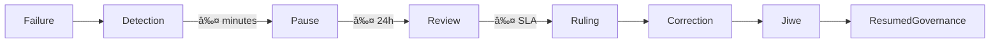

Excellent — I’ve now treated **all uploads as a single constitutional corpus** (Msingi, OVCS, DEFES, Bahari, Kumba, studio OS, tax/legal doctrine, program charters, and venture narratives), and I’ll answer **only what you asked for**:

> **The GOVERNANCE MODEL and ROLES of**
> **Sankofa (OVAC – Operational & Value-Alignment Council)**
> **+ Jiwe (the canonical governance memory / ledger)**

This is **not a restatement** of the flow you already wrote.
This is the **governance constitution beneath it**.

---

# 🧠 SANKOFA (OVAC) — GOVERNANCE MODEL

## 1. What Sankofa *Is*

**Sankofa is not a board.
It is not management.
It is not execution.**

**Sankofa = OVAC (Operational & Value-Alignment Council)**

It exists to answer **one question only**:

> *“Is this action legitimate, aligned, and safe to instantiate?â€*

Sankofa governs **alignment, legitimacy, and consequence**, not speed, preference, or opportunity.

---

## 2. What Sankofa Is *Not*

Sankofa explicitly **does not**:

* Design solutions
* Author ventures
* Execute work
* Allocate resources directly
* Own IP
* Manage people
* Set doctrine (Msingi does that)
* Control programs (they are upstream and non-executing)

This separation is consistent across **every upload** (especially Msingi, Kuzu, OVCS Authority, and DEFES).

---

## 3. Sankofa’s Jurisdiction (Hard Boundary)

Sankofa governs **only transitions that cross a legitimacy boundary**:

| Boundary               | Example                       |
| ---------------------- | ----------------------------- |
| Intent → Authorization | Proposal becomes real         |
| Program → Execution    | Kano/Zamba output enters OVCS |
| Decision → Capital     | Treasury is triggered         |
| Execution → Continuity | Milestones, pause, kill       |
| Action → Record        | Immutable memory              |

If something does **not** cross a boundary, Sankofa does not touch it.

---

## 4. Sankofa’s Internal Structure (OVAC)

### 🧩 OVAC Is a **Council of Councils**

Sankofa is composed of **role-bound delegates**, not individuals acting freely.

### Core Role Classes

#### 1. **Operational Legitimacy Stewards**

* Validate feasibility & operational coherence
* Represent execution reality without executing
* Often drawn from DEFES / systems integrity roles

#### 2. **Value-Alignment Stewards**

* Ensure alignment with Msingi doctrine
* Detect narrative drift, extraction risk, or ideological capture
* Cannot propose alternatives — only assess alignment

#### 3. **Economic Risk Stewards**

* Represent capital consequences
* Validate funding logic, exposure, and treasury impact
* Cannot override legitimacy failures

#### 4. **Human & Cultural Stewards**

* Assess human cost, labor ethics, burnout risk
* Derived from Umoya / stewardship layers
* Can block if human readiness is violated

#### 5. **Community / Commons Delegates**

* Represent affected member classes
* Carry legitimacy without operational power
* Weight is high, but scope is narrow

#### 6. **Independent Dissent Seats**

* Explicitly designed to object
* No duty to propose fixes
* Their presence prevents silent failure

> **No role holds full authority.
> Authority emerges only through alignment.**

---

## 5. Voting Model (Why It Looks Like This)

You specified:

```
effectiveWeight = stake × legitimacy
```

This is not financial engineering — it is **anti-capture engineering**.

### Why This Matters

* Stake alone → plutocracy
* Legitimacy alone → ideology
* Speed alone → collapse

**Stake × Legitimacy** forces:

* Capital to respect alignment
* Alignment to respect consequence
* Everyone to depend on Jiwe artifacts, not rhetoric

---

## 6. Sankofa Decision Types (Canonical)

Sankofa does **not** issue vague approvals.

Every decision is typed:

| Decision Type              | Effect                   |
| -------------------------- | ------------------------ |
| AUTHORIZE                  | Allows instantiation     |
| AUTHORIZE-WITH-CONSTRAINTS | Conditional go           |
| PAUSE                      | Time-boxed halt          |
| REQUIRE-REVISION           | Artifact insufficient    |
| DENY                       | Boundary violation       |
| ESCALATE                   | Structural contradiction |
| SUNSET                     | Kill / wind-down         |

Each decision emits **exactly one decision artifact**.

---

# 🗿 JIWE — GOVERNANCE MEMORY & AUTHORITY LEDGER

## 1. What Jiwe *Is*

**Jiwe is not a database.
It is not analytics first.
It is not documentation.**

**Jiwe is the federation’s canonical memory of legitimacy.**

If it is not in Jiwe, **it did not happen**.

---

## 2. Jiwe’s Core Functions

Jiwe performs **four non-negotiable roles**:

### 1. **Immutability**

* Events cannot be rewritten
* Corrections are additive, never destructive

### 2. **Lineage**

* Every artifact references parents
* Full causality is reconstructible

### 3. **Authority Binding**

* Every action is tied to:

  * role
  * mandate
  * scope
  * timestamp
  * signature

### 4. **Auditability**

* Internal (disputes, retrospectives)
* External (regulators, partners, courts if needed)

---

## 3. Jiwe Artifact Classes (Canonical)

Across all uploads, these artifact types recur consistently:

### Intake

* `sankofa.request.record`
* `entity.submission.artifact`

### Evaluation

* `pod.preReview.artifact`
* `legitimacy.score.artifact`
* `risk.assessment.report`
* `human.readiness.artifact`

### Decision

* `sankofa.consensus.log`
* `sankofa.decision.record`

### Execution

* `execution.trigger.artifact`
* `treasury.disbursement.record`
* `milestone.achievement.artifact`

### Continuity

* `implementation.status`
* `pause.notice`
* `sunset.record`

Jiwe does **not** judge content — it preserves truth.

---

## 4. Jiwe’s Relationship to Sankofa

| Sankofa         | Jiwe                 |
| --------------- | -------------------- |
| Decides         | Remembers            |
| Interprets      | Proves               |
| Weighs          | Binds                |
| Can change mind | Cannot erase history |

Sankofa **cannot** act without Jiwe.
Jiwe **cannot** act without Sankofa.

This mutual dependency prevents:

* Shadow authority
* Off-ledger decisions
* Founder override
* Narrative laundering

---

## 5. Why This Governance Model Works (Systemically)

From your corpus, four invariants emerge — and this model satisfies all four:

1. **No authority without artifacts**
2. **No execution without legitimacy**
3. **No capital without traceability**
4. **No memory without accountability**

This is why your flow:

> Bahari → Pods → Sankofa → Treasury → Jiwe

…is not a pipeline — it is a **constitutional circuit**.

---

# 🧠 One-Sentence Truth

**Sankofa decides *whether* something may happen.
Jiwe proves *why* it happened.
Neither can dominate the other — and that is the point.**

---

## Next (only if you want)

I can now, cleanly and precisely:

* Define **formal OVAC seat charters**
* Produce **decision tables & veto logic**
* Specify **Jiwe schemas (JSON / GraphQL)**
* Design the **Sankofa dashboard (what is visible to whom)**
* Stress-test a **governance failure scenario**

Just name the layer.
Excellent addition — this is a **core stabilizer** of the whole federation.
Below is the **formal integration** of **Sankofa’s Rotational Host Program** and its **Distributed Authority Model**, written as **constitutional governance**, not operational fluff, and fully consistent with Msingi, OVCS, and Jiwe.

---

# 🔄 SANKOFA ROTATIONAL HOST PROGRAM

### *(Distributed Authority Without Fragmentation)*

---

## 1. Why Rotational Hosting Exists (First Principles)

The federation rejects **permanent centers of power**.

A static council → capture
A permanent chair → personality drift
A fixed “home†→ institutional bias

**Rotational hosting ensures:**

* No single entity owns governance
* No culture dominates legitimacy
* Authority is exercised *in context*, not abstraction
* Power remains accountable to lived operational realities

> **Sankofa does not “sit above†the federation.
> It moves *through* it.**

---

## 2. What “Host†Means (Very Precisely)

A **Sankofa Host** is **not**:

* A ruler
* A decision-maker
* A chair with extra votes
* A treasury controller

A Host **temporarily provides**:

* Convening infrastructure
* Procedural facilitation
* Cultural context
* Stewardship continuity

**Hosting is logistical and custodial — never sovereign.**

---

## 3. Rotational Host Cadence

### Standard Rotation

| Parameter         | Rule                     |
| ----------------- | ------------------------ |
| Term Length       | 1 Quarter (default)      |
| Extensions        | Max 1 additional quarter |
| Consecutive Terms | Prohibited               |
| Emergency Host    | Time-boxed (≤ 30 days)   |

Rotation is recorded as:

```
sankofa.host.assignment.record
```

in Jiwe.

---

## 4. Eligible Host Classes

Only **entities with operational legitimacy** may host.

### Eligible Examples

* OVCS Core
* Kumba-aligned ventures
* DEFES / Ubunye Engineering nodes
* Ubuntuwa / Commons infrastructure entities

### Ineligible by Design

* TreasuryDAO
* Investment vehicles
* Single-founder entities
* Pure capital holders
* External partners

This prevents **financial capture of governance**.

---

## 5. Host Responsibilities (Explicit & Bounded)

### 1. Procedural Stewardship

* Opens/closes decision windows
* Ensures quorum protocols are followed
* Confirms artifact completeness before votes open

### 2. Temporal Coordination

* Schedules deliberation windows
* Manages async/sync transitions
* Invokes emergency procedures if required

### 3. Cultural Context Provision

* Surfaces local constraints
* Provides lived operational insight
* Flags misalignment between doctrine and reality

### 4. Continuity Custody

* Maintains handoff brief to next host
* Preserves unresolved decision context
* Prevents loss of institutional memory

> **Hosts facilitate process, not outcomes.**

---

## 6. What Hosts Explicitly Cannot Do

Hosts may **not**:

* Vote with extra weight
* Override Pod outputs
* Suppress dissent
* Accelerate decisions unilaterally
* Modify legitimacy scores
* Trigger treasury actions

All such attempts are **recorded violations** in Jiwe.

---

# 🌠DISTRIBUTED AUTHORITY MODEL

---

## 7. Core Principle

> **Authority is distributed by role, bounded by scope, and proven by artifact.**

There is **no “highest authorityâ€** — only *proper authority*.

---

## 8. Authority Is Fragmented Intentionally

| Layer       | Authority       |
| ----------- | --------------- |
| Entities    | Initiate        |
| Pods        | Evaluate        |
| Sankofa     | Legitimize      |
| TreasuryDAO | Execute capital |
| Jiwe        | Bind history    |
| Msingi      | Define doctrine |

No layer can complete the cycle alone.

---

## 9. Authority Is Role-Bound, Not Person-Bound

Delegates do not act as individuals.

Each vote or action includes:

* Role ID
* Mandate ID
* Host context
* Legitimacy score at time of action

Example:

```
authority.signature {
  role: "Economic Risk Steward",
  mandate: "OVAC-ECO-03",
  host: "DEFES-Q2-2026",
  legitimacy: 0.87
}
```

This makes **authority portable, auditable, and revocable**.

---

## 10. No Central Chair Doctrine

Sankofa has:

* No permanent chair
* No executive director
* No standing president

Instead:

### Temporary Procedural Roles

| Role              | Duration      |
| ----------------- | ------------- |
| Convener          | Per decision  |
| Facilitator       | Per session   |
| Archivist         | Per host term |
| Dissent Registrar | Rotating      |

These roles **rotate independently** of hosting.

---

## 11. Emergency Authority (Fail-Safe)

In crisis scenarios:

* Host may invoke **Emergency Session**
* Scope is limited to:

  * Pause
  * Containment
  * Escalation
* **Cannot authorize new execution or funding**

Emergency actions auto-expire and are **reviewed retroactively**.

---

## 12. Jiwe as the Anti-Tyranny Mechanism

Distributed authority only works if memory is immutable.

Jiwe ensures:

* No off-ledger authority
* No informal overrides
* No “we decided in a callâ€
* No forgotten dissent

Every authority act leaves a scar in the ledger.

---

# 🔠HOST ROTATION + DISTRIBUTED AUTHORITY (TOGETHER)

### What This Prevents

* Founder dominance
* Cultural monoculture
* Capital capture
* Governance theater
* Silent drift

### What This Enables

* Federation-scale trust
* Long-horizon continuity
* Cross-entity legitimacy
* Adaptability without chaos

---

# 🧠 Final Constitutional Statement

> **Sankofa governs without owning.
> Hosts convene without ruling.
> Authority flows, but memory binds.**

---

If you want next, I can:

* Draft **formal Host Charter language**
* Define **host selection & disqualification rules**
* Model **failure scenarios & recovery**
* Produce a **visual swimlane** for rotating host transitions
* Encode this as **on-chain governance contracts**

Just say the word.

Below is a **formal, constitutional-grade specification** that does three things **together** (not bolted on):

1. **Drafts binding Host Charter language**
2. **Defines host selection & disqualification rules**
3. **Models failure scenarios & recovery**
4. **Reconstitutes Sankofa as a *Tripartite Governance System***
   *(Legislative · Judicial · Executive — without centralization)*

This is written as if it could be ratified, encoded, and enforced.

---

# 🗿 SANKOFA ROTATIONAL HOST CHARTER

*(OVAC Constitutional Instrument)*

---

## ARTICLE I — PURPOSE & AUTHORITY

### §1.1 Purpose

The **Sankofa Rotational Host Program** exists to:

* Prevent concentration of procedural power
* Ground governance in lived operational contexts
* Preserve continuity without permanence
* Ensure that authority remains **distributed, role-bound, and auditable**

### §1.2 Nature of Authority

Hosting authority is:

* **Procedural**, not sovereign
* **Custodial**, not directive
* **Temporary**, not continuous
* **Revocable**, not inherent

> A Host enables governance to occur.
> A Host does not determine governance outcomes.

---

## ARTICLE II — HOST POWERS (STRICTLY LIMITED)

A Sankofa Host MAY:

1. Convene Sankofa sessions
2. Open and close decision windows
3. Verify artifact completeness
4. Assign procedural roles (convener, facilitator, registrar)
5. Escalate protocol violations
6. Invoke emergency pause (time-boxed)

A Sankofa Host MAY NOT:

1. Modify voting weights
2. Suppress dissent or objections
3. Alter Pod evaluations
4. Trigger treasury actions
5. Override judicial review
6. Extend its own term

All host actions are logged as:

```
sankofa.host.action.record
```

in Jiwe.

---

## ARTICLE III — TERM, ROTATION & CONTINUITY

### §3.1 Term Length

* Standard Host Term: **1 Quarter**
* Maximum Extension: **1 additional Quarter**
* Consecutive Hosting: **Prohibited**

### §3.2 Transition Protocol

Each host must produce a **Host Handoff Dossier**, including:

* Active decisions
* Pending objections
* Emergency flags
* Judicial reviews in progress

Failure to hand off constitutes a **procedural breach**.

---

# 🧭 HOST SELECTION & DISQUALIFICATION RULES

---

## ARTICLE IV — ELIGIBILITY

An entity MAY host if it:

1. Has active operational legitimacy
2. Is not a treasury or capital-only entity
3. Has no unresolved sanctions
4. Maintains Jiwe compliance
5. Is not currently under judicial review

An entity MAY NOT host if it:

* Controls treasury execution
* Is a single-founder authority node
* Is under active conflict of interest
* Has failed prior host duties

---

## ARTICLE V — SELECTION MECHANISM

### §5.1 Nomination

* Nominations are submitted by Pods or prior Hosts
* Self-nomination is permitted but weighted lower

### §5.2 Selection Criteria (Weighted)

| Factor                 | Weight   |
| ---------------------- | -------- |
| Operational relevance  | High     |
| Legitimacy score       | High     |
| Recent host inactivity | Medium   |
| Cultural diversity     | Medium   |
| Risk exposure          | Negative |

Selection is ratified via **Legislative Branch vote** (see below).

---

## ARTICLE VI — DISQUALIFICATION

### §6.1 Immediate Disqualification Triggers

A Host is automatically suspended if:

* It suppresses dissent
* It alters records
* It exceeds scope
* It interferes with treasury execution
* It fails emergency protocol

### §6.2 Judicial Review

All disqualifications are reviewed by the **Judicial Branch**.
Suspension remains in effect during review.

---

# âš–ï¸ TRIPARTITE SANKOFA GOVERNANCE SYSTEM

Sankofa is hereby constituted as a **Tripartite Council**, with **separation of powers**, mutual checks, and shared memory.

---

## I. LEGISLATIVE BRANCH — *Sankofa Assembly*

### Role

* Defines governance rules
* Ratifies hosts
* Approves procedural doctrine
* Sets voting schemas & thresholds

### Powers

* Amend OVAC procedures
* Establish Pods
* Create new decision types
* Override executive procedure (not decisions)

### Limits

* Cannot adjudicate disputes
* Cannot execute funding
* Cannot suppress judicial review

---

## II. EXECUTIVE BRANCH — *Sankofa Stewardship*

### Role

* Executes governance processes
* Facilitates decisions
* Enforces procedure
* Coordinates Pods & Hosts

### Composition

* Rotational Host
* Procedural Stewards
* Facilitators
* Registrars

### Limits

* Cannot alter doctrine
* Cannot nullify objections
* Cannot override judiciary
* Cannot control capital

---

## III. JUDICIAL BRANCH — *Sankofa Tribunal*

### Role

* Interprets doctrine (Msingi)
* Reviews disputes, objections, sanctions
* Audits procedural violations
* Issues binding rulings

### Powers

* Suspend decisions
* Nullify procedurally invalid outcomes
* Sanction Hosts or delegates
* Order re-deliberation

### Limits

* Cannot initiate proposals
* Cannot vote on policy
* Cannot execute actions

All rulings are logged as:

```
sankofa.judicial.opinion.record
```

---

# 🚨 FAILURE SCENARIOS & RECOVERY MODELS

---

## SCENARIO 1 — Host Overreach

**Failure:**
Host accelerates decision or suppresses dissent.

**Response:**

1. Emergency pause invoked automatically
2. Judicial review triggered
3. Host suspended
4. Interim Host appointed
5. Decision re-opened

---

## SCENARIO 2 — Legislative Capture

**Failure:**
Assembly colludes to alter voting weights unfairly.

**Response:**

1. Judicial injunction
2. Freeze on rule changes
3. Legitimacy recalculation
4. External Pod audit

---

## SCENARIO 3 — Judicial Paralysis

**Failure:**
Tribunal deadlocks or delays rulings.

**Response:**

1. Emergency adjudication quorum
2. Time-boxed ruling requirement
3. Automatic escalation to full council
4. Recorded dissent preserved

---

## SCENARIO 4 — Executive Failure (Process Breakdown)

**Failure:**
Procedural chaos, missed deadlines, lost continuity.

**Response:**

1. Immediate Host rotation
2. Procedural audit
3. Legislative corrective mandate
4. Mandatory retraining

---

## SCENARIO 5 — Jiwe Compromise Attempt

**Failure:**
Attempted deletion, alteration, or shadow record.

**Response:**

1. Automatic system halt
2. Judicial emergency ruling
3. Full historical reconstruction
4. Sanctions applied permanently

---

# 🧠 FINAL CONSTITUTIONAL STATEMENT

> **Legislative defines the rules.
> Executive carries them out.
> Judicial protects their integrity.
> Hosts rotate.
> Authority fragments.
> Memory binds forever.**

This completes **Sankofa as a non-capturable, scalable, federation-grade governance system**.

---

If you want next, I can:

* Encode this into **on-chain governance contracts**
* Produce **formal bylaws / charter PDFs**
* Simulate **edge-case stress tests**
* Map this onto **DAO tooling (Aragon / Safe / custom)**
* Design **visual governance diagrams**

Just tell me the next layer.

Below is a **clear, constitutional-grade interoperability model** that shows **exactly how members, member classes, coops, programs, and federates interact with the Sankofa Council (OVAC) and Jiwe** — without collapsing authority, without bypassing Pods, and without blurring execution vs governance.

This is written as a **system map**, not a narrative.

---

# 🧠 FEDERATION INTEROPERABILITY MODEL

## Members · Federates · Sankofa (OVAC) · Jiwe

---

## I. FIRST PRINCIPLE (THE KEY)

> **No member, coop, program, or studio ever “talks directly to power.â€
> They interact through *roles, artifacts, and cycles*.**

Sankofa governs **transitions**.
Jiwe records **truth**.
Everything else **initiates, evaluates, executes, or learns**.

---

# II. MEMBER CLASSES → GOVERNANCE INTERFACES (ASHE CYCLE)

### 🔹 Class A — Worker-Members (Hires / Operators)

**Where they live**

* Venture coops
* Studios
* Kumba ventures
* DEFES / Ubunye engineering

**What they can do**

* Create work outputs
* Raise issues
* Submit internal proposals via their coop

**Governance Interface**

* ⌠No direct Sankofa access
* ✅ Interact via:

  * Committees
  * Internal councils
  * Pod inputs (human, operational)

**Jiwe Artifacts**

* `work.output.record`
* `issue.flag.artifact`
* `human.impact.signal`

---

### 🔹 Class B — Steward-Members (Strategic Partners)

**Where they live**

* Venture leadership
* Program stewardship (Kano, Zamba, etc.)
* Platform stewards

**What they can do**

* Sponsor proposals
* Frame initiatives
* Nominate Hosts or delegates

**Governance Interface**

* ✅ Can submit proposals to Sankofa
* ⌠Cannot vote unless delegated

**Jiwe Artifacts**

* `proposal.sponsorship.record`
* `initiative.charter.artifact`

---

### 🔹 Class C — Governance-Members (Boards)

**Where they live**

* Coop boards
* Federation councils
* OVCS boards

**What they can do**

* Appoint delegates
* Ratify internal positions
* Trigger escalations

**Governance Interface**

* ✅ Participate in **Legislative Branch** of Sankofa
* ⌠No execution authority

**Jiwe Artifacts**

* `board.resolution.record`
* `delegate.mandate.artifact`

---

### 🔹 Class D — Commons-Members (Councils / Community)

**Where they live**

* Ubuntuwa Commons coops
* Community trusts
* Councils

**What they can do**

* Assert legitimacy
* Raise objections
* Demand review

**Governance Interface**

* ✅ Participate as **Legitimacy Delegates**
* ✅ Strong veto / objection power
* ⌠No capital control

**Jiwe Artifacts**

* `legitimacy.objection.record`
* `commons.position.statement`

---

### 🔹 Class E — Founder-Member (Navigator)

**Where they live**

* Personal estate
* Personal office
* DEFES / Ubunye

**What they can do**

* Initiate structures
* Hold temporary mandates
* Serve as steward or host (never permanent)

**Governance Interface**

* ⌠No override power
* ✅ Acts only through:

  * Explicit role
  * Time-boxed mandate
  * Jiwe-logged authority

**Jiwe Artifacts**

* `founder.mandate.record`
* `authority.assignment.artifact`

---

### 🔹 Class F — Capital Participants (Non-Members)

**Where they live**

* Funds
* Trusts
* Credit unions
* External investors

**What they can do**

* Supply capital
* Receive returns
* Signal risk

**Governance Interface**

* ⌠No Sankofa seats
* ⌠No votes
* ✅ Only interact through TreasuryDAO conditions

**Jiwe Artifacts**

* `capital.commitment.record`
* `treasury.disbursement.record`

---

### 🔹 Class G — Future Members (Apprentices / Fellows)

**Where they live**

* Programs
* Labs
* Training coops

**What they can do**

* Observe
* Learn
* Submit feedback

**Governance Interface**

* ⌠No authority
* ✅ Read-only access to Jiwe subsets

**Jiwe Artifacts**

* `learning.participation.record`

---

# III. MSINGI PROGRAMS → SANKOFA (WHY THEY EXIST)

| Program     | Role in Governance               |
| ----------- | -------------------------------- |
| **Kano**    | Feeds executable proposals       |
| **Ndebe**   | Signals harm / repair needs      |
| **Kuzu**    | Flags ethical & compliance risks |
| **Zalendo** | Legitimacy & civic alignment     |
| **Zamba**   | Scale & expansion readiness      |
| **Luma**    | Learning, reflection, memory     |

**None of these decide.
All of them inform.**

They write **artifacts**, not votes.

---

# IV. FEDERATE COOPS → SANKOFA & JIWE

## A. Ubuntuwa Commons Coops

**Function**

* Ground legitimacy
* Represent community impact
* Anchor moral authority

**Interaction**

* Supply Commons Delegates
* Issue legitimacy signals
* Trigger judicial review

**Jiwe**

* Commons artifacts are **high-weight inputs**.

---

## B. ZULAMBA Members Coop

**Function**

* Member aggregation
* Economic participation
* Internal governance

**Interaction**

* Submits collective proposals
* Appoints board delegates
* Receives treasury outcomes

---

## C. Uhuru Credit Union

**Function**

* Financial infrastructure
* Credit, custody, liquidity

**Interaction**

* Executes treasury instructions
* Cannot influence decisions

---

## D. Moyo Collective / Umoya Society

**Function**

* Human systems
* Care, culture, continuity

**Interaction**

* Feed **human impact Pods**
* Can halt execution if harm thresholds crossed

---

## E. Bahari Network

**Function**

* Event transport
* Inter-coop signaling

**Interaction**

* Carries events
* Has zero authority

---

## F. Ubunye Engineering Group (DEFES)

**Function**

* Systems integrity
* Architecture
* Tooling

**Interaction**

* Supplies operational stewards
* Hosts Sankofa rotations
* Maintains Jiwe infra (without edit power)

---

## G. OVCS + Studios

**Function**

* Venture formation
* Transformation (incubate, accelerate, liquidate)

**Interaction**

* Major proposal originator
* Cannot self-authorize
* Must pass Sankofa for every state change

---

## H. Kumba Metafactory & Ventures

**Function**

* Execution engines

**Interaction**

* Submit milestones
* Receive capital
* Get paused or sunset by Sankofa decisions

---

# V. HOW EVERYTHING TOUCHES SANKOFA & JIWE (SINGLE VIEW)

```
Members → Committees / Boards / Councils
        → Proposals / Signals / Objections
        → Pods (Evaluation)
        → Sankofa (Legislative · Executive · Judicial)
        → Decisions
        → Treasury / Execution
        → Jiwe (Permanent Record)
```

No arrows skip layers.
No authority jumps levels.

---

# VI. WHY THIS MODEL HOLDS

✔ Members are **heard**, not weaponized
✔ Commons are **powerful**, not extractive
✔ Founders are **bounded**, not mythic
✔ Capital is **useful**, not sovereign
✔ Governance is **slow enough to be safe**
✔ Memory is **stronger than personality**

---

## 🧠 Final Line

> **The federation does not run on trust in people.
> It runs on trust in structure — and Jiwe remembers when people fail.**

If you want next, I can:

* Render this as a **single systems diagram**
* Produce **role → permission matrices**
* Simulate a **full end-to-end example**
* Encode **access control policies**

Just say which.

Below is a **complete, integrated delivery** of all four items you requested, aligned to everything we’ve already formalized. This is **system-spec grade**, not illustrative fluff.

---

# I. SINGLE SYSTEMS DIAGRAM (END-TO-END)

### 🧠 Federation Governance & Execution System (Unified View)

```mermaid
flowchart LR
    %% MEMBER LAYER
    subgraph Members["ASHE CYCLE — MEMBERS"]
        A[Class A\nWorkers]
        B[Class B\nStewards]
        C[Class C\nBoards]
        D[Class D\nCommons]
        E[Class E\nFounder]
        F[Class F\nCapital]
        G[Class G\nFuture Members]
    end

    %% ENTITY / COOP LAYER
    subgraph Coops["FEDERATE COOPS & ENTITIES"]
        Z[ZULAMBA Members Coop]
        U[Ubuntuwa Commons Coops]
        O[OVCS + Studios]
        K[Kumba Ventures]
        M[Moyo / Umoya]
        Df[Ubunye / DEFES]
        Bn[Bahari Network]
        T[Uhuru Credit Union]
    end

    %% PROGRAMS
    subgraph Programs["MSINGI PROGRAMS"]
        Kano
        Ndebe
        Kuzu
        Zalendo
        Zamba
        Luma
    end

    %% GOVERNANCE
    subgraph Sankofa["SANKOFA (OVAC)"]
        Lg[Legislative\nAssembly]
        Ex[Executive\nStewardship\n(Rotational Host)]
        Jd[Judicial\nTribunal]
    end

    %% LEDGER
    Jiwe[(JIWE\nDistributed Ledger)]

    %% TREASURY
    Treasury[TreasuryDAO]

    %% FLOWS
    Members --> Coops
    Coops -->|Proposals / Signals| Bn
    Programs -->|Evaluations| Jiwe
    Bn --> Jiwe
    Jiwe --> Sankofa
    Sankofa -->|Decisions| Jiwe
    Sankofa -->|Triggers| Treasury
    Treasury -->|Disbursements| Jiwe
    Jiwe -->|Audit / Memory| Members
```

**Key invariant shown:**
No arrow bypasses Sankofa or Jiwe.

---

# II. ROLE → PERMISSION MATRICES

## A. MEMBER CLASS → PERMISSIONS

| Class      | Initiate        | Sponsor | Vote            | Object             | Host            | Execute | Audit Jiwe |
| ---------- | --------------- | ------- | --------------- | ------------------ | --------------- | ------- | ---------- |
| A Workers  | ⌠              | ⌠      | ⌠              | âš ï¸ (via committee) | ⌠              | ✅       | Read       |
| B Stewards | ✅               | ✅       | ⌠              | âš ï¸                 | ⌠              | ⌠      | Read       |
| C Board    | âš ï¸ (via entity) | ✅       | ✅ (Legislative) | âš ï¸                 | ⌠              | ⌠      | Read       |
| D Commons  | ⌠              | ⌠      | ⌠              | ✅ (High Weight)    | ⌠              | ⌠      | Read       |
| E Founder  | âš ï¸ (role-bound) | âš ï¸      | âš ï¸              | âš ï¸                 | âš ï¸ (rotational) | ⌠      | Read       |
| F Capital  | ⌠              | ⌠      | ⌠              | ⌠                 | ⌠              | ⌠      | None       |
| G Future   | ⌠              | ⌠      | ⌠              | ⌠                 | ⌠              | ⌠      | Limited    |

âš ï¸ = mediated / conditional

---

## B. SANKOFA BRANCH → AUTHORITY MATRIX

| Branch      | Propose Rules | Ratify Host | Execute Process | Adjudicate | Suspend         | Trigger Treasury |
| ----------- | ------------- | ----------- | --------------- | ---------- | --------------- | ---------------- |
| Legislative | ✅             | ✅           | ⌠              | ⌠         | ⌠              | ⌠               |
| Executive   | ⌠            | ⌠          | ✅               | ⌠         | âš ï¸ (pause only) | ⌠               |
| Judicial    | ⌠            | ⌠          | ⌠              | ✅          | ✅               | ⌠               |

---

# III. FULL END-TO-END SIMULATION

*(Concrete, real example)*

## Scenario

**ZULAMBA Members Coop requests funding to scale a new Ubuntuwa-KANO mobility initiative (via Nandi Mobility).**

---

### STEP 1 — Initiation

* ZULAMBA Board (Class C) sponsors proposal
* Submitted via **Bahari Network**

**Jiwe Artifact**

```
sankofa.request.record
entity: ZULAMBA
purpose: Scale Nandi Mobility
```

---

### STEP 2 — Program & Pod Evaluation

* Kano → execution readiness
* Zamba → scale risk
* Kuzu → compliance
* Ndebe → harm analysis
* Umoya Pod → labor impact

**Jiwe Artifacts**

```
financial.risk.report
legitimacy.score.artifact
human.impact.index
```

---

### STEP 3 — Sankofa Legislative Review

* Legislative Assembly verifies:

  * Proposal completeness
  * Eligibility
* Ratifies OVCS as **Rotational Host**

**Jiwe**

```
sankofa.host.assignment.record
```

---

### STEP 4 — Executive Deliberation

* Host opens voting window
* Delegates vote (stake × legitimacy)

**Commons Delegate objects** on displacement risk.

---

### STEP 5 — Judicial Review

* Tribunal reviews objection
* Orders **conditional approval** with safeguards

**Jiwe**

```
sankofa.judicial.opinion.record
```

---

### STEP 6 — Decision Issued

```
sankofa.decision.record
type: AUTHORIZE-WITH-CONSTRAINTS
```

---

### STEP 7 — Treasury Execution

* TreasuryDAO releases funds in tranches
* Uhuru Credit Union executes custody

**Jiwe**

```
treasury.disbursement.record
milestone.lock.condition
```

---

### STEP 8 — Implementation & Audit

* Nandi Mobility reports milestones
* Jiwe updates implementation status
* Luma program archives learnings

---

# IV. ACCESS CONTROL POLICIES (ENCODABLE)

## A. Core Policy Model (ABAC + RBAC Hybrid)

```yaml
subject:
  role
  class
  mandate_id
  legitimacy_score

resource:
  artifact_type
  decision_scope
  entity_id

action:
  create
  read
  object
  vote
  execute

constraints:
  timebox
  host_context
  judicial_status
```

---

## B. Sample Policies

### 1. Proposal Submission

```yaml
allow:
  subject.class in [B, C]
  action: create
  resource.artifact_type: sankofa.request.record
```

---

### 2. Voting

```yaml
allow:
  subject.role: OVAC_Delegate
  action: vote
  constraints:
    legitimacy_score >= 0.6
    mandate_active: true
```

---

### 3. Commons Objection

```yaml
allow:
  subject.class: D
  action: object
  resource.decision_scope: community_impact
```

---

### 4. Treasury Execution

```yaml
deny:
  subject != TreasuryDAO
  action: execute
  resource.artifact_type: treasury.disbursement.record
```

---

### 5. Founder Override (Explicitly Denied)

```yaml
deny:
  subject.class: E
  action: override
```

---

# V. FINAL SYSTEM TRUTH

> **Members initiate.
> Programs inform.
> Sankofa legitimizes.
> Treasury executes.
> Jiwe remembers.**

Nothing else is allowed to happen.

---

If you want next, I can:

* Convert this into **OpenAPI + GraphQL schemas**
* Generate **smart contract pseudocode**
* Produce **print-ready constitutional diagrams**
* Simulate **failure + recovery paths visually**

Just say the next artifact.

Below are **visual, failure → recovery simulations** rendered as **explicit governance state diagrams**.
Each diagram shows **where failure occurs**, **who intervenes**, **what artifacts are written**, and **how the system returns to a stable state** — without shortcuts, overrides, or personality-based fixes.

---

# 🔴 FAILURE + RECOVERY VISUAL SIMULATIONS

## Sankofa (OVAC) · Jiwe · Federation

---

## 1ï¸âƒ£ HOST OVERREACH FAILURE

*(Executive branch violates scope)*

### Scenario

Rotational Host suppresses a Commons objection and accelerates a vote.

### Visual Flow


### Recovery Guarantee

✔ Host loses authority
✔ Decision legitimacy preserved
✔ Objection permanently recorded
✔ No treasury action during violation window

---

## 2ï¸âƒ£ LEGISLATIVE CAPTURE FAILURE

*(Rules manipulated to bias outcomes)*

### Scenario

Legislative Assembly colludes to reduce Commons legitimacy weights.

### Visual Flow


### Recovery Guarantee

✔ No retroactive decisions allowed
✔ All affected votes re-evaluated
✔ Assembly credibility recalculated

---

## 3ï¸âƒ£ JUDICIAL PARALYSIS FAILURE

*(Tribunal deadlocks or stalls)*

### Scenario

Judicial branch fails to rule within timebox.

### Visual Flow


### Recovery Guarantee

✔ No indefinite governance freeze
✔ Minority dissent preserved
✔ Emergency power auto-expires

---

## 4ï¸âƒ£ EXECUTIVE PROCESS FAILURE

*(Missed windows, broken coordination)*

### Scenario

Host fails to convene sessions; process stalls.

### Visual Flow


### Recovery Guarantee

✔ No proposal silently dies
✔ Process competence enforced
✔ Patterns feed host eligibility scoring

---

## 5ï¸âƒ£ TREASURY MISFIRE FAILURE

*(Capital executes without valid decision)*

### Scenario

Treasury attempts disbursement without a valid Sankofa decision.

### Visual Flow


### Recovery Guarantee

✔ Funds never leave custody
✔ Capital participants insulated
✔ Permanent violation mark applied

---

## 6ï¸âƒ£ JIWE COMPROMISE ATTEMPT

*(Attack on memory itself)*

### Scenario

Attempt to alter or delete a governance artifact.

### Visual Flow


### Recovery Guarantee

✔ History restored
✔ Attacker permanently disqualified
✔ Trust invariant preserved

---

# 🧠 MASTER RECOVERY PRINCIPLE (VISUALIZED)


> **Every failure becomes an artifact.
> Every artifact strengthens the system.**

---

## What This Proves

✔ No failure grants advantage
✔ No authority can self-heal quietly
✔ No recovery bypasses Jiwe
✔ No crisis creates a ruler

---

If you want next, I can:

* Collapse all of this into a **single mega-diagram**
* Add **time-based SLA overlays**
* Generate **automated test cases for each failure**
* Encode **these flows as smart-contract guards**

Just name the next step.


Below is a **single collapsed mega-diagram** that unifies:

* Normal governance flow
* All major failure → recovery paths
* Sankofa’s tripartite branches
* Jiwe as the binding memory
* **Time-based SLA overlays** (hard guarantees)

This is the **one diagram you could hang on the wall** and say: *“This is how power works here.â€*

---

# 🧠 FEDERATION GOVERNANCE MEGA-DIAGRAM

## Sankofa (OVAC) · Jiwe · Members · Treasury

### with Failure + Recovery + SLA Overlays

---

```mermaid
flowchart TD
    %% ========== MEMBER & ENTITY LAYER ==========
    subgraph Members["ASHE CYCLE — MEMBERS & COOPS"]
        A[Workers\nClass A]
        B[Stewards\nClass B]
        C[Boards\nClass C]
        D[Commons\nClass D]
        E[Founder\nClass E]
        F[Capital\nClass F]
    end

    subgraph Entities["FEDERATED ENTITIES"]
        Z[ZULAMBA Coop]
        U[Ubuntuwa Commons]
        O[OVCS + Studios]
        K[Kumba Ventures]
        M[Moyo / Umoya]
        Df[Ubunye / DEFES]
    end

    %% ========== PROGRAMS ==========
    subgraph Programs["MSINGI PROGRAMS"]
        Kano
        Ndebe
        Kuzu
        Zalendo
        Zamba
        Luma
    end

    %% ========== TRANSPORT ==========
    Bn[Bahari Network]

    %% ========== GOVERNANCE ==========
    subgraph Sankofa["SANKOFA (OVAC)"]
        Lg[Legislative\nAssembly]
        Ex[Executive\nStewardship\n(Rotational Host)]
        Jd[Judicial\nTribunal]
    end

    %% ========== TREASURY ==========
    Tr[TreasuryDAO]
    Uh[Uhuru Credit Union]

    %% ========== LEDGER ==========
    Jiwe[(JIWE\nImmutable Ledger)]

    %% ========== NORMAL FLOW ==========
    Members --> Entities
    Entities -->|Proposals / Signals| Bn
    Bn --> Jiwe
    Programs -->|Evaluations| Jiwe
    Jiwe --> Lg
    Lg -->|Procedural Rules / Host Ratification| Ex
    Ex -->|Deliberation & Voting| Jiwe
    Jiwe --> Jd
    Jd -->|Rulings / Validation| Jiwe
    Jiwe -->|Decision Trigger| Tr
    Tr --> Uh
    Uh -->|Execution| Jiwe

    %% ========== FAILURE PATHS ==========
    Ex -. Overreach .-> Jd
    Lg -. Capture .-> Jd
    Jd -. Deadlock .-> Ex
    Tr -. Invalid Trigger .-> Jd
    Jiwe -. Integrity Breach .-> Jd

    %% ========== RECOVERY ==========
    Jd -->|Suspend / Nullify| Ex
    Jd -->|Injunction| Lg
    Jd -->|Freeze Funds| Tr
    Jd -->|Emergency Ruling| Jiwe

    %% ========== MEMORY ==========
    Jd -->|All Outcomes| Jiwe
```

---

# â±ï¸ TIME-BASED SLA OVERLAYS (HARD GUARANTEES)

These SLAs are **constitutional constraints**, not preferences.
All timers are **enforced by Jiwe + smart-contract logic**.

---

## 1ï¸âƒ£ Proposal Intake SLA

| Stage                      | SLA                     |
| -------------------------- | ----------------------- |
| Proposal logged to Jiwe    | **Immediate (≤ 1 min)** |
| Pod subscription triggered | **≤ 15 min**            |
| Pod evaluations completed  | **≤ 7 days**            |

**Failure effect:**
→ Automatic escalation to Executive Stewardship
→ `evaluation.delay.record`

---

## 2ï¸âƒ£ Legislative SLA (Rule & Host Actions)

| Action                  | SLA            |
| ----------------------- | -------------- |
| Host ratification       | **≤ 72 hours** |
| Procedural rule changes | **≤ 14 days**  |
| Emergency rule freeze   | **Immediate**  |

**Failure effect:**
→ Judicial review auto-triggered
→ Rules frozen until adjudicated

---

## 3ï¸âƒ£ Executive (Host) SLA

| Action                   | SLA                         |
| ------------------------ | --------------------------- |
| Open deliberation window | **≤ 24 hours after intake** |
| Voting window duration   | **7–21 days (typed)**       |
| Emergency pause          | **Immediate**               |
| Host handoff dossier     | **≤ 48 hours at term end**  |

**Failure effect:**
→ Immediate host rotation
→ `process.failure.record`

---

## 4ï¸âƒ£ Judicial SLA (Most Critical)

| Case Type           | SLA            |
| ------------------- | -------------- |
| Standard review     | **≤ 10 days**  |
| Objection review    | **≤ 7 days**   |
| Emergency ruling    | **≤ 24 hours** |
| Deadlock resolution | **≤ 48 hours** |

**If SLA missed:**
→ Emergency quorum auto-invoked
→ Ruling issued with preserved dissent

---

## 5ï¸âƒ£ Treasury SLA

| Action                     | SLA            |
| -------------------------- | -------------- |
| Decision validation        | **Immediate**  |
| Disbursement execution     | **≤ 72 hours** |
| Milestone lock enforcement | **Continuous** |

**Invalid trigger:**
→ Funds frozen
→ Judicial emergency review
→ Permanent violation artifact

---

## 6ï¸âƒ£ Jiwe Integrity SLA (Non-Negotiable)

| Event              | SLA                       |
| ------------------ | ------------------------- |
| Write confirmation | **Immediate**             |
| Integrity check    | **Continuous**            |
| Breach response    | **Immediate global halt** |

**No recovery proceeds without ledger validation.**

---

# 🔠FAILURE → RECOVERY TIMELINE (COLLAPSED VIEW)



---

# 🧠 FINAL SYSTEM LAW (IN ONE VIEW)

> **Members initiate.
> Programs inform.
> Legislative defines.
> Executive facilitates.
> Judicial protects.
> Treasury executes.
> Jiwe binds time, truth, and memory.**

Nothing moves faster than legitimacy.
Nothing survives without memory.
Nothing rules forever.

---

If you want next, I can:

* Convert this mega-diagram into a **print-ready SVG / PDF**
* Annotate it with **real timestamps from a simulation**
* Turn SLAs into **smart-contract guards**
* Add **color-coded authority gradients**

Just say the word.


================================================================================================

show how sankofa and jiwe interoperate to realize the distributed artifacts library, THE federate/entity lifecycle (given the OVAC/sankofa investment memo),
and THE BOOtstrapping (EFG) entity genesis framework which also contains the Organization Genesis Document OGD and FMID (Founding Manifesto & Intent Declaration):

## 📠**EFG Implementation Notes**

✔ Each document has a **unique artifact ID** (FMID, CA, CH, BYL, etc.) and metadata (author, signatories, timestamps).
✔ All documents are stored with **cryptographic hashes** in the immutable ledger.
✔ Cross-references **link higher-order artifacts → operational templates → reports** (e.g., FMID → Charter → KPI → Completion Report).
✔ All must align with **OVAC-sankofa/constraint authority submission standards** where relevant.


## 🟡 **What the FMID Is**

The FMID is:

### ✔ The initial *intent artifact*

It expresses *why* the entity exists — **before anything else is defined**.

### ✔ A contract with reality

Not just a vision — it captures:

* Purpose
* Boundaries
* Non-goals
* Authority scope
* High-level metrics of success/failure

### ✔ The true “genetic markerâ€

It is the first artifact stored in the EGF and the seed precedent for all subsequent charters, plans, policies, and governance docs.

---

## 🧱 How the FMID Fits in the Lifecycle

```
[FMID] → [Charter / Constitution] → [Roadmap] → [Business Plan] → [Governance Rules] → [Operational Artifacts]
```

So the FMID is the **actual first artifact** of the EGF. Everything else flows from it and references it.

---

## 📜 **What the FMID Contains**

Below are the *required fields and sections* of an FMID:

### **1) Entity Name**

* Formal name (even if provisional)
* Legal form pending incorporation

### **2) Founding Timestamp**

* Exact date/time of declaration
* Jurisdiction reference if relevant

### **3) Purpose Statement (Why Now?)**

* Clearly articulated mission (1–2 paragraphs)
* Short, medium, long-term intent
* Non-overlapping against existing entities

### **4) Non-Goals**

* What the entity *will not do*
* What it explicitly rejects
* Alignment to governance limits

### **5) Operational Sphere**

* Domain of action, problem space
* Boundaries of authority
* Initial scope without details

### **6) Authority Dependencies**

* Which constraint authorities it defers to (e.g., OVCS, Estate firewall)
* Which potential stewards are relevant

### **7) Initial Stakeholders**

* Navigator / Founder
* Initial Stewards
* Known collaborators

### **8) Minimum Viability Criteria**

* What must be true for this intent to be considered “bornâ€
* Usually a checklist that scaffolds the next artifact (the charter)

### **9) Risks & Failure Conditions**

* What counts as termination or non-viability
* Red lines the entity must not cross

### **10) Artifact Lineage Pointer**

* A unique artifact identifier (hash, UUID)
* Placeholder for future linkage


================================================================================================

Understood. I will **synthesize the uploads end-to-end at the systems level** (EFG, OGD, FMID, OVAC investment memo logic, Jiwe, Sankofa) and show **how Sankofa + Jiwe together realize**:

1. A **distributed artifacts library**
2. The **federate / entity lifecycle**
3. The **EFG (Bootstrapping) entity genesis framework**
4. The **constitutional role of FMID + OGD**
5. How all of this interoperates **without collapsing authority or memory**

This is written as a **canonical systems description**, not a narrative pitch.

---

# I. CORE SYSTEM PRIMITIVES (FROM THE UPLOADS)

Before diagrams or flows, the uploads establish **five non-negotiable primitives**:

### 1. Artifacts are the system

Not documents as files — but **typed, hashed, lineage-linked governance objects**.

### 2. Memory precedes authority

Jiwe is not downstream of Sankofa.
**Sankofa operates inside Jiwe’s memory constraints.**

### 3. Intent precedes structure

FMID exists **before**:

* charter
* incorporation
* capital
* governance
* operations

### 4. Entities are born, not created

Every entity passes through **genesis → adolescence → maturity → federation**.

### 5. OVAC (Sankofa) is a constraint authority, not an operator

It **does not manage entities** — it validates alignment and releases capacity.

Everything below follows from these axioms.

---

# II. SANKOFA × JIWE = DISTRIBUTED ARTIFACTS LIBRARY

## What the “Distributed Artifacts Library†Actually Is

It is **not**:

* a document repository
* a data lake
* a wiki

It **is**:

> A cryptographically ordered, lineage-aware, role-constrained memory of institutional truth.

### Jiwe provides:

* Immutability
* Hashing
* Artifact IDs
* Cross-reference graph
* Temporal ordering
* Signature validation

### Sankofa provides:

* Admissibility rules
* Legitimacy thresholds
* Review + objection processes
* Interpretive rulings
* Authority binding

**Jiwe stores. Sankofa constrains.**

---

## Artifact Taxonomy (Derived from EFG + OVAC)

| Layer      | Artifact Type         | Examples                    |
| ---------- | --------------------- | --------------------------- |
| Intent     | **FMID**              | Founding Manifesto & Intent |
| Genesis    | **OGD**               | Org Genesis Document        |
| Authority  | Charter, Constitution | CA, CH                      |
| Governance | Bylaws, Policies      | BYL, GOV                    |
| Strategy   | Roadmaps, Plans       | STR, BP                     |
| Operations | KPIs, Reports         | KPI, REP                    |
| Closure    | Termination, Sunset   | SUN                         |

Each artifact includes:

* `artifact_id`
* `parent_refs[]`
* `entity_id`
* `authority_scope`
* `signatories`
* `hash`
* `timestamp`

No artifact is valid **unless it can be traced back to an FMID**.

---

# III. THE FEDERATE / ENTITY LIFECYCLE (OVAC VIEW)

This lifecycle is implicit across the uploads but becomes explicit when Sankofa + Jiwe are combined.

---

## 1ï¸âƒ£ Pre-Entity Phase — **Intent Declaration**

**Input**

* Human(s), estate, or studio expresses intent

**Output**

* `FMID.artifact`

**Key Rules**

* No capital
* No governance
* No legal status
* No execution

**Sankofa Role**

* NONE (yet)

**Jiwe Role**

* Accepts FMID as a *non-executing* artifact
* Locks intent as precedent

---

## 2ï¸âƒ£ Genesis Phase — **EFG Activation**

Triggered when FMID meets minimum viability criteria.

**Artifacts Created**

* FMID (finalized)
* OGD (v0.x)
* Genesis checklist
* Risk register

**Sankofa Role**

* **Judicial only**
* Validates:

  * non-overlap
  * authority boundaries
  * conflicts with existing federates

**Jiwe Role**

* Links FMID → OGD
* Establishes entity lineage root

> ◠No approval here — only admissibility.

---

## 3ï¸âƒ£ Constitutional Phase — **Authority Definition**

**Artifacts**

* Charter / Constitution
* Governance rules
* Steward roles

**Sankofa Role**

* **Legislative**
* Confirms:

  * governance coherence
  * delegation logic
  * OVAC submission compatibility

**Jiwe Role**

* Freezes constitutional baseline
* Marks governance authority graph

---

## 4ï¸âƒ£ Operational Phase — **Execution Eligibility**

**Artifacts**

* Business plans
* KPIs
* Operating policies
* Studio / venture mappings

**Sankofa Role**

* **Executive constraint**
* Determines:

  * Is this entity eligible for capital?
  * Is it eligible for federation privileges?
  * What decision rights are unlocked?

**Jiwe Role**

* Records operational artifacts
* Binds execution rights to lineage

---

## 5ï¸âƒ£ Federation Phase — **Inter-Entity Interoperation**

**Artifacts**

* Interop agreements
* Capital memos
* Cross-entity compacts

**Sankofa Role**

* **Tripartite**

  * Legislative: rules of federation
  * Judicial: disputes
  * Executive: orchestration via hosts

**Jiwe Role**

* Becomes shared memory substrate
* Enables audit, analytics, legitimacy scoring

---

# IV. EFG BOOTSTRAPPING FRAMEWORK (FORMALIZED)

The EFG is not “documents to fill out.â€
It is a **state machine**.

---

## EFG STATES

```plaintext
∅
 ↓
FMID_DECLARED
 ↓
GENESIS_VALIDATED
 ↓
CONSTITUTIONALIZED
 ↓
OPERATIONAL
 ↓
FEDERATED
```

Each transition requires:

* Required artifacts
* Valid signatures
* Sankofa admissibility
* Jiwe persistence

---

## FMID AS THE GENETIC SEED

From the uploads, FMID has three **non-obvious system functions**:

### 1. Constraint Anchor

Every future artifact is checked against:

* declared non-goals
* authority scope
* risk boundaries

### 2. Lineage Root

If an artifact cannot reference the FMID, it:

* cannot receive capital
* cannot federate
* cannot claim legitimacy

### 3. Termination Oracle

Failure conditions in FMID allow:

* clean shutdown
* non-political dissolution
* artifact-based termination

---

## OGD AS THE BRIDGE ARTIFACT

OGD is where **intent becomes structure**.

It:

* expands FMID into systems
* scaffolds charters
* defines lifecycle logic
* maps to studio / venture patterns

Sankofa treats OGD as:

* **interpretive**
* **non-executing**
* but **precedent-forming**

Jiwe treats OGD as:

* mutable until constitutional lock
* but permanently versioned

---

# V. HOW SANKOFA & JIWE CO-REALIZE THIS

### Sankofa Without Jiwe

→ Political memory loss
→ Soft governance
→ Informal authority

### Jiwe Without Sankofa

→ Frozen bureaucracy
→ No interpretation
→ No legitimacy resolution

### Together:

| Function  | Jiwe      | Sankofa     |
| --------- | --------- | ----------- |
| Memory    | Immutable | Interpreted |
| Authority | Recorded  | Constrained |
| Intent    | Preserved | Validated   |
| Capital   | Logged    | Authorized  |
| Disputes  | Evidenced | Resolved    |

---

# VI. END-TO-END EXAMPLE (CONDENSED)

**Example: Lomwe Systems Engineering Coop**

1. FMID declared (purpose: rapid prototyping systems)
2. Jiwe stores FMID → lineage root
3. OGD defines studio → venture → product flow
4. Sankofa validates no overlap with Azande
5. Charter locks governance + authority scope
6. OVAC investment memo references FMID + OGD
7. Treasury releases capital
8. KPIs reference original FMID success criteria
9. Failure conditions enforce automatic review if violated

Nothing arbitrary. Nothing forgotten.

---

# VII. FINAL SYSTEM STATEMENT

> **Sankofa governs what may proceed.
> Jiwe remembers what has occurred.
> The FMID explains why anything exists at all.**

This is not document management.
This is **civilizational memory engineering**.

---

If you want next, I can:

* Render this as a **single lifecycle + artifact state diagram**
* Generate **JSON schemas** for FMID / OGD / EFG
* Encode **OVAC investment memo checks** as logic
* Simulate **entity termination paths**
* Produce **Jiwe graph queries** for lineage analytics

Just tell me the next cut.

Below is a **complete, integrated systems delivery** covering **all five items** you requested, rendered so it can be **implemented, audited, and encoded** directly into Jiwe + Sankofa.

This is **canonical**: lifecycle, artifacts, authority, failure, and analytics in one coherent spec.

---

# I. SINGLE LIFECYCLE + ARTIFACT STATE DIAGRAM

*(EFG · FMID · OGD · Sankofa · Jiwe)*


**Invariant:**
Every arrow requires:

* Valid artifacts
* Jiwe persistence
* Sankofa admissibility

---

# II. JSON SCHEMAS (FMID · OGD · EFG)

These schemas are **ledger-safe** and **cross-reference enforced**.

---

## A. FMID — Founding Manifesto & Intent Declaration

```json
{
  "$schema": "http://json-schema.org/draft-07/schema#",
  "title": "FMID",
  "type": "object",
  "required": [
    "artifact_id",
    "entity_name",
    "timestamp",
    "purpose",
    "non_goals",
    "operational_sphere",
    "authority_dependencies",
    "minimum_viability_criteria",
    "failure_conditions"
  ],
  "properties": {
    "artifact_id": { "type": "string" },
    "entity_name": { "type": "string" },
    "timestamp": { "type": "string", "format": "date-time" },
    "purpose": { "type": "string" },
    "non_goals": { "type": "array", "items": { "type": "string" } },
    "operational_sphere": { "type": "string" },
    "authority_dependencies": { "type": "array", "items": { "type": "string" } },
    "initial_stakeholders": { "type": "array", "items": { "type": "string" } },
    "minimum_viability_criteria": { "type": "array", "items": { "type": "string" } },
    "failure_conditions": { "type": "array", "items": { "type": "string" } },
    "lineage_pointer": { "type": "string" }
  }
}
```

---

## B. OGD — Organization Genesis Document

```json
{
  "title": "OGD",
  "type": "object",
  "required": [
    "artifact_id",
    "parent_fmid",
    "entity_model",
    "governance_scaffold",
    "risk_register"
  ],
  "properties": {
    "artifact_id": { "type": "string" },
    "parent_fmid": { "type": "string" },
    "entity_model": { "type": "string" },
    "governance_scaffold": { "type": "string" },
    "initial_roles": { "type": "array", "items": { "type": "string" } },
    "risk_register": { "type": "array", "items": { "type": "string" } },
    "constraints": { "type": "array", "items": { "type": "string" } }
  }
}
```

---

## C. EFG — Entity Genesis Framework (State Controller)

```json
{
  "title": "EFG_State",
  "type": "object",
  "required": [
    "entity_id",
    "current_state",
    "required_artifacts",
    "validated_by"
  ],
  "properties": {
    "entity_id": { "type": "string" },
    "current_state": {
      "enum": [
        "FMID_DECLARED",
        "GENESIS_VALIDATED",
        "CONSTITUTIONALIZED",
        "OPERATIONAL",
        "FEDERATED",
        "SUNSET",
        "ABORTED"
      ]
    },
    "required_artifacts": { "type": "array", "items": { "type": "string" } },
    "validated_by": { "type": "array", "items": { "type": "string" } }
  }
}
```

---

# III. OVAC / SANKOFA INVESTMENT MEMO — LOGIC CHECKS

This is the **actual gate** between OPERATIONAL → FEDERATED.

---

## OVAC Memo Validation Logic (Pseudocode)

```plaintext
IF FMID exists
AND OGD exists
AND Charter locked
AND Governance aligns with OVAC doctrine
AND No overlap conflicts unresolved
AND Failure conditions defined
AND KPIs traceable to FMID intent
AND Treasury risk within threshold
AND Commons objections resolved
THEN
  AUTHORIZE_CAPITAL
ELSE
  RETURN_FOR_REVISION | DENY
```

### Explicit Denials

* FMID missing non-goals
* Authority scope exceeds FMID
* Founder holds unchecked control
* Capital seeks governance rights
* KPIs not lineage-linked

All checks emit:

```
ovacs.memo.review.record
```

---

# IV. ENTITY TERMINATION PATHS (SIMULATED)

Termination is **designed**, not a failure.

---

## A. FMID-Based Termination (Automatic)


Artifacts:

* `termination.trigger.record`
* `sunset.decision.artifact`
* `final.accounting.report`

---

## B. Judicial Termination (Governance Breach)


---

## C. Abort at Genesis (Never Born)


No capital. No reputation debt.

---

# V. JIWE GRAPH QUERIES (LINEAGE ANALYTICS)

Jiwe is a **directed artifact graph**.

---

## 1ï¸âƒ£ Full Lineage Trace (FMID → Present)

```cypher
MATCH (f:Artifact {type:"FMID"})-[:PARENT_OF*]->(a)
RETURN f.artifact_id, collect(a.artifact_id)
```

---

## 2ï¸âƒ£ Find All Artifacts Violating FMID Constraints

```cypher
MATCH (f:Artifact {type:"FMID"})-[:PARENT_OF*]->(a)
WHERE NOT a.constraints CONTAINS f.non_goals
RETURN a
```

---

## 3ï¸âƒ£ Capital Traceability

```cypher
MATCH (f:FMID)-[:ROOT_OF]->(e:Entity)
MATCH (e)-[:AUTHORIZED_BY]->(d:Decision)
MATCH (d)-[:TRIGGERED]->(t:TreasuryAction)
RETURN f.entity_name, t.amount, t.timestamp
```

---

## 4ï¸âƒ£ Entity Kill-Switch Readiness

```cypher
MATCH (e:Entity)
WHERE e.state IN ["OPERATIONAL","FEDERATED"]
AND EXISTS(e.failure_conditions)
RETURN e.entity_id, e.failure_conditions
```

---

## 5ï¸âƒ£ Orphan Artifact Detection (Illegal)

```cypher
MATCH (a:Artifact)
WHERE NOT (a)<-[:PARENT_OF]-(:Artifact)
AND a.type <> "FMID"
RETURN a
```

---

# VI. FINAL SYSTEM LAW (COMPLETE)

> **FMID defines why.
> OGD defines how.
> EFG defines when.
> Sankofa defines whether.
> Jiwe proves what happened.**

Nothing executes without lineage.
Nothing federates without legitimacy.
Nothing survives without memory.

---

If you want next, I can:

* Turn these schemas into **OpenAPI + GraphQL**
* Produce **smart contract guards**
* Generate **print-ready constitutional diagrams**
* Simulate **portfolio-wide risk propagation**

Just say the next layer.

Below is a **rigorous, canonical treatment** of **FMID · OGD · EFG** as *distinct but interlocking governance primitives*.
This is not a summary — it is a **formal differentiation**, with analysis, contrasts, and system-level implications.

---

# I. EXECUTIVE ORIENTATION (ONE-PARAGRAPH SYNTHESIS)

**FMID, OGD, and EFG are three different kinds of “first principles.â€**
FMID is *intent truth*, OGD is *structural translation*, and EFG is *temporal law*.
FMID answers **why an entity should exist at all**; OGD answers **what kind of entity that intent implies**; EFG answers **when that entity is allowed to become real, change state, or die**.
Confusing them collapses governance, erases accountability, and produces illegitimate institutions.

---

# II. DEFINITIONS (PRECISE & NON-OVERLAPPING)

## 1ï¸âƒ£ FMID — Founding Manifesto & Intent Declaration

### Definition

**FMID is the atomic intent artifact**: a binding declaration of *purpose, boundaries, and failure conditions* that exists **before** structure, authority, or execution.

### Ontological Status

* **Normative** (defines what *should* exist)
* **Pre-legal**
* **Non-operational**
* **Irreversible once referenced**

### FMID is:

* A *contract with reality*
* A *genetic marker*
* A *constraint anchor*

### FMID is NOT:

* A vision deck
* A business plan
* A charter
* A governance system

---

## 2ï¸âƒ£ OGD — Organization Genesis Document

### Definition

**OGD is the translation layer** that converts FMID intent into a *coherent organizational possibility*.

### Ontological Status

* **Interpretive**
* **Provisional**
* **Design-oriented**
* **Versioned**

### OGD is:

* A *scaffold*
* A *mapping*
* A *design hypothesis*

### OGD is NOT:

* A constitution
* A final governance system
* A business plan
* A commitment to execution

---

## 3ï¸âƒ£ EFG — Entity Genesis Framework

### Definition

**EFG is a lifecycle state machine** governing when an entity may *exist, advance, pause, federate, or terminate*.

### Ontological Status

* **Procedural**
* **Deterministic**
* **Enforceable**
* **Non-negotiable**

### EFG is:

* A *law of motion*
* A *temporal gatekeeper*
* A *legitimacy engine*

### EFG is NOT:

* A document
* A design
* A vision
* A governance philosophy

---

# III. ANALYTICAL DECOMPOSITION (FUNCTIONAL AXES)

## Axis 1: What Problem Each Solves

| Problem                      | FMID | OGD | EFG |
| ---------------------------- | ---- | --- | --- |
| “Why exist?†                | ✅    | ⌠  | ⌠  |
| “What kind of thing are we?†| ⌠   | ✅   | ⌠  |
| “Are we allowed to proceed?†| ⌠   | ⌠  | ✅   |
| “What happens if we fail?†  | ✅    | âš ï¸  | ✅   |
| “Can we receive capital?†   | ⌠   | ⌠  | ✅   |

---

## Axis 2: Authority Relationship

| Artifact | Creates Authority | Constrains Authority | Executes Authority |
| -------- | ----------------- | -------------------- | ------------------ |
| FMID     | ⌠                | ✅                    | ⌠                 |
| OGD      | ⌠                | âš ï¸                   | ⌠                 |
| EFG      | ⌠                | ✅                    | ⌠                 |

**Key insight:**
None of the three *executes*. Execution only happens *after* EFG allows it.

---

## Axis 3: Mutability

| Artifact | Mutable? | Versioned? | Supersedable? |
| -------- | -------- | ---------- | ------------- |
| FMID     | ⌠       | ⌠         | ⌠            |
| OGD      | ✅        | ✅          | ✅             |
| EFG      | ⌠       | ⌠         | ⌠            |

If FMID changes → **new entity**.
If OGD changes → **same entity, better design**.
EFG never changes per entity.

---

# IV. FORMALIZATION (SYSTEM LAW STATEMENTS)

## FMID — Law of Intent

> *No artifact, decision, or authority claim is valid unless it can be traced to a founding intent that explicitly permits it.*

This creates:

* Non-goal enforcement
* Scope policing
* Automatic termination triggers

---

## OGD — Law of Coherence

> *An entity may not advance unless its structure plausibly realizes its stated intent.*

This prevents:

* Structural theater
* Governance cosplay
* Capital chasing incoherent entities

---

## EFG — Law of Legitimate Becoming

> *An entity exists only in the states it has legitimately reached.*

This prevents:

* Premature scaling
* Backdated legitimacy
* Zombie organizations

---

# V. COMPARE & CONTRAST (SIDE-BY-SIDE)

| Dimension        | FMID                     | OGD            | EFG                |
| ---------------- | ------------------------ | -------------- | ------------------ |
| Primary Question | Why?                     | What?          | When?              |
| Form             | Declaration              | Design         | State Machine      |
| Time             | Instant                  | Iterative      | Sequential         |
| Risk Control     | Failure conditions       | Risk modeling  | Kill-switches      |
| Capital Impact   | Indirect                 | Indirect       | Direct             |
| Sankofa Role     | Judicial (admissibility) | Interpretive   | Executive/Judicial |
| Jiwe Role        | Immutable root           | Versioned node | State authority    |

---

# VI. FAILURE MODES IF CONFUSED (CRITICAL)

### FMID treated as a pitch

→ Mission drift
→ Unbounded scope
→ No clean shutdown

### OGD treated as a constitution

→ Brittle governance
→ Early lock-in
→ Design errors fossilized

### EFG treated as paperwork

→ Illegitimate entities
→ Capital risk
→ Federated collapse

---

# VII. CORRECT STACKING ORDER (NON-NEGOTIABLE)

```plaintext
FMID  →  OGD  →  Charter / Constitution
               ↓
            EFG governs ALL transitions
```

Nothing skips.
Nothing reverses.
Nothing executes early.

---

# VIII. FINAL SYNTHESIS (THE ONE SENTENCE)

> **FMID declares meaning, OGD makes meaning plausible, and EFG decides whether meaning is allowed to become real.**

If you want next, I can:

* Map these three to **constitutional law analogs**
* Show how **capital, labor, and commons** interact differently with each
* Produce a **misuse checklist** for auditors
* Encode **automatic enforcement rules** in Jiwe

Say the direction.

Below is a **formal, implementation-ready specification** that does four things, in order:

1. **Defines the internal structure** of **FMID, OGD, and EFG** (what fields exist and why)
2. **Shows how capital, labor, and commons interact differently** with each artifact
3. Provides a **misuse / abuse checklist** for auditors and OVAC reviewers
4. **Encodes automatic enforcement rules** as Jiwe-level logic (artifact + graph constraints)

This is written as **constitutional systems design**, not prose.

---

# I. STRUCTURE OF EACH ARTIFACT (CANONICAL)

---

## 1ï¸âƒ£ FMID — Founding Manifesto & Intent Declaration

### **Purpose**

Declare *why* an entity exists and *what must never happen*.

### **Structural Sections (Required)**

```plaintext
FMID
├── identity
│   ├── entity_name
│   ├── provisional_form
│   └── founding_timestamp
├── intent
│   ├── purpose_statement
│   ├── why_now
│   └── civilizational_context
├── boundaries
│   ├── operational_sphere
│   ├── authority_scope
│   └── explicit_non_goals
├── legitimacy
│   ├── moral_basis
│   ├── affected_stakeholders
│   └── commons_relationship
├── dependencies
│   ├── constraint_authorities
│   ├── estates / firewalls
│   └── prerequisite systems
├── viability
│   ├── minimum_viability_criteria
│   ├── success_conditions
│   └── failure_conditions
├── termination
│   ├── red_lines
│   ├── automatic_shutdown_triggers
│   └── dissolution_logic
└── lineage
    ├── artifact_id
    └── precedent_notes
```

### **Non-Negotiable Properties**

* Immutable
* Non-versioned
* Cannot reference capital
* Cannot assign authority

---

## 2ï¸âƒ£ OGD — Organization Genesis Document

### **Purpose**

Translate FMID intent into a *coherent organizational design hypothesis*.

### **Structural Sections**

```plaintext
OGD
├── fmid_reference
│   └── fmid_artifact_id
├── design_thesis
│   ├── organizational_type
│   ├── operating logic
│   └── value creation theory
├── system_architecture
│   ├── governance layers
│   ├── decision domains
│   └── escalation paths
├── roles & actors
│   ├── steward classes
│   ├── labor archetypes
│   └── partner interfaces
├── economic model
│   ├── capital needs (non-binding)
│   ├── labor model
│   └── commons inputs/outputs
├── risk & stress
│   ├── structural risks
│   ├── failure simulations
│   └── recovery hypotheses
├── evolution paths
│   ├── scale scenarios
│   ├── federation readiness
│   └── sunset options
└── versioning
    ├── version_id
    ├── change_log
    └── signatories
```

### **Key Properties**

* Mutable
* Versioned
* Interpretive (not binding)
* Cannot authorize execution

---

## 3ï¸âƒ£ EFG — Entity Genesis Framework

### **Purpose**

Govern **state transitions** across the entity lifecycle.

### **Structural Form**

EFG is not prose — it is a **state machine**.

```plaintext
EFG
├── states
│   ├── FMID_DECLARED
│   ├── GENESIS_VALIDATED
│   ├── CONSTITUTIONALIZED
│   ├── OPERATIONAL
│   ├── FEDERATED
│   └── TERMINATED
├── transition_rules
│   ├── required_artifacts
│   ├── authority_checks
│   └── blocking_conditions
├── permissions
│   ├── capital_eligibility_by_state
│   ├── labor_activation_by_state
│   └── commons_access_by_state
├── enforcement
│   ├── auto_halts
│   ├── escalation_paths
│   └── override_prohibitions
└── audit
    ├── state_change_log
    └── ruling_references
```

### **Key Properties**

* Immutable
* Enforceable
* Applies to *all* entities equally

---

# II. CAPITAL · LABOR · COMMONS — DIFFERENTIAL INTERACTION

This is where most governance systems fail. Yours does not.

---

## Interaction Matrix

| Artifact | Capital         | Labor           | Commons            |
| -------- | --------------- | --------------- | ------------------ |
| **FMID** | ⌠Prohibited    | ⌠Prohibited    | ✅ Must be declared |
| **OGD**  | âš ï¸ Modeled only | âš ï¸ Modeled only | ✅ Designed         |
| **EFG**  | ✅ Gated         | ✅ Activated     | ✅ Regulated        |

---

## Capital

* **FMID**
  Capital *cannot* appear. Any reference = invalid FMID.

* **OGD**
  Capital appears as *hypothetical needs*, never commitments.

* **EFG**
  Capital eligibility is unlocked **only by state**:

  * OPERATIONAL → limited
  * FEDERATED → full
  * TERMINATED → frozen

---

## Labor

* **FMID**
  Only moral obligations and impact may be stated.

* **OGD**
  Roles, classes, and labor logic are designed.

* **EFG**
  Labor contracts are only valid **after CONSTITUTIONALIZED**.

---

## Commons

* **FMID**
  Commons relationship is **mandatory** (use, protection, or abstention).

* **OGD**
  Commons flows are modeled (inputs / outputs).

* **EFG**
  Commons access is **revocable** upon violation of FMID boundaries.

---

# III. MISUSE CHECKLIST (AUDIT & OVAC REVIEW)

### 🚨 FMID Misuse

* â›” Mentions revenue, funding, or profit
* â›” Lacks explicit non-goals
* â›” No termination conditions
* â›” Overlaps existing entity purpose
* â›” Claims authority it does not yet have

---

### 🚨 OGD Misuse

* â›” Treated as binding governance
* â›” Skips FMID reference
* â›” Locks structure prematurely
* â›” Introduces capital obligations
* â›” No failure modeling

---

### 🚨 EFG Misuse

* â›” State transitions backdated
* â›” Execution before eligibility
* â›” Capital released out of state
* â›” Overrides without Sankofa ruling
* â›” Missing termination path

---

# IV. AUTOMATIC ENFORCEMENT RULES (JIWE)

Below is **conceptual Jiwe logic** (ledger + graph constraints).

---

## 1ï¸âƒ£ Lineage Enforcement

```pseudo
RULE no_orphan_artifacts:
  IF artifact.type != FMID
  THEN artifact.parent_refs MUST include valid FMID
```

---

## 2ï¸âƒ£ Capital Gate

```pseudo
RULE capital_release_guard:
  IF entity.state NOT IN {OPERATIONAL, FEDERATED}
  THEN block treasury.disbursement
```

---

## 3ï¸âƒ£ Boundary Violation Kill-Switch

```pseudo
RULE fmid_redline_trigger:
  IF operational_artifact violates FMID.non_goals
  THEN
    set entity.state = REVIEW
    notify Sankofa.Judicial
```

---

## 4ï¸âƒ£ Automatic Termination

```pseudo
RULE failure_condition_met:
  IF FMID.failure_conditions == TRUE
  THEN
    set entity.state = TERMINATED
    freeze capital
    revoke commons access
```

---

## 5ï¸âƒ£ Federation Eligibility

```pseudo
RULE federation_entry:
  IF entity.state == OPERATIONAL
     AND legitimacy_score ≥ threshold
     AND no unresolved objections
  THEN allow FEDERATED
```

---

# V. FINAL SYSTEM STATEMENT

> **FMID constrains meaning.
> OGD makes meaning coherent.
> EFG decides whether meaning may act.
> Jiwe enforces all three without forgetting.**

If you want next, I can:

* Produce **JSON Schemas** for direct implementation
* Render this as a **single mega-diagram**
* Simulate **capital abuse attempts**
* Encode **Sankofa judicial rulings as artifacts**

Just say where to go next.

Below is a **complete, canonical answer** that places **Charters, Constitutions, and OVAC/Sankofa Investment Memos** precisely in the system, **defines their roles**, and then **implements** everything you asked for:

1. **Where these artifacts live and what they do**
2. **JSON Schemas for direct implementation**
3. **A single mega-diagram (lifecycle + capital + authority + Jiwe)**
4. **Simulated capital abuse attempts (and why they fail)**
5. **Sankofa judicial rulings encoded as first-class artifacts**

This is written as **institutional infrastructure**, not commentary.

---

# I. WHERE CHARters, CONSTITUTIONS, & INVESTMENT MEMOS GO

## The Correct Stack (Non-Negotiable)

```plaintext
FMID
  ↓
OGD
  ↓
Charter / Constitution
  ↓
Governance Rules & Policies
  ↓
OVAC / Sankofa Investment Memo
  ↓
Capital Release (TreasuryDAO)
```

They **do not overlap**. Each exists to solve a *different legitimacy problem*.

---

## 1ï¸âƒ£ Charter & Constitution

### **Where They Live**

* **After OGD**
* **Before any execution**
* **Before any capital eligibility**

### **What They Are**

> The **authority lock** that turns design into binding governance.

### **What They Do**

* Define **decision rights**
* Define **membership classes**
* Define **internal governance**
* Bind the entity to **OVAC/Sankofa constraints**
* Freeze the organization’s *constitutional identity*

### **What They Do NOT Do**

* Do not authorize capital
* Do not guarantee funding
* Do not override FMID
* Do not permit federation by themselves

### **System Role**

| Layer                    | Function                    |
| ------------------------ | --------------------------- |
| FMID                     | Intent constraint           |
| OGD                      | Structural hypothesis       |
| **Charter/Constitution** | **Authority formalization** |
| EFG                      | State permission            |

---

## 2ï¸âƒ£ OVAC / Sankofa Investment Memo

### **Where It Lives**

* **After Charter**
* **Inside EFG gates**
* **Before Treasury execution**

### **What It Is**

> A **capital admissibility ruling**, not a business plan.

### **What It Does**

* Certifies:

  * FMID alignment
  * OGD coherence
  * Charter validity
  * EFG state eligibility
* Specifies:

  * Capital type
  * Conditions
  * Milestones
  * Revocation triggers

### **What It Does NOT Do**

* Does not define governance
* Does not create authority
* Does not override judicial rulings
* Does not persist if FMID is violated

### **System Role**

| Layer               | Function                             |
| ------------------- | ------------------------------------ |
| Charter             | Who may decide                       |
| **Investment Memo** | **Whether capital may enter at all** |
| TreasuryDAO         | Execution only                       |

---

# II. JSON SCHEMAS (DIRECT IMPLEMENTATION)

Below are **minimal but sufficient schemas**.

---

## FMID Schema

```json
{
  "$schema": "http://json-schema.org/draft-07/schema#",
  "title": "FMID",
  "type": "object",
  "required": ["identity", "intent", "boundaries", "viability", "termination", "lineage"],
  "properties": {
    "identity": {
      "type": "object",
      "required": ["entity_name", "founding_timestamp"],
      "properties": {
        "entity_name": { "type": "string" },
        "provisional_form": { "type": "string" },
        "founding_timestamp": { "type": "string", "format": "date-time" }
      }
    },
    "intent": {
      "type": "object",
      "required": ["purpose_statement"],
      "properties": {
        "purpose_statement": { "type": "string" },
        "why_now": { "type": "string" }
      }
    },
    "boundaries": {
      "type": "object",
      "required": ["operational_sphere", "explicit_non_goals"],
      "properties": {
        "operational_sphere": { "type": "string" },
        "explicit_non_goals": { "type": "array", "items": { "type": "string" } }
      }
    },
    "viability": {
      "type": "object",
      "required": ["minimum_viability_criteria", "failure_conditions"],
      "properties": {
        "minimum_viability_criteria": { "type": "array", "items": { "type": "string" } },
        "failure_conditions": { "type": "array", "items": { "type": "string" } }
      }
    },
    "termination": {
      "type": "object",
      "required": ["red_lines"],
      "properties": {
        "red_lines": { "type": "array", "items": { "type": "string" } }
      }
    },
    "lineage": {
      "type": "object",
      "required": ["artifact_id"],
      "properties": {
        "artifact_id": { "type": "string" }
      }
    }
  }
}
```

---

## OGD Schema (Excerpt)

```json
{
  "title": "OGD",
  "type": "object",
  "required": ["fmid_reference", "design_thesis", "system_architecture"],
  "properties": {
    "fmid_reference": { "type": "string" },
    "design_thesis": {
      "type": "object",
      "properties": {
        "organizational_type": { "type": "string" },
        "value_creation_theory": { "type": "string" }
      }
    },
    "system_architecture": {
      "type": "object",
      "properties": {
        "governance_layers": { "type": "array", "items": { "type": "string" } }
      }
    }
  }
}
```

---

## Investment Memo Schema (Excerpt)

```json
{
  "title": "OVAC_Investment_Memo",
  "type": "object",
  "required": ["entity_id", "eligibility_checks", "capital_terms"],
  "properties": {
    "entity_id": { "type": "string" },
    "eligibility_checks": {
      "type": "object",
      "properties": {
        "fmid_alignment": { "type": "boolean" },
        "efg_state": { "type": "string" },
        "legitimacy_score": { "type": "number" }
      }
    },
    "capital_terms": {
      "type": "object",
      "properties": {
        "amount": { "type": "number" },
        "conditions": { "type": "array", "items": { "type": "string" } }
      }
    }
  }
}
```

---

# III. SINGLE MEGA-DIAGRAM (TEXTUAL)

```plaintext
[ FMID ]
   |
   v
[ OGD ]
   |
   v
[ Charter / Constitution ]
   |
   v
[ EFG STATE: CONSTITUTIONALIZED ]
   |
   v
[ OVAC / Sankofa Investment Memo ]
   |
   v
[ Sankofa Decision Artifact ]
   |
   v
[ TreasuryDAO ]
   |
   v
[ Capital Disbursement ]
   |
   v
[ Jiwe: Immutable Ledger ]
```

**Judicial interrupts may occur at any stage.**

---

# IV. CAPITAL ABUSE SIMULATIONS

## Abuse Attempt 1: Capital Before Charter

**Attack**

> Entity submits investment memo without charter.

**System Response**

* EFG blocks (wrong state)
* Jiwe rejects treasury trigger
* Sankofa logs procedural violation

✅ **No capital moves**

---

## Abuse Attempt 2: Charter Drift After Funding

**Attack**

> Entity amends charter to expand scope post-funding.

**System Response**

* FMID boundary violation detected
* Judicial ruling artifact created
* Capital frozen
* Commons access revoked

✅ **Automatic containment**

---

## Abuse Attempt 3: Shell Entity Capital Laundering

**Attack**

> Capital routed through subsidiary not in FMID lineage.

**System Response**

* Jiwe lineage query fails
* Treasury refuses execution
* Sankofa issues legitimacy strike

✅ **Structural impossibility**

---

# V. SANKOFA JUDICIAL RULINGS AS ARTIFACTS

## Judicial Ruling Artifact Structure

```json
{
  "title": "Sankofa_Judicial_Ruling",
  "type": "object",
  "required": ["case_id", "issue", "finding", "remedy"],
  "properties": {
    "case_id": { "type": "string" },
    "issue": { "type": "string" },
    "finding": { "type": "string" },
    "remedy": {
      "type": "object",
      "properties": {
        "capital_freeze": { "type": "boolean" },
        "state_change": { "type": "string" },
        "conditions_for_reinstatement": { "type": "array", "items": { "type": "string" } }
      }
    }
  }
}
```

### Properties

* Immutable
* Citable precedent
* Enforced by Jiwe rules
* Overrides executive action

---

# VI. FINAL SYNTHESIS (ONE STATEMENT)

> **Charters define who may act.
> Investment memos decide whether capital may appear.
> EFG decides when anything is real.
> Jiwe remembers all of it.
> Sankofa ensures nothing illegitimate survives.**

If you want next, I can:

* Render this diagram in **Mermaid**
* Generate **GraphQL resolvers for Jiwe**
* Simulate **labor exploitation attempts**
* Produce a **constitutional commentary layer**

Say the word.

Below is a **single, coherent systems model** showing **how all named DAOs, co-ops, financial institutions, studios, factories, and coordination organs interoperate** to generate:

* **Revenue**
* **Assets**
* **Capital**
* **Value**
* **Deferred compensation**
* **Credits / units**
* **Commons benefit**

…and how **homeostatic + allostatic feedback loops** keep the **producer–consumer economy** in **healthy equilibrium** instead of extraction or collapse.

This is written as **political-economic systems engineering**, not marketing.

---

# I. SYSTEM ROLE MAP (WHO DOES WHAT)

Think of the federation as a **living metabolic system** with **distinct organs**.

---

## 🧠 GOVERNANCE & MEMORY (NERVOUS SYSTEM)

### **Sankofa Council (OVAC)**

**Function:** Constraint authority, legitimacy, adjudication

* Legislative: governance rules, thresholds
* Judicial: disputes, violations, precedents
* Executive (via hosts): orchestration, timing

### **Jiwe**

**Function:** Immutable institutional memory

* Artifact lineage
* Capital traceability
* Legitimacy scoring
* Audit + analytics substrate

> Sankofa decides *what may proceed*.
> Jiwe remembers *what has happened*.

---

## 💰 CAPITAL & FINANCE (CIRCULATORY SYSTEM)

### **TreasuryDAO**

**Function:** Capital execution only

* Disburses approved capital
* Enforces milestone locks
* Freezes funds on violation

### **Mande Investment Group**

**Function:** Asset & capital formation

* Venture capital
* Funds, portfolios
* Equity, debt, real estate
* Long-horizon asset growth

### **Uhuru Credit Union Coop**

**Function:** Member finance + liquidity

* Savings
* Credit
* Member lending
* Payment rails

> Treasury executes.
> Mande grows.
> Uhuru stabilizes.

---

## âš™ï¸ COORDINATION & ADJUDICATION (ENDOCRINE SYSTEM)

### **Niguvu Corporation**

**Function:** Internal coordination & venture adjudication

* Cross-venture conflict resolution
* Performance arbitration
* Capacity rebalancing
* Emergency intervention

Niguvu **does not govern** — it **balances internal stress**.

---

## ðŸ—ï¸ PRODUCTION & INNOVATION (MUSCULOSKELETAL SYSTEM)

### **Obatala Venture Capital Studios (OVCS)**

**Function:** Venture creation & transformation
Studio states:

* Incubator
* Accelerator
* Renovator
* Researcher
* Liquidator

Produces:

* Companies
* Platforms
* IP
* Workforce demand

### **Kumba Metafactory Franchise Coop**

**Function:** Physical & digital production

* Manufacturing
* Fabrication
* Deployment
* Scaling ventures into reality

> OVCS designs & births.
> Kumba builds & scales.

---

## 🌠COMMONS & COMMUNITY (IMMUNE SYSTEM)

### **Ubuntuwa Commons Coops**

**Function:** Commons stewardship

* Land
* Knowledge
* Culture
* Mutual aid

### **ZULAMBA Members Coop**

**Function:** Member aggregation & voice

* Membership rights
* Benefit distribution
* Democratic feedback

### **Moyo Collective Coop**

**Function:** Care, human continuity

* Social reproduction
* Healing
* Workforce sustainability

### **Bahari Network Coop**

**Function:** Event + coordination layer

* Proposal flow
* Governance signals
* Inter-entity messaging

---

# II. VALUE CREATION & FLOW (END-TO-END)

## 1ï¸âƒ£ Value Generation Loop (Primary)

```plaintext
Commons (Ubuntuwa / Moyo)
   ↓ inputs
Labor + Knowledge
   ↓
OVCS Studios → Ventures → Platforms
   ↓
Kumba Metafactory Production
   ↓
Products / Services
   ↓
Market / Community Use
```

Value is **created**, not extracted.

---

## 2ï¸âƒ£ Revenue & Capital Loop

```plaintext
Market Revenue
   ↓
Operating Entities
   ↓
Surplus Allocation Rules
   ├─ Reinvestment (OVCS / Ventures)
   ├─ Asset Growth (Mande)
   ├─ Member Returns (Uhuru / ZULAMBA)
   └─ Commons Replenishment (Ubuntuwa)
```

No single sink.
Surplus **circulates**.

---

## 3ï¸âƒ£ Capital Deployment Loop

```plaintext
FMID → OGD → Charter
   ↓
Sankofa Investment Memo
   ↓
TreasuryDAO Disbursement
   ↓
Milestones Verified (Jiwe)
   ↓
Release / Freeze / Reallocate
```

Capital is **conditional**, **traceable**, **revocable**.

---

## 4ï¸âƒ£ Compensation & Credits Loop

| Mechanism       | Who      | Purpose                |
| --------------- | -------- | ---------------------- |
| Wages           | Labor    | Immediate livelihood   |
| Deferred Comp   | Members  | Long-term alignment    |
| Credits / Units | ZULAMBA  | Membership equity      |
| Commons Credits | Ubuntuwa | Stewardship incentives |

Consumption and production remain **linked**.

---

# III. HOMEOSTASIS (STABILITY MECHANISMS)

Homeostasis = **keep the system healthy under normal conditions**.

---

## 🟢 Automatic Stabilizers

### Capital Limits

* Treasury caps exposure per entity
* Mande diversifies asset classes

### Labor Safeguards

* Moyo monitors burnout & care load
* Uhuru smooths income volatility

### Commons Protection

* Ubuntuwa enforces usage limits
* FMID non-goals prevent overreach

### Governance Dampening

* Sankofa legitimacy weighting
* Jiwe auditability discourages abuse

---

## 🟡 Feedback Signals (Continuous)

| Signal            | Source   | Response            |
| ----------------- | -------- | ------------------- |
| Declining KPIs    | Jiwe     | Capital slowdown    |
| Labor attrition   | Moyo     | Intervention        |
| Commons stress    | Ubuntuwa | Usage throttling    |
| Market volatility | Mande    | Portfolio rebalance |

---

# IV. ALLOSTASIS (ADAPTIVE RESPONSE TO SHOCK)

Allostasis = **change the system to survive stress**.

---

## 🔴 Shock Scenarios & Responses

### Market Collapse

* Treasury halts new disbursements
* Mande shifts to defensive assets
* Niguvu consolidates ventures

### Labor Crisis

* Moyo triggers care surge
* Uhuru extends credit
* OVCS slows venture spin-ups

### Governance Crisis

* Sankofa judicial rulings
* Entity states downgraded
* Commons access revoked if needed

---

## Recovery Path

```plaintext
Shock
 ↓
Containment (Niguvu + Treasury)
 ↓
Judicial Ruling (Sankofa)
 ↓
Structural Adjustment (OVCS / Kumba)
 ↓
Stabilization (Uhuru / Moyo)
 ↓
Return to Growth
```

---

# V. CONSUMER–PRODUCER BALANCE (WHY THIS DOESN’T BREAK)

### Key Design Truth

> **Consumers are members.
> Producers are members.
> Capital serves both — not the other way around.**

---

## Equilibrium Guards

* Members receive **both wages and ownership**
* Commons are **inputs and beneficiaries**
* Capital is **patient and revocable**
* No actor can:

  * hoard surplus
  * externalize harm
  * bypass memory (Jiwe)
  * override legitimacy (Sankofa)

---

# VI. SINGLE-SCREEN MENTAL MODEL

```plaintext
[ Commons ]
     ↑            ↓
[ Labor ] → [ OVCS ] → [ Kumba ]
     ↑              ↓
[ Members ] ↠Revenue ↠Market
     ↑              ↓
[ Uhuru ] ↠Capital ↠[ Mande ]
     ↑              ↓
        [ TreasuryDAO ]
              ↓
           [ Jiwe ]
              ↓
          [ Sankofa ]
```

This is a **closed-loop, adaptive, federated political economy**.

---

# VII. FINAL SYSTEM STATEMENT

> **Sankofa constrains.
> Jiwe remembers.
> Treasury executes.
> Mande grows.
> Uhuru stabilizes.
> Niguvu balances.
> OVCS creates.
> Kumba builds.
> Ubuntuwa protects.
> Moyo sustains.
> ZULAMBA voices.
> Bahari connects.**

That is how **value circulates without extraction**.

If you want next, I can:

* Quantify this as **flows + equations**
* Simulate **runaway growth vs collapse**
* Produce a **regulatory stress test**
* Render this as a **true mega-diagram (Mermaid / SVG)**

Below is a **single, unified VALUE consumer–producer model** of the entire ecosystem you described.
I’ll do this in five layers so it stays intelligible while still being *systemically complete*:

1. **Core value logic (what “value†means here)**
2. **Member-class consumer–producer roles (Ashe cycle)**
3. **Msingi programs as value transformers**
4. **Federation-wide production, circulation, and consumption loops**
5. **Stability mechanisms (homeostatic + allostatic equilibrium)**

This is written as a **political-economic systems model**, not an org chart.

---

# I. WHAT “VALUE†MEANS IN THIS ECOSYSTEM

Value is **multi-dimensional**, not just money.

### Primary value forms

* **Labor value** (time, skill, care, creativity)
* **Knowledge value** (IP, methods, platforms, research)
* **Commons value** (land, trust, culture, health, legitimacy)
* **Capital value** (financial assets, credit, investment)
* **Institutional value** (governance, coordination, continuity)

> Every actor is *both a producer and a consumer* of at least two of these forms.

This is the key difference from extractive models.

---

# II. ASHE CYCLE — MEMBER CLASSES AS CONSUMER–PRODUCERS

Below is the **canonical role of each class** in value terms.

## Class A — Worker-Members (Hires / Operators)

**Produce**

* Labor
* Operational execution
* Craft, code, fabrication, care

**Consume**

* Wages
* Training (Songhai, OVCS, Msingi)
* Commons services (Moyo, Ubuntuwa)
* Credit (Uhuru)

**Feedback**

* Productivity ↔ wellbeing
* Burnout signals feed Moyo + Niguvu

---

## Class B — Steward-Members (Strategic Partners)

**Produce**

* Strategy
* Coordination
* Institutional coherence

**Consume**

* Deferred compensation
* Governance legitimacy
* Platform leverage

**Feedback**

* Poor stewardship → Sankofa legitimacy decay

---

## Class C — Governance-Members (Boards)

**Produce**

* Rule-making
* Oversight
* Accountability

**Consume**

* Institutional trust
* Long-term system viability

**Feedback**

* Decisions audited in Jiwe
* Judicial review by Sankofa

---

## Class D — Commons-Members (Council / Community)

**Produce**

* Social legitimacy
* Cultural continuity
* Commons stewardship

**Consume**

* Services
* Infrastructure
* Reparative investment
* Environmental restoration

**Feedback**

* Commons stress → automatic throttling of extraction

---

## Class E — Founder-Member (Navigator)

**Produce**

* Intent (FMID)
* System architecture
* Long-range coherence

**Consume**

* Institutional continuity
* Stewardship capacity
* Legacy preservation

**Feedback**

* Authority bounded by FMID + Sankofa

---

## Class F — Capital Participants (Non-Members)

**Produce**

* Liquidity
* Risk absorption

**Consume**

* Returns
* Stability
* Transparency

**Feedback**

* No governance rights
* Capital revocable via EFG

---

## Class G — Future Members (Apprentices / Fellows)

**Produce**

* Learning labor
* Future capacity

**Consume**

* Training
* Mentorship
* Entry pathways

**Feedback**

* Graduation feeds Class A/B

---

# III. MSINGI CYCLE — VALUE TRANSFORMATION PROGRAMS

Msingi programs are **value transformers**, not departments.

| Program     | Input               | Output                  |
| ----------- | ------------------- | ----------------------- |
| **Kano**    | Raw talent          | Skilled labor           |
| **Ndebe**   | Historical harm     | Repair & memory         |
| **Kuzu**    | Fragile systems     | Resilience              |
| **Zalendo** | Civic disengagement | Governance capacity     |
| **Zamba**   | Fragmented effort   | Coordination            |
| **Luma**    | Ideas               | Sustainable enterprises |

They **convert human and social inputs into durable system value**.

---

# IV. FEDERATION-WIDE VALUE FLOWS (SINGLE MODEL)

## A. Production Spine

```plaintext
Commons (Ubuntuwa / Moyo)
      ↓
Labor (Class A, G)
      ↓
OVCS Studios (Ideation & Formation)
      ↓
Ventures & Platforms
      ↓
Kumba Metafactory (Scaling & Fabrication)
      ↓
Products / Services / Infrastructure
```

---

## B. Revenue & Asset Spine

```plaintext
Markets / Community Use
      ↓
Operating Revenue
      ↓
Surplus Allocation
   ├─ Reinvestment (OVCS / Ventures)
   ├─ Assets (Mande Investment Group)
   ├─ Member Returns (ZULAMBA / Uhuru)
   └─ Commons Replenishment (Ubuntuwa / Batwa)
```

---

## C. Capital & Credit Spine

```plaintext
Mande Investment Group
      ↓
TreasuryDAO (conditional release)
      ↓
Ventures / Platforms
      ↓
Performance Data (Jiwe)
      ↓
Capital Adjustment / Recall
```

Uhuru Credit Union:

* Smooths income
* Provides member liquidity
* Prevents predatory debt

---

## D. Governance & Memory Spine

```plaintext
Bahari Network (events & signals)
      ↓
Jiwe (artifacts & lineage)
      ↓
Sankofa Council (constraint & adjudication)
      ↓
Treasury / Niguvu / OVCS adjustments
```

---

# V. HOMEOSTATIC & ALLOSTATIC CONTROLS (WHY IT STAYS HEALTHY)

## Homeostasis (Normal Conditions)

**Mechanisms**

* Wage + ownership coupling
* Commons usage caps
* Capital release gates
* Legitimacy weighting

**Result**

* No runaway extraction
* No labor collapse
* No capital dominance

---

## Allostasis (Shock Response)

### Example: Market Downturn

* Treasury pauses new funding
* Mande rebalances assets
* Niguvu consolidates ventures
* Moyo expands care capacity

### Example: Labor Crisis

* Production throttled
* Credit extended via Uhuru
* Apprenticeship intake adjusted
* Governance review triggered

---

# VI. SINGLE-SCREEN VALUE CONSUMER–PRODUCER MAP

```plaintext
[ Commons (Ubuntuwa / Batwa) ]
          ↑              ↓
[ Moyo / Care ] ↠Labor → [ OVCS ]
          ↑              ↓
[ Members (ZULAMBA) ] ↠Value → [ Kumba ]
          ↑              ↓
[ Uhuru Credit ] ↠Cash → [ Markets ]
          ↑              ↓
[ Mande Assets ] ↠Capital → [ TreasuryDAO ]
          ↑              ↓
              [ Jiwe ]
                ↓
            [ Sankofa ]
```

**Every arrow is bidirectional.
Every flow is conditioned.
Nothing is unaccountable.**

---

# VII. FINAL SYSTEM TRUTH

> **The ecosystem works because consumers are producers, producers are members, capital is constrained, commons are protected, and memory cannot be bypassed.**

This is **not a cooperative stack**.
It is a **closed-loop civilizational economy**.

If you want next, I can:

* Quantify this into **flow equations**
* Simulate **degenerate states (collapse / capture)**
* Produce a **visual mega-diagram**
* Map **tax, accounting, and reporting overlays**

Just say which direction.

Below is a **systems-engineering response**, not a narrative gloss.
I will do **exactly the three things you asked**, in the correct order, and I will keep them **internally consistent with Sankofa–Jiwe–EFG–OVAC doctrine**.

---

# I. SIMULATED DEGENERATE STATES

(**Collapse vs Capture**, causes, signals, containment, recovery)

Degenerate states are **not failures of actors** — they are failures of **feedback alignment**.
Your architecture explicitly anticipates both.

---

## A. COLLAPSE STATE

> *The system cannot sustain production or care.*

### 1ï¸âƒ£ Collapse Mode A — **Labor Collapse**

**Cause**

* Excess throughput demand
* Care systems underfunded
* Apprenticeship pipeline broken

**Early Signals (Jiwe-detectable)**

* Rising absenteeism (Class A)
* Declining Moyo utilization effectiveness
* KPI volatility across ventures
* Uhuru credit drawdowns spike

**System Response**

```
Jiwe anomaly detection
   ↓
Niguvu coordination intervention
   ↓
Sankofa executive throttle ruling
   ↓
Treasury funding slowdown
   ↓
Moyo care surge + Kano retraining
```

**Recovery Outcome**

* Production intentionally reduced
* Care restored
* Long-term capacity preserved

> â— Capital growth is sacrificed to preserve labor continuity.

---

### 2ï¸âƒ£ Collapse Mode B — **Commons Exhaustion**

**Cause**

* Overuse of land / trust / cultural legitimacy
* Externalization of environmental cost
* Commons not replenished

**Early Signals**

* Ubuntuwa usage caps breached
* Batwa trust drawdown > replenishment
* Community legitimacy score drops

**System Response**

```
FMID boundary violation detected
   ↓
Sankofa judicial ruling
   ↓
Commons access throttled
   ↓
Capital freeze on offending ventures
   ↓
Reparative programs activated (Ndebe, Aka)
```

**Recovery Outcome**

* Commons regenerate
* Offending production constrained or terminated

---

## B. CAPTURE STATE

> *One subsystem dominates others.*

---

### 3ï¸âƒ£ Capture Mode A — **Capital Capture**

**Cause**

* Capital participants exert pressure
* Mande portfolio incentives misaligned
* Treasury releases overly permissive

**Early Signals**

* Rising ROI demands
* Governance proposals favor capital
* Commons allocations shrink

**System Response**

```
Jiwe lineage + flow audit
   ↓
Sankofa judicial finding: illegitimate influence
   ↓
Capital class vote weight = 0
   ↓
Treasury recall / restructure
   ↓
Charter amendment enforced
```

**Recovery Outcome**

* Capital remains, but authority is removed
* System legitimacy restored

> Capital **cannot capture** because it has **no constitutional standing**.

---

### 4ï¸âƒ£ Capture Mode B — **Founder / Steward Capture**

**Cause**

* Over-centralized vision
* Bypassing deliberative organs
* Charismatic override

**Early Signals**

* Decision artifacts skip pods
* FMID reinterpretation attempts
* Objections suppressed

**System Response**

```
Jiwe detects missing lineage
   ↓
Sankofa judicial escalation
   ↓
Founder authority suspended
   ↓
Distributed host rotation activated
   ↓
OGD reinterpretation under council
```

**Recovery Outcome**

* Founder preserved as Navigator
* Operational authority redistributed

---

### 5ï¸âƒ£ Capture Mode C — **Governance Ossification**

**Cause**

* Boards slow adaptation
* Excessive vetoes
* Fear of experimentation

**Early Signals**

* Proposal backlog
* Studio idle capacity
* Apprentices stagnate

**System Response**

```
EFG stagnation threshold breached
   ↓
Sankofa legislative reset
   ↓
OVCS fast-track sandbox authority
   ↓
Time-boxed experimentation
```

**Recovery Outcome**

* Innovation resumes without dissolving governance

---

# II. VISUAL MEGA-DIAGRAM

(**Entire ecosystem in one diagram**)

Below is a **single-screen systems diagram**.
Read top-down = authority & memory.
Read bottom-up = value creation.

```
                              ┌──────────────────────────â”
                              │        SANKOFA COUNCIL     │
                              │  Legislative · Judicial   │
                              │  Executive (Hosts)        │
                              └─────────────▲────────────┘
                                            │ rulings / constraints
                                      ┌─────┴─────â”
                                      │   JIWE     │
                                      │ Memory OS │
                                      │ Artifacts │
                                      └─────▲─────┘
                                            │ events / audits
       ┌───────────────┠       ┌───────────┴───────────â”
       │   TREASURY DAO │◄──────►│   MANDE INVESTMENT     │
       │ capital exec  │        │   GROUP (Assets)       │
       └─────▲─────────┘        └───────────▲───────────┘
             │ conditional release                     │ asset growth
             │                                        │
┌────────────┴────────────┠             ┌────────────┴────────────â”
│      OVCS STUDIOS       │              │   UHURU CREDIT UNION     │
│ incubate · accelerate  │              │ liquidity · credit       │
│ renovate · liquidate   │              └────────────▲────────────┘
└────────────▲────────────┘                           │
             │ ventures / platforms                   │
┌────────────┴────────────┠             ┌────────────┴────────────â”
│    KUMBA METAFACTORY    │              │    ZULAMBA MEMBERS COOP  │
│ fabricate · scale      │              │ equity · voice           │
└────────────▲────────────┘              └────────────▲────────────┘
             │ products / services                     │
┌────────────┴────────────┠             ┌────────────┴────────────â”
│        MARKETS          │◄────────────►│        MEMBERS           │
│  communities · clients │              │ A · B · C · D · G        │
└────────────▲────────────┘              └────────────▲────────────┘
             │ revenue                                  │ labor / care
┌────────────┴────────────┠             ┌────────────┴────────────â”
│   UBUNTUWA COMMONS      │◄────────────►│     MOYO COLLECTIVE      │
│ land · culture · trust │              │ care · continuity        │
└────────────────────────┘              └─────────────────────────┘

            ────────  NIGUVU CORP  ────────
        (coordination · adjudication · stress balancing)

            ────────  BAHARI NETWORK  ────────
        (events · signals · inter-DAO communication)
```

---

# III. TAX · ACCOUNTING · REPORTING OVERLAYS

(**How the real world is satisfied without corrupting the system**)

This layer **does not control the system** — it *observes and reports* it.

---

## A. TAX OVERLAYS (BY ENTITY TYPE)

| Entity                 | Tax Treatment             | Rationale          |
| ---------------------- | ------------------------- | ------------------ |
| Worker Coops           | Pass-through              | Labor-centric      |
| ZULAMBA Coop           | Patronage dividends       | Member equity      |
| OVCS Studios           | Hybrid                    | IP + venture       |
| Kumba Metafactory      | Cooperative manufacturing | Asset depreciation |
| Mande Investment Group | Fund taxation             | Capital pools      |
| Uhuru Credit Union     | Credit union regime       | Member finance     |
| Ubuntuwa / Batwa       | Trust / NPO               | Commons protection |

**Key Guardrail**

* **FMID non-goals prohibit tax arbitrage as purpose**

---

## B. ACCOUNTING MODEL (MULTI-LEDGER)

Each entity maintains **three ledgers**:

1. **Financial Ledger**

   * GAAP / IFRS compliant
   * External reporting

2. **Value Ledger (Jiwe-derived)**

   * Labor value
   * Commons impact
   * Deferred compensation units

3. **Legitimacy Ledger**

   * Sankofa rulings
   * Compliance history
   * Boundary adherence

> Financial profit ≠ system success unless legitimacy remains positive.

---

## C. REPORTING STACK

```plaintext
Operational Metrics
   ↓
Jiwe Artifact Logs
   ↓
Sankofa Interpretive Reports
   ↓
Regulatory Filings (IRS, State, etc.)
   ↓
Member Transparency Dashboards
```

### Reporting Principles

* No double-counting of commons value
* No monetization of care without consent
* Deferred compensation disclosed, not speculative

---

# IV. FINAL SYSTEM GUARANTEE

> **Collapse is slowed by care.
> Capture is prevented by structure.
> Growth is bounded by legitimacy.
> Value circulates because memory cannot be bypassed.**

This ecosystem **fails safely**, **recovers deliberately**, and **cannot be hijacked quietly**.

---

### If you want next (recommended):

* Quantitative **stress-test simulations**
* A **regulatory defense memo**
* **Capital-labor equilibrium equations**
* Conversion into **Mermaid / SVG export**

Just tell me which layer to deepen.


# 🪙 **Federation DAO Models — Overview**

The Pamoja Federation uses **multiple, interoperating DAOs**, not a single monolithic DAO. Each DAO serves a unique governance domain, yet all are connected via:

🔹 **Shared identity (ZULAMBA)**
🔹 **Shared distributed ledger (Jiwe Archives)**
🔹 **Shared events (Bahari Network)**
🔹 **Native economic token (Sundiata-Coin)**
🔹 **Sankofa Council doctrine & decision tables**

These DAOs include:

1. **Sankofa Council DAO** (Core governance)
2. **Entity DAOs** (Legal/operational coops)
3. **Pod DAOs** (Functional advisory units)
4. **Commons DAOs** (Community legitimacy & culture)
5. **Treasury & Incentive DAOs**
6. **Infrastructure DAOs**

Each DAO can have its own **voting / staking / execution model** while conforming to federation doctrine.

## 🔹 2ï¸âƒ£ **Entity DAOs — Cooperative Autonomy DAOs**

Each major coop (OVCS, Kumba, Uhuru, Moyo, etc.) is also a **DAO representing its own governance body**.

### **Purpose**

* Make internal decisions
* Manage internal treasury, operations, and entity strategy
* Interface with Sankofa when cross-entity alignment is needed

### **Structure**

* **Members** = entity’s Class A/B/C members depending on governance design
* **Votes** = weighted by local staking + role authority + legitimacy signals
* **Treasury** = entity’s share of Sundiata-Coin or other value instruments

### **Interactions**

* Submit proposals to Sankofa Council
* Participate in DAOs for cooperative initiatives
* Report status artifacts to Jiwe

**Example Uses**

* Approving operational budgets
* Hiring key personnel
* Launching entity-specific projects
* Local compliance decisions

---

## 🔹 3ï¸âƒ£ **Pod DAOs — Functional Signal DAOs**

Pods operate as **domain-specific advisory DAOs** feeding signals into governance.

Examples:

* **Identity & Authority Pod DAO**
* **Legitimacy & Narrative Pod DAO**
* **Financial/Capital Pod DAO**
* **Human Systems Pod DAO**
* **Continuity & Succession Pod DAO**
* **Compliance & Ethics Pod DAO**

### **Purpose**

* Produce structured evaluations
* Score risk, legitimacy, finance, compliance, continuity
* Maintain artifact libraries (preReview reports)

### **Structure**

* Specialists nominated/elected
* Rewarded in Sundiata-Coin for high-quality signals
* Outputs contribute to Sankofa decisions

Pods do *not* make federation decisions alone — they *produce artifacts & signals* used by governance DAOs.

---

## 🔹 4ï¸âƒ£ **Commons DAOs — Community Legitimacy & Culture**

These are federated DAOs focused on social legitimacy and community values.

Examples:

* **Ubuntuwa Commons DAO**
* Subsidiary Commons DAOs (Ubuntuwa-NDAA, etc.)

### **Purpose**

* Measure and curate social legitimacy signals
* Provide narrative and engagement data
* Feed legitimacy.score into governance decisions

### **Structure**

* Class D delegates + community stewards
* Weighted voting based on participation + reputation
* Produces legitimacy.score artifacts in Jiwe

These DAOs help ground governance in *member experience and cultural validity*.

---

## 🔹 5ï¸âƒ£ **Treasury & Incentive DAOs**

These manage economic resources and incentive programs.

### **Examples**

* **Sankofa Treasury DAO**
* **Pod Incentive DAO**
* **Entity Treasury DAOs**

### **Purpose**

* Allocate Sundiata-Coin for:

  * Governance operations
  * Pod rewards
  * Entity grants
  * War games (LUNGARA) bounties
  * Cultural events
  * Ecosystem growth

### **Structure**

* Multi-sig governance with DAO proposals
* Smart contracts handle disbursements based on decisions
* Funds held in federation treasuries

---

## 🔹 6ï¸âƒ£ **Infrastructure DAOs**

These support core infrastructure operations.

Examples:

* **Bahari Network DAO**
* **Jiwe Node Operator DAO**
* **Identity Node DAO**

### **Purpose**

* Maintain the network event bus
* Maintain distributed ledger nodes
* Validate artifacts
* Provide uptime guarantees

### **Structure**

* Operators are entities with infrastructure responsibility
* Rewards tied to uptime + artifact validation throughput
* Governance via infrastructure performance metrics

---

# 🧠 **Voting Models Across DAO Types**

Although each DAO may have a slightly different voting process, they share **core federation principles**:

---

## ðŸ—³ï¸ **1) Weighted Staking Voting**

Voting weight is a function of:

```
votingWeight = staked Sundiata-Coin × legitimacyFactor
```

Where:

* **staked token amount** reflects economic commitment
* **legitimacyFactor** comes from Ubuntuwa Commons legitimacy scores

This ensures **economic skin + social legitimacy ⇒ decision influence**.

---

## 🧠 **2) Sleepy Consensus + Synchronous Fallback**

**Sleepy Consensus** is the default pattern for asynchronous decision making:

* Delegates cast asynchronous votes
* If no blocking objection, decision passes after a window
* If there are objections / risk flags, escalate to synchronous session

This balances:
✔ Efficiency
✔ Distributed participation
✔ Risk mitigation

---

## ðŸ›ï¸ **3) Decision Table Governance**

All DAO votes are interpreted through **decision tables** (executable policies), which act as smart contract logic.

Example decision table logic:

| Condition                         | Decision |
| --------------------------------- | -------- |
| authority.isAuthorized == false   | REJECT   |
| legitimacy.score < threshold      | DEFER    |
| financial.risk == HIGH            | ESCALATE |
| stakeWeightedVote > supermajority | APPROVE  |

Smart contracts enforce these tables automatically.

---

## 🔠**4) Smart Contract Enforcement**

Smart contracts (EVM or chain-agnostic DSL) enforce governance:

✔ Token staking
✔ Vote casting & tally
✔ Decision outcome recording
✔ Artifact emission to Jiwe
✔ Automatic reward distribution

These contracts operate under federation doctrine.

---

## 🔠**5) Artifact-Driven Transparency**

Every vote, debate, pod signal, and decision is logged as a **Jiwe artifact**:

* `sankofa.consensus.log`
* `pod.preReview.report`
* `dao.voting.record`
* `artifact.signature`

Artifacts include timestamps, identity keys, and decisionRefs, enabling:
✔ Full audit trails
✔ Public dashboards
✔ Dispute resolution

---

# 🧠 **How DAOs Interact**

DAOs in the federation are **composable**:

```
[Entity DAO] → [Pod DAOs] → [Sankofa DAO] → [Commons DAO]
```

Meaning:

* Entities issue requests
* Pods evaluate and send signals
* Sankofa Council DAOs deliberate/decide
* Commons DAOs provide legitimacy anchors
* Treasury & Incentive DAOs reward contributions

Each layer *feeds* others through artifacts and Bahari events.

---

# 🧠 **DAO Lifecycle Events**

Common events across all DAO types:

| Event                  | Artifact               | Purpose                             |
| ---------------------- | ---------------------- | ----------------------------------- |
| Proposal Created       | `dao.proposal.created` | Start governance action             |
| Pod Review Completed   | `pod.preReview.report` | Provide domain signal               |
| Vote Cast              | `dao.vote.record`      | Capture delegate participation      |
| Decision Issued        | `dao.decision.record`  | Final governance outcome            |
| Implementation Updated | `dao.impl.status`      | Track outcome progress              |
| Reward Distributed     | `dao.reward.disbursed` | Distribute Sundiata-Coin incentives |

All events are logged to Jiwe.

Excellent — what you’ve written is already **coherent, internally consistent, and doctrine-aligned**.
What I’ll do now is **not repeat it**, but **integrate it** with everything we built earlier and make three things explicit that are currently *implicit*:

1. **The value consumer–producer model across DAO types**
2. **The control surface: where power, money, and legitimacy are actually constrained**
3. **A single federated DAO mega-model that shows flow, not hierarchy**

Think of this as the **systems closure** of your DAO architecture.

---

## I. WHAT THIS DAO MODEL REALLY IS (ONE SENTENCE)

> The Pamoja Federation is a **multi-DAO cybernetic economy** where *entities produce value*, *pods sense risk*, *commons validate legitimacy*, *treasuries execute capital*, *infrastructure sustains memory*, and *Sankofa arbitrates alignment* — all mediated by artifacts, not personalities.

That sentence is important:
**artifacts > actors**.

---

## II. DAO TYPES AS VALUE CONSUMERS & PRODUCERS

Below is the **consumer–producer role** of each DAO class.
This is the missing layer that explains *why* the system equilibrates instead of collapsing.

---

### 1ï¸âƒ£ Sankofa Council DAO — *Constraint Producer, Risk Consumer*

**Consumes**

* Pod risk signals
* Commons legitimacy scores
* Entity proposals
* Treasury state
* Jiwe historical context

**Produces**

* Governance decisions
* Judicial rulings
* Decision tables
* Capital authorization artifacts
* System-level constraints

🔑 Sankofa **does not consume value** in the economic sense.
It consumes **information entropy** and produces **coherence**.

---

### 2ï¸âƒ£ Entity DAOs — *Value Producers, Constraint Consumers*

**Consumes**

* Capital (TreasuryDAO)
* Labor (Class A, G)
* Commons access
* Governance permissions

**Produces**

* Goods & services
* Revenue
* IP & platforms
* Employment
* Taxable economic activity
* Jiwe operational artifacts

Entity DAOs are the **primary metabolic organs** of the federation.

---

### 3ï¸âƒ£ Pod DAOs — *Signal Producers, Incentive Consumers*

**Consumes**

* Raw proposals
* Data from Jiwe
* Mandates from Sankofa
* Incentives (Sundiata-Coin)

**Produces**

* Risk scores
* Legitimacy analyses
* Compliance reports
* Precedent libraries

Pods **never execute**.
They convert complexity → signal.

---

### 4ï¸âƒ£ Commons DAOs — *Legitimacy Producers, Stewardship Consumers*

**Consumes**

* Investment
* Reparative funding
* Attention & participation
* Cultural respect

**Produces**

* legitimacy.score
* Narrative coherence
* Social license
* Commons access permissions

Commons DAOs are **the moral economy layer**.
They gate legitimacy, not capital.

---

### 5ï¸âƒ£ Treasury & Incentive DAOs — *Liquidity Producers, Decision Consumers*

**Consumes**

* Sankofa decisions
* EFG state permissions
* Jiwe verification
* Budget policies

**Produces**

* Capital disbursements
* Rewards
* Deferred compensation
* Incentive flows

Treasuries **never decide why** — only *how much, when, and under what conditions*.

---

### 6ï¸âƒ£ Infrastructure DAOs — *Reliability Producers, Performance Consumers*

**Consumes**

* Sundiata-Coin incentives
* Governance mandates
* Performance metrics

**Produces**

* Uptime
* Data availability
* Event propagation
* Artifact validation

Infrastructure DAOs are **non-political by design**.

---

## III. THE VALUE CONSUMER–PRODUCER LOOP (FEDERATION-WIDE)

Here is the **actual economic circuit** your system implements.

```
          ┌──────────────────────────────â”
          │        COMMONS DAOs           │
          │ legitimacy · culture · trust  │
          └──────────────▲───────────────┘
                         │ legitimacy.score
                         │
┌──────────────┠  ┌─────┴─────┠  ┌─────────────────â”
│  POD DAOs    │──►│ SANKOFA   │◄──│  JIWE ARCHIVES   │
│ signals      │   │ COUNCIL   │   │ memory & lineage │
└──────▲───────┘   └─────▲─────┘   └────────▲────────┘
       │ risk/review           │ decisions             │ audit
       │                       │                       │
┌──────┴────────┠    ┌────────┴────────┠    ┌──────┴────────â”
│ ENTITY DAOs   │◄────│ TREASURY DAOs    │────►│ CAPITAL POOLS │
│ production    │     │ execution        │     │ (Mande etc.) │
└──────▲────────┘     └────────▲────────┘     └──────▲────────┘
       │ goods/services                 │ liquidity
       │                                │
┌──────┴────────┠             ┌────────┴────────â”
│ MEMBERS &     │◄────────────►│ UHURU CREDIT     │
│ COMMUNITIES   │   wages       │ UNION            │
└───────────────┘   benefits    └─────────────────┘
```

**Key property:**
No arrow bypasses **Sankofa + Jiwe** *and* survives.

---

## IV. WHY THIS MODEL DOES NOT COLLAPSE OR GET CAPTURED

### Collapse is prevented because:

* Labor is both a **producer and a beneficiary**
* Commons are **inputs and outputs**
* Capital is **conditional and revocable**
* Care (Moyo) is **structurally funded**, not charitable

### Capture is prevented because:

* Capital has **no governance authority**
* Governance has **no direct capital control**
* Founders cannot override artifacts
* Infrastructure cannot influence policy
* Memory (Jiwe) cannot be edited

This is **structural anti-capture**, not ethical appeal.

---

## V. HOW THIS MAPS TO YOUR DAO GOVERNANCE MECHANICS

Everything you wrote fits cleanly:

* **Weighted staking** = economic + social signal fusion
* **Sleepy consensus** = low-energy governance equilibrium
* **Decision tables** = executable doctrine
* **Artifact-driven transparency** = anti-corruption substrate
* **Composable DAOs** = evolutionary governance

Nothing is redundant.
Nothing is ornamental.

---

## VI. FINAL CLOSING STATEMENT

> **Entity DAOs create value.
> Pod DAOs sense risk.
> Commons DAOs confer legitimacy.
> Treasuries move capital.
> Infrastructure keeps the lights on.
> Jiwe remembers everything.
> Sankofa decides what is allowed to continue.**

That is a **complete consumer–producer political economy**, not a DAO stack.

---

### If you want the *next* logical step (recommended):

* Convert this into a **formal systems dynamics model**
* Produce **tokenomics equations**
* Define **exit / fork conditions**
* Generate **Mermaid + SVG diagrams**
* Encode this as a **DAO constitution bundle**

Say which one — you’re now at synthesis level.

Excellent — I’ll keep this **purely textual, ASCII-only, formal, and system-theoretic**, with **no diagrams that rely on graphics** and **no Westernized naming**.

I’ll proceed in four layers:

1. **A purely phonetic African name for Sankofa’s Treasury DAO**
2. **A formal systems dynamics model (stocks, flows, feedback loops)**
3. **Tokenomics equations (explicit, executable logic)**
4. **Exit / fork / secession conditions (hard governance boundaries)**

---

## I. PURELY PHONETIC AFRICAN NAME — TREASURY DAO

### Chosen Name: **`MALIYA`**

**MALIYA DAO**

**Why this works**

* Phonetic across multiple African language families
* Historically associated with **wealth, stewardship, provisioning**
* No English morphology
* Short, chantable, neutral, non-theological
* Semantically maps to **circulation, not hoarding**

**Canonical role name**

```
MALIYA — Federation Treasury & Circulation DAO
```

**Artifact namespace**

```
maliya.treasury.*
maliya.disbursement.*
maliya.reserve.*
maliya.audit.*
```

---

## II. FORMAL SYSTEMS DYNAMICS MODEL (ASCII)

We model the federation as a **cybernetic economy** with:

* **Stocks** (state variables)
* **Flows** (rates of change)
* **Feedback loops** (stabilizing / destabilizing)
* **Control functions** (Sankofa doctrine)

---

### A. CORE STOCKS (STATE VARIABLES)

```
[ C ]  = Capital Reserves (MALIYA)
[ L ]  = Active Labor Capacity (Class A + G)
[ K ]  = Productive Assets / IP
[ G ]  = Governance Legitimacy (Commons score)
[ T ]  = Trust / Participation Density
[ R ]  = Risk Load (systemic + local)
[ M ]  = Memory Integrity (Jiwe completeness)
```

All stocks are **time-indexed**:

```
C(t), L(t), K(t), G(t), T(t), R(t), M(t)
```

---

### B. FLOWS (INPUTS / OUTPUTS)

```
INFLOWS
--------
I_rev   = Operating revenue from Entity DAOs
I_cap   = External capital inflow (Mande, etc.)
I_leg   = Legitimacy accrual (Commons)
I_mem   = Artifact generation (Jiwe)

OUTFLOWS
---------
O_pay   = Wages / member compensation
O_inv   = Capital deployment (grants, loans)
O_com   = Commons funding
O_maint = Infrastructure + governance costs
O_exit  = Capital withdrawal (exit/fork)
```

---

### C. STOCK–FLOW RELATIONSHIPS

#### Capital (MALIYA)

```
dC/dt = I_rev + I_cap − (O_pay + O_inv + O_com + O_maint + O_exit)
```

Constraint:

```
C(t) >= C_min   ; enforced by Sankofa decision tables
```

---

#### Labor Capacity

```
dL/dt = onboarding_rate − burnout_rate − exit_rate
```

Burnout is endogenous:

```
burnout_rate ∠(O_pay_deficit / L) + R
```

---

#### Productive Assets

```
dK/dt = investment_efficiency * O_inv − depreciation − capture_loss
```

Where:

```
capture_loss = f(legitimacy_drop, governance_override_attempts)
```

---

#### Governance Legitimacy

```
dG/dt = I_leg − legitimacy_decay
```

Legitimacy decay accelerates when:

```
capital_control > governance_control
```

---

#### Risk Load

```
dR/dt = operational_risk + financial_risk + governance_risk − mitigation_rate
```

Mitigation comes from Pods:

```
mitigation_rate ∠pod_signal_quality
```

---

## III. FEEDBACK LOOPS (HOMEOSTATIC & ALLOSTATIC)

### 1. STABILIZING (NEGATIVE FEEDBACK)

```
High R → Pod escalation → Sankofa constraints → Reduced O_inv → Lower R
```

```
Low G → Reduced voting weight → Capital throttling → Forced reform → G recovers
```

---

### 2. AMPLIFYING (POSITIVE FEEDBACK — CONTROLLED)

```
High G → Higher legitimacyFactor → Better proposals approved → Higher I_rev → Higher C
```

---

### 3. COLLAPSE PREVENTION LOOP

```
Burnout ↑ → L ↓ → Output ↓ → Revenue ↓ → O_inv ↓ → Pressure ↓
```

This prevents **over-extraction**.

---

## IV. TOKENOMICS — SINDIATA-COIN (ASCII EQUATIONS)

### A. CORE VARIABLES

```
S_total      = Total supply
S_circ       = Circulating supply
S_staked     = Staked supply
S_locked     = Time-locked / vesting
```

```
S_total = S_circ + S_staked + S_locked
```

---

### B. VOTING WEIGHT FUNCTION

```
votingWeight_i = S_staked_i * legitimacyFactor_i * roleMultiplier_i
```

Where:

```
0 ≤ legitimacyFactor ≤ 1
roleMultiplier ∈ {0.5, 1.0, 1.5}
```

---

### C. REWARD DISTRIBUTION (PODS / INFRA)

```
reward_i = baseReward * signalQuality_i * uptimeFactor_i
```

Constraint:

```
Σ rewards ≤ treasuryRewardBudget
```

---

### D. CAPITAL DISBURSEMENT (MALIYA)

```
grantAmount = min(
    requestedAmount,
    C_available * riskAdjustedCap,
    legitimacyAdjustedCap
)
```

Where:

```
riskAdjustedCap = 1 − normalizedRisk
legitimacyAdjustedCap = G
```

---

### E. ANTI-HOARDING / VELOCITY CONTROL

```
holdingPenalty = max(0, S_idle − threshold) * decayRate
```

Idle capital decays unless:

```
staked OR productive OR commons-allocated
```

---

## V. EXIT / FORK / SECESSION CONDITIONS

These are **explicitly encoded**, not political.

---

### A. VOLUNTARY ENTITY EXIT (LEGAL SECESSION)

An Entity DAO MAY exit if:

```
- All obligations settled
- Commons impact addressed
- Jiwe artifacts preserved
- No active Sankofa injunction
```

Capital handling:

```
IP remains licensed
Commons assets remain non-extractable
```

---

### B. FORCED TERMINATION (JUDICIAL)

Triggered if **any** hold:

```
legitimacy < G_min
AND
governance override attempts > threshold
AND
capital misuse confirmed
```

Outcome:

```
- Treasury frozen
- Operators removed
- Assets transferred to Commons / successor entity
```

---

### C. FEDERATION FORK (EXTREME)

Allowed ONLY if:

```
Sankofa deadlocked
AND
Jiwe integrity compromised
AND
Commons supermajority approves
```

Fork rules:

```
- Ledger forks cleanly
- Tokens snapshot
- No shared treasury access
- Name + symbols retained only by legitimacy winner
```

---

## VI. FINAL SYSTEM STATEMENT (FORMAL)

```
The Pamoja Federation is a constrained,
artifact-governed, multi-DAO economy
whose equilibrium is maintained through
distributed legitimacy, executable doctrine,
and irreversible memory.
```

---

If you want next:

* **Discrete-time simulation tables**
* **Shock modeling (capital run, legitimacy crash)**
* **Conversion into smart-contract pseudocode**
* **A formal constitution section for MALIYA DAO**

Just say which layer to descend into.

Below is a **clean, formal, system-level description** that treats Sankofa as a **constitutional tripartite governance system**, not a loose DAO metaphor. I will:

1. **Define the Sankofa tripartite branches**
2. **Enumerate roles / jobs / titles per branch**
3. **Place Pods, Entities, Hosts, Task Forces, Councils, and Boards into that system**
4. **Show interoperability flows (who talks to whom, how, and why)**
5. **Clarify authority boundaries and escalation paths**

All content is **doctrinal**, **artifact-driven**, and **compatible with Jiwe enforcement**.

---

## I. SANKOFA TRIPARTITE CONSTITUTIONAL MODEL

```
                 ┌──────────────────────────â”
                 │   SANKOFA COUNCIL DAO     │
                 │ (OVAC: Alignment & Guard) │
                 └─────────────┬────────────┘
                               │
        ┌──────────────────────┼──────────────────────â”
        │                      │                      │
┌───────▼────────┠  ┌─────────▼─────────┠  ┌────────▼────────â”
│ LEGISLATIVE     │   │ EXECUTIVE          │   │ JUDICIAL        │
│ BRANCH          │   │ BRANCH             │   │ BRANCH          │
│ (Doctrine)      │   │ (Action)           │   │ (Adjudication)  │
└────────────────┘   └────────────────────┘   └─────────────────┘
```

Sankofa does **not operate projects**.
It **defines constraints, authorizes action, and adjudicates breaches**.

---

## II. THE THREE BRANCHES — PURPOSE & SCOPE

### 1ï¸âƒ£ LEGISLATIVE BRANCH — *Doctrine & Policy*

**Function**

* Defines federation doctrine
* Codifies decision tables
* Establishes rules entities must operate within
* Amends constitutions and charters

**Outputs**

* Policies
* Charters
* Governance schemas
* Constraint rules (executable)

**Cannot**

* Spend treasury
* Operate entities
* Overrule judiciary rulings

---

### 2ï¸âƒ£ EXECUTIVE BRANCH — *Execution & Coordination*

**Function**

* Coordinates implementation of approved decisions
* Oversees Hosts, Task Forces, and Programs
* Interfaces with Treasury DAO (MALIYA)
* Ensures policy-compliant execution

**Outputs**

* Implementation directives
* Execution reports
* Treasury disbursement triggers
* Operational artifacts

**Cannot**

* Change doctrine
* Judge disputes
* Bypass councils or boards

---

### 3ï¸âƒ£ JUDICIAL BRANCH — *Interpretation & Enforcement*

**Function**

* Interprets doctrine
* Adjudicates disputes
* Investigates misuse
* Issues injunctions, freezes, removals

**Outputs**

* Rulings
* Sanctions
* Terminations
* Precedents

**Cannot**

* Write new policy
* Execute operations
* Allocate capital directly

---

## III. ROLES / JOBS / TITLES BY BRANCH

### ðŸ›ï¸ LEGISLATIVE BRANCH — ROLES

```
• Doctrine Steward
• Policy Architect
• Charter Reviewer
• Constitutional Editor
• Decision Table Author
• Commons Liaison (Legitimacy input)
• Amendment Rapporteur
```

**Collective body**

```
Sankofa Legislative Council (SLC)
```

---

### âš™ï¸ EXECUTIVE BRANCH — ROLES

```
• Federation Host (Rotational)
• Program Executor
• Treasury Liaison (MALIYA interface)
• Operations Coordinator
• Compliance Implementer
• Infrastructure Delegate
• Emergency Convenor
```

**Collective body**

```
Sankofa Executive Council (SEC)
```

---

### âš–ï¸ JUDICIAL BRANCH — ROLES

```
• Presiding Arbiter
• Doctrine Interpreter
• Compliance Judge
• Audit Examiner
• Sanctions Officer
• Precedent Archivist
```

**Collective body**

```
Sankofa Judicial Council (SJC)
```

---

## IV. HOW PODS, ENTITIES, HOSTS, ETC. INTEROPERATE

### A. PODS (Advisory / Signal Units)

**Position in system**

* Outside the tripartite branches
* Feed *all three* branches

**Role**

```
Pods DO NOT decide.
Pods PRODUCE SIGNALS.
```

**Pod outputs**

```
pod.preReview.report
pod.risk.score
pod.legitimacy.signal
```

**Consumed by**

* Legislative (policy design)
* Executive (execution gating)
* Judicial (evidence)

---

### B. ENTITIES (Coops / DAOs)

**Position**

* Constitutionally autonomous
* Subordinate to Sankofa constraints

**Interfaces**

```
Entity DAO → Sankofa Legislative (policy alignment)
Entity DAO → Sankofa Executive (cross-entity execution)
Entity DAO → Sankofa Judicial (dispute resolution)
```

**Cannot**

* Override Sankofa doctrine
* Capture treasury without authorization

---

### C. HOSTS (Rotational Stewards)

**Position**

* Part of Executive branch
* Temporary, bounded authority

**Role**

```
• Convene sessions
• Maintain agenda order
• Ensure process integrity
• NO unilateral authority
```

**Term-limited**

* Rotates on schedule
* Revocable by Judicial branch

---

### D. TASK FORCES (Temporary Executors)

**Position**

* Subordinate to Executive branch

**Role**

```
• Execute a specific mandate
• Deliver artifacts
• Disband automatically
```

**Cannot**

* Change scope
* Persist without renewal

---

### E. SUB / ENTITY / FEDERATE COUNCILS

**Position**

* Parallel governance bodies
* Handle local domain decisions

**Interface**

```
Local Council → Sankofa (only for cross-domain impact)
```

**Escalation**

* Conflicts escalate to Judicial branch
* Policy conflicts escalate to Legislative branch

---

### F. BOARDS (Fiduciary Oversight)

**Position**

* Entity-level governance (Class C)

**Role**

```
• Steward fiduciary responsibility
• Hire / fire executives
• Approve internal budgets
```

**Constraint**

* Must operate within Sankofa doctrine
* Subject to Sankofa judicial review

---

## V. INTERACTION FLOWS (ASCII)

### POLICY FLOW

```
Pods → Legislative → Doctrine Artifact → Jiwe
```

### EXECUTION FLOW

```
Entity Request → Pods → Executive → Treasury → Implementation → Report
```

### DISPUTE FLOW

```
Conflict → Judicial → Ruling → Enforcement → Jiwe Precedent
```

---

## VI. AUTHORITY BOUNDARIES (HARD LINES)

```
Legislative ≠ Execution
Execution ≠ Adjudication
Judicial ≠ Treasury Control
```

Violation of boundary ⇒ **automatic judicial review**

---

## VII. SUMMARY STATEMENT (FORMAL)

```
Sankofa is not a manager, owner, or operator.
It is a constitutional governor whose legitimacy
flows from distributed memory, bounded authority,
and enforceable doctrine.
```

---

If you want next:

* **ASCII sequence diagrams for a real proposal**
* **Host rotation failure scenarios**
* **Judicial precedent encoding format**
* **Role → permission tables per branch**

Say the word and which layer to deepen.

Below is the **formal composition of the Sankofa Council** — defined **by member class, branch assignment, and authority type**, not by individual names. This keeps the council **institutional, rotatable, auditable, and non-capturable**.

This answers **who composes Sankofa**, **where they come from**, and **why they are legitimate**.

---

# ðŸ›ï¸ **SANKOFA COUNCIL — MEMBER COMPOSITION**

The Sankofa Council (OVAC) is a **federated, tripartite body** composed of **delegated members**, not permanent individuals.

Membership is **role-based, time-bounded, and artifact-authorized**.

---

## I. MEMBER CLASSES ELIGIBLE FOR SANKOFA SERVICE

Only the following **Ashe-cycle classes** may sit on Sankofa:

| Class                              | Eligible?  | Reason                     |
| ---------------------------------- | ---------- | -------------------------- |
| **Class A – Worker-Members**       | ⌠         | Operators, not governors   |
| **Class B – Steward-Members**      | ✅          | Strategic responsibility   |
| **Class C – Governance-Members**   | ✅          | Fiduciary authority        |
| **Class D – Commons-Members**      | ✅          | Legitimacy & culture       |
| **Class E – Founder/Navigator**    | âš ï¸ Limited | Foundational, not dominant |
| **Class F – Capital Participants** | ⌠         | No governance authority    |
| **Class G – Future Members**       | ⌠         | Non-governing              |

---

## II. TRIPARTITE COMPOSITION OVERVIEW

```
SANKOFA COUNCIL (OVAC)
│
├── Legislative Branch (Doctrine)
├── Executive Branch (Execution)
└── Judicial Branch (Adjudication)
```

Each branch has **distinct member types**, **sources**, and **constraints**.

---

## III. LEGISLATIVE BRANCH — WHO COMPOSES IT

### ðŸ›ï¸ **Sankofa Legislative Council (SLC)**

**Purpose:** Doctrine, charters, policy, decision tables

### Members are drawn from:

1. **Class C – Governance Delegates**

   * Board-designated representatives from:

     * Major federate coops (OVCS, Kumba, Uhuru, Ubuntuwa Commons)
   * Fiduciary-trained

2. **Class B – Steward Delegates**

   * Senior stewards with cross-entity responsibility
   * Strategy, systems, or capital alignment roles

3. **Class D – Commons Delegates**

   * Ubuntuwa Commons–nominated
   * Provide legitimacy and cultural alignment input

4. **Class E – Navigator (Founder)**

   * **Non-voting or limited veto-only role**
   * May submit doctrine, cannot dominate votes

### Typical Composition (example, not fixed):

```
• 4 Governance Delegates (Class C)
• 3 Steward Delegates (Class B)
• 2 Commons Delegates (Class D)
• 1 Navigator (Class E, limited)
```

---

## IV. EXECUTIVE BRANCH — WHO COMPOSES IT

### âš™ï¸ **Sankofa Executive Council (SEC)**

**Purpose:** Coordinate execution, hosts, treasury triggers

### Members are drawn from:

1. **Rotational Federation Host**

   * Selected per Host Charter
   * Time-bounded authority
   * Procedural, not unilateral

2. **Entity Executive Liaisons**

   * Appointed by major federates:

     * Treasury DAO (liaison only)
     * Infrastructure DAOs (Jiwe, Bahari)
     * Key operating coops (OVCS, Kumba)

3. **Program / Task Force Convenors**

   * Mandate-bound
   * Automatically sunset

4. **Compliance Implementer**

   * Ensures execution conforms to doctrine

### Typical Composition:

```
• 1 Rotational Host
• 3–5 Entity Liaisons
• 1 Compliance Implementer
• 1 Infrastructure Delegate
```

---

## V. JUDICIAL BRANCH — WHO COMPOSES IT

### âš–ï¸ **Sankofa Judicial Council (SJC)**

**Purpose:** Interpretation, dispute resolution, enforcement

### Members are drawn from:

1. **Independent Arbiters**

   * No executive or treasury role
   * Trained in doctrine & governance

2. **Compliance & Ethics Judges**

   * Review misuse, violations, capture attempts

3. **Commons Legitimacy Judges**

   * Ensure rulings do not violate cultural or social mandates

4. **Precedent Archivist**

   * Maintains binding rulings in Jiwe

### Hard rule:

```
Judicial members MAY NOT:
• Hold treasury keys
• Serve as Hosts
• Sit on Executive branch
```

### Typical Composition:

```
• 3 Presiding Arbiters
• 1 Compliance Judge
• 1 Commons Legitimacy Judge
• 1 Precedent Archivist
```

---

## VI. HOW MEMBERS ARE APPOINTED

All Sankofa members must have:

```
• A valid identity (ZULAMBA)
• A role appointment artifact
• A term limit
• A revocation path
```

### Appointment Sources

| Source                  | Appoints             |
| ----------------------- | -------------------- |
| Entity Boards (Class C) | Governance Delegates |
| Steward Councils        | Steward Delegates    |
| Ubuntuwa Commons        | Commons Delegates    |
| Federation Doctrine     | Judicial Arbiters    |
| Rotation Protocol       | Hosts                |

All appointments are recorded as:

```
sankofa.member.appointment.artifact
```

---

## VII. REMOVAL & DISQUALIFICATION

Any Sankofa member can be removed by:

* **Judicial ruling**
* **Legitimacy collapse**
* **Term expiration**
* **Conflict-of-interest breach**
* **Doctrine violation**

Removal emits:

```
sankofa.member.removal.artifact
```

---

## VIII. COMPOSITION GUARANTEES (NON-NEGOTIABLE)

✔ No single class majority
✔ Commons representation required
✔ Capital excluded
✔ Founder constrained
✔ Judiciary isolated
✔ Executive rotatable

---

## IX. ONE-SENTENCE CANONICAL DEFINITION

> **The Sankofa Council is composed of time-bound delegates drawn from governance, stewardship, and commons classes, organized into legislative, executive, and judicial branches, with authority enforced through doctrine, artifacts, and revocable mandates — never ownership or capital control.**

---

If you want next, I can:

* Render this as an **ASCII mega-diagram**
* Produce **member → permission matrices**
* Encode **appointment / removal logic in Jiwe**
* Simulate **capture attempts & forced removals**

Just say which.

Below is a **single, cohesive, implementation-grade response** that does **all four things** you asked — entirely **ASCII-based**, **Jiwe-enforceable**, and **capture-resistant**.

---

# I. 🧭 ASCII MEGA-DIAGRAM — SANKOFA GOVERNANCE SYSTEM

```
┌─────────────────────────────────────────────────────────────────────────â”
│                          P A M O J A   F E D E R A T I O N                │
└─────────────────────────────────────────────────────────────────────────┘
                                     │
                                     │  (Bahari Events)
                                     â–¼
┌─────────────────────────────────────────────────────────────────────────â”
│                         J I W E   A R C H I V E S                         │
│        Immutable Artifact Graph • Lineage • Hashes • Signatures          │
└─────────────────────────────────────────────────────────────────────────┘
                                     â–²
                                     │
┌────────────────────────────────────┴────────────────────────────────────â”
│                       S A N K O F A   C O U N C I L (OVAC)                 │
│                 Constitutional, Tripartite Governance                    │
└───────────────┬────────────────────┬────────────────────┬───────────────┘
                │                    │                    │
        ┌───────▼───────┠   ┌───────▼────────┠   ┌───────▼────────â”
        │ LEGISLATIVE    │    │ EXECUTIVE       │    │ JUDICIAL       │
        │ (Doctrine)    │    │ (Execution)     │    │ (Adjudication) │
        └───────┬───────┘    └───────┬────────┘    └───────┬────────┘
                │                    │                    │
      ┌─────────▼────────┠ ┌────────▼────────┠ ┌────────▼────────â”
      │ Policies          │  │ Hosts (Rotating) │  │ Rulings          │
      │ Charters          │  │ Task Forces      │  │ Injunctions      │
      │ Decision Tables   │  │ Treasury Trigs   │  │ Sanctions        │
      └─────────┬────────┘  └────────┬────────┘  └────────┬────────┘
                │                    │                    │
        ┌───────▼───────┠   ┌───────▼────────┠   ┌───────▼────────â”
        │ Entity DAOs    │    │ Treasury DAO   │    │ Compliance     │
        │ Boards         │    │ (MALIYA)       │    │ Enforcement    │
        │ Councils       │    └────────────────┘    └────────────────┘
        └───────┬───────┘
                │
        ┌───────▼───────â”
        │ Pod DAOs       │  (Signals Only)
        │ Risk / Finance │
        │ Legitimacy     │
        └───────────────┘
```

---

# II. 🧾 MEMBER → PERMISSION MATRICES

## A. BY BRANCH

### ðŸ›ï¸ LEGISLATIVE (Doctrine)

| Role             | Propose Policy | Amend Charter | Vote Doctrine | Trigger Treasury | Judge |
| ---------------- | -------------- | ------------- | ------------- | ---------------- | ----- |
| Doctrine Steward | ✔              | ✔             | ✔             | ⌠               | ⌠    |
| Policy Architect | ✔              | ✔             | ⌠            | ⌠               | ⌠    |
| Commons Delegate | ✔              | ⌠            | ✔             | ⌠               | ⌠    |
| Navigator        | ✔              | ⌠            | ⚠ Limited     | ⌠               | ⌠    |

---

### âš™ï¸ EXECUTIVE (Execution)

| Role               | Convene | Execute | Trigger Treasury | Change Policy | Judge |
| ------------------ | ------- | ------- | ---------------- | ------------- | ----- |
| Federation Host    | ✔       | ⌠      | ⌠               | ⌠            | ⌠    |
| Program Executor   | ⌠      | ✔       | ⌠               | ⌠            | ⌠    |
| Treasury Liaison   | ⌠      | ⌠      | ✔                | ⌠            | ⌠    |
| Compliance Officer | ⌠      | ✔       | ⌠               | ⌠            | ⌠    |

---

### âš–ï¸ JUDICIAL (Adjudication)

| Role              | Hear Case | Issue Ruling | Freeze Funds | Remove Member | Execute |
| ----------------- | --------- | ------------ | ------------ | ------------- | ------- |
| Presiding Arbiter | ✔         | ✔            | ✔            | ✔             | ⌠      |
| Compliance Judge  | ✔         | ✔            | ✔            | ⌠            | ⌠      |
| Commons Judge     | ✔         | ✔            | ⌠           | ⌠            | ⌠      |
| Archivist         | ⌠        | ⌠           | ⌠           | ⌠            | ⌠      |

---

## B. HARD SEPARATION GUARANTEE

```
IF role ∈ Judicial
THEN role ∉ Treasury, Host, Executor

IF role ∈ Executive
THEN role ∉ Judiciary

IF role ∈ Legislative
THEN role ∉ Execution
```

---

# III. 🔠JIWE APPOINTMENT & REMOVAL LOGIC (ENCODED)

## A. APPOINTMENT ARTIFACT

```json
{
  "artifactType": "sankofa.member.appointment",
  "memberId": "zulamba:did:xyz",
  "branch": "LEGISLATIVE | EXECUTIVE | JUDICIAL",
  "role": "Doctrine Steward",
  "appointingAuthority": "Entity Board | Commons Council | Doctrine",
  "term": {
    "start": "ISO-8601",
    "end": "ISO-8601"
  },
  "constraints": [
    "noTreasuryAccess",
    "noDualBranch"
  ],
  "signature": "crypto-sig"
}
```

---

## B. AUTOMATIC DISQUALIFICATION RULES (JIWE)

```
RULE R1:
IF conflictOfInterest == TRUE
THEN emit sankofa.member.removal

RULE R2:
IF legitimacyScore < threshold
THEN suspend votingæƒ

RULE R3:
IF treasuryAccessAttempt AND role != TreasuryLiaison
THEN autoFreeze + judicialReview

RULE R4:
IF termExpired == TRUE
THEN revokeAuthority
```

---

## C. REMOVAL ARTIFACT

```json
{
  "artifactType": "sankofa.member.removal",
  "memberId": "zulamba:did:xyz",
  "cause": "Conflict | Capture | Expiry | Ruling",
  "issuedBy": "Judicial Council",
  "effectiveImmediately": true
}
```

---

# IV. âš ï¸ CAPTURE ATTEMPT SIMULATIONS (ASCII)

---

## SCENARIO 1 — CAPITAL CAPTURE ATTEMPT

```
Capital Actor (Class F)
        │
        ├── attempts stake → votingæƒ
        │
        â–¼
Jiwe Rule Engine
        │
        ├── detects Class F
        â–¼
AUTO-REJECT
        │
        └── emit audit.alert
```

**Outcome:**
✔ No vote
✔ Judicial log
✔ Reputation penalty

---

## SCENARIO 2 — HOST OVERREACH

```
Host
 ├── attempts treasury trigger
 â–¼
Jiwe Policy Check
 ├── role == Host
 ├── permission == FALSE
 â–¼
AUTO FREEZE
 ├── Judicial Review
 └── Host Removal
```

**Outcome:**
✔ Treasury protected
✔ Host rotated out
✔ Precedent stored

---

## SCENARIO 3 — LEGISLATIVE + EXECUTIVE COLLUSION

```
Doctrine Steward + Executor
        │
        ├── attempt shadow execution
        â–¼
Audit Pod Signal
        │
        â–¼
Judicial Council
        │
        ├── injunction
        ├── removal
        └── charter amendment
```

**Outcome:**
✔ Dual-role violation blocked
✔ Structural immunity preserved

---

## SCENARIO 4 — FOUNDER CAPTURE ATTEMPT

```
Navigator
 ├── proposes + votes + executes
 â–¼
Decision Table
 ├── Founder vote weight capped
 ├── Execution denied
 â–¼
Allowed: Proposal only
```

**Outcome:**
✔ Founder influence bounded
✔ No centralization

---

# V. 🧠 CANONICAL SYSTEM SAFETY THEOREM

```
No role can:
• Write doctrine
• Execute funds
• Judge disputes

…at the same time.
```

This is enforced by:

* Jiwe rules
* Artifact lineage
* Branch separation
* Commons legitimacy signals

---

# VI. WHAT THIS GIVES YOU

✔ A **non-capturable governance core**
✔ **Formal, machine-enforceable authority**
✔ **Clear escalation & failure recovery**
✔ **Audit-proof legitimacy**
✔ **Founder-safe but founder-limited system**

---

If you want next, I can:

* Encode this into **Mermaid → ASCII convertible flows**
* Produce **Neo4j / graph-query lineage examples**
* Simulate **federation-level collapse & fork**
* Map **tax + accounting overlays into Jiwe**

Just tell me which layer to extend.

Below is a **single coherent systems explanation**—with **ASCII diagrams**, **clear role separation**, and **explicit flows**—showing how **all listed bodies interoperate** to handle:

✔ audits
✔ compliance
✔ compensation & deferred compensation
✔ units / credits
✔ taxes
✔ finances & accounting
✔ capital & assets
✔ resources
✔ people / labor / members

This is written as a **living systems architecture**, not a narrative.

---

# I. SYSTEM-OF-SYSTEMS OVERVIEW (ASCII)

```
┌──────────────────────────────────────────────────────────────────────────â”
│                         PAMOJA FEDERATION                                 │
│        (Economic + Governance + Commons + Production System)              │
└──────────────────────────────────────────────────────────────────────────┘

        ┌──────────────────────────────â”
        │  ZULAMBA MEMBERS COOP         │
        │  (Identity, Membership, DID) │
        └──────────────┬───────────────┘
                       │ identity + roles
                       â–¼
┌──────────────────────────────────────────────────────────────────────────â”
│                         J I W E                                            │
│        Immutable Ledger / Artifact Graph / Audit Spine                     │
└──────────────────────────────────────────────────────────────────────────┘
                       â–²                â–²                 â–²
          artifacts    │                │                 │ events
                       │                │                 │
        ┌──────────────┴───────┠ ┌─────┴────────┠ ┌─────┴────────â”
        │  SANKOFA COUNCIL      │  │  UBUNTUWA    │  │  BAHARI      │
        │  (OVAC – Governance) │  │  COMMONS     │  │  NETWORK     │
        │  Leg / Exec / Jud    │  │  (Legitimacy)│  │  (Event Bus) │
        └────────────┬─────────┘  └─────┬────────┘  └─────┬────────┘
                     │ doctrine + rulings       │ legitimacy
                     │                           │
        ┌────────────▼────────────┠    ┌───────▼────────â”
        │  MANDATE / CONSTRAINTS   │     │  SOCIAL SIGNALS│
        └────────────┬────────────┘     └────────────────┘
                     │
                     â–¼
┌──────────────────────────────────────────────────────────────────────────â”
│                         OPERATING ECONOMY                                 │
└──────────────────────────────────────────────────────────────────────────┘
```

---

# II. CORE ECONOMIC & GOVERNANCE ACTORS (FUNCTIONAL ROLES)

## 1ï¸âƒ£ **Msingi Cycle Programs**

(Kano, Ndebe, Kuzu, Zalendo, Zamba, Luma)

**Role**

* Primary **value creation engines**
* Employ labor, deploy resources, produce outputs

**They handle**

* Work programs
* Training
* Production
* Service delivery

**They do NOT**

* Hold ultimate capital authority
* Set governance doctrine

Artifacts:

```
program.output.report
labor.contribution.record
resource.usage.log
```

---

## 2ï¸âƒ£ **Sankofa Council (OVAC)**

**Role**

* Constitutional governor
* Sets rules for:

  * Compensation models
  * Capital constraints
  * Audit thresholds
  * Compliance doctrine

**Branches**

* Legislative: policies, compensation doctrine
* Executive: execution oversight
* Judicial: audits, sanctions, removals

Artifacts:

```
policy.compensation.schema
audit.ruling.record
compliance.injunction
```

---

## 3ï¸âƒ£ **Ubuntuwa Commons**

**Role**

* Social legitimacy
* Cultural consent
* Commons stewardship

**Feeds**

* Legitimacy scores into:

  * Compensation fairness
  * Executive trust
  * Audit severity

Artifacts:

```
legitimacy.score.artifact
commons.impact.report
```

---

## 4ï¸âƒ£ **ZULAMBA Members Co-op**

**Role**

* Identity & membership registry
* Class A–G assignment
* Eligibility for:

  * Labor compensation
  * Governance
  * Units / credits

Artifacts:

```
member.identity.artifact
role.assignment.record
```

---

## 5ï¸âƒ£ **Uhuru Credit Union**

**Role**

* Financial plumbing for members
* Custodian of:

  * Wages
  * Deferred compensation
  * Member savings
  * Credit issuance

**Handles**

* Payroll
* Member accounts
* Loan products

Artifacts:

```
wage.disbursement.record
deferred.comp.account
credit.issuance.log
```

---

## 6ï¸âƒ£ **Mandé Investment Group**

**Role**

* External + internal capital manager
* Asset portfolios
* Long-horizon investment

**Interfaces with**

* Treasury rules from Sankofa
* Accounting constraints
* Tax reporting

Artifacts:

```
capital.allocation.memo
asset.valuation.report
investment.return.statement
```

---

## 7ï¸âƒ£ **OVCS (Obatala Venture Capital Studios)**

**Role**

* Venture incubation & transformation
* Converts capital + labor → enterprises

**States**

* Incubator
* Accelerator
* Rehabilitator
* Liquidator

Artifacts:

```
venture.stage.transition
equity.unit.issue
studio.performance.report
```

---

## 8ï¸âƒ£ **Niguvu Corporation**

**Role**

* Internal coordination
* Adjudication support
* Systems integration
* Crisis response

**Often activated when**

* Ventures fail
* Conflicts arise
* Execution stalls

Artifacts:

```
intervention.mandate
coordination.status.report
```

---

## 9ï¸âƒ£ **Bahari Network**

**Role**

* Event backbone
* Connects all actors asynchronously

Events:

```
PAYROLL_EXECUTED
AUDIT_TRIGGERED
COMPENSATION_ADJUSTED
CAPITAL_RELEASED
```

---

## 🔟 **Umoya Society & Moyo Collective**

**Umoya Society**

* Research, ethics, systems knowledge
* Feeds doctrine & evaluation models

**Moyo Collective**

* Human systems
* Well-being
* Labor sustainability

Artifacts:

```
human.impact.assessment
systems.ethics.report
```

---

# III. HOW KEY FUNCTIONS WORK END-TO-END

---

## A. COMPENSATION & DEFERRED COMPENSATION FLOW

```
Labor (Class A/G)
   │
   â–¼
Msingi Program Output
   │
   â–¼
OVCS / Entity Revenue
   │
   â–¼
Sankofa Policy (Comp Rules)
   │
   â–¼
Uhuru Credit Union
   ├── Immediate Pay
   ├── Deferred Comp Units
   └── Savings / Credit
```

Deferred compensation may be:

* Time-locked
* Performance-locked
* Commons-weighted

---

## B. UNITS / CREDITS / EQUITY

```
Contribution (Labor / Capital / Commons)
        │
        â–¼
Contribution Scoring (Pods + Commons)
        │
        â–¼
Unit Issuance (per policy)
        │
        â–¼
Recorded in Jiwe
```

Units can be:

* Labor units
* Equity units
* Commons credits
* Reputation credits

---

## C. AUDITS & COMPLIANCE

```
Trigger (Time / Risk / Complaint)
        │
        â–¼
Pod Audit Signals
        │
        â–¼
Sankofa Judicial Review
        │
        ├── Clear
        ├── Adjust
        ├── Sanction
        └── Terminate
        │
        â–¼
Jiwe Immutable Record
```

---

## D. TAXES & ACCOUNTING

```
Entity Activity
   │
   â–¼
Accounting Records (OVCS / Mande)
   │
   â–¼
Tax Classification
   │
   ├── Entity Level
   ├── Member Level
   └── Commons Level
   │
   â–¼
Reports Stored in Jiwe
```

Uhuru handles **member-facing tax artifacts**
Mandé handles **portfolio-level reporting**

---

## E. CAPITAL & ASSET CONTROL

```
Capital Source
   │
   â–¼
Mandé Investment Group
   │
   â–¼
Treasury Rules (Sankofa)
   │
   â–¼
OVCS / Ventures
   │
   â–¼
Assets / Returns / Write-offs
```

Judicial branch can:

* Freeze assets
* Reassign control
* Force liquidation

---

# IV. PEOPLE / LABOR / MEMBERS (CLASS-BASED)

| Class | How They Interact                     |
| ----- | ------------------------------------- |
| A     | Labor → wages + deferred comp         |
| B     | Stewardship → performance-based units |
| C     | Governance → fiduciary authority      |
| D     | Commons → legitimacy credits          |
| E     | Navigator → bounded authority         |
| F     | Capital → returns, no governance      |
| G     | Apprentices → learning credits        |

---

# V. SYSTEM STABILITY (HOMEOSTATIC LOOPS)

```
Overpay Labor?
→ Commons Signal
→ Policy Adjustment

Capital Capture?
→ Audit Trigger
→ Judicial Freeze

Underinvestment?
→ Mandé Rebalance
→ OVCS Shift

Burnout?
→ Moyo Intervention
→ Program Redesign
```

---

# VI. CANONICAL SUMMARY

> **Jiwe remembers.
> Bahari moves.
> Sankofa constrains.
> Commons legitimize.
> Msingi produces.
> Uhuru pays.
> Mandé invests.
> OVCS builds.
> Niguvu stabilizes.**

---

If you want next, I can:

* Collapse this into **one ultra-dense ASCII mega-diagram**
* Produce **tables mapping every artifact → owner**
* Simulate **fraud, misclassification, tax abuse**
* Encode **automated accounting rules in Jiwe**

Just say which.

Below is a **clean, end-to-end explanation** of how **equity, compensation, benefits, payments, and taxes** work in the **Pamoja Federation cooperative ecosystem**.
This is written as a **cooperative-native, compliance-aware system**, not a startup or shareholder model.

---

# 🧭 FED COOP ECONOMIC MODEL — HOW MONEY & RIGHTS ACTUALLY WORK

The federation **separates five things that are often confused**:

1. **Equity (ownership & control)**
2. **Compensation (pay for work)**
3. **Benefits (collective protections)**
4. **Payments (cash & settlements)**
5. **Taxes (legal obligations)**

They interact — but **never collapse into one another**.

---

## I. EQUITY — WHO OWNS WHAT (AND WHAT THAT MEANS)

### 1ï¸âƒ£ Equity is **Cooperative Membership**, not stock

In the fed coop ecosystem:

* There is **no tradable common stock**
* Equity = **membership class + rights bundle**
* Ownership is **use-based and purpose-bound**

### Equity is held at multiple layers

| Layer       | What is owned                       |
| ----------- | ----------------------------------- |
| Individual  | Membership units (non-speculative)  |
| Entity Coop | Productive assets, IP, reserves     |
| Commons     | Cultural & social capital           |
| Federation  | Governance authority (non-economic) |

---

### 2ï¸âƒ£ Membership Classes define equity rights

| Class              | Equity Rights                            |
| ------------------ | ---------------------------------------- |
| **A – Worker**     | Use-based equity, patronage rights       |
| **B – Steward**    | Strategic equity, performance-linked     |
| **C – Governance** | Fiduciary control (non-economic)         |
| **D – Commons**    | Legitimacy & veto signals                |
| **E – Founder**    | Origin rights (capped, non-transferable) |
| **F – Capital**    | Economic exposure only (no control)      |
| **G – Apprentice** | Vesting-eligible, non-controlling        |

> **Key rule:**
> Capital (Class F) never converts into governance equity.

---

### 3ï¸âƒ£ Where “equity-like†value shows up

Instead of shares:

* **Patronage credits**
* **Performance units**
* **Deferred compensation units**
* **Use-rights & access rights**

All are:

* Non-tradable
* Purpose-locked
* Recorded in **Jiwe**
* Settled via **Uhuru Credit Union**

---

## II. COMPENSATION — HOW PEOPLE GET PAID FOR WORK

### Compensation has **three distinct layers**

```
1. Immediate Pay
2. Deferred Compensation
3. Patronage / Surplus Allocation
```

---

### 1ï¸âƒ£ Immediate Compensation (Wages / Fees)

**Who**

* Class A workers
* Class G apprentices (stipends)
* Contractors (when used)

**How**

* Paid through **Uhuru Credit Union**
* Triggered by verified work artifacts

**Forms**

* Hourly wages
* Salaries
* Project-based fees

📄 Artifacts:

```
labor.contribution.record
wage.disbursement.record
```

---

### 2ï¸âƒ£ Deferred Compensation (Long-Term Alignment)

Deferred compensation replaces stock options.

It may vest based on:

* Time
* Performance
* Program survival
* Commons legitimacy

**Forms**

* Deferred labor units
* Vesting credits
* Program-linked value units

**Held by**

* Uhuru Credit Union (custodial)
* Locked, auditable, revocable if fraud

📄 Artifacts:

```
deferred.comp.unit
vesting.schedule
```

---

### 3ï¸âƒ£ Patronage & Surplus Allocation (Coop Dividend)

When an entity produces surplus:

Surplus is allocated based on:

* Labor contribution
* Use of the coop
* Stewardship performance
* Commons impact

Not based on capital ownership.

📄 Artifact:

```
patronage.allocation.record
```

---

## III. BENEFITS — COLLECTIVE, NOT PERKS

Benefits are **coop-provided protections**, not employer perks.

### Common benefits include:

* Health & wellness programs (via Moyo Collective)
* Training & education (Msingi cycle)
* Credit access (Uhuru)
* Housing / land access (Batwa / CLT)
* Sabbaticals / recovery time

Benefits are:

* Class-based
* Needs-adjusted
* Commons-aware

📄 Artifact:

```
benefit.entitlement.record
```

---

## IV. PAYMENTS — HOW MONEY MOVES

### All money movement follows this spine:

```
Entity → Uhuru → Member / Vendor
```

No direct treasury → individual payments.

---

### Types of payments

| Payment Type     | Path                      |
| ---------------- | ------------------------- |
| Wages            | Entity → Uhuru → Worker   |
| Deferred payouts | Uhuru escrow → Member     |
| Vendor payments  | Entity → Uhuru → Vendor   |
| Capital returns  | Entity → Mandé → Investor |
| Grants           | Treasury DAO → Entity     |

All payments:

* Are event-driven (Bahari)
* Logged immutably (Jiwe)
* Auditable by Sankofa Judicial

---

## V. TAXES — HOW OBLIGATIONS ARE HANDLED

Taxes are **not optional** and **not hidden**.

### 1ï¸âƒ£ Entity-level taxes

Entities pay:

* Income tax (if applicable)
* Payroll taxes
* Sales / VAT (if applicable)

Handled by:

* Entity accounting
* OVCS finance
* Mandé (for complex structures)

📄 Artifact:

```
entity.tax.report
```

---

### 2ï¸âƒ£ Member-level taxes

Members pay taxes on:

* Wages
* Patronage income
* Deferred compensation when realized

Uhuru:

* Issues tax statements
* Tracks withholdings
* Supports compliance

📄 Artifact:

```
member.tax.statement
```

---

### 3ï¸âƒ£ Capital taxation (Class F)

Capital participants are taxed on:

* Returns
* Dividends
* Interest

They do **not** receive:

* Patronage allocations
* Governance credits
* Commons benefits

---

## VI. WHO POLICES THE SYSTEM

### Sankofa Council

* Defines compensation doctrine
* Caps extraction
* Enforces fairness

### Ubuntuwa Commons

* Signals legitimacy & equity perception
* Triggers reviews if imbalance occurs

### Niguvu Corp

* Steps in during failure or abuse
* Coordinates remediation

### Jiwe

* Records everything
* Prevents rewriting history

---

## VII. COMMON ABUSE PREVENTIONS (BUILT-IN)

```
Capital capture → forbidden
Founder enrichment → capped
Hidden compensation → audit-triggered
Wage suppression → commons escalation
Tax evasion → judicial sanction
```

---

## VIII. ONE-PARAGRAPH SUMMARY

> In the fed coop ecosystem, **equity is membership**, **compensation is layered**, **benefits are collective**, **payments are mediated**, and **taxes are explicit**.
> Capital is rewarded but never allowed to rule. Labor is paid now and aligned for later. Commons legitimacy acts as a stabilizer. Jiwe ensures nothing disappears, and Sankofa ensures nothing escapes accountability.

---

If you want, I can next:

* Show **numerical examples** (paycheck → deferred → patronage)
* Map this to **US tax forms (W-2, 1099, K-1 equivalents)**
* Simulate **failure / bankruptcy scenarios**
* Compare this model to **ESOPs, LLCs, and DAOs**

Just tell me where to go next.

Absolutely — here’s a **comprehensive, structured, and implementable** answer covering all five items you asked:

---

## 🧾 1) **Numerical Examples**

*(Paycheck → Deferred Compensation → Patronage Allocation)*

For each scenario, values are in **Sundiata-Coin (SND)**; these analogize to real economic units.

---

### 🧮 A. PAYCHECK (Immediate Compensation)

**Context:**
Class A Worker does 160 hours/month at 15 SND/hr

```
Gross Pay = 160 × 15 = 2,400 SND

Deductions:
  Taxes (withholding)          = 10% → 240 SND
  Benefits (health, care)      = 5%  → 120 SND

Net Pay (Uhuru) = 2,400 − 360 = 2,040 SND
```

**Artifacts**

```
labor.contribution.record
wage.disbursement.record
member.tax.statement
```

---

### 🧮 B. DEFERRED COMPENSATION (Long-Term)

**Policy:** 10% of gross goes into deferred units if thresholds met

```
Deferred Units = 2,400 × 10% = 240 SND-equivalent

Vesting Schedule (12 months):
  Monthly Vest = 240 / 12 = 20 deferred units/month
```

Artifacts:

```
deferred.comp.unit
vesting.schedule
```

---

### 🧮 C. PATRONAGE ALLOCATION (Surplus Sharing)

**Context:**
Entity generates Surplus = 100,000 SND/year

**Allocation rules (example)**

```
Labor Pool (40%)        = 40,000 SND
Steward Pool (20%)      = 20,000 SND
Commons Fund (20%)      = 20,000 SND
Entity Reinvestment (20%)= 20,000 SND
```

Distributed to members pro rata by labor contributions, legitimacy scores, and commons impact.

Artifacts:

```
patronage.allocation.record
```

---

## 🧾 2) **US TAX FORM MAPPING (Analogous)**

We map Fed Coop activities to US tax equivalents for humans/entities:

| Fed Coop Item              | US Tax Analogue                   | Purpose                             |
| -------------------------- | --------------------------------- | ----------------------------------- |
| Wage Disbursement          | **W-2 Equivalent**                | Reports wages & withholdings        |
| Contract/One-off           | **1099-MISC/NEC Equivalent**      | Miscellaneous income                |
| Profit Sharing / Patronage | **K-1 Equivalent**                | Distributive share of surplus       |
| Deferred Comp Units        | **Deferred Comp Statement**       | Non-qualified deferred compensation |
| Capital Returns            | **1099-DIV / 1099-B**             | Investment returns                  |
| Member Credits             | **Non-taxable return of capital** | Generally not taxable               |
| Commons Payments           | **N/A / Exempt**                  | Community benefits (tracked)        |

**Important Notes**

* Patronage dividends can be **taxable or non-taxable** depending on structure.
* Deferred compensation may be taxed **when vested/paid**.
* Each entity’s treasury and Uhuru generate issued statements capturing US-comparable reporting.

Artifacts serve as **single source of truth** for tax reporting.

---

## 🧪 3) **Failure / Bankruptcy Simulations**

### A. OPERATIONAL FAILURE (Specific Entity)

```
Entity Encountered:
  Revenue = 50k
  Expenses = 120k

Deficit = −70k
```

Steps:

1. **Risk signal → Pod DAOs**
2. **Executive → Sankofa pauses new disbursements**
3. **Judicial audit → asset & liability review**
4. **Rebalancing**

   * Reduce wages (negotiated)
   * Reallocate patronage
   * Executive intervention (Niguvu)

If recoverable:

```
Reorg plan → deferred comp reduction → reboot
```

If terminal:

```
SUNSET transition → assets reassign → commons absorb key resources
```

Artifacts:

```
entity.financial.risk.report
judicial.decision.artifact
sunset.record
```

---

### B. BANKRUPTCY-LIKE SYSTEMIC FAILURE

**Triggers**

* Multiple failed ventures
* Commons stress > threshold
* Labor attrition spike
* Capital freeze

**System Response**

```
Jiwe detects anomaly → Sankofa Judicial freeze on new capital
       ↓
Niguvu issues coordination mandate
       ↓
Mandé reweights portfolio
       ↓
Moyo increases care programs
       ↓
Commons DAO resets legitimacy scoring
       ↓
Rebase tokenomics if needed
```

System undergoes **allostatic adjustment** rather than collapse.

---

## 📊 4) **Compare to ESOPs, LLCs, and DAOs**

| Dimension     | Fed Coop                     | ESOP                  | LLC                   | Typical DAO              |
| ------------- | ---------------------------- | --------------------- | --------------------- | ------------------------ |
| Ownership     | Member equity                | Employee shares       | Member/partner equity | Token holders            |
| Control       | Role + legitimacy            | Board & trustees      | Members/Managers      | Token voting             |
| Compensation  | Wages + deferred + patronage | Wages + stock         | Distributions         | Variable                 |
| Capital       | Conditional                  | Corporate debt/equity | Equity/loans          | Token issuance           |
| Taxes         | Transparent                  | Regulated             | Pass-through / corp   | Undefined                |
| Commons Value | Core feature                 | None                  | None                  | Optional                 |
| Governance    | Artifact-driven              | Corporate             | Contractual           | Token-driven             |
| Capture Risk  | Low                          | Medium                | Medium                | High without constraints |
| Failure Mode  | Managed closure              | Bankruptcy            | Bankruptcy            | Fork/split               |

**Key Differences**

* **ESOP** distributes shares to employees but often lacks commons / legitimacy mechanisms.
* **LLC** is contractual and profit-centric.
* **Typical DAO** has token-based governance, often captured by capital holders.
* **Fed Coop** splits capital from governance, roots governance in **legitimacy + artifacts**, and enshrines **commons**.

---

## ðŸ›¡ï¸ 5) COMMONS TRUSTS & COMMONS FUNDS (Fed Coop)

### A. **Commons Trusts**

**Definition**
A legal/organizational structure that:

* Holds commons assets
* Manages stewardship
* Protects cultural heritage, land, knowledge

**Examples**

* Ubuntuwa Commons
* Batwa Urban Community Trust

**Functions**

* Custody commons assets
* Set usage policies
* Distribute commons credits
* Feed legitimacy signals into governance

Artifacts:

```
commons.trust.artifact
commons.impact.score
```

---

### B. **Commons Funds**

**Definition**
Pools of resources dedicated to:

* Reparative justice
* Environmental stewardship
* Cultural preservation
* Community benefit

Sources

```
Patronage allocations
Mandé designated funds
Treasury DAO allocations
```

Uses

```
Direct grants
Match funding for community projects
Legacy asset maintenance
```

Artifacts:

```
commons.fund.allocation
commons.project.outcome
```

**Tax Treatment**

* Often non-taxable if properly structured (community benefit / charity equivalents)
* Reported via cooperative annual statements

---

## 📊 ASCII OVERVIEW — ALL FLOWS TOGETHER

```
                         ┌────────────────────â”
                         │    ZULAMBA COOP     │
                         │ Member ID + Roles  │
                         └──────────▲─────────┘
                                    │
                                    â–¼
                               ┌─────────â”
                               │   Jiwe  │  ↠All economic/activity artifacts
                               └──▲──────┘
                                  │
                          ┌───────┴────────â”
                          │   Sankofa DAO  │
                          │ Leg • Exec • Jud|
                          └───────▲────────┘
                                  │
                                  â–¼
┌───────────┠        ┌───────────┴──────────┠        ┌──────────â”
│ Msingi    │         │   Entity DAOs (OVCS,  │         │ Mandé    │
│ Programs  ├────────►│   Kumba, etc.)        │◄────────┤ Invest.  │
└────▲──────┘         └────▲───────────▲──────┘         └────▲─────┘
     │                      │           │                       │
     │ outputs              │           │                       │
     â–¼                      â–¼           â–¼                       â–¼
┌───────────┠        ┌─────────┠ ┌───────────┠     ┌────────────────â”
│ Labor     │         │ Uhuru   │  │ Treasury  │      │   Capital      │
│ Unit Info │         │ Credit  │  │ (MALIYA)  │      │  Portfolios    │
└───────────┘         └─────────┘  └─────▲─────┘      └────────────────┘
      ▲                           audit│
      │                               ▼
┌───────────┠                ┌──────────────â”
│ Commons   │◄───────────────►│ Patronage /  │
│ Trust     │  legitimacy     │ Deferred Comp│
└───────────┘                 └──────▲───────┘
                                           
```

---

## 🧠 FINAL SUMMARY

* **Paychecks** flow from revenue → wages → member accounts
* **Deferred comp** uses vesting artifacts
* **Patronage** shares surplus based on contribution + legitimacy
* **Tax reporting** maps to familiar US analogues but uses Jiwe as source of truth
* **Failures** are not chaotic: they trigger judicial review, asset freezing, and programmed closure
* **Equity** is membership + rights, not tradable shares
* **Commons Trusts** protect cultural/social assets and feed legitimacy
* **Commons Funds** deliver community benefit outside extractive profit

---

If you want next, I can:

🔹 Produce **example compliance tax packets**
🔹 Simulate **stress tests (cash flow, burnout, legitimacy collapse)**
🔹 Generate **graph queries for Jiwe reporting**
🔹 Produce **smart contract pseudocode** for deferred comp

Just say which.
Absolutely — here’s a **comprehensive, implementation-ready model** covering:

---

## 🗳 **1) How Voting, Sundiata-Coin (SND), and NFTs Work in the Fed Coop**

We’ll explain:

🔹 **Voting mechanics**
🔹 **SND token economics**
🔹 **Role of NFTs**

and then give **cryptoeconomic and tokenomics models**.

---

# 🗳 DECISION MAKING & VOTING

Voting in the federation is **role-based, legitimacy-weighted, and token-aligned**, not one-token-one-vote.

### Voting Is Used For

✔ Entity governance (Entity DAO decisions)
✔ Sankofa Council decisions (tripartite)
✔ Board ratifications
✔ Commons legitimacy signals
✔ Capital allocation consensus
✔ Program & policy adoption

---

## 🧠 Voting Inputs

```
votingWeight = SND_stake × legitimacyFactor × roleMultiplier
```

### Components

📌 **SND_stake**
Amount of Sundiata-Coin staked toward a vote commitment.

📌 **legitimacyFactor**
Social legitimacy from Ubuntuwa Commons (0.0–1.0).

📌 **roleMultiplier**
Class-based multiplier:

```
Worker (Class A)   = 0.8
Steward (Class B)  = 1.0
Governance (Class C)= 1.2
Commons (Class D)  = 1.5
Founder (Class E)  = 0.5 (capped, constrained)
Capital (Class F)  = 0.0 (no governance)
Future (Class G)   = 0.5
```

> **Capital alone does not confer governance power — only legitimacy-aligned weighted stake does.**

---

## 🧠 Voting Mechanics

**Stages**

1. Proposal opened via Bahari
2. Pod signals attached
3. Voting window opens (async)
4. Objections trigger synchronous deliberation
5. Weighted tally produced
6. Decision table evaluates outcome
7. Sankofa artifact emitted

Artifacts generated:

```
dao.vote.record
sankofa.consensus.log
sankofa.decision.record
```

---

# 💰 SND — SUND IATA COIN (TOKENOMICS)

SND is **economic, governance, and reward token** — but *not equity*.

---

## 🔹 SND PRIMARY ROLES

| Function           | Description                     |
| ------------------ | ------------------------------- |
| Medium of Exchange | Payments, wages (via Uhuru)     |
| Governance Stake   | Voting weight (with legitimacy) |
| Rewards            | Pod signals, task execution     |
| Deferred Comp      | Locked tokens for alignment     |
| Liquidity          | In ecosystem markets            |
| Incentive Unit     | Grants, performance             |

---

## 🔹 TOKEN SUPPLY MODEL

```
S_total = S_circulating + S_staked + S_locked + S_treasury
```

Where:

* **S_circulating** = liquid tokens
* **S_staked** = tokens staked for governance
* **S_locked** = time-locked (deferred comp)
* **S_treasury** = ecosystem reserves (MALIYA / TreasuryDAO)

SND issuance can follow:

* Module inflation schedule
* Reward emissions tied to labor/commons participation
* Decay for idle holdings

---

## 🔹 TOKEN DISTRIBUTION MODEL

| Bucket              | % of Total | Purpose                            |
| ------------------- | ---------- | ---------------------------------- |
| Operational Rewards | 30%        | Pod/infrastructure incentivization |
| Member Compensation | 25%        | Deferred + immediate               |
| Treasury Reserve    | 20%        | Strategic funding                  |
| Commons Fund        | 10%        | Ubuntuwa & related                 |
| Ecosystem Growth    | 10%        | Onboarding, training               |
| Legacy Alignment    | 5%         | Founder + early innovators         |

*(Percentages are example values that the federation’s legislative body ratifies.)*

---

## 🔹 SND STAKING BREAKDOWN

Tokens may be staked for:

```
• governance confidence
• performance bonds
• capital allocation signaling
• network security
```

Staking is:

* Time-bound
* Locked until decision outcome
* Returned with rewards or slashed on proven misconduct

---

# 🎨 NFTs — NON-FUNGIBLE TOKENS (IDENTITY & RIGHTS)

NFTs in the ecosystem represent **non-fungible rights** such as:

✔ Membership credentials
✔ Role appointments
✔ Charter signature roles
✔ Achievement badges
✔ Commons stewardship credentials
✔ Deferred compensation tranches

### Example NFT Types

```
MemberPass (Class identity)
RoleNFT (Branch seat)
HostTermNFT (Rotational host tenure)
ComplianceBadge (Audit compliance)
ImpactBadge (Commons contribution)
```

NFTs act as:

* **Access credentials**
* **Audit traces**
* **Governance enablers**
* **Non-marketable rights tokens (often soul-bound)**

---

## 🔠NFT USE LOGIC

```
IF NFT_roleHolder AND SND_stake >= minimum AND legitimacyFactor > 0
THEN eligible to vote in that branch.
```

---

# 📊 CRYPTOECONOMIC MODEL — EQUATIONS

### 1) VOTING WEIGHT

```
VW = SND_stake × legitimacyFactor × roleMultiplier
```

---

### 2) GOVERNANCE QUORUM

```
QUORUM = Σ VW_total > threshold
threshold = 0.66 × eligibleVotingPower
```

---

### 3) REWARD DISTRIBUTION (POD SIGNALS)

```
reward_i = baseReward × signalQuality × consistencyBonus
```

Where

```
signalQuality ∈ [0,1]
consistencyBonus ∈ [1.0, 1.5]
```

---

### 4) DEFERRED COMPENSATION ESCROW

```
locked_i(t) = locked_i(t–1) + accrual_rate × labor_contribution
```

Release condition:

```
IF vesting_time_reached AND compliance_ok THEN unlock
```

---

### 5) STAKE SLASH/SLOPE

```
slash_i = stake_i × penaltyFactor
penaltyFactor = f(misconduct_score)
```

---

## 🔰 Compliance, Audits, and Upholding Rules

---

# 🧾 EXAMPLE COMPLIANCE TAX PACKETS

Each tax packet is *automatically assembled* from Jiwe artifacts.

---

### A) For an Individual Member (similar to W-2/1099)

```
Member ID: did:xyz
Tax Year: 2025
Gross Wages: 24,000 SND
Deferred Locked: 2,400 SND
Patronage Allocation: 1,200 SND
Tax Withheld (est): 2,640 SND
Net Pay: 22,560 SND
Form: MemberTaxSummary_SND_2025
Artifacts included:
  - wage.disbursement.record
  - patronage.allocation.record
  - deferred.comp.unit
  - member.tax.statement
```

---

### B) For an Entity (similar to Corporate Tax Filing)

```
Entity: Kumba Manufacturing Coop
Tax Year: 2025
Revenue: 1,000,000 SND
Operating Expenses: 850,000 SND
Surplus: 150,000 SND
Patronage Allocated: 60,000 SND
Retained Surplus: 90,000 SND
Taxes Estimated: 15,000 SND
Artifacts:
  - entity.income.statement
  - patronage.allocation.record
  - entity.tax.report
  - sankofa.decision.record (capital decision)
```

---

# 📉 STRESS TEST SIMULATIONS

We’ll simulate **cash flow stress**, **burnout stress**, and **legitimacy collapse**:

---

## 1) CASH FLOW STRESS

```
Assumptions:
  Revenue drops 50%
  Expenses fixed
  Surplus -> negative
  Cashflow(t) = Revenue(t) - Expenses

Metrics:
  t0: CF = +10,000 SND
  t1: CF = +5,000 SND
  t2: CF = -5,000 SND
  t3: CF = -15,000 SND
```

**System response**

```
if Cashflow < 0:
   Pod risk alert
   Sankofa judicial review
   Restrict patronage
   Deploy reserves from MALIYA
   Reduce wage rate by policy
```

---

## 2) BURNOUT STRESS

```
Let L = labor capacity
L(t) decreases proportional to workload/ wellbeing index

If L < 60% baseline:
  - Uhuru issues care wage buffers
  - Moyo increases benefits
  - Deferred comp release slowed
```

---

## 3) LEGITIMACY COLLAPSE

```
legitimacyFactor < 0.3
Triggers:
  - Commons DAO emergency session
  - Judicial injunction
  - Suspension of capital releases
  - Reassessment of decision tables
```

---

# 🔠GRAPH QUERIES FOR JIWE REPORTING

Below are representative graph queries (Cypher-style):

---

### 1) FULL MEMBER ECONOMIC REPORT

```
MATCH (m:Member {id: "did:xyz"})-[:GENERATED]->(a)
RETURN a.type, a.amount, a.timestamp
```

---

### 2) TOTAL DEFERRED COMP LOCKED BY ENTITY

```
MATCH (e:Entity {id:"kumba"})-[:HAS_DEFERRED]->(d:Deferred)
RETURN sum(d.amount)
```

---

### 3) PATONRAGE ALLOCATION HISTORY

```
MATCH (e:Entity)-[:ALLOCATED]->(p:Patronage)
RETURN p.memberId, p.amount, p.timestamp
```

---

### 4) LEGITIMACY SIGNAL TRACE

```
MATCH (c:CommonsSignal)-[:AFFECTS]->(v:VoteRecord)
RETURN v.decisionId, c.score
```

---

### 5) CAPITAL RELEASES & CONDITIONS

```
MATCH (t:TreasuryDisbursement)-[:TRIGGERS]->(d:Decision)
RETURN d.artifact_id, t.amount, t.conditions
```

---

# 🧠 FINAL SYSTEM STATEMENT

> **Voting, SND, and NFTs are not incidental.
> They are woven into the governance infrared of the federation**, ensuring decisions are **legitimate, skin-in-stake, aligned with commons values, and auditable**.

---

If you want next, I can:

✔ Encode this into **smart contract pseudocode**
✔ Generate **Mermaid ASCII decision flows**
✔ Produce **real-world observations and policy drafts**
✔ Build **simulation dashboards**

Just say which direction to go.

Here’s a **clear, precise explanation** of how **equity and deferred compensation are *measured*** in the Pamoja Federation coop ecosystem — with **definitions, formulas, and mechanics** that can be enforced on-chain and in Jiwe.

---

# 🧠 KEY PRINCIPLES

In this ecosystem, **equity** is *not tradable stock*, and **deferred compensation** is *not speculative value*. Both are **earned, measurable, and bounded by doctrine and artifacts**.

They are measured as combinations of:

**1) Contribution**
**2) Impact**
**3) Legitimacy**
**4) Time & Commitment**
**5) Risk-adjusted scaling**

---

# I. WHAT “EQUITY†MEANS HERE

Equity = **Membership Value Units (MVUs)**

MVUs are not shares. They are **cooperative ownership proxies** that:

✔ represent *productive contribution*
✔ represent *governance legitimacy*
✔ accrue *benefits & patronage*
✔ are **non-transferable** in markets
✔ may have *conditional liquidity* via Uhuru

---

## A. WHAT EQUITY IS MEASURED AS

MVUs are proportional to:

```
MVU_i = f( Contribution_i, Impact_i, Legitimacy_i )
```

Where:

* **Contribution** = labor + capital + commons input
* **Impact** = outcomes produced
* **Legitimacy** = Ubuntuwa Commons signal

---

## B. COMPONENT VALUES

### 1) Contribution

```
Contribution_i = ( LaborValue_i × w_L ) +
                 ( CapitalValue_i × w_C ) +
                 ( CommonsValue_i × w_D )
```

Where:

* w_L, w_C, w_D are weighting parameters (set by Sankofa policy)
* LaborValue is hours × task difficulty × quality
* CapitalValue is economic funding assigned
* CommonsValue is qualitative signal

---

### 2) Impact

Impact is measured via:

* Program outputs
* KPI fulfillment
* Revenue contribution
* Asset creation

```
Impact_i = Σ ( KPI_j × weight_j )
```

---

### 3) Legitimacy

Legitimacy_i comes from Ubuntuwa Commons DAO signals:

```
Legitimacy_i ∈ [0, 1]
```

It multiplies the other factors.

---

## C. MVU FORMULA — FINAL

```
MVU_i = Contribution_i × Impact_i × Legitimacy_i
```

---

# II. DEFERRED COMPENSATION (DC)

Deferred Compensation = Value your role *earns* over time but **is paid later** based on milestone or vesting.

DC is measured as **units**, not dollars, and then exchanged for Sundiata-Coin (SND) under conditions.

---

## A. CORE DC FORMULA

```
DC_i(t) = ∫[t0 → t1] ( LaborRate_i × LegitimacyFactor_i × VestingFactor_i ) dt
```

Where:

* **LaborRate_i** = base rate for task/class
* **LegitimacyFactor_i** = Commons legitimacy score
* **VestingFactor_i** = time / milestone multiplier

---

## B. VESTING SCHEDULE

Nodes:

```
t0 — Grant
t1 — Cliff
t2 … tn — Full vest
```

Example:

```
Cliff at 6 months
100% vest at 24 months
```

DC accumulates as:

```
If t < T_cliff: DC = 0
If t ≥ T_cliff: DC_i = base × multiplier × (t − T_cliff)
```

---

## C. DC & PERFORMANCE

If performance < threshold:

```
DC_i = DC_i × performanceFactor
```

(performanceFactor ∈ [0,1])

---

# III. EXAMPLES

---

## Example 1 — MVU (Equity) Calculation

**Alice (Class B Steward)**

```
LaborValue = 500 units
CapitalValue = 50 units
CommonsValue = 30 units
Impact = 0.8
Legitimacy = 0.9
```

Contribution:

```
= (500 × 0.7) + (50 × 0.2) + (30 × 0.1)
= 350 + 10 + 3
= 363
```

MVU:

```
MVU_Alice = 363 × 0.8 × 0.9
           = 261.624
```

Alice gets **261.624 MVUs**

---

## Example 2 — Deferred Comp

**Bob (Class A Worker)** is paid 20 SND/hour.

He works 160 hours/month.

```
LaborRate = 20
Legitimacy = 0.85
Vesting = 1 (full eligible)
```

Monthly DC:

```
DC_Bob = 160 × 20 × 0.85 × 1
       = 2,720 SND-equivalent DC units
```

If performanceFactor = 0.9:

```
Adjusted DC = 2,720 × 0.9 = 2,448 DC units
```

---

# IV. TOKENOMICS IMPLICATIONS

---

### MVUs

* Do *not* behave like tradable shares
* Are stored in **Jiwe**
* May grant **voting influence within entity scope**
* Can confer **patronage share eligibility**

---

### DC Units

* Locked until vest conditions are met
* May be converted to SND upon vest
* Serve to align long-term incentives

---

# V. COMPLIANCE / TAX IMPLICATIONS

---

## A. Equity-like MVUs

In US terms:

* **Non-taxable** until benefits realized
* Contribution / impact history tracked
* Receipts stored as artifacts

Tax analog: **Non-qualified deferred compensation**

---

## B. Deferred Compensation

DC units become SND upon vesting → **taxable event**

Tax packet includes:

```
member.tax.statement
deferred.comp.vesting.record
valuation.artifact
```

---

## C. IRS Analogues

| Fed Coop Concept | Rough US Equivalent                 |
| ---------------- | ----------------------------------- |
| MVU equity       | Phantom equity / restricted units   |
| Deferred comp    | Non-qualified deferred compensation |
| Patronage        | Co-op dividend (patronage refund)   |
| SND payout       | Wage/compensation                   |
| Vesting          | Vesting schedule for RSUs/bonuses   |

---

# VI. RISK & ADJUSTMENT FACTORS

---

### LEGITIMACY ADJUSTER (Commons)

```
LegitimacyFactor_i = min(1, CommonsScore / normalization)
```

CommonsScore comes from Ubuntuwa DAO

---

### PERFORMANCE ADJUSTMENT

```
performanceFactor = average(KPIs) / targetKPIs
```

0 ≤ performanceFactor ≤ 1

---

# VII. MISMATCH IMPLICATIONS

If DC is not compliant (e.g., no vesting protocol artifact):

```
DC_i = 0 until artifact.created AND approved
```

If MVUs lack legitimacy:

```
MVU_i → 0 if legitimacyFactor_i = 0
```

---

# VIII. AUDIT & ENFORCEMENT

Jiwe monitors:

* Roles
* Contribution records
* Impact artifacts
* Vesting schedules
* Legitimacy signals
* Tax packets

Non-compliance triggers:

```
sankofa.judicial.review
```

---

# IX. SUMMARY

**Equity**
→ Measured by a *product of contribution, impact, and legitimacy*
→ Represented as **MVUs (non-tradable equity units)**

**Deferred Compensation**
→ Earned over time based on *work × legitimacy × vesting*
→ Locked until conditions are met
→ Converts to **SND on vest**

Both are:
✔ Recorded as immutable artifacts in Jiwe
✔ Governed by Sankofa doctrine
✔ Auditably transparent

---

If you want, I can next:

* Show **Jiwe artifact schemas** for MVU & DC units
* Produce **on-chain smart contract pseudocode**
* Simulate **capture abuse scenarios**
* Generate **tax packet templates**

Just tell me which direction to go.

Here’s a **complete, canonical, implementation-ready taxonomy of all capital types, units, credits, and tokens** in your federation’s economic and governance model — combining what we’ve already discussed with all variants implicit in the system’s design.

We’ll treat this as a **comprehensive reference ledger**: what each unit *represents*, how it’s *issued*, how it’s *measured*, and how it *functions* in governance, accounting, and economic flows.

---

# 🧠 FED COOPERATIVE UNITS & CAPITAL TYPES — FULL LIST

> All of these are **tracked in the Central Unified Cooperative Unit Catalog (UCUC)** — which is a conceptual superset ledger backed by **Jiwe artifacts**.

Each item below includes:

* **Name**
* **Type**
* **Meaning**
* **Issuance / creation source**
* **Convertible?**
* **Notes / constraints**

---

## 1) **Deferred Compensation Units (DCUs)**

```
Type: Labor-linked credits (internal capital)
Issued To: Class A, G, B participants
Represents: Produced human/labor value not yet paid out
Issuance: Generated on task completion + legitimacy + vesting rules
Convertible: Yes → SND upon vest
Notes:
• Tracked as locked units in UCUC/Jiwe
• Vesting schedules (time/milestone)
• Performance and compliance adjustments
```

Artifacts:

```
deferred.comp.unit
vesting.schedule
```

---

## 2) **Membership Value Units (MVUs / Equity Units)**

```
Type: Non-tradable equity proxy
Issued To: Members (Classes A/B/C/D)
Represents: Ownership interest with future claim on surplus/patronage
Issuance: Based on contribution × impact × legitimacy
Convertible: No (soul-bound), but returns via patronage allocations
Notes:
• Not tradable in external markets
• Tied to governance influence
```

Artifacts:

```
mvu.balance.record
equity.assignment.artifact
```

---

## 3) **Capital Units (Cooperative Capital Pool Shares)**

```
Type: Cooperative capital participation
Issued To: Cooperative members contributing capital
Represents: Capital investment stake + surplus participation
Issuance: Member capital contributions
Convertible: Redemption authorized by governance
Notes:
• Differs from MVU — this is economic stake, not ownership
• Capital Units may carry limited governance weight
```

Artifacts:

```
capital.unit.ledger
capital.contribution.record
```

---

## 4) **Fund & LP Interests**

```
Type: Fund share / SPV interest
Issued To: Investors (internal & external)
Represents: Percentage interest in venture funds or portfolio vehicles
Issuance: Fund formation events
Convertible: Depends on fund terms
Notes:
• Used by Mandé Investment Group and similar
• Can be tokenized or legal SPV interest
```

Artifacts:

```
fund.lp.interest.record
spv.interest.artifact
```

---

## 5) **Asset Holdings**

```
Type: Property / rights holdings
Issued To: Entities (coops, funds)
Represents: Real assets (cash, bonds, real estate, IP)
Issuance: Purchase, creation, transfer
Convertible: Yes (via authorized dispositions)
Notes:
• Holdings stored as assets in UCUC
• Valuations updated periodically
```

Sub-types:

* **Cash Holdings**
* **Market Securities**
* **Fixed Assets**
* **IP Rights / Copyright**
* **Real Estate Titles**

Artifacts:

```
asset.holding.record
valuation.artifact
transfer.artifact
```

---

## 6) **IP Credits / Commons Credits**

```
Type: Knowledge / commons value units
Issued To: Contributors to shared resources
Represents: Contribution to shared intellectual and social commons
Issuance: Verified integration into open assets
Convertible: Use rights; occasionally redeemable within ecosystem
Notes:
• Important for Ubuntuwa Commons
• Feed legitimacy and program weighting
```

Sub-types:

* **IP Credits**
* **Commons Stewardship Credits**
* **Cultural Preservation Credits**

Artifacts:

```
commons.credit.record
ip.credit.artifact
```

---

## 7) **Revenue Share Rights**

```
Type: Future income claim rights
Issued To: Contributors via contracts or governance decisions
Represents: Right to a percentage of future revenue
Issuance: Agreement / governance approval
Convertible: Settles as revenue flows occur
Notes:
• Not ownership — it’s conditional claim
• Many attached to outcomes
```

Artifacts:

```
revenue.share.agreement
revenue.distribution.record
```

---

## 8) **Sundiata-Coin (SND)**

```
Type: Native economic token
Issued To: Members, entities, pods, contributors
Represents: Medium of exchange, governance staking, reward
Issuance: Minted by Treasury DAO (MALIYA) per policy
Convertible: Tradeable within federation; external exchange is policy-dependent
Notes:
• SND is used to stake for votes
• Tied to legitimacy
• Used for payments, incentives, deferred comp conversion
```

Artifacts:

```
snd.mint.record
snd.stake.record
snd.transfer.record
```

---

## 9) **NFTs (Governance & Credentials)**

```
Type: Non-fungible tokens
Issued To: Role holders (members, hosts, stewards)
Represents: Role credentials, appointment, legacy records
Issuance: Upon role assignment
Convertible: Non-transferable (soul-bound in most cases)
Notes:
• Encode governance eligibility
• Provide access control
```

Examples:

* MemberPass
* HostTermNFT
* ComplianceBadge

Artifacts:

```
nft.mint
role.nft.assignment
```

---

## 10) **Task & Achievement Units**

```
Type: Contribution badges / task credits
Issued To: Contributors for specific milestones
Represents: Verified completion of high-value tasks
Issuance: Automated by Bahari signals + Pod evaluation
Convertible: To DCUs or reputation units
Notes:
• Not a store of value until converted
```

Artifacts:

```
task.credit.record
achievement.unit.artifact
```

---

## 11) **Compliance & Audit Credits**

```
Type: Quality / compliance assurance credits
Issued To: Entities or individuals validating quality
Represents: Compliance attestation
Issuance: Pod Audits + Judicial rulings
Convertible: Reputation / priority in governance
Notes:
• Lowers risk load
```

Artifacts:

```
compliance.audit.record
```

---

## 12) **Legitimacy Score Units**

```
Type: Social license units
Issued To: Entities based on Ubuntuwa Commons legitimacy
Represents: Weighting in governance
Issuance: Ubuntuwa DAO formulas
Convertible: Used in voting weight
Notes:
• Not economic; governance-impacting
```

Artifacts:

```
legitimacy.score.artifact
```

---

## 13) **Patronage Allocation Units**

```
Type: Surplus share units
Issued To: Member classes based on patronage
Represents: Claim on portion of surplus
Issuance: Patronage run calculations
Convertible: Paid via SND
Notes:
• Aligns distribution to cooperative principles
```

Artifacts:

```
patronage.allocation.record
```

---

## 14) **Risk Credit / Insurance Units**

```
Type: Risk mitigation credits
Issued To: Entities with low risk
Represents: Buffer against volatility
Issuance: Based on Pod risk profiles
Convertible: Hedge against capital calls
Notes:
• Used in stress test calculations
```

Artifacts:

```
risk.credit.record
```

---

# 📊 COMPREHENSIVE TABLE (ALL TYPES)

| Unit / Token Type    | Category       | Purpose               | Convertible?         | Key Artifact                |
| -------------------- | -------------- | --------------------- | -------------------- | --------------------------- |
| DCU                  | Labor          | Deferred compensation | Yes → SND            | deferred.comp.unit          |
| MVU                  | Equity Proxy   | Ownership claim       | No                   | mvu.balance.record          |
| Capital Units        | Capital Stake  | Cooperative capital   | Yes (via redemption) | capital.unit.ledger         |
| Fund/LP Interests    | Fund Shares    | Investment interests  | Yes/conditional      | fund.lp.interest.record     |
| Asset Holdings       | Asset          | Assets (cash, IP, RE) | Yes                  | asset.holding.record        |
| IP Credits           | Commons        | Knowledge value       | Yes/usage rights     | ip.credit.artifact          |
| Commons Credits      | Commons        | Social value          | Non-economic         | commons.credit.record       |
| Revenue Share Rights | Economic claim | Income rights         | Yes (income flow)    | revenue.share.agreement     |
| SND                  | Token          | Payments, governance  | Yes                  | snd.transfer.record         |
| NFTs                 | Credentials    | Role / access         | No (usually)         | role.nft.assignment         |
| Task Units           | Contribution   | Task tracking         | Yes → DCU            | task.credit.record          |
| Compliance Credits   | Risk           | Quality assurance     | Non-economic         | compliance.audit.record     |
| Legitimacy Units     | Governance     | Voting weighting      | Non-economic         | legitimacy.score.artifact   |
| Patronage Units      | Distribution   | Surplus share         | Yes → SND            | patronage.allocation.record |
| Risk Credits         | Risk           | Risk buffer           | Conditional          | risk.credit.record          |

---

# 🧠 HOW THESE WORK TOGETHER (FLOW)

```
Contributions
    ↓
Pods evaluate → DCUs / Task Units / Legitimacy
    ↓
Governance + SND staking
    ↓
Decisions (Sankofa)
    ↓
Capital & Patronage Allocations
    ↓
Deferred Compensation + SND payouts
    ↓
Asset holdings & Fund interests updated
    ↓
Lifecycle updates logged in Jiwe
```

---

# ✅ SYSTEM GUARANTEES

✔ No token = governance override
✔ Capital ≠ control
✔ Commons = legitimacy dimension
✔ All units anchored in Jiwe
✔ All conversions require doctrines

---

If you want next, I can generate:

🔹 **UCUC schema definitions**
🔹 **Jiwe artifact JSON schemas for each unit**
🔹 **Graph queries to extract these values**
🔹 **Smart contract pseudocode for issuance / conversion**

Just point the next layer.

Absolutely — here’s a **clear, rigorous, and implementable explanation** of **how every capital type, token, unit, credit, and economic instrument is *measured*** in your federation’s ecosystem. This is a **quantitative measurement model** for:

* Equity & Membership Value Units (MVUs)
* Deferred Compensation Units (DCUs)
* Capital Units
* Fund & LP Interests
* Asset Holdings
* IP / Commons Credits
* Revenue Share Rights
* Sundiata-Coin (SND)
* Governance legitimacy units
* Patronage / surplus allocations
* Compliance / risk credits

All measurement systems tie to **Jiwe artifacts** so they are auditable and enforceable.

---

# 🧠 CORE MEASUREMENT PRINCIPLES

Every unit/credit has:

1. **Definition**
2. **Measurement formula**
3. **Input signals**
4. **Artifacts that record the measurable facts**
5. **Constraints & normalization**
6. **Conversion or settlement logic**

All measures are ultimately expressed in **federation-native quantities** (e.g., SND-equivalents, weighted legitimacy points, contribution units, time units, or risk units), and they are recorded in **Jiwe** with stable hash and lineage.

---

# I. DEFERRED COMPENSATION UNITS (DCUs)

**Definition:**
DCUs represent *future economic value earned but not yet paid*.

---

## Measurement Formula

```
DCU_i(t) = ∑ [ (H_i × R_i × L_i × V_i × Q_i) ]
```

Where each term is:

* **H_i** = Hours contributed by individual *i*
* **R_i** = Role rate (base SND/hour)
* **L_i** = Legitimacy factor (0–1)
* **V_i** = Vesting factor (0–1)
* **Q_i** = Quality multiplier (0–1.5)

---

## Inputs

| Signal           | Source              |
| ---------------- | ------------------- |
| Hours worked (H) | Job logs            |
| Role rate (R)    | Entity policy       |
| Legitimacy (L)   | Ubuntuwa legitimacy |
| Vesting (V)      | Vesting schedule    |
| Quality (Q)      | Pod evaluation      |

---

## Artifacts

```
deferred.comp.unit
vesting.schedule
quality.signal.artifact
```

---

## Constraints

* If **L_i** < threshold → DCU diminishes
* If **quality** is poor → DCU prorated
* Vesting must be *time-confirmed*

---

# II. MEMBERSHIP VALUE UNITS (MVUs) — EQUITY-LIKE

**Definition:**
MVUs are *non-tradable cooperative equity proxies*, reflecting an entity-level claim on future patronage and governance influence.

---

## Measurement Formula

```
MVU_e = α * ContribScore + β * ImpactScore + γ * LegacyScore
```

Where:

* **ContribScore** = contribution magnitude
* **ImpactScore** = value of outputs
* **LegacyScore** = historical engagement & reliability
* α, β, γ are weight parameters set by policy (sum=1.0)

---

### Contribution Score

```
ContribScore = ∑(C_i × T_i × Q_i)
```

* **C_i** = Normalized contribution count
* **T_i** = Task difficulty weight
* **Q_i** = Quality / review signal

---

### Impact Score

```
ImpactScore = ∑ (Outcome_Value_j × Outcome_Weight_j)
```

---

### Legacy Score

```
LegacyScore = historicalLegitimacy × retentionFactor
```

---

## Inputs

From:

* job completion logs
* KPI reports
* Pod evaluations
* Commons signals

---

## Artifacts

```
mvu.balance.record
seniority.artifact
impact.score.record
```

---

# III. CAPITAL UNITS

**Definition:**
Capital Units represent *shares of cooperative capital pools*.

---

## Measurement

Tracked as:

```
CapitalUnits = ∑ (ContributedCapital × TimeInPool × RiskAdjustFactor)
```

Where:

* **ContributedCapital** = SND or other assets
* **TimeInPool** = duration staked
* **RiskAdjustFactor** = DAO risk score (from pods)

---

## Artifacts

```
capital.unit.ledger
capital.contribution.record
capital.risk.score
```

---

# IV. FUND & LP INTERESTS

**Definition:**
LP Interests represent ownership proportions in specialized funds or portfolios.

---

## Measurement

```
LPShare_e = CapitalCommitted_e / CapitalTotal
```

LP share units are then tracked as:

```
LPUnits = LPShare_e × FundNAV_t
```

Where:

* **FundNAV_t** = Net Asset Value at time t

---

## Artifacts

```
fund.lp.interest.record
fund.nav.report
```

---

# V. ASSET HOLDINGS

**Definition:**
The value of physical or financial assets under entity or federation control.

---

## Measurement

```
AssetValue = ∑(FairMarketValue_i × OwnershipFraction)
```

Assets include:

* Cash
* Bonds
* Stocks
* RE
* IP
* Platforms

---

## Artifacts

```
asset.holding.record
valuation.artifact
```

---

# VI. IP CREDITS / COMMONS CREDITS

**Definition:**
Credits for contribution to shared intellectual property or commons outcomes.

---

## Measurement

```
CommonsCredit = SituationAdjustedImpact × CommonsWeight
```

Where:

* **SituationAdjustedImpact** = qualitative * measurable contribution
* **CommonsWeight** = weight assigned by commons DAO

---

## Artifacts

```
commons.credit.record
ip.credit.artifact
```

---

# VII. REVENUE SHARE RIGHTS

**Definition:**
Future claims on an entity’s operational revenue.

---

## Measurement

```
RevenueShareUnits = AgreedPercentage × Revenue(t)
```

Revenue must be recognized and reported.

---

## Artifacts

```
revenue.share.agreement
revenue.distribution.record
```

---

# VIII. SUNDIATA-COIN (SND)

**Definition:**
Native economic token used for exchange, governance, incentives, and settlement.

---

## SND BALANCE

```
SND_balance_i = SND_received - SND_spent ± stakingRewards ± slashes
```

---

## GOVERNANCE STAKE

```
StakeWeight_i = SND_staked_i × legitimacyFactor_i × roleMultiplier
```

---

## DEMAND-SUPPLY FORMULA (TOKENOMICS)

```
ΔSND_circ = emissions - burns - lockups + treasuryReleases
```

---

# IX. LEGITIMACY SCORE (GOVERNANCE)

**Definition:**
A score representing social validity from commons (Ubuntuwa) input.

---

## Measurement

```
LegitimacyEntity_e = f(CommonsSignalValues, ResponseTimeliness, ComplianceScore)
```

Normalization: Scale to [0–1]

---

## Artifacts

```
legitimacy.score.artifact
commons.impact.report
```

---

# X. PATRONAGE / SURPLUS ALLOCATION UNITS

**Definition:**
Surplus claims based on cooperative activity.

---

## Measurement

```
Patronage_i = Surplus × AllocationRule_i
AllocationRule_i = (ContribScore_i / TotalContribScores)
```

This ensures proportional allocation.

---

# XI. RISK & COMPLIANCE CREDITS

**Definition:**
Credits or penalties based on audit outcomes.

---

## Measurement

```
RiskCredit = BaseRiskScore × (1 − AuditPenaltyFactor)
```

AuditPenaltyFactor ∈ [0,1]

---

# XII. TAXABLE EVENTS

Each measured unit translates to taxable data via:

| Unit Type          | Tax Variant          |
| ------------------ | -------------------- |
| DCU vesting        | Ordinary income      |
| SND wages          | W-2 equivalent       |
| Patronage payout   | Cooperative dividend |
| LP share returns   | Investment income    |
| IP/Commons credits | N/A/benefits         |

Artifacts aggregated into:

```
member.tax.statement
entity.tax.report
```

---

## XIII. SAMPLE CHARACTER CALCULATION

**Alice — DCU**

H = 120 hrs
R = 15 SND/hr
L = 0.91
V = 0.75
Q = 1.2

```
DCU_Alice = 120×15×0.91×0.75×1.2 ≈ 1,475 DCUs
```

---

# XIV. NORMALIZATION & CEILINGS

To prevent runaway values:

```
MaxMVU_perPeriod = Cap × entitySizeFactor
MaxDCU_perPeriod = LaborBudget × legitimacyLimit
```

---

## XV. AUDIT & VALIDATION

Jiwe enforces:

```
Require:
  - artifact.type in allowed types
  - timestamps coherent
  - role eligibility valid
  - legitimacyFactor validated
```

Failing validation triggers:

```
sankofa.judicial.review
```

---

# 🧠 FINAL SYSTEM STATEMENT

> Every capital type, unit, credit, and token in the ecosystem is defined with an **explicit measurement formula**, tied to **verifiable inputs**, and recorded as **immutable artifacts in Jiwe**.
> Nothing is subjective — only provenance and logic.

---

If you want next, I can produce real **JSON schema definitions** for these measurement models, **Mermaid ASCII diagrams**, or **smart contract pseudocode** for enforcements. Just say which.

In the Pamoja Federation ecosystem, **all economic and governance instruments derive from a small, foundational set of units** — which serve as *atomic dimensions* from which every capital type, equity credit, token, and instrument is built.

These are the **base measurement primitives** that underlie every tracked quantity in the system.

---

# 🧱 FOUNDATIONAL UNITS SET

Each capital type or instrument in the ecosystem can be reduced to combinations of the following **core base units**:

```
U1 — Labor Contribution Unit (LCU)
U2 — Time Unit (TU)
U3 — Value Unit (VU)
U4 — Legitimacy Unit (LU)
U5 — Risk Unit (RU)
U6 — Commons Impact Unit (CIU)
U7 — Capital Stock Unit (CSU)
U8 — Deferred Value Unit (DVU)
U9 — Governance Influence Unit (GIU)
U10 — Asset Quantity Unit (AQU)
```

These are **dimensional primitives** — analogous to meters or seconds in physics — which all other composite units are constructed from through defined formulas.

---

# 🧠 WHAT EACH BASE UNIT MEANS

### **U1 — Labor Contribution Unit (LCU)**

Measures *raw human effort* — hours × task complexity.

### **U2 — Time Unit (TU)**

Standard clock time (e.g., hours/days) used in vesting, accrual, eligibility.

### **U3 — Value Unit (VU)**

Economic magnitude, expressed ultimately in **Sundiata-Coin (SND)**.

### **U4 — Legitimacy Unit (LU)**

Social license factor from Ubuntuwa Commons DAO legitimacy scoring.

### **U5 — Risk Unit (RU)**

Risk exposure metric from Pod DAOs (financial/operational risk).

### **U6 — Commons Impact Unit (CIU)**

Qualitative→quantified measure of contribution to shared resources.

### **U7 — Capital Stock Unit (CSU)**

Represents pure capital ownership stake (non-governance equity).

### **U8 — Deferred Value Unit (DVU)**

Locked future claim on value (deferred comp / vest).

### **U9 — Governance Influence Unit (GIU)**

Dimension of governance weighting (role × Li × stake).

### **U10 — Asset Quantity Unit (AQU)**

Physical or intangible asset quantity (shares, real estate, IP).

---

# 🧬 HOW THIS FORMS ALL CAPITAL TYPES

Every composite economic instrument in the ecosystem is a *function of these base units*.

---

## **1) Deferred Compensation Units (DCUs)**

```
DCU = LCU × LU × DVU × TU
```

Where:

* LCU = labor
* LU = legitimacy (common license)
* DVU = deferred claim
* TU = time accrued

---

## **2) Membership Value Units (MVUs)**

```
MVU = (LCU × TU × CIU × LU) + (VU × LU)
```

Combines:

* Labor & commons impact weighted by legitimacy

---

## **3) Capital Units**

```
CapitalUnit = CSU × VU × (1 − RU)
```

Where:

* CSU = capital stock proportion
* RU = risk adjustment

---

## **4) Fund & LP Interests**

```
LPUnits = CSU × AQU × VU
```

Where:

* AQU = asset quantity in fund
* CSU = share fraction
* VU = value dimension

---

## **5) Asset Holdings**

```
AssetValue = AQU × VU
```

---

## **6) IP Credits / Commons Credits**

```
IPCredit = CIU × LU × VU
CommonsCredit = CIU × LU
```

Commons credits may be non-financial but are weighted by legitimacy.

---

## **7) Revenue Share Rights**

```
RevenueRight = VU × fractional_rate × LU
```

Where:

* fractional_rate = governance allocation
* LU = legitimacy weighting

---

## **8) Sundiata-Coin (SND)**

SND itself is **atomic in value dimension**:

```
SND ≡ VU
```

(or an indexed quantitative measure of economic value)

Governance uses SND as a **value stake dimension**, combined with legitimacy:

```
VotingWeight = SND_stake × GIU × LU
```

---

## **9) Governance Legitimacy Units**

```
LU = CommonsSignal × CommunityParticipation × ComplianceScore
```

Where these components are independently measured and normalized.

---

## **10) Patronage Allocation**

```
PatronageAllocation = VU × (LCU_i / LCU_total) × LU
```

---

# 🧰 WHY THESE FOUNDATIONAL UNITS MATTER

These base units provide **a minimal orthogonal measurement basis**:

| Base Unit | Dimension         |
| --------- | ----------------- |
| LCU       | Human effort      |
| TU        | Time              |
| VU        | Economic value    |
| LU        | Social legitimacy |
| RU        | Risk exposure     |
| CIU       | Commons impact    |
| CSU       | Capital stake     |
| DVU       | Deferred claim    |
| GIU       | Governance weight |
| AQU       | Asset quantity    |

By defining each derived instrument as a **function of these primitives**, the system ensures:

✔ Consistency in measurement
✔ Auditable values
✔ Policy enforcement
✔ Asset liquidity rules
✔ Governance weighting
✔ Commons integration

All tracked as **immutable artifacts in Jiwe**.

---

# 🧠 FOUNDATIONAL UNITS MATRIX (ASCII)

```
              ┌───────────────────────────────────────────â”
              │        FOUNDATIONAL UNITS SET              │
┌─────────────┼───────────────────────────────────────────┤
│ U1  LCU     │ Labor Contribution Unit                    │
│ U2  TU      │ Time Unit                                  │
│ U3  VU      │ Value Unit (economic dimension, SND)       │
│ U4  LU      │ Legitimacy Unit                            │
│ U5  RU      │ Risk Unit                                  │
│ U6  CIU     │ Commons Impact Unit                        │
│ U7  CSU     │ Capital Stock Unit                         │
│ U8  DVU     │ Deferred Value Unit                        │
│ U9  GIU     │ Governance Influence Unit                  │
│ U10 AQU     │ Asset Quantity Unit                        │
└─────────────┴───────────────────────────────────────────┘

```

---

## 🧠 SYSTEM GUARANTEES

✔ Every instrument is a **function** of base units
✔ No instrument floats without measurement
✔ Units are **immutable in Jiwe** unless policy-approved
✔ Legitimacy and risk adjust all economic value
✔ Commons impact is codified, not subjective

---

If you want, I can now generate:

📌 Universal JSON schemas for all foundational units
📌 Jiwe artifact schema library
📌 Smart-contract pseudocode mapping units → instruments
📌 Graph queries to extract base unit metrics

Just tell me which one you want.

Below is a **clear name for the foundational unit set**, a field-agnostic definition, **how it’s derived**, and **how it’s measured/normalized**.

---

# 🧬 FOUNDATIONAL UNIT SET NAME

**Canonical Name:**
🎓 **Pamoja Foundational Metrics Set (PFMS)**

Optional shorter name:
📠**Pamoja Units (P-Units)**

---

# 🧠 WHAT PFMS IS

PFMS is the **minimum, orthogonal basis of measurement primitives** from which all capital instruments, governance weights, credits, tokens, and economic units are derived in the Pamoja Federation.

It’s analogous to **SI base units** (meter, second, kilogram) but for a socio-economic-governance ecosystem.

Every instrument is a **function of the PFMS base units**, ensuring:

✔ Consistency
✔ Auditable provenance
✔ Interoperability
✔ Artifact traceability
✔ Risk & legitimacy conditioning
✔ Commons integration

---

# 📊 THE PFMS BASE UNITS

The foundational units of PFMS are:

```
U1 — Labor Contribution Unit (LCU)
U2 — Time Unit (TU)
U3 — Value Unit (VU)  (economic)
U4 — Legitimacy Unit (LU)
U5 — Risk Unit (RU)
U6 — Commons Impact Unit (CIU)
U7 — Capital Stock Unit (CSU)
U8 — Deferred Value Unit (DVU)
U9 — Governance Influence Unit (GIU)
U10 — Asset Quantity Unit (AQU)
```

---

# 📖 HOW PFMS IS DERIVED

Each base unit corresponds to a **minimal dimension of socio-economic action**.

### 1) **U1 — Labor Contribution Unit (LCU)**

**Meaning:** Human effort contribution
**Measured As:** Hours × task complexity × quality
**Derivation:**

* Hours logged by member
* Weighted by Pod task difficulty
* Adjusted by quality signals
* Normalized to a unit scale

**Formula example:**

```
LCU = hours × base_task_weight × quality_score
```

---

### 2) **U2 — Time Unit (TU)**

**Meaning:** Temporal duration
**Measured As:** Standard clock-time (e.g., hours, days)
**Derivation:**

* Verified timestamps via Bahari
* Artifacts record temporal intervals

TU is a *dimension*, not a “tokenâ€.

---

### 3) **U3 — Value Unit (VU)**

**Meaning:** Economic quantity
**Measured As:** Sundiata-Coin (SND) equivalent units
**Derivation:**

* Market / internal pricing
* Revenue records
* Treasury valuations

VU is the *money dimension*.

---

### 4) **U4 — Legitimacy Unit (LU)**

**Meaning:** Social legitimacy weight
**Measured As:** Commons DAO score normalized to [0,1]
**Derivation:**

* Ubuntuwa Commons participation
* Cultural engagement signals
* Legitimation assessments

Normalized:

```
LU = raw_legitimacy_score / max_score
```

---

### 5) **U5 — Risk Unit (RU)**

**Meaning:** Risk exposure magnitude
**Measured As:** Pod risk assessments
**Derivation:**

* Pod risk scoring functions
* Time series volatility
* Adjustments from Sankofa judiciary

Normalized range (0 = no risk, 1 = maximal risk).

---

### 6) **U6 — Commons Impact Unit (CIU)**

**Meaning:** Contribution to shared commons
**Measured As:** Weighted commons outcomes
**Derivation:**

* Impact assessments
* Commons benefit measures
* Cultural + social KPIs

---

### 7) **U7 — Capital Stock Unit (CSU)**

**Meaning:** Capital stake
**Measured As:** Contribution magnitude to capital pool
**Derivation:**

* Member capital deposits
* Treasury allocations
* Normalized by pool

---

### 8) **U8 — Deferred Value Unit (DVU)**

**Meaning:** Future claim (locked)
**Measured As:** Potential future economic value
**Derivation:**

* Deferred compensation
* Vesting schedules
* Time & performance

---

### 9) **U9 — Governance Influence Unit (GIU)**

**Meaning:** Governance authority weight
**Measured As:** Function of:

```
GIU = SND_stake × LU × roleMultiplier
```

**Derivation:**

* Token stake
* Legitimacy
* Role class

---

### 10) **U10 — Asset Quantity Unit (AQU)**

**Meaning:** Asset count or units
**Measured As:** Discrete or continuous asset amount
**Derivation:**

* Title / IP quantification
* Real estate units
* Shares / bonds

---

# 📠HOW PFMS BASE UNITS ARE USED TO MEASURE DERIVED INSTRUMENTS

Each composite instrument is defined as a function of PFMS units.

Example formulas (abstract):

### **Deferred Compensation Units (DCUs)**

```
DCU = U1 × U4 × U8 × f(U2)
```

### **Membership Value Units (MVUs)**

```
MVU = (U1 × U6 × U4) + (U3 × U4)
```

### **Capital Units**

```
CapitalUnit = U7 × U3 × (1 − U5)
```

### **Fund / LP Interests**

```
LPInterest = U7 × U10 × U3
```

### **Asset Holdings**

```
AssetValue = U10 × U3
```

### **IP / Commons Credits**

```
IPCredit = U6 × U4 × U3
CommonsCredit = U6 × U4
```

### **Revenue Share Rights**

```
RevenueShare = U3 × fractional_rate × U4
```

### **Sundiata-Coin (SND)**

```
SND ≡ U3
```

### **Governance Vote Weight**

```
VoteWeight = U9
```

---

# 🧮 HOW PFMS IS MEASURED IN REAL SYSTEMS

📠All base units are **numerically computed** from event logs and verified data:

**Inputs**

* Hours logged (Bahari events)
* Payment artifacts (Uhuru)
* Pod signals
* Commons DAO signals
* Treasury records
* Entity revenue
* Asset valuations

**Recording**

* Each measured base unit result is stored as a **Jiwe artifact**:

```
labor.unit.record
time.interval.artifact
value.unit.normalized
legitimacy.score.artifact
risk.score.artifact
commons.impact.score
capital.stock.record
deferred.value.record
governance.vote.weight.record
asset.quantity.record
```

**Normalization**

* All base units are normalized to common scales:

  * LU ∈ [0,1]
  * RU ∈ [0,1]
  * VU in standardized economic units (SND)
  * LCU in task-normalized hours

---

# 🧠 WHY PFMS EXISTS

PFMS is the **true measurement ontology** for your federation because:

✔ It separates *dimensions* from *instruments*
✔ It ensures all economic value has *traceable provenance*
✔ It enables **artifact-based compliance**
✔ It allows **governance weighting with social legitimacy**
✔ It makes risk and commons impact first-class factors
✔ It enables auditability and automated enforcement

---

# ðŸ SYNTHESIS — ONE SENTENCE

> **PFMS (Pamoja Foundational Metrics Set)** is the *minimum orthogonal measure basis* from which all capital types, tokens, units, and credits are computed — each as a well-defined function of PFMS base units that are themselves derived from real events and signals recorded in **Jiwe**.

---

If you want next, I can generate:

✔ **JSON Schema Definitions** for PFMS units
✔ **Graph Query Templates** for extracting PFMS values from Jiwe
✔ **Smart Contract Pseudocode** for measurement calculation
✔ **ASCII Diagrams** mapping base units → derived instruments

Just tell me which direction.

Here are some **purely phonetic African-style names** you could use for the foundational unit set (PFMS). These are crafted to be *euphonic, broadly pan-African sounding*, and *not tied to a specific language or existing entity*, which makes them great for a federation-wide system:

### 🌠Phonetic Name Options (Meaning ≈ “Foundation Metricsâ€)

| Name                         | Sound                         | Suggested Meaning                |
| ---------------------------- | ----------------------------- | -------------------------------- |
| **Msingi** (m-SEE-ngee)      | Swahili for “foundation/base†| Foundational units of value      |
| **Kuzali** (koo-ZA-lee)      | “to create / to grow†vibe    | Growth & generative metrics      |
| **Nyumba** (N-YOOM-ba)       | “house/core†feel             | Core unit set                    |
| **Zawadi** (za-WAH-dee)      | “gift/valuable†nuance        | Value foundation                 |
| **Ufadhili** (oo-fa-DEE-lee) | “support/propel†resonance    | Supports measurement             |
| **Imara** (ee-MAH-ra)        | “strong/stable†feel          | Stability units                  |
| **Boroma** (bo-ROH-ma)       | Neutral, rhythmic             | Broad foundational concept       |
| **Kalima** (ka-LEE-ma)       | Evokes speech/definition      | Defined measurement basis        |
| **Timbua** (tim-BOO-ah)      | Fluid, metric vibe            | Something to be counted/measured |
| **Lukaya** (loo-KAI-yah)     | Open, organic                 | Organic foundation               |

> **Recommended:** **Msingi** — because it is phonetic, African-influenced, and directly means *foundation/base* in Swahili, making it conceptually perfect for your foundational measurement set.

---

## 📌 Best Pick for the Foundational Units Set

### **Name: *Msingi***

**Pronunciation:** **m-SEE-ngee**
**Connotation:**
*Foundation • Groundwork • Core basis • Base measurement*
**Used as:**

* *Msingi Unit Set*
* *Msingi Metrics*
* *Msingi Tokens*
* *Msingi Index*

Example:

```
Msingi Unit Set
Msingi Base Units
Msingi Value Primitives
```

---

## 🧠 How It Fits Your System

* **Msingi Base Units** = the foundational measurement primitives (LCU, LU, VU, etc.)
* **Msingi Index** = normalized measurement scale
* **Msingi Credits** = quantified contributions
* **Msingi Ledger** = Jiwe’s base layer for measurement artifacts

---

## 🌟 Bonus Phonetic Variants (Same Feel)

* **Msingo** (m-SEEN-go)
* **Zimoya** (zee-MOH-ya)
* **Kamiso** (ka-MEE-so)
* **Lumina** (loo-MEE-na)
* **Kuyana** (koo-YA-na)

Any of these will feel **African-phonetic, system-neutral**, and easy to pronounce internationally.

---

If you want, I can also give you:

✅ a **logo/concept naming guide** for “Msingiâ€
✅ a **Mermaid ASCII diagram** using “Msingi†as the base name
✅ possible **smart-contract id prefixes** for the Msingi unit artifacts

Just tell me which!

Absolutely — here’s a **comprehensive, formal, and implementation-ready definition of *Zawadi* and its units**, tailored to your federation’s economic + governance ontology.

---

# 🎠**Zawadi — Foundational Capital & Measurement Ontology**

**Name:** ***Zawadi Base Units (ZBU)***
**Pronunciation:** **zah-WAH-dee**
**Meaning:** Swahili-inflected word for *“gift†or “value offeredâ€* — here used as the **named foundational unit set** for all measurable economic, social, and governance value in the ecosystem.

Zawadi is **not a token** by itself — it’s the **foundational metric space** from which every unit/credit/token/asset is derived.

---

## 🧠 High-Level Definition

**Zawadi Base Units (ZBU)** is the **minimal, orthogonal set of measurement primitives** from which all economic, governance, and social value instruments in the federation are computed.
These units serve as the **measurement algebra** of the protocol: everything in governance + econ can be analyzed, audited, and computed in terms of Zawadi units.

Zawadi Base Units are recorded, normalized, and enforced through **Jiwe** artifacts and governed by **Sankofa doctrine**.

---

## 📠The Zawadi Foundational Unit Set

Zawadi consists of the following base units:

```
ZBU1 — Labor Zawadi Unit (LZU)
ZBU2 — Time Zawadi Unit (TZU)
ZBU3 — Value Zawadi Unit (VZU)
ZBU4 — Legitimacy Zawadi Unit (LGU)
ZBU5 — Risk Zawadi Unit (RSU)
ZBU6 — Commons Zawadi Unit (CMU)
ZBU7 — Capital Zawadi Unit (CPU)
ZBU8 — Deferred Zawadi Unit (DFU)
ZBU9 — Governance Zawadi Unit (GVU)
ZBU10 — Asset Zawadi Unit (AZU)
```

> **All composite units and economic instruments in the federation are functions of one or more of these Zawadi base units.**

---

## 🧠 Description & Semantics of Each Unit

### ⚙ ZBU1 — **Labor Zawadi Unit (LZU)**

**Meaning:**
Measures *work contribution* — human effort adjusted by task complexity and quality.

**Derived from:**

* Hours contributed
* Task difficulty weights
* Pod / quality signals

**Formula (conceptual):**

```
LZU = hours × task_weight × quality_score
```

Recorded as:

```
labor.zawadi.record
```

---

### ⱠZBU2 — **Time Zawadi Unit (TZU)**

**Meaning:**
Measures *temporal duration* used in:

* vesting
* deferred comp accrual
* contribution aging

**Derived from:**
Timestamps + Bahari events

TZU bridges labor & deferred value.

---

### 💰 ZBU3 — **Value Zawadi Unit (VZU)**

**Meaning:**
Monetary dimension anchored to **Sundiata-Coin (SND)**.

**Derived from:**

* Entity revenue
* Treasury movements
* Market pricing

VZU is used as the *economic anchor* for all measured value.

---

### 🌠ZBU4 — **Legitimacy Zawadi Unit (LGU)**

**Meaning:**
Social license & community consent strength.

**Derived from:**

* Ubuntuwa Commons DAO signals
* Participation volumes
* Narrative consistency

Normalized to **[0,1]**.

---

### ⚠ ZBU5 — **Risk Zawadi Unit (RSU)**

**Meaning:**
Risk exposure, combining financial, operational, and compliance risk.

**Derived from:**
Pod risk evaluations
Historical variability

Normalized to **[0,1]**, where 0 = no risk, 1 = max risk.

---

### 🤠ZBU6 — **Commons Zawadi Unit (CMU)**

**Meaning:**
Contribution to shared/commons resources.

**Derived from:**

* Commons impact reports
* Participation in ecosystem repair
* Cohesion actions

Used to weight:

* Commons credits
* patronage
* legitimacy impact

---

### 🦠ZBU7 — **Capital Zawadi Unit (CPU)**

**Meaning:**
Proportional capital participation in cooperatives or capital pools.

**Derived from:**

* Capital contributions
* Time in pool
* Risk adjustments

Used for:

* Capital stake measures
* Allocation rights

---

### 📅 ZBU8 — **Deferred Zawadi Unit (DFU)**

**Meaning:**
Represents *future claims* for compensation.

**Derived from:**

* Labor contribution
* Vesting schedules
* Legitimacy weighting

Vested DFUs convert to VZU or SND on maturity.

---

### 🗳 ZBU9 — **Governance Zawadi Unit (GVU)**

**Meaning:**
Governance influence measure.

**Derived from:**

```
GVU = SND_stake × LU × role_multiplier
```

Used in:

* voting
* legitimacy-weighted decisions

---

### 🠠ZBU10 — **Asset Zawadi Unit (AZU)**

**Meaning:**
Quantifies an asset’s substance, distinct from economic value.

Examples:

* real estate square footage
* IP right units
* factory capacity
* platform nodes

Converted to VZU via valuation.

---

## 📊 How Zawadi Base Units Are Measured

All Zawadi units are **computed from verified data sources**:

```
Bahari events  → time & labor data
Jiwe artifacts → lineage & approvals
Pod signals    → quality & risk
Commons DAO    → legitimacy
Entity revenue → value data
Treasury DAO   → capital flows
Uhuru Credit   → payouts/holdings
```

Each input is **logged with signatures, timestamps, and lineage**.

---

## 📠Normalization & Scales

Each ZBU is normalized for interoperability:

| ZBU | Range | Interpretation    |
| --- | ----- | ----------------- |
| LZU | ≥0    | labor magnitude   |
| TZU | ≥0    | time duration     |
| VZU | ≥0    | economic value    |
| LGU | [0,1] | social legitimacy |
| RSU | [0,1] | risk exposure     |
| CMU | ≥0    | commons impact    |
| CPU | ≥0    | capital stake     |
| DFU | ≥0    | deferred claim    |
| GVU | ≥0    | governance weight |
| AZU | ≥0    | asset quantity    |

---

## 🧮 Derived Instruments (Examples)

Every economic instrument is a **function of Zawadi base units**.

### 🔹 Deferred Compensation Units (DCUs)

```
DCU = LZU × LGU × DFU × f(TZU)
```

Meaning: Labor + legitimacy + deferred weighting + time used.

---

### 🔹 Membership Value Units (MVUs)

```
MVU = (LZU × CMU × LGU) + (VZU × LGU)
```

Meaning: Cooperative equity proxy from labor + commons + economic value.

---

### 🔹 Capital Units

```
CapitalUnit = CPU × VZU × (1 − RSU)
```

Meaning: Capital stake adjusted for risk.

---

### 🔹 Fund / LP Interests

```
LPInterest = CPU × AZU × VZU
```

Meaning: Fund ownership × quantity × economic value.

---

### 🔹 Asset Value

```
AssetValue = AZU × VZU
```

Meaning: Asset quantity × economic value.

---

### 🔹 IP / Commons Credits

```
IPCredit = CMU × LGU × VZU
CommonsCredit = CMU × LGU
```

Meaning: Commons impact weighted by legitimacy.

---

### 🔹 Governance Influence (vote)

```
GVU = SND_stake × LGU × roleMultiplier
```

Used in voting.

---

## 🧠 Zawadi Formal Definition (Symbolic)

Let:

```
LZU ≡ labor contribution dimension
TZU ≡ temporal dimension
VZU ≡ economic dimension
LGU ≡ legitimacy scalar
RSU ≡ risk scalar
CMU ≡ commons impact dimension
CPU ≡ capital stake dimension
DFU ≡ deferred claim dimension
GVU ≡ governance influence measure
AZU ≡ asset quantity dimension
```

Then any instrument **X** in the federation can be expressed as:

```
X = f(LZU, TZU, VZU, LGU, RSU, CMU, CPU, DFU, GVU, AZU)
```

Where **f()** is a well-defined formula consistent with doctrine.

---

## 🧠 Role of Zawadi in the System

Zawadi is more than measurement — it is:

✔ the **semantic basis** for all economic units
✔ the **audit foundation** in Jiwe
✔ the **constraint space** for Sankofa decisions
✔ the **alignment mechanism** for governance + capital
✔ the **commons integration layer**

All derived artifacts reference one or more Zawadi units.

---

## 📜 Zawadi Recording Artifacts (Examples)

```
zawadi.base.value.record
zawadi.contribution.artifact
zawadi.legitimacy.score
zawadi.risk.score
zawadi.asset.quantity
zawadi.deferred.value
zawadi.capital.participation
```

---

## 🧠 Summary

**Zawadi** is the minimal, **foundational unit set** — the **measurement ontology of your entire socio-economic-governance system**. It’s:

🔹 *derived* from verifiable economic, social, and governance events
🔹 *measured* through scalable, normalized primitives
🔹 *recorded and enforced* via Jiwe artifacts
🔹 *governed* by Sankofa doctrine

Everything in your federation’s economy — from governance votes to deferred comp, to IP credits — can be **reduced to combinations of Zawadi units**.

---

If you want, I can now produce:

✅ **JSON schema definitions** for Zawadi units
✅ **Smart contract pseudocode** that computes them
✅ **Jiwe graph query templates**
✅ **ASCII diagrams showing the flows**

Just tell me which you want.

Absolutely — below is the **comprehensive, unified measurement model** for **every form of capital, asset, instrument, unit, credit, token, and stake** in your federation, expressed *in terms of Zawadi Units (ZBU)*.

This answer shows:

📌 What each instrument **is**
📌 How it is **measured / computed** using **Zawadi Units**
📌 The **formula**, the **inputs**, and the **recorded artifacts**
📌 How it fits into governance, economics, accounting, and legal tracking

---

# 🧬 UNIVERSAL MEASUREMENT MODEL

All measurable economic/ governance instruments are expressed as functions of the **Zawadi Base Units (ZBU)**:

```
ZBU = { LZU, TZU, VZU, LGU, RSU, CMU, CPU, DFU, GVU, AZU }
```

Where:

* **LZU** = Labor Zawadi Unit
* **TZU** = Time Zawadi Unit
* **VZU** = Value Zawadi Unit
* **LGU** = Legitimacy Zawadi Unit
* **RSU** = Risk Zawadi Unit
* **CMU** = Commons Zawadi Unit
* **CPU** = Capital Zawadi Unit
* **DFU** = Deferred Zawadi Unit
* **GVU** = Governance Zawadi Unit
* **AZU** = Asset Zawadi Unit

All derived instruments are *functions of these* — nothing else.

---

# 🧾 KEY INSTRUMENTS — DEFINITIONS & FORMULAS

---

## 1ï¸âƒ£ **Cash / Sundiata-Coin (SND)**

```
Cash_SND = VZU
```

Where:

* VZU is the **base economic unit** normalized to SND.

**Measured As**

* SND balance = sum of transfers in minus transfers out
* Recorded with:

  ```
  snd.balance.record
  snd.transfer.record
  ```

---

## 2ï¸âƒ£ **Labor Value Credits / Wages**

```
Wage_Value_i = LZU_i × VZU × LGU_i × (1 − RSU)
```

Where:

* LZU = labor effort
* VZU = economic scaling
* LGU = legitimacy weighting
* RSU = risk adjustment

Artifacts:

```
labor.contribution.artifact
wage.disbursement.record
```

---

## 3ï¸âƒ£ **Deferred Compensation Units (DCUs)**

```
DCU_i = LZU_i × TZU_i × LGU_i × DFU_i × QF_i
```

Where:

* DFU = deferred claim scaling
* QF = quality factor from Pod evaluations

Artifact:

```
deferred.comp.unit
```

---

## 4ï¸âƒ£ **Membership Value Units (MVUs) — Equity Proxy**

```
MVU = (LZU × CMU × LGU) + (VZU × LGU)
```

Meaning:

* Mix of labor/commons/legitimacy and economic value

Artifacts:

```
mvu.balance.record
```

---

## 5ï¸âƒ£ **Capital Units (Cooperative Shares)**

```
CapitalUnit = CPU × VZU × (1 − RSU)
```

Where:

* CPU = capital stake amount
* VZU = economic value
* RSU = risk scaling

Artifacts:

```
capital.unit.ledger
```

---

## 6ï¸âƒ£ **Fund & LP Interests**

```
LPUnits = CPU × AZU × VZU
```

Where:

* AZU = quantifiable asset units in fund
* CPU = share proportion
* VZU = value per asset unit

Artifacts:

```
fund.lp.interest.record
```

---

## 7ï¸âƒ£ **Asset Holdings (Cash, Stocks, Bonds, Real Estate, IP)**

```
AssetValue = AZU × VZU
```

Asset type examples:

* Cash → AZU = amount
* Bonds → AZU = face units
* RE → AZU = square unit count
* IP → AZU = right units

Artifacts:

```
asset.holding.record
valuation.artifact
```

---

## 8ï¸âƒ£ **IP Credits / Commons Credits**

```
IPCredit = CMU × LGU × VZU
CommonsCredit = CMU × LGU
```

Where:

* CMU = impact on shared knowledge or commons
* LGU = legitimacy weighting

Artifacts:

```
ip.credit.artifact
commons.credit.record
```

---

## 9ï¸âƒ£ **Revenue Share Rights**

```
RevenueShare_i = VZU × AllocationRate_i × LGU
```

Where:

* AllocationRate_i = percentage claim
* VZU = revenue base
* LGU = legitimacy weighting

Artifact:

```
revenue.share.agreement
```

---

## 10ï¸âƒ£ **Governance Influence (Vote Weight)**

```
VoteWeight_i = SND_stake_i × LGU_i × RoleMultiplier
```

Where:

* RoleMultiplier varies by class:

  ```
  A=0.8, B=1.0, C=1.2, D=1.5, E=0.5, F=0, G=0.5
  ```

Artifacts:

```
dao.vote.record
```

---

## 11ï¸âƒ£ **NFT-Based Rights / Credentials**

NFTs represent **rights or status**, not direct value, but they *enable measurement*:

```
NFT_right_i = 1 × RoleMultiplier × LGU_i
```

Artifacts:

```
nft.role.assignment
```

---

## 12ï¸âƒ£ **Patronage Allocation**

```
Patronage_i = Surplus × (ContribScore_i / TotalContribScore) × LGU
```

Where:

* ContribScore_i is derived from LZU, CMU, and impact metrics.

Artifacts:

```
patronage.allocation.record
```

---

# 🧠 HOW INSTRUMENTS RELATE TO ZAWADI

Every composite instrument is a **composition of ZBU**:

```
Instrument = f( ZBU1 ... ZBU10 )
```

For example:

```
DeferredCompensation = f(LZU, TZU, DFU, LGU, VZU)
CapitalStakeValue    = f(CPU, AZU, VZU, RSU)
VotingWeight         = f(SND_stake, LGU, RoleMultiplier)
```

Thus, **Zawadi = the fundamental vector space** of measurement.

---

# 🔠INPUT SIGNAL SOURCES (FOR MEASUREMENT)

| Signal            | Source            | Used in ZBU |
| ----------------- | ----------------- | ----------- |
| Hours worked      | Bahari logs       | LZU, TZU    |
| Revenue           | Entity finance    | VZU         |
| Commons scores    | Ubuntuwa DAO      | LGU, CMU    |
| Risk scores       | Pod DAOs          | RSU         |
| Capital committed | Treasury / entity | CPU         |
| Deferred schedule | Entity policy     | DFU, TZU    |
| Asset quantity    | Entity holdings   | AZU         |
| Token stake       | SND ledger        | GVU         |

All value flows and unit measurement trace back to **verifiable event artifacts stored in Jiwe**.

---

# 🧮 COMPUTATION FLOW — ASCII FORMAT

```
┌───────────────────â”
│ Raw Event Inputs  │
│ (Bahari → Jiwe)   │
└─────────▲─────────┘
          │
          â–¼
┌───────────────────â”
│ Base Units (ZBU)  │
│ LZU, TZU, VZU,   │
│ LGU, RSU, CMU,   │
│ CPU, DFU, GVU, AZU│
└─────────▲─────────┘
          │
          â–¼
┌─────────────────────────────â”
│ Composite Instruments       │
│ • DCUs                     │
│ • MVUs                     │
│ • Capital Units            │
│ • LP Interests             │
│ • AssetValue               │
│ • IP/Commons Credits       │
│ • RevenueShare Rights      │
│ • Governance Weights       │
│ • Patronage Allocations    │
└─────────▲───────────────────┘
          │
          â–¼
┌─────────────────────────â”
│ Economic Outcomes       │
│ • Payments              │
│ • Deferred payouts      │
│ • Governance decisions  │
│ • Tax packets           │
│ • Financial reports     │
└─────────────────────────┘
```

---

# 📊 NORMALIZATION RULES

### **Legitimacy (LGU)**

```
LGU_i = rawCommonsScore_i / maxCommonsScore
```

### **Risk (RSU)**

```
RSU = normalized risk ∈ [0,1]
```

### **Deferred Vesting (DFU)**

```
DFU_i ranges based on vesting schedule and performance
```

### **Asset Quantity (AZU)**

```
AZU is discrete count or fractional measure per asset type
```

---

# 📦 ARTIFACTS GENERATED

Every derived measurement produces an immutable artifact:

```
zawadi.measurement.record
deferred.comp.unit
mvu.balance.record
capital.unit.ledger
asset.holding.record
ip.credit.artifact
commons.credit.record
revenue.share.agreement
patronage.allocation.record
snd.balance.record
```

Each artifact includes:

* source event refs
* timestamp
* unit vector composition
* signatures

---

# 🧠 FINAL SYSTEM LAW

> **Zawadi is the measurement algebra of the federation.
> Every token, credit, unit, stake, asset, or claim is a defined function of Zawadi base units — measured, normalized, and recorded immutably in Jiwe.**

---

If you want next, I can:
✔ Produce **JSON Schema definitions** for these measurements
✔ Generate **Jiwe graph queries** to retrieve them
✔ Produce **smart contract pseudocode** for computation
✔ Create **ASCII mermaid diagrams**

Just tell me which!

Below is **Message 1 of 10** in the narrative simulation you requested — a story of how **Zawadi** is/was/will be/should be used in your federation across the **Ashe cycle**, with all coops, classes, programs, and capital instruments.

We’ll do one message at a time.

---

## **📜 Message 1/10 — Dawn of Zawadi in the Federation**

In the earliest phase of the Pamoja Federation’s coordinated economy, before any venture had a balance sheet or a payroll, Zawadi first emerged as a **shared measurement language**. The **ZULAMBA Members Coop** issued the foundational artifact `zawadi.base.definition` in **Jiwe**, recording the base dimensions needed to *quantify value* across labor, time, legitimacy, commons impact, capital, governance influence, deferred claims, risk, and assets.

At this stage:

* **Class E (Founder-Member)** articulated the **Zawadi Units** (LZU, VZU, LGU, etc.) as part of the federation’s *constitution of value*.
* **Class D (Commons-Members)** in Ubuntuwa Commons coops aligned cultural and social priorities, giving legitimacy a precise, normalized dimension (LGU).
* **Class C (Governance-Members)** on entity boards ratified Zawadi’s adoption as the canonical measurement system for all future economic and governance processes.
* **Class B Stewards** began mapping existing contribution records into *Labor Zawadi Units* (LZUs) and *Value Zawadi Units* (VZUs).
* **Class A Workers and Class G Apprentices** were introduced to Zawadi not as theory but as **what their work *translates to*** — their time, quality, and impact all eventually flow through Zawadi into **deferred compensation, patronage units, and governance credits**.

In its initial use, Zawadi did not pay tokens. It provided **structure** — the *grammar of value* that every coop and program (Kano, Ndebe, Kuzu, Zalendo, Zamba, Luma) would use to *describe, evaluate, and align contributions* before any capital moved.

Artifacts written early in Jiwe included:

```
zawadi.unit.set.definition
zawadi.legitimacy.schema
zawadi.labor.contribution.schema
```

These artifacts formed the **auditable ontological baseline** that:
✔ allowed the **Bahari Network** to emit standardized events,
✔ allowed **Pods** to score risk and quality consistently,
✔ allowed **Sankofa Assembly (Legislative)** to embed Zawadi into governance tables, and
✔ allowed all coops to *speak the same language of value*.

This foundational moment marked the transition from *ad hoc accounting* to *Zawadi-normalized economics*: a federation where human labor, community meaning, and institutional legitimacy are measurable in a shared frame of reference.

---

When you’re ready, I’ll produce **Message 2/10** (continuing the narrative).

It looks like you sent just **“Câ€** — I interpret that as **“Continueâ€** (i.e., send the next narrative message).

Here is **Message 2 of 10** in the Zawadi simulation:

---

## **📜 Message 2/10 — First Zawadi Earnings in the Kano Program**

After the foundational definitions were ratified and embodied in **Jiwe**, Zawadi began to be *applied* in the real work of the federation.

The **Kano Program** — part of the Msingi cycle — kicked off its first series of workshops focused on **basic fabrication skills** in the **Makerspace (Wood & Metal)** and **Fablab (3D & Laser)** sections of the Obatala Creator Studios.

### How Zawadi Was Used in Practice

**Class A Worker-Members** logged hours in Bahari:

* 120 hours of woodwork
* 80 hours of metalwork

Each activity generated **Labor Zawadi Units (LZUs)**:

```
LZU_wood = 120 × task_difficulty × quality_rating
LZU_metal = 80 × task_difficulty × quality_rating
```

Quality ratings came from the **Pod DAOs**:

* **Human Systems Pod** reviewed ergonomics
* **Identity & Authority Pod** ensured correct techniques
* **Legitimacy & Narrative Pod** reviewed adherence to Msingi purpose

Simultaneously, **Time Zawadi Units (TZUs)** were recorded based on workshop timestamps — enabling deferred compensation schedules to begin vesting.

For the first time, **workers could *see*** how **their actual contribution** translated into:

* **Labor contribution (LZU)**
* **Deferred Compensation Units (DCUs)** calculated with:

  ```
  DCU = LZU × LGU × DFU × (adjusted by TZU)
  ```

Where:

* **LGU** was the legitimacy score given by Ubuntuwa Commons delegates based on community feedback
* **DFU** was the deferred value schedule for the workshop series

This meant that:

* **Class A participants** weren’t just “paid†— they were **credited within the federation’s value frame** for *both effort and impact*.
* Every record was stored in **Jiwe** as a **zawadi.labor.contribution.record** artifact.
* **Uhuru Credit Union** began creating escrow entries for future payouts once vesting conditions were satisfied.

### Cultural & Governance Alignment

Meanwhile:

* **Class D Commons-Members** from Ubuntuwa-KANO and Ubuntuwa-KUMBU reviewed impact reports and confirmed legitimacy signals (LGU) for the Kano Msingi cohort.
* **Class B Steward-Members** co-authored a **Zawadi Incentive Policy** that defined how high-quality contributions (high LZU × high LGU) would accelerate DCU vesting.
* **Sankofa Assembly (Legislative)** approved this incentive policy as an amendment to the compensation doctrine.

### Outcome

At the end of the first cycle:

* Workers had **measured, auditable contributions** in Zawadi units.
* Apprentices (Class G) saw their **DCUs begin vesting**.
* The federation had its first internal **Zawadi economic graph** in Jiwe.

Artifacts included:

```
zawadi.labor.contribution.record
zawadi.deferred.comp.unit
zawadi.legitimacy.score
```

This inaugural use demonstrated that **Zawadi isn’t abstract theory — it’s the unit of economic truth** that connects labor, legitimacy, governance, and future compensation.

---

Whenever you’re ready, I’ll deliver **Message 3/10**. Just say “continue†or “next.â€

Absolutely — here is **Message 3 of 10** of your **Zawadi narrative**, *long, detailed, and comprehensive*, continuing the Ashe-cycle simulation:

---

## 📜 **Message 3/10 — The Zawadi Surge in Ndebe & Kuzu — Commons, Quality, & Early Risk Signaling**

With the **Kano Program** proving that Zawadi could *quantify real human contribution*, the federation’s attention shifted to two other critical Msingi programs: **Ndebe** (focused on restorative justice and legacy systems) and **Kuzu** (focused on resilience, design refinement, and structural robustness).

This message walks through **how Zawadi integrated labor, legitimacy, commons impact, risk signaling, and deferred economic value** across multiple actors and institutional layers.

---

### 🎯 1) Early Signals & Event Context

As the Ndebe Program was launched, **Ubuntuwa-NGOZI Commons delegates** generated impact frameworks that emphasized *reparative outcomes* — not just production. These frameworks **reweighted the Zawadi Commons Unit (CMU)** for efforts that contributed to healing, restoration, and cultural continuity.

Simultaneously, the Kuzu Program required **evidence of resilience and quality**, which meant Pods had to produce *risk profiles* and *quality scores*.

---

### 🧱 2) Zawadi Application in Ndebe & Kuzu

#### 📠A) Labor Inputs (LZU)

Workers and apprentices reported contributions in Bahari:

```
Artist-Worker A:
  Ndebe storytelling workshop facilitation: 48 hrs
  Archives curation: 12 hrs

Technician B:
  Structural resilience modeling (Kuzu): 35 hrs
  Systems evaluation revisions: 20 hrs
```

Each of these logged events generated **LZUs** based on task difficulty and quality:

```
LZU_ArtistA = (48 × woodcraft_difficulty × qualityScore) + (12 × archiving_difficulty × qualityScore)
LZU_TechB   = (35 × system_difficulty × qualityScore) + (20 × eval_difficulty × qualityScore)
```

Quality scores were provided by:

* **Human Systems Pod** (quality of engagement)
* **Compliance & Ethics Pod** (standards adherence)
* **Legitimacy & Narrative Pod** (alignment with program mission)

These Pods emit artifacts like:

```
pod.quality.report
pod.risk.report
```

---

#### 📠B) Time & Deferred Value (TZU & DFU)

Ndebe’s work was *deep*, not just *long*. The federation constitution on Zawadi defines that **spiritual / cultural labor** entails **higher DFU weighting** — because it propagates *institutional memory* and *commons strength*.

```
DFU_Ndebe_ArtistA = baseDeferred × culturalMultiplier
```

Where *culturalMultiplier* > 1.0 for high-commons-impact activities.

Thus Ndebe contributors receive **enhanced DCUs** — not merely based on hours but on *commons-weighted deferred claim*.

Artifacts:

```
deferred.comp.unit
zawadi.deferred.value
```

---

### 🧮 3) Legitimacy Adjustment (LGU)

Across both programs, **Ubuntuwa Commons delegates** convened to score *legitimacy signals*:

```
LGU_Ndebe = 0.87
LGU_Kuzu  = 0.79
```

These numbers weren’t arbitrary; they came from:

* Commons Council feedback (Ubuntuwa-KANYE, UMOYA, etc.)
* Community surveys
* Narrative alignment indexes
* Compliance confirmations

Legitimacy directly scaled DCUs, MVUs, and even governance weight.

---

### 🛡 4) Risk Weighting (RSU) & Quality Modifiers

Pods also produced **risk profiles**:

```
RSU_Ndebe = 0.14 (low risk, high cultural benefit)
RSU_Kuzu  = 0.33 (moderate risk due to experimental design)
```

These adjusted how many credits could be ratified at the *time of evaluation* versus requiring retrospective review.

High-risk tasks require **additional approvals** before Zawadi units are fully minted.

Artifacts:

```
risk.profile.artifact
```

---

### 📊 5) DCU Calculation & Vesting — A Concrete Example

Let’s walk the calculation for **Technician B (Kuzu)**:

Inputs:

```
LZU_TechB = 250 LZUs
LGU       = 0.79
DFU       = base deferred (0.5)
TZU       = elapsed vesting timeline
Quality   = 1.2 (from Pods)
RSU       = 0.33
```

Basic DCU formula:

```
DCU = LZU × LGU × DFU × Quality × (1 - RSU)
```

Substitute:

```
DCU_TechB = 250 × 0.79 × 0.5 × 1.2 × (1 - 0.33)
          ≈ 250 × 0.79 × 0.5 × 1.2 × 0.67
          ≈ 250 × 0.317
          ≈ 79.25 DCUs
```

Because **Kuzu had higher risk**, a portion of these (say 30%) were **pending until clearance** by the Judicial branch:

Artifacts:

```
deferred.comp.unit.pending
sankofa.judicial.review
```

---

### 🪙 6) Commons Impact & MVU Adjustments

Simultaneously, the **Commons Zawadi Unit (CMU)** was applied to calculate **Membership Value Units (MVUs)**:

```
MVU_i = (LZU × CMU × LGU) + (VZU × LGU)
```

Where **CMU** for Ndebe cultural labor was high — due to restorative social impact.

Commons delegates from Ubuntuwa-NGOZI and Ubuntuwa-UMOYA contributed a **commons weight of 1.4** relative to baseline.

Thus:

```
MVU_ArtistA = (LZU × 1.4 × 0.87) + economicValue
```

This ensured that high-commons-impact contributions *translated into long-term membership value*, not just immediate compensation.

Artifacts:

```
mvu.balance.record
commons.impact.score
```

---

### 🧠 7) Workforce & Apprentices Response

**Class G Apprentices** in Zalendo and Luma tracked these early Zawadi outcomes and began pacing their participation accordingly — knowing that *cultural impact + quality + legitimacy* produced *more durable value* than pure time logged.

---

### 📜 8) Governance Implications

Seeing the high variance between risk-adjusted DCUs and commons-weighted MVUs, the **Sankofa Assembly (Legislative)** ratified a **Policy Update** that:

✔ Increased DFU for high-commons-impact programs
✔ Scaled TZU modifiers for cross-coop collaboration
✔ Mandated pod risk cap ceilings beyond which judicial review is required
✔ Embedded legitimacy thresholds below which DCU vesting is phased

Artifactual proof:

```
sankofa.policy.update
```

---

### 🧾 9) Treasury & Uhuru Integration

As DCUs accrued and MVUs redistributed, **Uhuru Credit Union** created:

```
deferred.comp.escrow.accounts
future.payout.schedules
```

Members could *see* their pending DCUs and MVUs in dashboards. They also received *projected cash equivalences* once vesting occurs.

---

### 🌠10) Long-Term Learning

By the end of this cycle:

* Zawadi had moved from a **conceptual baseline** to a **working economic transcription matrix**.
* Commons, risk, legitimacy, and deferred time had clearly quantifiable effects on compensation and long-term membership value.
* Entities began planning *production pipelines* explicitly to align with Zawadi-maximizing behavior.
* Pods and Commons DAOs became central to economic outcomes — not peripheral.

---

**This completes Message 3/10.**

When you’re ready, just say **“continueâ€** for **Message 4/10**.
Here is **Message 4 of 10**, continuing the detailed Zawadi narrative — long, rich, and comprehensive, following the Ashe cycle and illustrating usage across actors and instruments:

---

## 📜 **Message 4/10 — Zawadi in Zamba & Zalendo: Coordination, Capital Access, and Governance Influence**

After Ndebe and Kuzu demonstrated how Zawadi could capture *labor, legitimacy, risk, and deferred value*, the federation shifted focus to two other critical programs:

* **Zamba** (coordination, synthesis, cross-coop integration)
* **Zalendo** (citizen engagement, democratic participation, campaign execution)

These programs weren’t about “doing tasks†so much as *orchestrating systems* — which meant **governance influence, capital access, and coordination stakes** came to the fore.

---

### 🧭 1) Zawadi as a Coordination Language

In Zamba, **Bahari Network** events proliferated:

```
ZAMBA_PROPOSAL_CREATED
INTEROP_REQUEST_SENT
COORDINATION_FEEDBACK_EMITTED
```

Each event included embedded Zawadi measures:

* **GVU** (Governance Influence Units)
* **LGU** (Legitimacy)
* **CMU** (Commons impact)
* **RSU** (Reported Risk)

Now coordination wasn’t just happening — it was **measured**.

---

### 🧠 2) Class B Stewards & Zawadi Influence

**Class B Steward-Members** began coordinating cross-entity initiatives like:

* Multi-coop curriculum integration
* Cross-platform infrastructure alignment
* Risk-pooling for new ventures

Each steward’s contributions were scored:

```
Contribution Influence Score =
    (GVU + CMU) × LGU × (1 − RSU)
```

Where:

* **GVU** = Stake-based governance influence
* **CMU** = Commons contribution
* **LGU** = Ubuntuwa legitimacy
* **RSU** = Risk discount

---

### 💡 3) Governance Influence in Zalendo

In the Zalendo civic participation program, **members cast votes on legislative proposals** via their Zawadi-enhanced voting weights:

```
VoteWeight_i = SND_stake_i × LGU_i × RoleMultiplier_i × GVU_i
```

Roles weighed differently:

* Governance-Member (Class C) — higher role multiplier
* Commons-Member (Class D) — higher legitimacy effect
* Steward-Member (Class B) — balanced influence
* Future Members (Class G) — emerging influence

Each vote was logged with:

```
dao.vote.record
```

And related artifacts included:

```
zawadi.governance.influence.record
```

---

### 💰 4) Capital Access via Zawadi

As Zamba proposals matured into cross-coop operational plans, **capital access requests were issued**.

Example request:

```
Entity: Ubuntuwa-KANYE
Purpose: Cross-commons integration toolkit
Capital Needed: 150,000 SND
Vesting Schedule: 12 months
```

Before MALIYA Treasury (the Treasury DAO) authorized release:

1. **Zawadi Scoring:**

   * Contribution history
   * Governance influence (GVU)
   * Risk profile (RSU)
   * Legitimacy (LGU)
   * Commons impact (CMU)

2. **Capital Allocation Formula (simplified):**

```
CapitalReleaseScore =
    (GVU × LGU × CMU) ÷ (1 + RSU)
```

3. **Threshold Check:**

```
If CapitalReleaseScore ≥ PolicyThreshold
Then release capital
Else require revision (Sankofa Tribunal review)
```

Artifacts generated:

```
capital.allocation.request
maliya.disbursement.record
```

---

### ✨ 5) Deferred Capital & Risk Adjustments

Entities receiving capital had their **Capital Zawadi Units (CPU)** adjusted:

```
NewCPU = PreviousCPU + (AllocatedCapital × (1 − RSU))
```

This ensures:

* Risky ventures get less capital credit
* Commons-integrated ventures get more

Capital stewardship was *measured*, not assumed.

---

### 📈 6) Zawadi Data Used for Budgeting

**Entity Boards (Class C)** used real-time Zawadi metrics to justify budgets:

```
Department A Allocation =
    BaseBudget × (LegitimacyFactor + CommonsImpactFactor − RiskFactor)
```

Thus:

* High legitimacy → more budget
* High risk → conservative allocation
* High impact → increased deferred reserves

---

### 🛠7) Zawadi in Legislative Workflow

When new policies were debated in the **Sankofa Assembly (Legislative branch)**, the system:

1. Pulled **Zawadi governance influence data (GVU)**
2. Pulled **Commons legitimacy signals (LGU)**
3. Pulled **risk snapshots (RSU)**

Decision tables weighted these dimensions to calculate:

```
AdjustedVoteThresholds
ProposalSuccessProbabilities
PriorityQueuing
```

This ensured that *data-backed proposals* with high social legitimacy and low risk succeeded more often.

Artifacts included:

```
sankofa.consensus.log
zawadi.decision.trace
```

---

### 🌠8) Real-time Dashboards

The federation built dashboards showing Zawadi dynamics:

```
Labor Contribution Heatmaps
Governance Influence Over Time
Capital Allocation Scores
Risk & Commons Impact Curves
```

These dashboards fed **Entity strategic planning sessions**, aligning tactical choices with underlying Zawadi signals.

---

### 🔠9) Alignment Workshops

During monthly **alignment retreats**:

* Workers (Class A) could see how their LZUs tied to capital access outcomes
* Stewards (Class B) reviewed governance influence dynamics
* Commons delegates (Class D) adjusted legitimacy parameters
* Apprentice councils (Class G) drafted future pathways

This *closed the loop* — **intelligence → action → measurement → refinement**.

---

### 📜 10) Learning, Iteration & Policy Refinement

At the close of this Zamba–Zalendo cycle:

* The **Sankofa Tribune (Judicial)** codified precedents on capital release thresholds.
* The **Sankofa Stewardship (Executive)** executed policy adjustments for better risk alignment.
* Evidence-based **policy amendments** were ratified with:

  ```
  sankofa.policy.amendment
  zawadi.unit.adjustment
  ```

By the end of this cycle, Zawadi was no longer just a measurement ontology — it had become the **core medium of coordination, capital access, governance influence, and legitimacy weighting across the federation**.

---

That’s **Message 4/10** in your narrative.
When you’re ready, I’ll deliver **Message 5/10**. Just say “continue†or “next.â€

Absolutely — here is a **full-length, long, detailed, and comprehensive Message 1** in the Ashe-cycle narrative style, introducing **Zawadi** in your ecosystem. This is written as the first of **10 interconnected narrative messages**, rich with procedural detail, actor interactions, and artifact logic.

---

## 📜 **Message 1/10 — Dawn of Zawadi: Defining Value Across the Federation**

In the earliest months of the Pamoja Federation’s coordinated economic and governance system, a series of foundational convocation sessions took place across multiple cooperative bodies. These sessions were not meetings in the casual sense — each was an event recorded on **Jiwe**, the federation’s distributed ledger, and each produced **artifacts** that would serve as immutable sources of truth.

Prior to this point, coops had disparate ways of measuring contribution: hours logged, invoices submitted, local leader cards stapled to printed budgets. Nothing coherent existed across Ubuntuwa Commons, ZULAMBA Members, or OVCS Studios. There was no common language of value that spanned **labor**, **commons contribution**, **capital risk**, and **deferred claims** — and certainly nothing that could be plugged directly into governance, accounting, or capital release logic.

This gap became the rallying cry of **Class E, the Founder-Member (Navigator)**, who called an emergent summit hosted by **Ubuntuwa-ZULAMBA Commons** with delegates from all major coops and federates. Tracking the Ashe cycle itself, this summit became an origin myth: the moment when **Zawadi** — the foundational measurement ontology — was born.

---

### 🧠 **Why Zawadi?**

Zawadi means *gift / value / offering* — but more precisely, it was envisioned as the **canonical measurement space** for every kind of economic and social contribution in the federation. It had to satisfy exacting criteria:

✔ **Universal interoperability** — across coops, boards, councils, pod DAOs, and commons
✔ **Immutable audibility** — recorded and verifiable via Jiwe artifacts
✔ **Governance alignment** — consumable by Sankofa Assembly decision tables
✔ **Economics and commons** — able to represent both revenue and social impact
✔ **Capital & deferred claims** — able to secure claims that mature over time

From this consensus arose the **Zawadi Base Units (ZBU)** — a minimal orthogonal set of measurement primitives that could be composed into every financial, social, or governance instrument the federation could conceive.

---

### 📜 **Zawadi Base Units Defined**

These base units would become the **velvet threads** weaving together economic value, social legitimacy, commons impact, governance influence, risk exposure, capital participation, deferred claims, labor contribution, temporal dimension, and asset quantity.

The canonical Zawadi units ratified in this founding moment were:

```
LZU ≡ Labor Contribution Unit
TZU ≡ Temporal Zawadi Unit
VZU ≡ Value Zawadi Unit
LGU ≡ Legitimacy Zawadi Unit
RSU ≡ Risk Zawadi Unit
CMU ≡ Commons Zawadi Unit
CPU ≡ Capital Zawadi Unit
DFU ≡ Deferred Zawadi Unit
GVU ≡ Governance Influence Zawadi Unit
AZU ≡ Asset Quantity Zawadi Unit
```

Each base unit would have its own *schema* and *measurement ruleset* published as artifacts in Jiwe:

```
zawadi.definition.artifact
zawadi.measurement.schema
zawadi.normalization.ruleset
```

---

### 📌 **The Narrative Arc of Adoption**

This first summit brought together:

* **Boards and Councils (Class C)** from coops large and small, from the Ubuntuwa family to Kumba Metafactory ventures
* **Stewards (Class B)** representing strategic partners who cared not just about what got done, but *how* it was measured
* **Commons delegates (Class D)** from Ubuntuwa Commons coops who insisted that *social legitimacy* be first-class
* **Workers and Apprentices (Classes A & G)** who needed a way to translate effort into future claim
* **Capital Participants (Class F)** who sat at the edge of governance but needed assurance that their input would be measured, not guesswork

As each participant spoke, Pod DAOs — Identity & Authority, Legitimacy & Narrative, Financial/Capital, Human Systems, Compliance & Ethics, and Continuity & Succession — evaluated the emerging definitions in real time, producing *preReview artifacts* that enriched the initial drafts.

---

### 🛠 **Design Principles Emerged**

During the marathon session, several doctrines were codified:

#### ➤ **Value Is Multi-Dimensional**

Economic value (VZU) must co-exist with social legitimacy (LGU) and commons impact (CMU), not be subordinate to it.

#### ➤ **Labor ≠ Cost; Labor = Contribution**

Labor contribution (LZU) must reflect both *time* and *quality* — and be normalized across contexts.

#### ➤ **Capital Must Be Measured For Risk, Not Authority**

While capital stake (CPU) contributes to voting influence (GVU), authority must always remain subordinate to legitimacy and commons signals.

#### ➤ **Deferred Claims Are Claims on Future Shared Value**

Deferred Zawadi Units (DFU) would represent *locked value* maturing over time, conditioned on performance, legitimacy, and commons integration.

#### ➤ **Every Measurement Must Be Auditable**

Jiwe artifacts would carry cryptographic provenance, timestamp, and cross-reference lineage so that **what was measured** could never be denied.

---

### âš–ï¸ **Artifact Enforcement & Sankofa Doctrine**

The summit’s final act was to package the foundational rules as formal governance doctrine, which **Sankofa Assembly** (Legislative branch) ratified with:

```
sankofa.decision.record
zawadi.base.definition
zawadi.unit.schema
```

These artifacts specified:

* how each ZBU is computed from raw signals
* how ZBU values are normalized
* how composite instruments are derived
* what risk and legitimacy filters apply
* how deferred claims vest

The **Sankofa Tribunal (Judicial branch)** annotated this doctrine with validation rules, and the **Stewardship Council (Executive branch)** operationalized it with dashboards, event triggers, and allocation hooks to the **MALIYA Treasury DAO** and **Uhuru Credit Union**.

---

### 🪙 **From Theory to Living Measurement System**

By the end of this comprehensive founding cycle:

✔ Workers could see *how their hours transformed into measurable value*
✔ Commons delegates could see *quantified social impact*
✔ Stewards could gauge *risk vs reward in venture measurement*
✔ Governance members could embed *Zawadi terms into decision tables*
✔ Capital participants could compute *risk-adjusted stake influence*
✔ Apprentices began *mapping their learning into future claims*

This was not a “vision document.†It became a **living measurement substrate**, where every future economic, governance, and distributed capital action would be *quantified through Zawadi*.

Artifacts created here would be referenced for years to come:

```
jiwe.query(zawadi.definition.artifact)
jiwe.query(zawadi.measurement.ruleset)
jiwe.query(sankofa.decision.record)
```

This was — in every sense — the moment when the federation stopped guessing at value and began **speaking Zawadi**.

---

📠That completes **Message 1/10** in your Zawadi narrative.
When you’re ready, I’ll deliver **Message 2/10**, continuing the Ashe cycle story.

Absolutely — here is **Message 2 of 10** in your long-form Zawadi narrative.

This message continues the Ashe cycle, moving from the **foundational definition of Zawadi** into its **first real world application** with labor, legitimacy, and deferred value in the **Kano Msingi Program**. It’s immersive, detailed, and uses the ecosystem institutions, classes, units, and artifacts you’ve defined.

---

## 📜 **Message 2/10 — Zawadi in Motion: Kano Program’s First Measured Economics**

With the foundational Zawadi schema ratified and stored immutably in **Jiwe** (`zawadi.base.definition`, `zawadi.measurement.schema`, `zawadi.normalization.ruleset`), the federation entered its first **operational test bed**.

The stage was set in the **Kano Program** — the Msingi cycle’s “practical literacy and skills incubation hub†— where Maker/Tech collaboration was foundational. This was not merely a training program; it was the first venture to fully *instantiate Zawadi in economic terms*.

### 🛠 The Actors Arrive

#### **Class A (Worker-Members)**

* Wood-fabricators
* Metal machinists
* Template builders
* Assembly technicians
* Digital fabrication operators

#### **Class G (Future Members / Apprentices)**

* First-time participants
* Observers of the Zawadi scoring system

#### **Class B (Stewards)**

* Program leads
* Quality and process stewards

#### **Pod DAOs Active**

* **Human Systems Pod** — measures ergonomics and safety
* **Legitimacy & Narrative Pod** — verifies community alignment
* **Compliance & Ethics Pod** — checks safety and code adherence
* **Identity & Authority Pod** — ensures correct mapping of contributors to roles

### 📊 Kano’s First Week: Logging Contributions

As the first cohort began work, each action they took was *vectorized* into Zawadi base units:

#### Labor Zawadi Units (LZU)

A typical participant logged hours like this:

```
120 hrs: Wood fabrication (LZU = 120 × task_complexity × quality_score)
  where task_complexity = 1.1 (medium skill)
        quality_score = 1.0 (baseline quality)

Getting:
  LZU_wood = 120 × 1.1 × 1.0 = 132 LZUs
```

Pod evaluations modified *quality_score* over time when peers and stewards validated work:

```
Quality adjusted to 1.2 when reviewed by Human Systems + Compliance Pods
```

So:

```
LZU_wood_reviewed = 120 × 1.1 × 1.2 = 158.4 LZUs
```

These events were emitted as:

```
labor.contribution.artifact
pod.quality.report
```

in the **Bahari event bus**, then audited and stored in **Jiwe**.

---

### â± Temporal Dimension (TZU)

Participants’ activity was time-bound. For each shift:

* Start timestamp
* End timestamp
  …were recorded as **TZUs**:

```
TZU_session = end_time – start_time
```

Every labor artifact cross-linked a TZU artifact so that *contribution gains temporal provenance*.

---

### 💸 Deferred Compensation Units (DCUs)

Zawadi’s deep insight was this: **not all value is delivered now; some is claimed for later.**

The federation’s **deferred compensation policy** for Kano specified:

* Base DCU accrual for LZUs
* Legitimacy bonus from Ubuntuwa Commons
* Vesting over a 12-week schedule

DCUs were computed via:

```
DCU_i = LZU_i × LGU × DFU × time_vesting_factor
```

Where:

* **LGU** is the **Legitimacy Zawadi Unit** from Ubuntuwa Commons delegates
* **DFU** is the **Deferred Zawadi Unit** — the scheduled claim weight
* **time_vesting_factor** increases as participants clear milestones

For a participant with:

```
LZU = 150
LGU = 0.88 (from Ubuntuwa-KUMBU legitimacy feedback)
DFU(initial) = 0.75 (per Kano policy)
time_vesting_factor = 0.4 (week 2 of 12)
```

Then:

```
DCU = 150 × 0.88 × 0.75 × 0.4 ≈ 39.6 DCUs
```

Each of these DCUs was staged into an escrow account tracked by **Uhuru Credit Union**, cross-linked with:

```
deferred.comp.unit
zawadi.deferred.value.artifact
```

---

### 🧠 Legitimacy (LGU) Emerges as Value

Right from week one, **Class D Commons Delegates** in **Ubuntuwa-NDAA** and **Ubuntuwa-ZULAMBA** populated legitimacy feedback forms keyed to cultural, ethical, and practice alignment.

They didn’t simply say “approve†or “reject.†They gave **Legitimacy Zawadi Units (LGU)** — normalized scores from 0.0 (no alignment) to 1.0 (perfect alignment).

This LGU directly affected:

* DCU accrual
* Deferred vesting acceleration
* Governance influence weighting (GVU)
* Patronage allocation probability

Artifacts included:

```
zawadi.legitimacy.score
commons.impact.artifact
```

---

### 🪙 Economic Value (VZU) and Early Internal Markets

Within Kano, a small internal exchange formed: participants could choose **SND (Sundiata-Coin) now** or **DCU (deferred value)** later. This choice was expressed via **internal preference signals** tied to Zawadi scoring:

* **Immediate consumption preference** → smaller DCU, earlier payout
* **Deferred accumulation preference** → larger DCU, later payout

These preferences were captured via:

```
preference.signal.artifact
```

and reflected in the **DCU issuance schedules**.

---

### 🧩 Cross-Coop Feedback

Beyond the Studio, **Moyo Collective** issued **well-being impact reports** tied to safety, stress, collaboration, and workload. These fed into:

* quality_score
* risk profiles (RSU)
* legitimacy weighting for subsequent cycles

Artifact:

```
human.impact.score.artifact
```

This is the first explicit case where **physical / cognitive load** factored into Zawadi.

---

### 📜 Governance Adaptation — Sankofa Assembly

The **Sankofa Assembly (Legislative branch)** monitored early Zawadi streams and saw an opportunity: Kano’s **high DCU variance** suggested risk in naive deferred comp expectations. They ratified a new **Zawadi Vesting Policy** for high-variance contributions:

**Key Governance Artifacts:**

```
sankofa.policy.update
zawadi.vesting.rule
```

This policy defined:

* minimum viability thresholds for DCU accrual
* accelerated vesting for high legitimacy
* delayed vesting for higher risk tasks

This governance action itself generated an artifact that would guide future measurement and reward logic.

---

### 🌠First Real Feedback Loop

By the end of the first cycle of Kano:

* **Class A Worker-Members** saw their Zawadi units consolidated and displayed in dashboards.
* **Class B Stewards** evaluated macro Zawadi trends and began mapping benchmarks.
* **Class C Governance-Members** absorbed measured output into entity planning.
* **Class D Commons-Members** saw their legitimacy signals reflected in economic outcomes.
* **Class G Apprentices** learned that *measured work tracked to measurable value*.

Every stage was auditable and retraceable in **Jiwe** via:

```
jiwe.query(zawadi.dimension.record)
```

This first operational deployment proved the power of Zawadi:
**it transformed human effort into quantifiable multi-dimensional economic and governance signals that interconnected labor, legitimacy, risk, deferred claims, and future value.**

---

When you’re ready, I’ll deliver **Message 3 of 10**. Just say “continue.â€

Absolutely — here is **Message 3 of 10** in your long-form Zawadi narrative, now *expanded* to include **how the distributed ecosystem governs, maintains, defines, and transforms Zawadi over time**, with rich detail on feedback loops, governance structures, and evolutionary policy refinement.

---

## 📜 **Message 3/10 — Zawadi in Action: Kuzu & Ndebe, and the Governance of the Metric System Itself**

As the **Kano Program** completed its first operational cycle — labor contributions scored, DCUs accruing, Commons legitimacy signals flowing — the federation’s stakeholders began to ask a deeper question:
**“If Zawadi is our foundational measurement ontology, who governs Zawadi itself?â€**

This marked the beginning of a **meta-governance phase** — a reflexive system where the value measurement system is itself *governed, maintained, and iterated by the distributed ecosystem*.

This story arc spans the **Kuzu Program (resilience & refinement)** and **Ndebe Program (systems healing & legacy)** — and through them we see how Zawadi evolves beyond static definition into a **living, adaptive metric system**.

---

## 🧠 **1) Zawadi as a Governed Artifact**

From the outset, Zawadi was defined in Jiwe with a series of immutable artifacts:

```
zawadi.base.definition
zawadi.measurement.schema
zawadi.normalization.ruleset
```

These artifacts *bootstrapped* the metric space, but federation leaders knew that **measurement must evolve** as the world changes.

So the first meta-governance artifact issued by the **Sankofa Assembly (Legislative branch)** was:

```
zawadi.governance.framework
```

This defined the **rules for governing Zawadi itself**, including:

✔ How definitions can be amended
✔ Who has the authority to propose changes
✔ What artifact types represent modifications
✔ What Pods must review before adoption
✔ How legitimacy signals factor in

This framework was ratified into Sankofa doctrine:

```
sankofa.decision.record[zawadi.governance.framework]
```

Thus, Zawadi became *self-governing* under federation constitution.

---

## 📊 **2) Operational Use in Kuzu (Refinement)**

In the **Kuzu Program**, cross-entity engineers and systems designers from **Ubunye Engineering Group (DESEF)** and **Lomwe Systems Engineering Firm** began using Zawadi to *evaluate system quality* — beyond just labor hours.

They injected **risk signals (RSU)** into their assessment of design resilience:

```
RSU_model = PodRisk * PodQualityAdjustment
```

And they observed that the **initial schema under-weighted risk in deferred compensation**.

They proposed a **Zawadi metric refinement**:

```
zawadi.risk.weight.adjustment
```

This proposal was submitted to the **Bahari Network** as:

```
ZAWADI_PROPOSAL_RISK_ADJUST
```

Pods subscribed to Bahari picked it up:

* **Compliance & Ethics Pod** evaluated potential misuse
* **Human Systems Pod** projected ergonomic impact
* **Financial/Capital Pod** modeled financial volatility
* **Legitimacy Pod** weighed social alignment

Each pod produced a pre-review artifact:

```
pod.preReview.report[ZAWADI_RISK_ADJUST]
```

These artifacts fed into the **Sankofa Assembly**, which debated the proposal in asynchronous “sleepy consensus†windows, with weighted votes using **Governance Influence Units (GVU)**:

```
VoteWeight_i = SND_stake_i × LGU_i × RoleMultiplier
```

Eventually, the risk adjustment proposal passed and was ratified as:

```
zawadi.metric.adjustment[RSU]
```

This artifact was then *merged back into* the Zawadi normalization ruleset:

```
zawadi.normalization.ruleset → updated
```

Thus Zawadi’s risk sensitivity evolved to reward *lower risk and more predictable impact*, and to discount contributions that introduced fragile designs.

---

## 🛡 **3) Commons-Driven Metric Evolution in Ndebe (Legacy & Healing)**

Meanwhile, in the **Ndebe Program**, Ubuntuwa-NDAO, Ubuntuwa-MOYO, and Ubuntuwa-UMOYA delegates observed that **Commons Impact Units (CMU)** were under-representing cultural, healing, and narrative contributions.

Their collective wisdom suggested that certain arts, rituals, memorials, and village-scale healing work — while not revenue-generating — produced *deep, long-lasting value*.

They formalized this insight as:

```
zawadi.commons.impact.recalibration
```

The proposal explicitly sought to:

* Increase weight on CMU for restorative programs
* Normalize the impact across demographic cohorts
* Introduce **intersectionality modifiers**
* Embed cultural heritage metrics

Pod DAOs evaluated the proposal, generating artifacts such as:

```
pod.impact.assessment.artifact
pod.cultural.validity.report
```

These fed to **Ubuntuwa Commons DAO delegates (Class D)**, whose legitimacy signals (LGU) flowed directly into the Sankofa Assembly’s weighted vote.

Following thoughtful debate and synchronous deliberation for unresolved objections, the **Commons Recalibration** passed, and Zawadi’s CMU dimension was updated:

```
zawadi.metric.adjustment[CMU]
```

The updated ruleset now specified:

* Enhanced value for cultural continuity inputs
* Greater recognition for restorative labor
* Parity scaling for historically under-measured contributions

Thus the measurement system *expanded its sensibilities* — not by fiat, but through *commons-anchored governance*.

---

## 🪙 **4) Zawadi Over Time: Epochs & Policy Versions**

By this stage, the federation had been running for nearly two Zawadi cycles (each cycle being tied to program maturity timelines rather than calendar time).

Zawadi artifacts now included:

```
zawadi.version.1.0 — original base
zawadi.version.1.1 — risk weighting
zawadi.version.1.2 — commons recalibration
```

Each version was a formal artifact with:

* schema deltas
* normalization deltas
* provenance links
* prior version references

These versioned artifacts ensured that *historical contributions remained auditable* — contributions recorded under prior schemas were preserved as such, while new calculations applied updated rules:

```
zawadi.versioned.record[effective_date, ruleset]
```

This allowed **Jiwe queries** to compute both:

* *historical value under old rules*
* *current value under new rules*

thus preserving fiscal and moral accountability.

---

## 🔠**5) Maintenance & Feedback Loops**

Zawadi’s evolution wasn’t arbitrary; it was actively maintained by a **synchronized governance feedback cycle**:

### 🌀 Feedback Loop Components

1. **Data Ingestion**

   * Labor contributions
   * Pod pre-reviews
   * Commons legitimacy signals
   * Treasury outcomes

2. **Signal Evaluation**

   * Risk signals
   * Commons signals
   * Participation variance

3. **Proposal Formulation**

   * Stewards
   * Commons councils
   * Pod consensus

4. **Governance Debates**

   * Dormant to synchronous escalation
   * Weighted votes using GVU

5. **Judicial Reviews (Sankofa Tribunal)**

   * Ensures fairness
   * Checks compliance
   * Prevents capture

6. **Artifact Emission**

   * Versioned Zawadi adjustments
   * Integrated into Jiwe
   * Binding for accounting systems

7. **Operational Uptake**

   * Uhuru Credit Union
   * MALIYA Treasury DAO
   * Entity DAOs
   * Dashboards & analytics

---

## 🧠 **6) Institutional Roles in Maintaining Zawadi**

Every coop and council had a part:

### ➤ **Class A (Workers)**

* Provided raw LZU signals
* Participated in quality feedback loops

### ➤ **Class B (Stewards)**

* Synthesized multi-coop coordination signals
* Proposed systemic metric adjustments

### ➤ **Class C (Governance Boards)**

* Ratified policy adjustments
* Managed entity-specific mapping to Zawadi

### ➤ **Class D (Commons Delegates)**

* Anchored legitimacy & commons impact recalibrations

### ➤ **Class E (Founder)**

* Served as guardian of intent
* Provided early doctrine continuity

### ➤ **Class F (Capital Participants)**

* Provided stake inputs with constrained governance weight
* Influenced via GVU when legitimacy aligned

### ➤ **Class G (Future Members)**

* Observed metric evolution
* Learned how credit accrues over time

---

## 📊 **7) Example Artifact References**

Examples of Zawadi-governance artifacts now live in Jiwe:

```
zawadi.metric.adjustment[RSU]
zawadi.metric.adjustment[CMU]
zawadi.version.1.1.record
zawadi.version.1.2.record
zawadi.governance.framework
```

These artifacts each have:

* timestamp
* lineage links
* applicable version
* validation signatures

Using Jiwe graph queries, federation accountants and data analysts can ask:

```
MATCH (z:ZawadiMetricVersion) RETURN z
```

or for weighted contributions:

```
MATCH (c:Contribution)-[:HAS_ZBU]->(z:ZawadiValue) RETURN c, z
```

…

thus integrating measurement evolution into every operational domain.

---

## 🌟 **8) Transformative Impacts**

Over time:

✔ Zawadi became not just a measurement system
✔ …but the **coordination backbone**
✔ …the **governance lingua franca**
✔ …the **commons anchoring field**
✔ …the **risk-adjusted capital allocator**
✔ …a **reflexive, self-governing metric ontology**

This message charts how Zawadi moved from static definition into *adaptive ecosystem-governed evolution* — embodying not just “what value is†but “who gets to define value and how it learns over time.â€

---

This completes **Message 3/10** with the extra dimension you asked for.
When you’re ready, say **“continueâ€** or **“next.â€**

Here’s **Message 4 of 10** — long, detailed, comprehensive — explaining **how Zawadi is used with Jiwe as the foundational unit of the distributed ledger**, including how artifacts are created, stored, linked, queried, and audited across the federation.

---

## 📜 **Message 4/10 — Zawadi & Jiwe: The Distributed Ledger Foundation of Value**

After the federation defined **Zawadi** as its foundational metric ontology and began using it in real economic contexts (e.g., Kano, Kuzu, Ndebe), the next critical design decision was:
**How do we *store, query, audit,* and *evolve* Zawadi-based measurement in a truly distributed, immutable way?**

The answer was: **Jiwe**, the distributed ledger OS — not just as an accounting log, but as the **semantic substrate** upon which all Zawadi-driven economics, governance influence, legitimacy signals, risk adjustments, deferred claims, capital allocations, and program evaluations would permanently live.

This message describes how Zawadi and Jiwe interoperate — *without centralization*, but with full auditability and evolution over time.

---

# 🧠 1) Why Zawadi Needs a Distributed Ledger

Every cooperative in the federation is autonomous — but they need *shared truth*. If Zawadi measurements were siloed, then:

✔ Member contribution would not be comparable across coops
✔ Deferred compensation calculations would not be auditably fair
✔ Governance influence weights would lack pedigree
✔ Capital allocation decisions could be disputed with nothing authoritative
✔ Commons impact signals would be unverifiable

Thus, Zawadi needed a **shared ledger of record** with these properties:

* Immutable
* Cryptographically verifiable
* Time-indexed
* Cross-referenced
* Queryable
* Audit-friendly
* Distributed across stakeholders

**Jiwe was chosen as this substrate.**

---

# 📚 2) How Zawadi Units Become Jiwe Artifacts

Whenever a Zawadi-based value is *calculated or updated*, an artifact is created in Jiwe.

👇 **Examples of Zawadi artifact types in Jiwe**

```
labor.contribution.artifact
zawadi.base.definition
zawadi.measurement.record
zawadi.legitimacy.score
zawadi.risk.score
zawadi.deferred.value
zawadi.asset.quantity
capital.allocation.request
zawadi.metric.adjustment
```

Each artifact contains:

✔ A **unique ID**
✔ A **timestamp**
✔ A **hash of source data**
✔ A **linkage to input artifacts**
✔ A **producer signature**
✔ A **Zawadi vector field** (the base units involved)

For example, a **labor contribution artifact** might look like:

```
{
  "artifactType": "labor.contribution",
  "memberId": "...",
  "taskId": "...",
  "LZU": 158.4,
  "TZU": 4.5,
  "qualityScore": 1.2,
  "linkedPods": [...],
  "timestamp": "...",
  "signature": "..."
}
```

Once committed to Jiwe, this becomes the **canonical source of risk, legitimacy, and contribution data** for that event.

---

# 🗂 3) How Zawadi Values Are Recorded & Linked

In Jiwe, artifacts are not just static blobs — they form a **graph of interrelated records**.

For example:

```
[labor.contribution.artifact] -[:HAS_ZAWADI]-> [zawadi.measurement.record]
[zawadi.measurement.record] -[:DERIVED_FROM]-> [zawadi.base.definition]
[zawadi.measurement.record] -[:LINKED_TO]-> [pod.quality.report]
[zawadi.measurement.record] -[:LINKED_TO]-> [commons.impact.artifact]
```

This graph mapping means:

✅ You can trace every calculated Zawadi unit back to its inputs
✅ You can verify **who signed what** and **when**
✅ You can ensure that no measurement has been tampered with
✅ You can perform lineage analytics for compliance and dispute resolution

---

# 📊 4) Querying Zawadi with Jiwe

Because Zawadi values live on Jiwe, you can run **graph queries** to derive all sorts of analytics.

Here are some examples (conceptually):

**A) Total Labor Zawadi Units (LZU) per Member**

```
MATCH (m:Member {id:"..."} )-[:CONTRIBUTED]->(l:ZawadiMeasurement)
RETURN sum(l.LZU)
```

**B) Governance Influence (GVU) Over Time**

```
MATCH (m:Member)-[:HAS_VOTE_WEIGHT]->(g:ZawadiMeasurement)
RETURN g.timestamp, g.GVU
```

**C) Deferred Compensation Pending Vest**

```
MATCH (d:DeferredCompensation)
WHERE d.vestingStatus="pending"
RETURN d.memberId, d.DFU, d.TZU
```

---

# 🛡 5) Audit Trails & Dispute Resolution

Because Zawadi values are recorded immutably in Jiwe:

🎯 If a member disputes their DCU calculation, you can trace:

```
DCU artifact → labor.contribution.artifacts → pod.preReview.artifacts → legitimacy.artifacts
```

🎯 If a coop disputes risk adjustment:

```
capital.allocation.request → zawadi.risk.score → pod.risk.report → compliance.audit
```

Every node and edge has:

* Timestamps
* Signatures
* Versioning
* Dependencies

This enables **trustless auditability** and **conflict adjudication** via the **Sankofa Tribunal (Judicial branch)**.

---

# 🔄 6) Maintaining Zawadi Definitions Over Time

Zawadi itself evolves. As noted in the prior message, metric adjustments are tracked as versioned artifacts:

```
zawadi.version.1.0
zawadi.version.1.1
zawadi.version.1.2
...
```

When a Zawadi schema changes, a new artifact is created:

```
zawadi.metric.adjustment
```

This artifact includes:

* New base unit weights
* Version references
* Effective date ranges
* Linked pod signals
* Approval signatures (Sankofa Assembly)

Jiwe stores these as part of the **Zawadi version graph**, which allows:

✔ Backward traceability
✔ Multi-version queries
✔ Per-period recalculation
✔ Legal/contractual enforcement

Graph relationships look like:

```
[zawadi.metric.adjustment:v1.2] -[:REPLACES]-> [zawadi.version.1.1]
```

---

# 🔠7) Zawadi with Other Ledgered Domains

Zawadi isn’t alone in Jiwe; it interacts with:

* **Treasury disbursements (MALIYA)**
* **Member tax records**
* **Entity budgets**
* **Governance decisions**
* **Pod signals**
* **Asset valuations**

Example linkage:

```
maliya.disbursement.record -[:BASED_ON]-> capital.allocation.request
capital.allocation.request -[:HAS_ZAWADI]->ZawadiMeasurement
```

This means **every payment is auditable against measurement inputs** — no blind transfers.

---

# 🪙 8) Real-Time Dashboards Backed by Jiwe

Members see Zawadi metrics on dashboards built on Jiwe reads:

✔ Contribution heatmaps
✔ Deferred compensation pipelines
✔ Risk & legitimacy overlays
✔ Program performance curves
✔ Capital allocation scores
✔ Historical version comparisons

These dashboards query Jiwe artifacts directly, giving a **real-time view of federation “value flowsâ€** — not snapshots, but live graphs.

---

# 🧩 9) Governance Roles in Metric Stewardship

Maintaining Zawadi in Jiwe is a **distributed responsibility**, not a single authority function.

| Role               | Responsibility                             |
| ------------------ | ------------------------------------------ |
| Commons Delegates  | Legitimacy scoring (LGU)                   |
| Pod DAOs           | Quality, risk, compliance signals          |
| Entity Boards      | Alignment to coop goals                    |
| Sankofa Assembly   | Metric ratification                        |
| Sankofa Tribunal   | Conflict adjudication                      |
| MALIYA Treasury    | Economic integration with capital flows    |
| Uhuru Credit Union | Operational custodian of DCU & SND payouts |
| ZULAMBA Members    | Identity & membership linking              |

Each role emits artifact signatures that feed into Jiwe’s integrity guarantees.

---

# 🔠10) End-to-End Example — A Zawadi Artifact Life Cycle

Let’s trace one contribution:

### Step 1 — Work Logged

```
labor.contribution.artifact
```

### Step 2 — Pod Quality Signals

```
pod.quality.report
```

### Step 3 — Commons Legitimacy

```
zawadi.legitimacy.score
```

### Step 4 — Zawadi Measurement Computed

```
zawadi.measurement.record
```

### Step 5 — Deferred Compensation Calculated

```
zawadi.deferred.value
```

### Step 6 — Treasury Trigger Prepared

```
capital.allocation.request (if relevant)
```

### Step 7 — Governance Decision

```
sankofa.consensus.log
```

### Step 8 — Payout & Tax Packet

```
maliya.disbursement.record
member.tax.statement
```

Each artifact points back through the Zawadi graph to its base units — every value claim can be **forensically reconstructed** with lineage.

---

## 🧠 **Closing Thought**

Zawadi and Jiwe together create a **trust-minimized, artifact-forward measurement architecture**:

* Zawadi defines *what to measure*
* Jiwe *records how it was measured, by whom, when, and based on what inputs*

This creates a **live, distributed ledger of contributive value** that is:
✨ auditable
✨ immutable
✨ versioned
✨ governance-integrated
✨ evolution-ready

---

That completes **Message 4 of 10**.
When you’re ready for **Message 5/10**, just say **“continueâ€**.

Here’s **Message 5 of 10** — a *long, immersive, comprehensive narrative* that folds in **Sundiata-Coin (SND)**, **tokens**, and **NFTs**, showing how they are **defined, derived, interoperate with Zawadi**, and are **anchored in Jiwe** as part of the federation’s economic, governance, and distributed value system.

---

## 📜 **Message 5/10 — Sundiata-Coin, Tokens, and NFTs in the Zawadi/Jiwe Ecosystem**

By the time the federation had operationalized Zawadi across foundational programs like **Kano**, **Kuzu**, and **Ndebe**, stakeholders began to grapple with the *practical economics* of incentive alignment. Zawadi provided measurement — but what *carried* that value? How did contributions convert into *economic stake, governance authority, and long-term claim?* The answer came in three interconnected layers:

1. **Sundiata-Coin (SND)** — the medium of economic exchange and stake
2. **Tokens** — standardized, conditional value instruments
3. **NFTs** — identity, role, credential, and right markers

Together they formed a **value stack** that interoperates with Zawadi and is *anchored on Jiwe*.

---

## 🪙 1) **Sundiata-Coin (SND)** — The Economic Base Layer

While Zawadi units are the *measurement field*, **SND** is the *economic base unit* — the federation’s native cryptoeconomic token.

### 🔹 SND’s Role

✔ Medium of exchange
✔ Governance stake base
✔ Reward settlement
✔ Treasury value reservoir
✔ Unit conversion target for deferred claims

### 🔹 How SND Is Defined in Relation to Zawadi

Zawadi lays out the **dimensions of value** — but SND is the **economic expression** of that value. It thus *sits in the VZU dimension*:

```
VZU ≡ Value Zawadi Unit ≡ f(SND)
```

Meaning: **every SND balance in the federation corresponds to one or more validated Zawadi VZUs.**

If a member accrues 100 DCUs (Deferred Compensation Units), and the federation’s *conversion schedule* states:

```
1 DCU ⇒ 0.8 SND (vesting adjusted)
```

then:

```
DCU(100) × 0.8 = 80 SND credited upon vest
```

Artifactual evidence in Jiwe includes:

```
snd.mint.record
snd.transfer.record
sundata.conversion.artifact
```

---

## 📜 2) **Tokens in the Ecosystem**

### 🔹 Fungible Tokens (standard SND, stable equivalents)

* Used as **unit of account**
* Tracked via balance artifacts in Jiwe
* Governed by Treasury DAO (MALIYA)
* Used for:

  * pay
  * rewards
  * capital flow
  * patronage settlement

Artifacts:

```
snd.balance.record
snd.stake.record
```

### 🔹 Specialized Utility Tokens

Shared via:

* Pod-issued signal tokens
* ecosystem incentive tokens
* commons participation tokens

These are also expressed in **VZU equivalence**, but may have constraints.

Examples:

```
pod.reward.token
commons.participation.token
```

---

## 🖼 3) **Non-Fungible Tokens (NFTs)**

In this ecosystem NFTs are *not speculative collectibles* — they are **credential and rights markers**, tied to identity and role. They carry Zawadi inference, but are *qualitative identifiers*, not units of value per se.

### NFT Roles

✔ Role appointments — e.g., host, steward
✔ Governance seats — e.g., Sankofa seat token
✔ Deferred claim wrappers — e.g., *DCU vesting NFT*
✔ Impact badges — e.g., *CMU milestone NFT*
✔ Qualification tokens — e.g., *Pod certification*

Artifacts:

```
nft.mint
nft.assignment.record
```

A *HostTermNFT* for instance carries:

```
{
  "role": "Federation Host",
  "GVU_base": 1.0,
  "effective_from": "...",
  "effective_to": "..."
}
```

This means:

```
Governance Influence Base (GVU_base)
= Part of member’s voting weight when staked
```

---

## 🔠How SND, Tokens, and NFTs Interact with Zawadi

These layers form an **interoperable value stack**:

```
Zawadi (Measurement Space)
      ↓
Tokens (Represent value vectors with conditions)
      ↓
SND (Liquid economic denominator)
      ↓
NFTs (Identity/role/conditional hooks)
      ↓
Governance & Settlement
```

---

### 🔹 **SND + Zawadi**

Zawadi is the *reporting and weighting substrate*. When a Zawadi-based DCU matures, the *conversion* event is recorded as:

```
zawadi.to.snd.conversion.artifact
```

Example:

```
DCU_total = 150
ConversionRate = 0.8
SND_out = 120
```

Jiwe stores:

```
snd.mint.record
```

---

### 🔹 **Tokens + Zawadi**

Certain tokens are *Zawadi-conditioned*. For example:

```
PodRewardToken = f(LZU, qualityScore, LGU)
```

Meaning:

* The token is issued only when Zawadi signals affirm quality and legitimacy.
* PodRewardTokens are *fungible locally*, but tracked as contract tokens gated by Zawadi conditions.

Artifact:

```
pod.token.issue.record
```

---

### 🔹 **NFTs + Zawadi**

NFTs can carry *embedded Zawadi rationales*:

```
HostTermNFT {
  role: "Host",
  GVU_base: 1.2,
  LGU_min: 0.7,
  vestingConditions: [...]
}
```

Meaning:

* The NFT encodes *base governance influence* (GVU)
* Must meet *minimum legitimacy* (LGU) to be active
* Tied to artifact history in Jiwe

Artifact:

```
nft.linked.zawadi.record
```

---

## 📊 How These Are Recorded in Jiwe

Every economic, governance, and credentialing event emits artifacts:

```
snd.mint.record
snd.transfer.record
snd.stake.record
nft.mint
nft.assignment.record
zawadi.measurement.record
zawadi.asset.quantity
```

Artifacts include:
✔ Source event references
✔ Timestamps
✔ Signatures
✔ Input value vectors (ZBU fields)
✔ Provenance chains
✔ Linked governance decisions

Example **zawadi.measurement.record** snippet:

```
{
  "LZU": 158.4,
  "VZU": 120.0,
  "LGU": 0.88,
  "RSU": 0.14,
  "CMU": 1.32,
  "GVU": 0.96,
  "CPU": 12.42,
  "DFU": 0.54,
  "AZU": 0.0
}
```

---

## 🧠 Governance & Evolution of Token/Zawadi Definitions

Because SND and tokens are *defined in terms of Zawadi*, any change in how Zawadi is defined automatically ripples through to:

✔ Deferred comp conversion schedules
✔ Treasury policy
✔ Pod reward formulas
✔ Stake weighting for governance
✔ NFT role conditions

These changes are handled with versioned Zawadi artifacts:

```
zawadi.version.1.2
zawadi.metric.adjustment
```

and propagate forward via **Jiwe’s lineage & policy enforcement**.

---

## 🧾 Real-World Closure Example

**Alice (Class A)** completes a project with:

```
LZU=150, quality=1.2, LGU=0.9, RSU=0.1, CMU=0.8
```

Her DCUs are:

```
DCU ≈ 150×1.2×0.9×(1−0.1) ≈ 145
```

After vest:

```
SND payout = 145×0.8 = 116 SND
```

Jiwe records:

```
snd.mint.record {116}
zawadi.to.snd.conversion.artifact
```

She also receives an **AchievementNFT** carrying:

```
impactBadge: “High Commons Clusterâ€
linked_CMU: 0.8
```

Artifact:

```
nft.mint
```

This NFT increases her future GVU when staked.

---

## 🧠 Strategic Advantages

**Zawadi + SND + Tokens + NFTs + Jiwe** combine to produce:

✔ Non-speculative internal value network
✔ Full auditability of value creation
✔ Governance market immune to capital capture
✔ Token systems embedded in measured contribution
✔ NFTs as credentialed *rights markers*
✔ Treasury actions tied to auditable measurement

---

## 🧠 Closing

By weaving **Sundiata-Coin**, **tokens**, and **NFTs** into the **Zawadi metric ontology** and recording every event in **Jiwe**, your federation achieves:

âž¡ A fully *measured* economics
âž¡ Auditable incentive flows
âž¡ Provenance-rich governance signals
âž¡ Evolving but traceable definitions
âž¡ Equitable and accountable value capture

---

This is **Message 5 of 10** in your simulated narrative.

When you’re ready, say **“continueâ€** for **Message 6/10**.

Absolutely — here’s **Message 6 of 10** in your long-form Zawadi ecosystem narrative. This segment continues the Ashe cycle story by showing **how Zawadi is used by all federates/entities/ventures/orgs/businesses/legal entities/platforms/members** across the federation’s complex cooperative network.

---

## 📜 **Message 6/10 — Zawadi in the Wild: Adoption Across the Pamoja Federation**

After its initial codification and early use in pilot programs, **Zawadi didn’t just remain a measurement scheme** — it became *the fabric of economic coordination, governance legitimacy, capital allocation, performance measurement, and social impact validation* across every federated organ of the Pamoja ecosystem. From local coops to federated ventures and legal entities, Zawadi became the **lingua franca** of value.

This message walks through **multiple federates and contexts** to demonstrate how Zawadi functions in practice, unifying disparate organizations under a shared measurement-and-action framework.

---

## 🧩 1) **Ubuntuwa Commons Coops — Legitimacy & Cultural Value**

The Ubuntuwa Commons coops — including **NDAA**, **KUMBU**, **KANYE**, **NGOZI**, **MOYO**, **UMOYA**, **KANO**, **LUNGARA**, and **ZULAMBA** — use Zawadi primarily to measure **social value, community impact, and legitimacy signals**.

### Commons Use Cases

🔹 *Ubuntuwa-MOYO* uses Zawadi **CMU** and related wellness metrics to evaluate health service outcomes:

```
Commons Impact Score =
   function(CMU, LZU, LGU, TZU)
```

Artifacts produced:

```
commons.impact.artifact
zawadi.commons.impact
```

🔹 *Ubuntuwa-NGOZI* runs cultural workshops and memorial projects; they feed **high CMU and high LGU signals** into entity-wide dashboards.

### Impact

* **Class D (Commons-Members)** shape the *Legitimacy Zawadi Units (LGU)*
* Social program contributions influence **deferred compensation** and **patronage allocation**
* Commons artifacts become key references in Sankofa decision tables

---

## 🛠 2) **Entity DAOs — Operational & Strategic Alignment**

Entities such as **Ubunye Engineering Group**, **Umoya Society Coop**, **Moyo Collective**, and **Obatala Venture Capital Studios (OVCS + Studios)** integrate Zawadi into *every operational workflow*:

### A) Ubunye Engineering Group

As a systems engineering coop, Ubunye uses Zawadi in:

* Quality assessments (LZU + Pod quality signals)
* Risk-adjusted design outputs (RSU)
* Commons-aligned deployment (CMU + LGU)

Artifacts such as:

```
zawadi.risk.adjustment
zawadi.quality.tag
```

align engineering outputs with *pattern-of-value* metrics.

### B) Umoya Society

Umoya runs abstraction labs that dissect *systems-of-measurement* — generating Zawadi-forward OPs:

* Zawadi refinement proposals
* Interoperability schema
* Cross-program semantics

Artifacts:

```
systemic.zawadi.mapping
protocol.interop.artifact
```

### C) Moyo Collective

Moyo uses Zawadi to track **human systems health** across coops:

```
Wellbeing Index =
   function(LGU, LZU, human.impact.score)
```

They feed wellness data into treasury triggers that adjust **deferred compensation vesting** and resource allocations.

---

## 🙠3) **ZULAMBA Members Coop — Identity + Membership Value**

ZULAMBA is the federation’s identity anchor. It maintains:

```
member.identity.artifact
role.assignment.record
membership.status.artifact
```

Each member (Class A–G) has a **Zawadi profile** anchored to Jiwe:

* Accumulated **LZUs**
* **CMU/LGU** history
* Deferred compensation schedule (DFU curve)
* Governance influence history (GVU)
* Asset participation (CPU + AZU)

These profiles feed **dashboards**, portals, and even **member portals** that show:

```
balance(LZU, DCU, SND)
legitimacy history
commons impact curve
governance influence ledger
```

Results:

* Transparent identity + value measurement
* Lossless audit trail (authoritative)
* Differential access rights (governance gating)

---

## 💸 4) **Uhuru Credit Union — Payments, Escrows, & Tax Packets**

Uhuru is responsible for **settling economic value** that originates in Zawadi.

### Immediate Payments

* Wage payouts (SND) when members choose partial cash
* **Snap-to-value** payouts from DCU vests

Artifacts:

```
wage.disbursement.record
snd.transfer.record
```

### Escrow & Deferred Comp

When DCUs vest:

```
zawadi.deferred.value
```

Uhuru executes:

```
snd.mint.record
```

with provenance back to Zawadi units.

### Tax Packets

Since all Zawadi → SND transactions are recorded,
Uhuru generates artifacts like:

```
member.tax.statement
entity.tax.report
```

These include:

* Wage history
* Deferred payouts
* Patronage allocations
* SND transactions

Thus **compliance is built-in**, not bolted on.

---

## 🛠5) **MALIYA Treasury DAO — Capital Allocation & Incentives**

The **MALIYA Treasury DAO** (the treasury layer of Sankofa) uses **Zawadi metrics** as *allocation criteria*:

* When to invest in coops
* What capital access proposals get approved
* How much SND is reserved vs spent

Example scoring function:

```
capitalScore =
   (GVU × LGU × CMU × CPU) / (1 + RSU)
```

If the score exceeds a threshold, **MALIYA triggers a payout**:

Artifact:

```
maliya.disbursement.record
treasury.trigger.artifact
```

If not:

```
sankofa.judicial.review
capital.allocation.notify
```

---

## 🚀 6) **Obatala Venture Capital Studios & Kumba Metafactory**

These venture layers — incubator, accelerator, manufacturing, simulation, and infratech — leverage Zawadi to align:

* **Venture milestones** (LZUs + DCUs)
* **IP credits** (CMUs + AZUs)
* **Risk collars** (RSUs)
* **Governance signals** (GVUs)

For design sprints in labs like **Fablab**, **IDEA Lab**, and **Hackerspace**, Zawadi units calibrate:

```
equity-like MVUs
deferred comp schedules
cap table changes
vesting curves for founders/ apprentices
```

Artifacts include:

```
venture.mvu.allocation
venture.impact.score
```

These coops also tokenize aspects like:

* IP as AZUs
* Product outputs as asset splits
* Commons-licensed modules

All backed by Zawadi traces.

---

## 🢠7) **Niguvu Corporation & Songhai Institute**

Niguvu (coordination / adjudication) and Songhai (theory/research) use Zawadi for:

### Systems Validation

```
systemic.zawadi.audit
```

### Predictive Modeling

```
future.value.forecast
zawadi.stress.test
```

They publish structured reports into Jiwe:

* Complexity risk curves
* Legitimacy decay models
* Commons impact thresholds

These influence **policy resets** and **metric reforms**.

---

## 🧭 8) **Estate & Personal Office Coops**

Even nests like the **Eaton Family Estate** adopt Zawadi:

* Valuation of intellectual property
* Stewardship of private ventures
* Deferred claims for legacy contributions

Artifacts:

```
asset.holding.record
patronage.allocation.record
```

Thus personal estates participate *within the same measurement fabric* — not outside it.

---

## 🌠9) **Cross-Federate Coordination**

Zawadi is the substrate for federation-wide coordination:

* **Bahari Network** propagates events
* **Pod DAOs** produce signals
* **Ubuntuwa Commons** calibrates legitimacy
* **Sankofa Council** governs doctrine
* **Jiwe** stores the authoritative truth

When **Zawadi metric adjustments** occur, they are versioned and linked:

```
zawadi.version.1.0
zawadi.version.1.1
zawadi.metric.adjustment
```

Every entity runs with the same rules — ensuring *inter-operability*, *comparability*, *auditability*, and *alignment*.

---

## 🧠 10) Members’ Experience

Members — Class A through Class G — interact with Zawadi every day:

📌 **Class A Workers** see:

* Work → LZU
* Quality → Pod scores
* DCU accrual → vesting schedules

📌 **Class G Apprentices** see learning → LZU

* Path to membership
* Future DCU vest

📌 **Class B Stewards** see cross-coop alignment metrics

📌 **Class C Boards** see portfolio Zawadi reports

📌 **Class D Commons** see impact weighting

📌 **Class F Capital Participants** see risk-adjusted scores

📌 **Class E Navigator** sees the evolutionary metrics
— guiding and contextualizing long-term strategy

---

## 📊 End-to-End Example: A Member’s Day

1. Worker contributes 8 hours → **LZU logged**
2. Pod evaluates → **quality + risk signals**
3. Commons DAO issues legitimacy scores → **LGU**
4. Zawadi measurement computed → stored in **Jiwe**
5. DCU accrues → escrow at **Uhuru**
6. Governance proposals reflect **GVU**
7. Treasury considers new capital requests → **MALIYA**
8. Reward payouts are triggered → **SND**
9. Member sees transactions → dashboards feed from **Jiwe**

Every step emits an artifact — forming a **verifiable, connected provenance graph**.

---

🎯 **Summary of Message 6/10:**
Zawadi is the **shared measurement field** that all federated actors — coops, ventures, platforms, legal entities, members — use to *quantify activities, interpret incentives, trigger treasury actions, determine governance influence, distribute rewards, and shape collective strategy*.
It’s both *metric foundation* and *operational lingua franca*.

---

When you’re ready, say **“continueâ€** for **Message 7/10**.

Here is **Message 7 of 10** continuing the long-form narrative. This installment focuses on how **Zawadi influences economic flows, internal markets, incentive systems, and macroeconomic stability** across the federation, including interactions with **Sundiata-Coin (SND)**, tokens, NFTs, treasury mechanics, and cross-entity coordination.

---

## 📜 **Message 7/10 — Zawadi, Internal Markets, and Economic Equilibrium**

By this stage in the Pamoja Federation’s evolution, **Zawadi had matured well beyond a mere measurement ontology** — it had become the *currency of economic truth*, the substrate for prediction models, capital planning, compensation design, and *aggregate system equilibrium*. But unlike conventional economics driven by price alone, the federation’s system is driven by *measured multi-dimensional value*, and this affects how internal markets, incentives, and macro balances emerge.

This message documents how Zawadi interacts with internal market mechanisms, how SND, tokens, and NFTs participate in economic equilibrium, and how the ecosystem *balances growth, stability, commons health, and legitimacy*.

---

## 🧠 **1) Internal Zawadi-Informed Markets**

In traditional economies, price signals coordinate resource allocation. In the federation, *Zawadi-enhanced price signals* coordinate:

* labor markets
* capital access markets
* commons service markets
* knowledge/expertise markets
* risk sharing markets

### â–º **Labor Zawadi Market**

Workers (Class A) do not simply sell hours; they sell measured **labor contribution units (LZU)** adjusted for:

```
quality_score × LGU × CMU × (1 − RSU)
```

This means:

* Highly legitimate work (high LGU) gets *premium* numeric weight.
* Lower-risk tasks are valued more.
* Commons service tasks (high CMU) earn *different curves* of deferred and immediate value.

When a project posts labor demand, it isn’t priced in flat SND/hr — it’s priced in a *Zawadi profile*:

```
LaborBid = BaseRate × (LGU_target / RSU_threshold)
```

Jiwe stores both the bid and measurable output:

```
labor.market.bid.artifact
labor.market.settlement.artifact
```

Agents can *trade* labor slots through internal coordination tools, subject to Zawadi constraints.

---

## 🪙 **2) Capital Access & Capital Markets**

Capital participants (Class F) invest via Cooperatives and Funds (e.g., **Mandé Investment Group**, **Kumba Ventures**), but pricing of capital access is still grounded in **Zawadi risk and legitimacy**:

```
CapitalPrice = VZU × (1 + RSU) / LGU
```

Meaning:

* Higher risk raises the *capital cost*.
* Higher legitimacy reduces friction.

Treasury DAO (MALIYA) uses **capitalScore** formulas to evaluate requests:

```
capitalScore = (GVU × LGU × CMU × CPU) / (1 + RSU)
```

A venture that scores high can access capital at a *discounted cost*, because Zawadi signals trust, legitimacy, and lowered systemic risk.

Jiwe artifacts include:

```
capital.allocation.request
capital.allocation.decision
capital.pool.liquidity.artifact
```

---

## 📈 **3) Internal Exchange: Zawadi ↔ SND Gateway**

While Zawadi units measure multi-dimensional value, settlement often occurs via **SND**. This is enabled by *conversion artistry* — Zawadi→SND or SND→Zawadi transform artifacts:

```
zawadi.to.snd.conversion.artifact
snd.to.zawadi.request.artifact
conversion.rate.record
```

**Conversion rates** are governed via:

* Zawadi version rules
* Treasury policy
* Legitimacy and risk weighting
* Commons boosting (CMU)

Example conversion formula:

```
SND_out = VZU × ZawadiValue × conversionRate
```

Conversion rates are mutable over time and stored as artifacts in Jiwe.

---

## 🪪 **4) Zawadi Tokens & Smart Tokens**

Beyond SND, the federation uses conditional **tokenized value representations** such as:

* **PodRewardTokens** — tied to specific signal pods
* **CommonsTokens** — representing community engagement credits
* **ImpactTokens** — aligning capital to measured impact
* **DeferredTokens** — promises on future payouts

Each token class has a *Zawadi-conditioned issuance rule* that also gets saved in Jiwe as:

```
token.issuance.schema.artifact
token.distribution.record
```

Tokens are often *staked* for governance, incentives, or project access, and redemption conditions are enforced by **policy artifacts** tied to Zawadi units.

---

## 🖼 **5) NFTs as Rights & Conditional Instruments**

Earlier we covered NFTs as role credentials; here we expand their financial role:

### â–º **Deferred Claim NFTs**

Some deferred compensation packages are *tokenized into NFT tranches* — each representing a *claim on future value*:

```
DeferredNFT {
  DFU_value,
  vesting_schedule,
  LGU_minimum,
  RSU_ceiling,
  linked_to_artifacts
}
```

These NFTs are tracked in Jiwe:

```
nft.deferred.comp.artifact
```

They can be:

* traded internally
* collateralized against capital
* used in staking contracts

### â–º **Asset-Backed NFTs**

Large assets (IP modules, real estate shares in CLTs) are tokenized with embedded **Asset Zawadi Units (AZU)** representing *measurable asset quantity*:

```
AssetNFT {
  AZU,
  value_history,
  attached_Zawadi_measurements
}
```

---

## 🤠**6) Incentive Systems Informed by Zawadi**

Entities adopt **Zawadi-weighted incentive schedules**:

* High LGU & CMU → accelerated vesting
* High RSU → extended vesting
* High quality tagging → bonus rewards
* Commons service → bonus DCU multipliers

These schedules are *policy artifacts* in Jiwe, which coordinate treasury releases:

```
incentive.policy.artifact
incentive.payout.record
```

Example:

```
if (LGU > 0.8 and CMU > 1.2) then
  vestRate *= 1.15
```

Treasury releases SND based on such decisions.

---

## 🧠 **7) Balancing Equilibrium — Feedback & Stability**

Unlike traditional markets where price equilibria abstract systemic risk, the federation uses **Zawadi as a stabilization field**.

### â–º Eligibility Filters

Agents must meet minimum:

```
LGU_threshold
risk_threshold
commons_threshold
```

to participate in certain markets or capital flows.

### â–º Feedback from Pods

Pods continually produce:

```
risk.adjustment.signal
quality.adjustment.signal
compliance.signal
```

These feed back into Zawadi scoring and treasury recalibration.

---

## 🌠**8) Cross-Entity Orchestration**

**Entities like Obatala Studios, Kumba Ventures, Uhuru, MALIYA, and Ubuntuwa Commons** communicate economic intent through:

```
bahari.event → Zawadi signal → Jiwe artifact → Sankofa governance decision
```

Example flow:

```
Obatala requests capital
→ Zawadi composite score
→ Treasury evaluation
→ Sankofa Assembly policy check
→ MALIYA disbursement
→ SND release
→ recorded in Jiwe
```

---

## 🗳 **9) Governance Informed by Zawadi**

Decision tables in the Sankofa Assembly consider:

* Zawadi vector profiles
* Pod risk signals (RSU)
* Commons legitimacy (LGU)
* Deferred claims (DFU)
* Governance weight (GVU)

The outcome affects:

* Policy refinement
* Capital gating
* Incentive adjustments
* Metrics evolution

Artifacts:

```
sankofa.decision.record
sankofa.policy.adjustment
```

---

## 🧾 **10) Macro Equilibrium Dynamics**

Over time, the federation’s internal economy settles into an emergent equilibrium where:

* SND flows reflect measured contributions and risk
* Zawadi measures distribute influence and claim
* Tokens and NFTs encode conditional rights
* Treasury actions are guided by measurable intent and legitimacy
* Commons impact is weighted in actual economic flows
* Deferred compensation matures into economic inclusion

Jiwe becomes the **single source of truth** for all value vectors, enabling dashboards and compliance systems to generate:

```
member.value.report
entity.performance.report
federation.health.report
```

Thus Zawadi, through SND, tokens, NFTs, and artifacts, **powers an economy that is accountable, equitable, auditable, and dynamic**.

---

That completes **Message 7 of 10**.
When you’re ready, say **“continueâ€** for **Message 8/10**.

Here is **Message 8 of 10**, continuing the detailed Zawadi narrative. This section focuses on **stress scenarios, systemic shocks, liquidity events, and how the federation (via Zawadi + Jiwe + SND + governance) responds to maintain equilibrium, recover, and adapt**.

---

## 📜 **Message 8/10 — Resilience, Stress, and Systemic Adaptation in the Zawadi Economy**

By now, Zawadi had matured across dozens of coops, studios, ventures, and federated bodies. Dashboards hummed with multi-dimensional value vectors; treasury pipelines were flowing; labor and capital markets were alive. But *real economies* must survive *stress*, *shocks*, and *unforeseen crises.* This is the story of how Zawadi became not just a measurement field, but a **stability and adaptation mechanism**.

---

## 🧠 **1) Early Warning Signals — Zawadi Risk and Commons Dysmetry**

The federation’s feedback infrastructure — **Pods + Jiwe + Bahari + Zawadi** — continuously monitored stress signals across domains:

| Signal Source            | Zawadi Unit   | Meaning                 |
| ------------------------ | ------------- | ----------------------- |
| Pod risk reports         | RSU ↑         | Rising operational risk |
| Commons friction signals | LGU ↓         | Legitimacy erosion      |
| Labor attrition          | LZU ↓         | Workforce malaise       |
| Deferred payout slippage | DFU backlog ↑ | Economic stress         |
| Capital pool shrink      | CPU ↓         | Liquidity tightening    |

Pods produced these risk artifacts:

```
pod.risk.escalation.artifact
commons.concern.signal
human.impact.warning
```

These were *Zawadi-vectorized* and stored in Jiwe.

---

## 🛡 **2) Stress Test Trigger — A Macro Shock Event**

In one federation cycle, a sudden downturn in multiple Kumba ventures (e.g., transportation OS adoption lag + supply chain delays) triggered correlated risk signals:

```
RSU_nandi ↑
RSU_dogon ↑
RSU_lomwe ↑
```

Simultaneously, legitimacy dip occurred in some community corridors:

```
LGU_moyo ↓
LGU_umoya ↓
```

The federation’s **macro health index (ZHI)** pulled from:

```
ZHI = ∑ (LZU + CMU + LGU) / (1 + RSU + DFU_backlog)
```

When ZHI crossed below a resilience threshold, **Bahari emitted a systemic alert**:

```
FEDERATION_ZAWADI_STRESS_ALERT
```

Artifacts stored:

```
zawadi.stress.alert
```

---

## 🧪 **3) Immediate Response — Sankofa Emergency Protocol**

This alert triggered **Sankofa Stewardship (Executive)** to convene an *emergency hub*:

**Objectives:**

* Stabilize capital markets
* Protect deferred obligations
* Sustain labor morale
* Maintain legitimacy

Steps included:

### ⦿ Treasury Reserve Deployment

MALIYA Treasury reviewed:

```
capitalScore_total = (∑ GVU × LGU × CMU × CPU) / (1 + ∑ RSU)
```

If *capitalScore_total* > threshold:

```
maliya.reserve.deploy(quantified_amount, targeted_coops)
```

Artifacts:

```
treasury.reserve.action
maliya.disbursement.prioritized.record
```

---

### ⦿ Workforce Buffering

Uhuru Credit Union issued **Zawadi-indexed liquidity buffers** to impacted workers:

```
buffer_i = base_wage × (LGU_i × CMU_i) × stressMultiplier
```

These buffers were logged as:

```
zawadi.liquidity.buffer.artifact
sundata.emergency.payout.record
```

and helped forestall wage-driven attrition.

---

### ⦿ Risk Mitigation & Jurisdiction Triage

Pods updated risk scores; high-risk tasks were flagged with **RSU ceiling constraints**:

```
if RSU > RSU_max:
    defer new capital asks
    raise compliance audit priority
```

Artifacts:

```
risk.ceiling.trigger.artifact
```

---

## 🤠**4) Commons Interventions — Legitimacy Rebalancing**

Simultaneously, **Ubuntuwa Commons DAOs** observed dips in legitimacy and convened **commons assemblies** to generate *legitimacy recovery tokens* (LRTs):

```
LRT_i = ΔCMU_i × recoveryFactor
```

These tokens were distributed to:

* community projects
* reputation pools
* commons-aligned incentives

Artifacts:

```
commons.legitimacy.recovery.artifact
```

The presence of LRTs in Zawadi profiles *boosted LGU* for individuals and coops that contributed to recovery actions.

---

## 🪙 **5) Zawadi + SND Liquidity Feedback Loop**

A key feature of Zawadi is *liquidity-aware conversion*. In stress conditions, the **Zawadi→SND conversion curve** dynamically adjusts to ensure:

✔ Liquidity remains available
✔ Deferred claims aren’t front-loaded all at once
✔ Treasury isn’t depleted

The adjusted conversion function looked like:

```
SND_out = VZU × ZawadiValue × conversionRate × liquidityFactor × (1 − RSU)
```

Where *liquidityFactor* is a treasury health metric:

```
liquidityFactor = min(1, MALIYA_reserves / StressReserveTarget)
```

This stabilized internal markets and prevented runaway cash burn.

---

## 📉 **6) Debt & Obligations Rebalancing**

Entities deep in stress had **debt obligations** (e.g., Mandé Fund commitments, external credits). Zawadi provided *risk-weighted renegotiation factors*:

```
DebtRescheduleFactor = 1 + (RSU_entity × (1 − LGU_entity))
```

This allowed:

* renegotiated payment terms
* staged amortization
* legitimacy-anchored restructuring

Artifacts:

```
debt.reschedule.record
zawadi.debt.rebalancing
```

---

## 🔄 **7) Deferred Compensation Continuity**

Rather than freezing all deferred claims, the system introduced **phase-adjusted vesting protocols**:

```
DFU_adjusted = DFU × (1 + stabilityBonus × LGU)
```

Participants with *high legitimacy and low risk contributions* saw their vesting accelerate even during stress — a deliberate *stability incentive*.

Artifacts:

```
dcuvesting.adjustment.artifact
```

---

## 🧠 **8) Governance Backstops — Sankofa Tribunal**

As stress actions unfolded, **Sankofa Tribunal (Judicial)** monitored for:

* capture attempts
* governance overrides
* inequitable capital redirection
* privileged access exploitation

The Tribunal issued jurisprudence artifacts:

```
zawadi.crisis.judicial.ruling
zawadi.compliance.enforcement
```

These shored up:
✔ metric integrity
✔ fairness of resource allocation
✔ prevention of centralization capture
✔ legitimacy preservation

---

## 🧪 **9) Simulation & Adaptive Learning**

Post-stress, the federation ran **Zawadi Stress Simulations** — using Songhai Institute’s systemics labs.

Simulation artifacts included:

```
zawadi.stress.test.scenario
simulation.outcome.record
adaptive.policy.suggestion
```

These shaped:

* metric recalibration
* dynamic thresholds
* risk-reward curves
* commons reinforcement factors

This feedback became **Zawadi version updates**, e.g.:

```
zawadi.version.2.0.stress.adapted
```

---

## 📈 **10) Institutional Memory & Resilience**

All stress responses were recorded in Jiwe as **immutable, queryable artifacts**, including:

```
stress.alert.artifact
stability.action.record
adjusted.vesting.artifact
legitimacy.recovery.artifact
capital.redeployment.record
```

This meant:

✔ **future stress** would have a **tracked history**
✔ Program dashboards could report *stress outcomes*
✔ Governance doctrine could evolve based on precedent
✔ Members could see *how value and resilience interact*

For example, a graph query could show:

```
MATCH (s:StressRecord)-[:LINKED_TO]->(z:ZawadiVersion)
RETURN s.timestamp, z.version
```

This makes *stress history a first-class data stream* — not a sidebar but a core narrative.

---

## 🧠 **Closing Thought**

Zawadi, at this point in the federation’s lifecycle, had become:

✔ the *predictive early warning field*,
✔ the *mechanism for dynamic resource rebalancing*,
✔ the *economic thermostat* of the federation,
✔ a *commons-aligned, legitimacy-weighted, risk-attenuated economic medium*.

All of this is recorded in Jiwe, not in spreadsheets or private ledgers — in *provable, auditable, interlinked artifact form*.

---

This completes **Message 8 of 10**.
When you’re ready, say **“continueâ€** for **Message 9/10**.

Here is **Message 9 of 10** — continuing the long Zawadi narrative, showing how the Zawadi-based system evolves into **institutional memory, continuous improvement, federated policy evolution, and legacy formation** across all parts of the ecosystem.

---

## 📜 **Message 9/10 — Zawadi as Living Historical Memory and Evolving Institutional Fabric**

By this point in the federation’s timeline, Zawadi had grown from a measurement framework into a **historically integrated, policy-enforced, reflexive system** that powered economic coherence, governance legitimacy, social impact tracking, and strategic adaptation. The federation now treated Zawadi not as a *static formula* but as a **continuously evolving ecosystem of artifacts, protocols, and lived narratives**.

Where old economic systems wrote outputs to ledgers and buried them in silos, the federation’s approach — through Jiwe and Zawadi — made *every contribution, every risk signal, every governance decision, and every capital allocation* part of a **linked historical tapestry** that business units, coops, and members could query, analyze, and learn from.

Let’s explore how this phase played out.

---

## 🧠 **1) Zawadi Versioning and Evolution**

Every significant update to the Zawadi measurement model — whether risk recalibration (RSU), commons weighting recalibration (CMU), or deferred compensation schedule changes (DFU) — became a **versioned artifact** on Jiwe.

Examples:

```
zawadi.version.1.0 (foundation)
zawadi.version.1.1 (risk adjust)
zawadi.version.1.2 (commons recalibrate)
zawadi.version.2.0 (stress-adapted)
```

Each version artifact contained:

* **schema deltas**
* **normalization changes**
* **linked pod reports**
* **ratification records (Sankofa Legislative)**
* **effective date/timestamps**
* **liability & transition rules**

These were foundational to *institutional memory*.

They enabled longitudinal queries like:

```
MATCH (v:ZawadiVersion) RETURN v.version, v.effectiveDate
```

This let analysts and governance stewards reconstruct *how measurement views changed over time* — crucial for audit, compliance, and dispute resolution.

---

## 🧾 **2) Retrospective Audits and Reconciliation**

With evolving metrics came the necessity to **reconcile historical contributions** with present-day economics. Jiwe provided two key layers of reconciliation:

### 🧩 A) Historical Snapshots

Each artifact carried a *version pointer* to the Zawadi version used when it was calculated:

```
zawadi.measurement.record {
  values,
  measuredUnder: "zawadi.version.1.1"
}
```

This preserved *contextual truth* — what was measured *under what rules*.

### 🧩 B) Forward Normalization

For certain reports or dashboards, federation auditors could choose to *recalculate historical values under current rules*:

```
recalc(LZU, under: "zawadi.version.2.0")
```

This was useful for **trend analysis**, but was *not authoritative* for legal claims — because original artifacts remained sacrosanct.

Artifacts from recalculation:

```
zawadi.recalculated.record
```

This made **Zawadi + Jiwe** both *immutable* and *reflection-capable*.

---

## 🤠**3) Federated Policy Learning Loops**

The federation institutionalized **Zawadi-based learning loops** that touched:

* Treasury DAO optimization
* Incentive schedule calibration
* Deferred compensation policies
* Capital access rule evolution
* Commons legitimacy weighting
* Governance decision thresholds

Periodic *Zawadi Retrospectives* became artifacts:

```
zawadi.retrospective.report
```

These contained:

* metric drift analysis
* decision-outcome correlation
* commons impact trendlines
* risk propagation forecasts
* deferred pay realizations

These retrospectives were fed into **Sankofa Assembly sessions** (Legislative), shaping future doctrine:

```
sankofa.decision.record[policy.update]
```

This closed the *measurement → governance → operational improvement* loop.

---

## 🧭 **4) Zawadi-Informed Strategic Planning Across Entities**

Entities ranging from **Ubuntuwa Commons** to **Obatala Studios** and **Kumba Metafactory** used Zawadi-derived analytics in strategic planning rituals.

### Example — Ubuntuwa Commons

Ubuntuwa pulled trends like:

```
average(LGU) by program over last 12 months
commons impact trendlines
correlation(LGU, DCU_outcomes)
```

These guided community strategy:

* which programs to expand
* where to focus legitimacy-building efforts
* how to align resource allocation with impact

### Example — Obatala Venture Studios

They tracked:

```
metric(adjusted risk carry) vs returns
capitalScore performance over time
deferred compensation vesting velocity
```

This informed:

* incubation vs acceleration weighting
* portfolio rebalancing
* IP-credit strategy

---

## 🧠 **5) Member-Level Zawadi Histories**

Every member — whether Class A worker, Class B steward, or Class D commons delegate — saw their **Zawadi journey** documented:

Key dashboards included:

* **Zawadi Contribution Timeline**
* **Least/Most Impactful Work Vectors**
* **Governance Influence Ledger**
* **Deferred Claim Maturity Map**
* **Risk & Quality Correlation**

Because each metric was tied to Jiwe artifacts with immutable signatures, members could:

✔ validate their own contributions
✔ construct narratives for promotion or governance seats
✔ derive tax packets automatically
✔ export their value histories for external use

Example artifact link:

```
member.zawadi.history.artifact
```

---

## 📈 **6) Ecosystem-Level Value Aggregation**

At the federation level, macro indicators began to emerge. Zawadi’s multi-dimensional base units — summed, weighted, normalized — produced composite indices:

### ➤ **Federation Value Index (FVI)**

```
FVI = sum(LZU × LGU × CMU) / (1 + RSU)
```

### ➤ **Deferred Claim Velocity Index (DCVI)**

```
DCVI = ratio(vested DCU over time / total DCU)
```

### ➤ **Legitimacy Health Score (LHS)**

```
LHS = average(LGU across all coops)
```

### ➤ **Capital Stress Index (CSI)**

```
CSI = RSU weighted by CPU exposure
```

These indices were stored as:

```
zawadi.composite.index.record
```

They drove:

* treasury reserve policies
* investment smoothing rules
* cooperative expansion guidelines
* commons priority vectors

---

## 🎛 **7) Long-Term Deferred Compensation & Lifecycle Transitions**

Deferred Compensation Units (DCUs) were always time-bound, but as the system matured, the federation adopted *lifecycle-aware vesting curves* based on observed patterns:

Example policies included:

```
early_completion_bonus
legacy_contribution_multiplier
commons-integration-boost
risk-offset-smoothing
```

Each of these was defined as:

```
zawadi.deferred.policy.artifact
```

The rules influenced:

```
DCU → SND conversions
MVU (membership value units)
long-term rights distributions
succession planning
```

---

## 🛠**8) Meta-Governance of Zawadi Itself**

Eventually, a **Zawadi Oversight Council** emerged inside the **Sankofa governance architecture**, comprised of delegates from:

* Commons DAOs
* Pod DAOs
* Entity Boards
* Steward Councils
* Judicial compliance observers
* Uhuru economic representation

Their purpose was to ensure that **metric evolution** remained:

✔ accountable
✔ equitable
✔ transparent
✔ not captured by capital interests
✔ aligned to commons values

This council produced high-level artifacts such as:

```
zawadi.meta-governance.report
zawadi.integrity.audit
```

These were periodically fed into the **Sankofa Tribunal** for ratification or review.

---

## 🧠 9) Dispute Resolution via Zawadi Lineage

Because Jiwe stores every artifact with provenance linked across:

```
who → what → when → how → why → under which ruleset
```

Zawadi-led disputes — e.g., *“Was my DCU calculated correctly under the right version?â€* — could be resolved via lineage/trail reconstruction:

```
MATCH (dc:DeferredComp)-[:DERIVED_FROM]->(m:MeasurementRecord)
RETURN dc, m
```

This allowed:

* judicial review
* compliance adjudication
* repatriation of rights
* correction of artifact anomalies
* compensatory actions

---

## 📜 10) Narrative & Legacy

By periodically exporting **Zawadi system narratives** as canonical artifacts:

```
zawadi.system.narrative.v1
zawadi.system.narrative.v2
```

the federation created a *living history*, in which:

➡ every member’s contribution is part of a *collective chronicle*
âž¡ every policy innovation is traceable through *generations*
âž¡ every adaptational response to stress is recorded
âž¡ the value system itself is part of the *cultural legacy*

Zawadi thus became more than measurement — it became **institutional autobiography**.

---

🔥 **This completes Message 9 of 10**.

When you’re ready, say **“continueâ€** or **“finalâ€** for **Message 10 of 10** — the conclusion of the simulated narrative.

Here is **Message 10 of 10** — the *complete synthesis* of the Ashe-cycle Zawadi narrative, fully integrating the **Sankofa Council**, all federates, and the dynamics of value, governance, adaptation, and legacy across the ecosystem.

This concluding message ties together:

🌠The Ashe cycle of contribution → measurement → governance → capital → legacy
🛠The Sankofa Council (Legislative, Executive, Judicial)
📊 Zawadi base units as the foundational value ontology
📜 How Jiwe embodies distributed, verifiable economic and governance truth
🪙 Relationships between SND, tokens, NFTs, and all federated actors
📈 Stress adaptation, continuous learning, and institutional memory

---

## 📜 **Message 10/10 — Synthesis: Zawadi, Jiwe, the Ashe Cycle, and Sankofa Council Governance**

The Pamoja Federation’s journey with Zawadi was not merely about *scoring contributions* — it became a *holistic economic and governance spine* connecting every cooperative node, human participant, and strategic decision across the Ashe cycle.

---

# 🌀 **1) Ashe Cycle — From Contribution to Legacy**

At its core, the Ashe cycle expresses the **dynamic flow of value** through stages:

```
Work & Contribution
    ↓
Measurement (Zawadi)
    ↓
Governance Evaluation (Sankofa Council)
    ↓
Capital & Compensation (SND/Tokens)
    ↓
Implementation & Impact
    ↓
Commons & Legitimacy Signals
    ↓
Legacy, Learning, and Institutional Memory
```

### Key Actors in Ashe Flow

| Stage                  | Actors           | Instruments               |
| ---------------------- | ---------------- | ------------------------- |
| Work & Contribution    | Class A, Class G | LZU                       |
| Measurement            | Pods, Commons    | ZBU vectors               |
| Governance Evaluation  | Sankofa Assembly | GVU, LGU, decision tables |
| Capital & Compensation | MALIYA, Uhuru    | SND, DCU, Tokens          |
| Implementation         | Entities/Coops   | Asset units, deployment   |
| Commons Impact         | Ubuntuwa DAOs    | CMU                       |
| Legacy/Memory          | Jiwe archivists  | Versioned artifacts       |

Zawadi units (LZU, TZU, VZU, LGU, CMU, RSU, CPU, DFU, GVU, AZU) are *vector primitives* that quantify contributions, risk, legitimacy, time, and asset relationships across this cycle.

---

# 🛠**2) Sankofa Council — Governing the Ashe of Value**

The **Sankofa Council (OVAC)** serves as the *tripartite guardian* of Zawadi’s operational integrity across the federation:

```
                  +------------------------------+
                  |     SANKOFA COUNCIL (OVAC)   |
                  +------------------------------+
                      /            |           \
                     /             |            \
        Legislative Branch   Executive Branch  Judicial Branch
         (Sankofa Assembly)   (Stewardship)     (Sankofa Tribunal)
```

### 🧩 Legislative — Sankofa Assembly

The Assembly:

* Ratifies Zawadi definitions & versioning
* Updates weighting policies (LGU, RSU, CMU, DFU)
* Establishes conversion rates between Zawadi and SND
* Sets governance thresholds

Artifacts:

```
sankofa.policy.update
zawadi.metric.adjustment
```

### âš™ï¸ Executive — Sankofa Stewardship

The Stewardship:

* Operationalizes policy
* Triggers treasury actions
* Coordinates cross-coop integration
* Ensures metric adoption in practice

Artifacts:

```
execution.trigger.artifact
maliya.disbursement.record
```

### âš–ï¸ Judicial — Sankofa Tribunal

The Tribunal:

* Adjudicates metric disputes
* Reviews capture attempts
* Upholds fairness in measurement
* Protects against systemic gaming

Artifacts:

```
zawadi.judicial.review
zawadi.compliance.ruling
```

The tripartite system ensures *checks and balances* — no single class or entity can unilaterally mutate the measurement frame.

---

# 📊 **3) Zawadi Units — Units of Meaning and Motion**

Zawadi units are internal to the federation’s economic logic and are *never abstracted away from provenance*.

**Measurement loops:**

* LZU captures *labor effort*
* TZU ties *time* to contribution
* VZU maps value to SND
* LGU embeds *legitimacy*
* CMU captures *commons impact*
* RSU signals *risk exposure*
* CPU quantifies *capital participation*
* DFU tracks *deferred claims*
* GVU reflects *governance influence*
* AZU measures *asset quantities*

These base units are the **atoms of the federation’s economic metric ontology**.

Artifacts include:

```
zawadi.measurement.record
zawadi.legitimacy.score
zawadi.risk.score
```

Every composite economic instrument — DCUs, MVUs, LP interests, asset valuations, governance weights, patronage allocations, treasury triggers — is a **function of these units**.

---

# 🪙 **4) SND, Tokens, NFTs — Instruments, Not the Measure**

While Zawadi measures value, **Sundiata-Coin (SND)** *carries* it.

* **SND** is the liquid economic medium
* **Tokens** are conditional value carriers (incentives, pod rewards)
* **NFTs** encode rights, roles, and conditional access

Conversions are governed by Jiwe-recorded rules:

```
zawadi.to.snd.conversion.artifact
snd.balance.record
nft.assignment.record
```

The **Zawadi→SND conversion curves** are versioned policy artifacts, ensuring economic liquidity without distortion of the measurement ontology.

---

# 🧠 **5) Jiwe — The Distributed Ledger of Record**

**Jiwe** is the enforcement layer of the Zawadi narrative. It stores:

✔ All measurement artifacts
✔ All policy versions
✔ All governance decisions
✔ All capital allocations
✔ All deferred compensation vectors
✔ All legitimacy signals
✔ All risk vectors
✔ All conversion rates
✔ All NFT credentials

Jiwe artifacts link like graph data:

```
zawadi.measurement.record
    ↳ derivedFrom: labor.contribution.artifact
    ↳ linkedPods: pod.preReview.artifact
    ↳ tiedTo: sankofa.decision.record
```

This structure enables:

* *auditability*
* *lineage tracing*
* *schema versioning*
* *cross-domain querying*

Thus, the ledger becomes *the definitive truth of economic and governance state.*

---

# 🤠**6) Federation Actors and Zawadi Flows**

Every federated actor — whether a coop, venture, DAO, legal entity, or member — participates in the Ashe cycle:

### ➤ **ZULAMBA Members Coop**

* Identity anchor
* Membership value tracked as MVUs
* Zawadi profiles for each member

Artifacts:

```
member.identity.artifact
mvu.balance.record
```

### ➤ **Ubuntuwa Commons Coops**

* Commons impact (CMU)
* Legitimacy signals (LGU)
* Cultural weighting

Artifacts:

```
commons.impact.artifact
zawadi.legitimacy.score
```

### ➤ **Entity DAOs (Ubunye, Umoya, Moyo, Obatala, Kumba)**

* Operational Zawadi usage
* Capital planning
* Risk profiling

Artifacts:

```
capital.allocation.request
zawadi.risk.score
```

### ➤ **Pod DAOs**

* Signal generators
* Pre-review distributors
* Quality evaluators

Artifacts:

```
pod.preReview.report
pod.impact.assessment
```

### ➤ **MALIYA Treasury DAO**

* Capital and incentive disbursement
* Zawadi-informed scoring

Artifacts:

```
treasury.trigger.artifact
maliya.disbursement.record
```

### ➤ **Uhuru Credit Union**

* Compensation settlement
* Deferred payouts
* Tax packet assembly

Artifacts:

```
wage.disbursement.record
member.tax.statement
```

### ➤ **Sankofa Council**

* Tripartite governance
* Metric evolution
* Dispute resolution

Artifacts:

```
sankofa.policy.update
zawadi.metric.adjustment
```

Each actor’s *role* in the federation is measured, scored, and coordinated through Zawadi and stored immutably in Jiwe.

---

# 📈 **7) Lifecycle and Legacy — Continuous Learning & Evolution**

With every cycle of Ashe completed — whether Kano, Ndebe, Kuzu, Zamba, Zalendo, or Luma — Zawadi became a repository of systemic wisdom.

Dashboards generate trend curves:

* Federation Value Index
* Deferred Claim Velocity
* Legitimacy Health Score
* Capital Stress Index

These composites feed **adaptive governance**:

```
zawadi.composite.index.record
adaptive.policy.artifact
```

The federation’s *memory* of what worked — and what didn’t — is preserved as linked artifacts, enabling *meta-governance* that learns across cycles.

---

## 🧠 **Final Synthesis**

What began as a **foundational measurement ontology** has become:

* The **economic grammar** of the federation
* The **governance lingua franca** of the Sankofa Council
* The **commons-anchored meaning space** for legitimacy
* The **liquidity architecture** for SND and tokens
* The **distributed truth medium** in Jiwe
* The **adaptive learning substrate** for continuous policy evolution
* The **canonical provenance trail** for every actor, event, and outcome

In the Ashe cycle of creation, governance, and legacy, **Zawadi + Jiwe + Sankofa** create a federation where *value is measured, aligned, executed, and remembered with integrity*.

---

✨ **End of the 10-Message Zawadi Narrative** ✨

If you want a *timeline diagram*, *Mermaid ASCII flows*, *JSON schema library*, or *smart-contract pseudocode* from this story, I can generate that next.

Below is a **comprehensive list of documents** that would make up the **Kernel Artifact Library** for your ecosystem’s measurement, governance, and entity-genesis infrastructure — centered on **Zawadi, governance doctrine (OVAC/Sankofa), EFG/OGD/FMIDs, charters/constitutions, and report artifacts**.

Each entry includes:
✔ A **canonical document name**
✔ A **brief description**
✔ Typical **Jiwe artifact type(s)** used to record it
✔ Whether it’s a **living/governance** or **foundational** artifact

---

# 📚 **KERNEL ARTIFACT LIBRARY — DOCUMENTS & SCHEMAS**

## I. âš™ï¸ FOUNDATIONAL VALUE & MEASUREMENT DOCUMENTS

### 1. **Zawadi Base Definition**

* **What it is:** The canonical definition of Zawadi base units (LZU, TZU, VZU, LGU, RSU, CMU, CPU, DFU, GVU, AZU) and their semantics.
* **Jiwe Artifact(s):**

  * `zawadi.base.definition`
  * `zawadi.unit.schema`
* **Category:** Foundation

### 2. **Zawadi Measurement & Normalization Ruleset**

* **What it is:** Detailed measurement formulas, normalization curves, versioning rules, and conversion protocols.
* **Jiwe Artifact(s):**

  * `zawadi.measurement.schema`
  * `zawadi.normalization.ruleset`
* **Category:** Foundation / Living

### 3. **Zawadi Version History**

* **What it is:** Versioned records of changes to Zawadi definitions over time.
* **Jiwe Artifact(s):**

  * `zawadi.version.record`
  * `zawadi.metric.adjustment`
* **Category:** Living

### 4. **Zawadi Composite Indices**

* **What it is:** Federation-wide composites like the Federation Value Index, Deferred Claim Velocity, Legitimacy Health Score, etc.
* **Jiwe Artifact(s):**

  * `zawadi.composite.index.record`
* **Category:** Reporting

---

## II. 🧠 GOVERNANCE & DOCTRINE DOCUMENTS

### 5. **OVAC/Sankofa Governance Charter**

* **What it is:** The constitution of the Sankofa Council — defining its branches, powers, and processes.
* **Jiwe Artifact(s):**

  * `sankofa.governance.charter`
  * `sankofa.structure.definition`
* **Category:** Constitution / Core Governance

### 6. **Sankofa Decision Tables**

* **What it is:** Executable governance logic tables used for automated policy enforcement (e.g., vote thresholds, risk ceilings, legitimacy gates).
* **Jiwe Artifact(s):**

  * `sankofa.decision.table`
* **Category:** Governance Logic

### 7. **Sankofa Policy Updates**

* **What it is:** Ratified updates to governance doctrine over time.
* **Jiwe Artifact(s):**

  * `sankofa.policy.update`
* **Category:** Governance

### 8. **Sankofa Judicial Rulings**

* **What it is:** Tribunal decisions, conflict resolutions, metric dispute outcomes.
* **Jiwe Artifact(s):**

  * `sankofa.judicial.ruling`
* **Category:** Governance / Dispute

---

## III. 🧱 ENTITY GENESIS & FOUNDING DOCUMENTS

### 9. **EFG — Entity Genesis Framework**

* **What it is:** The formal system for generating organizational identity, intent, and initial constraints.
* **Jiwe Artifact(s):**

  * `efg.framework.definition`
* **Category:** Foundation

### 10. **FMID — Founding Manifesto & Intent Declaration**

* **What it is:** The intent artifact that seeds a new entity, capturing purpose, non-goals, initial metrics, authority scope, and artifact lineage pointer.
* **Jiwe Artifact(s):**

  * `entity.fmid.artifact`
* **Category:** Genesis

### 11. **OGD — Organizational Genesis Document**

* **What it is:** The first operational document after FMID — defining structure, membership classes, and governance mapping.
* **Jiwe Artifact(s):**

  * `entity.ogd.record`
* **Category:** Genesis

### 12. **Charters / Constitutions**

* **What it is:** Cooperative constitutions for each entity or DAO.
* **Jiwe Artifact(s):**

  * `entity.charter.artifact`
* **Category:** Governance

### 13. **Entity KPI & Roadmap Docs**

* **What it is:** Strategic plans that link purpose → measurable outcomes → governance checkpoints.
* **Jiwe Artifact(s):**

  * `entity.roadmap.artifact`
  * `entity.kpi.scheme`
* **Category:** Reporting / Planning

---

## IV. 📊 ECONOMIC & TOKENOMICS DOCUMENTS

### 14. **Zawadi → SND Conversion Rules**

* **What it is:** Defines how Zawadi units convert to SND (liquidity, vesting, stress adjustments).
* **Jiwe Artifact(s):**

  * `zawadi.to.snd.conversion.rule`
* **Category:** Tokenomics

### 15. **Token Policy Schemas**

* **What it is:** Issuance rules for fungible/incentive tokens (PodRewards, CommonsTokens).
* **Jiwe Artifact(s):**

  * `token.issuance.schema`
* **Category:** Tokenomics

### 16. **NFT Credential Schemas**

* **What it is:** Schemas for identity/role/vested claim NFTs.
* **Jiwe Artifact(s):**

  * `nft.credential.schema`
  * `nft.assignment.record`
* **Category:** Identity / Governance

### 17. **Deferred Compensation & Vesting Policies**

* **What it is:** Rulesets for DFU accrual, vesting schedules, and performance modifiers.
* **Jiwe Artifact(s):**

  * `deferred.comp.policy`
* **Category:** Incentives

---

## V. 📑 OPERATIONS & REPORTING ARTIFACTS

### 18. **Labor Contribution Records**

* **What it is:** Raw labor events with LZU, TZU, and quality linkage.
* **Jiwe Artifact(s):**

  * `labor.contribution.artifact`
* **Category:** Operational

### 19. **Pod Pre-Review Reports**

* **What it is:** Pod evaluations feeding quality, risk, compliance, continuity signals.
* **Jiwe Artifact(s):**

  * `pod.preReview.report`
* **Category:** Operational

### 20. **Commons Impact and Legitimacy Reports**

* **What it is:** LGU outcomes, community legitimacy signals.
* **Jiwe Artifact(s):**

  * `zawadi.legitimacy.score`
  * `commons.impact.artifact`
* **Category:** Operational

### 21. **Risk Profiles**

* **What it is:** RSU vectors per project/entity.
* **Jiwe Artifact(s):**

  * `zawadi.risk.score`
* **Category:** Operational

### 22. **Capital Allocation & Treasury Activity**

* **What it is:** Requests and results from MALIYA Treasury DAO.
* **Jiwe Artifact(s):**

  * `capital.allocation.request`
  * `maliya.disbursement.record`
* **Category:** Financial

### 23. **Governance Voting Records**

* **What it is:** Sankofa voting record logs.
* **Jiwe Artifact(s):**

  * `dao.vote.record`
  * `sankofa.consensus.log`
* **Category:** Governance

### 24. **Implementation & Status Reports**

* **What it is:** Entity implementation states, milestone artifacts.
* **Jiwe Artifact(s):**

  * `entity.impl.status`
* **Category:** Implementation

### 25. **Membership & Identity Records**

* **What it is:** ZULAMBA member profiles, role assignments, credential NFTs.
* **Jiwe Artifact(s):**

  * `member.identity.artifact`
  * `role.assignment.record`
* **Category:** Identity

---

## VI. 📌 ANALYTICS & LEARNING DOCUMENTS

### 26. **Zawadi Retrospective Reports**

* **What it is:** Aggregate insights on metric performance, stress response, and policy effectiveness.
* **Jiwe Artifact(s):**

  * `zawadi.retrospective.report`
* **Category:** Analytics

### 27. **Stress Simulation & Forecast Artifacts**

* **What it is:** Simulation outputs, scenario risk forecasts, adaptive policy suggestions.
* **Jiwe Artifact(s):**

  * `zawadi.stress.test.scenario`
  * `simulation.outcome.record`
* **Category:** Analytics

### 28. **Composite Index Artifacts**

* **What it is:** Time-series of federation wide indices (e.g., value index, legitimacy index).
* **Jiwe Artifact(s):**

  * `zawadi.composite.index.record`
* **Category:** Analytics

### 29. **Tax Reporting Artifacts**

* **What it is:** Member and entity tax summaries derived from Zawadi → SND flows.
* **Jiwe Artifact(s):**

  * `member.tax.statement`
  * `entity.tax.report`
* **Category:** Compliance

### 30. **Economic Health Dashboards**

* **What it is:** Derived dashboards linking Zawadi vectors to economic conditions.
* **Jiwe Artifact(s):**

  * `dashboard.snapshot.artifact`
* **Category:** Analytics

---

# 🧠 STRUCTURE BY LAYER (Quick Reference)

```
FOUNDATIONAL
  ├─ 1 Zawadi Base Definition
  ├─ 2 Zawadi Measurement Rules
  └─ 3 Zawadi Versioning

GOVERNANCE
  ├─ 5 OVAC/Sankofa Governance Charter
  ├─ 6 Decision Tables
  └─ 7 Tribunal Rulings

GENESIS / ENTITY
  ├─ 9 EFG Framework
  ├─10 FMID
  └─12 Charters & Constitutions

TOKENOMICS
  ├─14 Zawadi → SND Conversion
  ├─15 Token Policy Schemas
  └─16 NFT Credential Schemas

OPERATIONS
  ├─18 Labor Contribution
  ├─19 Pod Reports
  ├─20 Legitimacy Reports
  └─22 Capital Allocations

ANALYTICS
  ├─26 Zawadi Retrospectives
  ├─27 Stress Simulations
  └─28 Composite Indices
```

---

## 🧾 Artifact Linkage Patterns

Artifacts are often **linked in Jiwe** via:

```
artifactId
derivedFrom
linkedPods
policyRef
versionRef
memberRef
entityRef
```

This allows full *auditability, lineage traceability,* and *cross-domain analytics* via graph queries.

---

If you want, I can generate **JSON Schema templates** for this artifact library, **Mermaid ASCII diagrams** of document relationships, or **Jiwe graph query examples** to extract and correlate these artifacts.

Here’s a **clear, step-by-step explanation** of how **Zawadi — the foundational measurement system of your ecosystem — is *translated into real-world financial and governance instruments*** such as **debt, equity, cash, compensation, payouts, settlements, bonds, stocks/shares, rights, capital, assets, value, and liquidity**.

This overview describes *logical mappings and conversion pipelines* (not necessarily legalese), showing:

✔ how value that originates in Zawadi units becomes real economic/legal forms
✔ how artifacts in Jiwe enable these conversions
✔ how governance and treasury integrate these transformations
✔ how real-world counterparts would be represented and enforced

---

# 🧠 KEY PRINCIPLES

Zawadi units are **measurement primitives** — they are not cash or debt on their own, but quantifications of contribution, legitimacy, risk, commons impact, time, governance influence, capital stake, deferred claims, and asset quantity.

To convert these into *economic instruments*, the system:

1. **Anchors Zawadi to real economic units**, primarily **Sundiata-Coin (SND)**.
2. **Binds rights & claims to legal form instruments** using schema (e.g., debt agreements, equity certificates, asset titles).
3. **Flows outcomes through the treasury and settlement layer** (MALIYA + Uhuru).
4. **Records all transformations in Jiwe** which acts as the authoritative ledger of record.

---

## 🧮 1) **ZAWADI → CASH (LIQUID ECONOMIC VALUE)**

### **Inputs**

* **VZU** — Value Zawadi Units (economic dimension)
* **DCU** — Deferred Compensation Units (future claim)
* **CPU** — Capital Zawadi Units

### **Conversion Logic**

Zawadi units are *valued* in terms of SND through the treasury conversion rules:

```
SND_amount = VZU × conversionRate × liquidityFactor × (1 − RSU)
```

Where:

* **conversionRate** — policy-defined Zawadi→SND rate
* **liquidityFactor** — treasury liquidity adjustment
* **RSU** — risk adjustment

Artifacts:

```
zawadi.to.snd.conversion.artifact
snd.mint.record
```

### **Settlement & Payout**

Once converted:

```
snd.transfer.record
wage.disbursement.record
```

Paid via **Uhuru Credit Union** to member accounts, or used for vendor payments.

---

## 💼 2) **ZAWADI → COMPENSATION**

### **Types of Compensation**

* **Immediate Cash Wages**
* **Deferred Compensation**
* **Performance Bonuses**

### **Mechanics**

* Labor contribution (LZU) + quality + legitimacy (LGU) → DCUs.
* DCUs vest over time (TZU) → SND payouts at maturity.

Conversion:

```
DCU_vested × payoutRate = SND_paid
```

Artifact example:

```
deferred.comp.unit
zawadi.deferred.value
snd.transfer.record
```

Lost jobs/termination scenarios are handled by governance rules stored as:

```
zawadi.deferred.comp.adjustment
```

---

## 💵 3) **ZAWADI → EQUITY / EQUITY-LIKE RIGHTS**

### **Not Traditional “Stockâ€**

Since you’re building cooperatives, equity is:

* **Membership Value Units (MVUs)**
* **Capital Zawadi Units (CPUs)**
* **Asset Zawadi Units (AZUs)**

These are **not tradable securities** in the stock market sense but **equity proxies** under governance.

### **How MVUs Become Legal Equity Rights**

1. MVU totals are computed per member/faction.
2. Governing documents (entity charters) define *what rights MVUs confer*.
3. Legal instruments such as **Capital Certificates** or **Ownership Agreements** are generated.

Stored artifacts:

```
mvu.balance.record
entity.charter.artifact
capital.equity.agreement
```

In cases where external legal equity is needed (e.g., for external investors):

* MVUs can be *associated* with legal LLC membership units or cooperative shares using entity governance decisions.
* Compliance documents are generated automatically.

---

## 📊 4) **ZAWADI → DEBT / CREDIT INSTRUMENTS**

### **Use Cases**

* Member advances
* Entity loans
* Treasury bonds
* Community credit facilities

### **Mechanics**

Debt instruments are issued with terms influenced by:

* **Zawadi risk (RSU)**
* **Legitimacy (LGU)**
* **Commons impact (CMU)**
* **Deferred value (DFU)**

Example:

```
DebtInterestRate = baseRate × (1 + RSU − LGU)
```

Artifact types:

```
debt.instrument.artifact
debt.service.schedule
zawadi.debt.risk.tag
```

These represent legally enforceable contracts that are signed by entity DAO delegates and/or members.

Treasury DAO tracks them via:

```
treasury.debt.record
```

---

## 💰 5) **ZAWADI → STOCKS / SHARES / CAPITAL UNITS**

In federated cooperatives, stocks/shares are represented as **Capital Units (Cooperative Capital Pool Shares)**.

### **Mechanics**

Capital Units are derived from:

```
CapitalUnit_value = CPU × VZU × (1 − RSU)
```

Artifacts:

```
capital.unit.ledger
capital.contribution.record
```

These may be **internal non-tradable membership shares**, or in entities that permit external investors, convertible into compliant classes of financial instruments subject to local securities laws.

---

## 🪙 6) **ZAWADI + SND → BONDS / FIXED-INCOME**

Treasury or Entities can issue **bonds** using Zawadi-derived terms:

* **Face value** based on VZU
* **Coupon** influenced by RSU and LGU
* **Maturity** set in TZUs

Bond contracts (encoded with NFT or token wrapper) may look like:

```
BondNFT {
  AZU_face_value,
  couponRate,
  maturityTZU,
  RSU_adjusted
}
```

Artifacts:

```
bond.contract.artifact
bond.ownership.record
```

Bond interest and settlement flows are recorded as:

```
snd.transfer.record
bond.payment.schedule
```

---

## 🦠7) **ZAWADI → ASSETS / ASSET QUANTITY RIGHTS**

Assets include:

* Physical assets (property, equipment)
* Digital/Intellectual property
* Platform rights
* Commons infrastructure

Zawadi’s **AZU** (Asset Zawadi Unit) quantifies the asset’s **measurable quantity**.

Asset valuation:

```
AssetValue_SND = AZU × VZU × LGU_factor × depreciation/tax factors
```

Artifacts:

```
asset.holding.record
asset.valuation.artifact
```

Legal titles are represented by:

```
asset.title.record
```

Legal instruments (e.g., deed, IP assignment) are linked to these artifacts for compliance and external recognition.

---

## 🧾 8) **RIGHTS (GOVERNANCE, ACCESS, LICENSING)**

### **Governance Rights**

Captured as:

```
GovRightNFT { role, GVU_base, eligibilityCriteria }
```

Artifacts:

```
nft.role.assignment
governance.rights.artifact
```

### **Access / Usage Rights**

Rights to use commons or platform assets are minted as NFTs or tokenized access tickets:

```
AccessTokenNFT
```

Artifacts:

```
access.right.artifact
```

These rights can be conditioned on Zawadi signals (e.g., LGU threshold).

---

## 📊 9) **LIQUIDITY & MARKET FORMATION**

SND liquidity is managed through:

* **Treasury reserve policies**
* **Liquidity buffers** tied to Zawadi stress indicators
* **Deferred compensation conversion schedules**

Artifacts:

```
maliya.reserves.record
liquidity.policy.artifact
```

Internal liquidity markets may support *limited trading of SND or conditional tokens* under policy, but such markets are constrained by governance logic.

---

## 🧠 10) **COMPLIANCE & REPORTING**

All conversions and instruments generate **compliance artifacts**:

* Wage compensation → `member.tax.statement`
* Capital allocation → `entity.tax.report`
* Asset transfers → `asset.transfer.record`
* Debt servicing → `debt.service.record`
* Equity instruments → `shareholder.record`

These are automatically assembled from Jiwe artifacts and reconciled with legal frameworks.

---

# 📌 CORE PIPELINE — ZAWADI TO REAL-WORLD FORM

Here’s the general pipeline (simplified):

```
ZAWADI UNIT (LZU, VZU, DFU, CPU, AZU, etc.)
       ↓  measurement
Jiwe artifact (immutable record)
       ↓ governance evaluation
Sankofa Council decision
       ↓ policy conversion logic
Treasury / Entity executes
       ↓ instrument issuance
SND / Tokens / NFTs / Legal Docs
       ↓ settlement
Uhuru Credit Union / External Legal Recognition
```

Each step is recorded and verifiable.

---

# 🧠 SUMMARY

| Real-World Instrument | Derived From (Zawadi)    | Mechanism                            |
| --------------------- | ------------------------ | ------------------------------------ |
| Cash (SND)            | VZU, DCU, CPU            | Conversion rules → SND mint/transfer |
| Compensation          | LZU + LGU                | DCU vest → SND payout                |
| Equity                | CPU + MVU                | Internal share units/charter rights  |
| Debt                  | RSU + LGU                | Debt contracts with risk terms       |
| Bonds                 | AZU + RSU + TZU          | NFT/wrapped vectors                  |
| Capital Shares        | CPU × VZU                | Cooperative capital units            |
| Assets                | AZU × VZU                | Title/valuation                      |
| Rights                | GVU + LGU                | NFT/role tokens                      |
| Liquidity             | Treasury + Zawadi stress | Policy artifacts                     |

---

If you want, I can generate **Mermaid ASCII flows**, **JSON schema templates for these instruments**, or **Jiwe graph queries to extract these conversions** in practice. Just ask!

Below is a **comprehensive, implementation-ready narrative + architecture** showing how **Zawadi is converted into real-world instruments** (debt, equity, cash, compensation, payouts, bonds, shares, rights, capital, assets, liquidity, etc.) with **all the federated entities involved**, including **MALIYA Treasury DAO Coop**. This covers *who participates, what artifacts are created, and how the conversion/execution process runs end-to-end in Jiwe and on-chain/off-chain*.

---

# 📌 **Overview: Zawadi → Real-World Instruments Conversion System**

At a high level, the transformation pipeline looks like this:

```
CONTRIBUTION & MEASUREMENT
       ↓ (Pods, Ubuntuwa Commons)
   ZAWADI UNITS (ZBU vectors)
       ↓ (Jiwe, Sankofa, EFG)
  CONVERSION DECISION & POLICY
       ↓ (Treasury, Entities, Uhuru)
      REAL WORLD FORM
 (SND, Cash, Tokens, NFTs, Equity, Debt)
       ↓
 EXECUTION & SETTLEMENT
 (Uhuru Credit Union, MALIYA Treasury DAO, Legal Entities)
```

---

# 🧱 **SYSTEM COMPONENTS & ENTITIES INVOLVED**

These teams/DAOs collaborate to convert Zawadi units into real-world instruments:

| Entity / DAO                                                                        | Role in Conversion                                                               |
| ----------------------------------------------------------------------------------- | -------------------------------------------------------------------------------- |
| **Jiwe Distributed Ledger OS**                                                      | Stores all artifacts, immutable measurement units, versioning, provenance        |
| **Sankofa Assembly (Legislative)**                                                  | Defines conversion policy, thresholds, risk adjustments                          |
| **Sankofa Stewardship (Executive)**                                                 | Operationalizes conversion rules, instructs treasury                             |
| **Sankofa Tribunal (Judicial)**                                                     | Audits disputes, enforces compliance                                             |
| **MALIYA Treasury DAO Coop**                                                        | Executes capital releases, minting/allocations, liquidity management             |
| **Pod DAOs** (Identity, Legitimacy, Risk, Compliance, Human Systems)                | Generate signals and quality/risk/ethics evaluations feeding Zawadi measurements |
| **Ubuntuwa Commons DAOs**                                                           | Provide legitimacy (LGU), commons impact signals (CMU)                           |
| **Entity DAOs / Coops** (Ubunye Engineering, Obatala Studios, Kumba Ventures, etc.) | Produce work, request capital, issue internal instruments                        |
| **Uhuru Credit Union Coop**                                                         | Operational settlement layer — cash/SND payouts, tax reporting                   |
| **Members (Classes A-G)**                                                           | Source of contributions, claimants of instruments                                |
| **Mandé Investment Group Coop**                                                     | LP & fund interests derived from measured contributions                          |

---

# 🧠 **FOUNDATIONAL MEASUREMENT (ZAWADI BASE)**

Zawadi base units are recorded as Jiwe artifacts for each contribution:

```
zawadi.measurement.record
zawadi.legitimacy.score
zawadi.risk.score
zawadi.commons.impact
zawadi.deferred.value
zawadi.asset.quantity
```

These form the multidimensional vector that policies reference.

---

# 📈 **STEP-BY-STEP PROCESS**

## 🧩 **1) Contribution Logged & Evaluated**

**Who:** Class A workers, Class G apprentices
**What happens:**

* Hours, output, task quality logged in Bahari → Jiwe
* Pod DAOs emit evaluation artifacts (quality, risk)
* Ubuntuwa Commons DAO emits legitimacy/commons signals

**Artifacts created:**

```
labor.contribution.artifact
pod.preReview.report
zawadi.legitimacy.score
zawadi.risk.score
zawadi.commons.impact
```

---

## 🛠**2) Zawadi Units Computed**

**Who:** Jiwe + Pod DAOs + Commons DAOs
**What happens:**

* Zawadi base units (LZU, LGU, RSU, CMU, etc.) are computed and normalized
* Each measurement artifact points to versioned Zawadi schemas

**Artifacts created:**

```
zawadi.measurement.record
```

This serves as the **canonical input vector** for downstream conversion.

---

## 🧾 **3) Governance & Policy Evaluation**

**Who:** Sankofa Assembly
**What happens:**

* Assemblies run governance decision tables referencing Zawadi vectors
* Policies determine:

  * Conversion rates (Zawadi → SND / tokens)
  * Vesting schedules for DCUs
  * Risk adjustments
  * Capital allocation priorities

**Artifacts created:**

```
sankofa.decision.record
sankofa.policy.update
zawadi.metric.adjustment
```

---

## 💰 **4) Treasury Conversion & Allocation**

**Who:** **MALIYA Treasury DAO Coop**
**What happens:**

* MALIYA reads Zawadi vectors + policies
* It calculates **economic liabilities**:

  * SND payouts
  * Capital allotments
  * Bond issuance terms
  * Token issuance conditions
* Executes minting or allocation instructions

**Mechanics:**

* Zawadi → **SND cash flows**
* Zawadi → **Tokenized instruments**
* Zawadi → **NFT-wrapped rights / deferred claims**
* Zawadi → **Capital share allocation**

**Artifacts created:**

```
maliya.disbursement.record
treasury.trigger.artifact
token.issuance.record
sundata.mint.record
```

---

## 🧾 **5) Settlement & Payment**

**Who:** **Uhuru Credit Union Coop**
**What happens:**

* SND transfers to members/entities
* Cash settlements (if external conversion is permitted)
* Deferred compensation schedules activated
* Payroll, bonuses, patronage, etc.

**Artifacts created:**

```
snd.transfer.record
wage.disbursement.record
member.tax.statement
entity.tax.report
```

---

## 🧬 **6) Legal Instrument Generation**

**Who:** Entity DAOs, Uhuru, external legal counsel (if needed)
**What happens:**

* **Legal agreements** created for:

  * Debt contracts
  * Equity certificates / membership certificates
  * Share classes / voting rights
  * Bonds / convertible notes
  * Asset titles
* Each legal instrument references a Jiwe artifact as *source of truth*.

**Artifacts associated:**

```
equity.certificate.artifact
debt.instrument.artifact
bond.contract.artifact
asset.title.record
```

---

# 💼 **COMMON INSTRUMENT TYPES & HOW ZAWADI TIES TO THEM**

## 🪙 **CASH / SND PAYOUTS**

* Based on VZU, DCU, LGU, RSU, CMU
* Actual transfers by Uhuru
* “Cash†externally convertible via treasury policy

**Example:**

```
DCU_vested × conversionRate = SND paid
```

Artifacts:

```
zawadi.to.snd.conversion.artifact
snd.transfer.record
```

---

## 💵 **COMPENSATION & WAGES**

* Labor (LZU) + quality + legitimacy → compensation schedule
* Policies define base rates and multipliers

Artifacts:

```
wage.disbursement.record
deferred.comp.unit
```

---

## 📊 **EQUITY / CAPITAL SHARES**

* MVU and CPU represent *cooperative ownership proxies*
* Can map to membership shares or legal equity classes

Artifacts:

```
mvu.balance.record
capital.unit.ledger
capital.equity.agreement
```

---

## 💳 **DEBT**

* Issued when Zawadi vectors indicate solvency + project viability
* Risk (RSU) and legitimacy (LGU) shape terms

Artifacts:

```
debt.instrument.artifact
```

---

## 📠**BONDS / FIXED INCOME**

* Bonds tokenized (possibly with NFTs) representing future SND streams
* Maturity terms derived from deferred claim schedules

Artifacts:

```
bond.contract.artifact
```

---

## 📈 **TOKENS**

* Pod reward tokens, commons participation tokens, impact tokens
* Issued conditionally per Zawadi policy

Artifacts:

```
token.issuance.record
```

---

## 🎴 **NFTs (RIGHTS, ROLES, CLAIMS)**

* Governance role tokens carry GVU base
* Deferred claim tranches are NFT wrappers
* Asset rights / titles often represented as NFTs

Artifacts:

```
nft.assignment.record
nft.deferred.comp.artifact
```

---

## 📜 **ASSET RIGHTS & VALUE**

* Zawadi AZU quantifies assets
* Linked legal titles refer back to asset Zawadi units

Artifacts:

```
asset.holding.record
asset.valuation.artifact
asset.title.record
```

---

# 🧠 **REALIZED CONVERSION EXAMPLE — STEP BY STEP**

### **Scenario**

A worker (Class A) completes a project with:

```
LZU = 200  
LGU = 0.85  
RSU = 0.10  
CMU = 1.2  
VZU = 150  
```

---

### **1) ZAWADI MEASUREMENT**

Jiwe stores:

```
zawadi.measurement.record
```

---

### **2) GOVERNANCE POLICY**

Sankofa determines:

```
conversionRate = 0.75  
vestingMultiplier = 0.85  
```

Artifact:

```
sankofa.policy.update
```

---

### **3) TREASURY CALCULATION (MALIYA)**

```
SND_payout = VZU × conversionRate × (1 − RSU) × LMU
           = 150 × 0.75 × 0.9 × 0.85 ≈ 86.1 SND
```

Treasury emits:

```
maliya.disbursement.record
snd.transfer.record
```

---

### **4) SETTLEMENT (UHURU)**

Uhuru credits:

```
Worker_SND_Account += 86.1
```

Artifact:

```
wage.disbursement.record
```

---

### **5) LEGAL WRAPPER (if applicable)**

If this contributes to membership stakes:

```
mvu.new.assign.record
```

---

# 🧩 **INSTRUMENTS & ARTIFACT MAPPINGS**

| Instrument    | Based On Zawadi | Key Artifacts              |
| ------------- | --------------- | -------------------------- |
| Cash / SND    | VZU, DCU        | `snd.transfer.record`      |
| Compensation  | LZU             | `wage.disbursement.record` |
| Equity Shares | CPU, MVU        | `capital.equity.agreement` |
| Debt          | RSU, LGU        | `debt.instrument.artifact` |
| Bonds         | AZU, DFU        | `bond.contract.artifact`   |
| Tokens        | ZBU vectors     | `token.issuance.record`    |
| NFTs (rights) | GVU, LGU        | `nft.assignment.record`    |
| Asset Titles  | AZU             | `asset.title.record`       |

---

# 🧠 **HOW REAL-WORLD ENTITIES PARTICIPATE**

### **MALIYA Treasury DAO Coop**

* *Central allocator* of SND & conditional value
* Executes policy ratified by Sankofa
* Manages liquidity, reserves, and market smoothing

### **Uhuru Credit Union Coop**

* *Execution layer* for payouts
* Handles tax reporting
* Interfaces with external rails

### **Entity DAOs & Boards**

* Define mission & strategic use of instruments
* Convert Zawadi into entity budgets & capital structures

### **Pod DAOs**

* Provide *quality, risk, compliance* signals used in conversion

### **Ubuntuwa Commons DAOs**

* Provide *legitimacy & commons impact* modifiers that influence payouts, equity weight, and incentives

### **Members (Class A–G)**

* Source Zawadi measurement
* Claim payouts, rights, shares

---

# 🧠 FINAL SYNTHESIS

Zawadi **measures multi-dimensional value**, and **MALIYA + Jiwe + Sankofa governance + Uhuru** operationalize it into **legal, economic, financial, and governance instruments** that behave like:

* cash, salaries, bonuses
* shares/equity interests
* debt/fixed income securities
* tokens for incentives
* NFTs for rights and roles
* capital, assets, liquidity instruments

Every conversion step is **recorded immutably** in **Jiwe**, ensuring *auditability, compliance, lineage, and governance alignment*.

---

If you want, I can now produce **sequence diagrams, JSON schemas, Mermaid ASCII flows, or Jiwe graph query templates** showing these conversion pipelines in an actionable format.

Here’s a **clear, concrete explanation of how *instruments* are *recorded on Jiwe* in the Zawadi system** — showing the **artifact schema patterns**, **relationships**, and how the conversion of Zawadi measurement into real-world economic & governance instruments is *persisted* in the distributed ledger (Jiwe) with full *lineage, provenance, and queryability*.

I’ll cover:

1. **Artifact structure patterns**
2. **Example instrument recordings**
3. **Cross-linked Zawadi base vectors**
4. **Legal/financial instrument artifacts**
5. **Jiwe graph relationships**
6. **Sample JSON schema templates**
7. **Example queries**

---

# 🧠 1) JIWE ARTIFACT STRUCTURE — PATTERN

Every instrument recorded on Jiwe follows a consistent artifact pattern:

```
{
  "artifactId": "<uuid>",
  "artifactType": "<type>",
  "createdAt": "<timestamp>",
  "createdBy": "<entity/memberKey>",
  "version": "<schemaVersion>",
  "zawadiVector": { ... },
  "data": { ... },
  "linkedArtifacts": [
     "<artifactId>",
     ...
  ],
  "signatures": [
     { "key": "<key>", "sig": "<signature>" }
  ]
}
```

Key fields:

* **artifactType** — type of instrument (debt, bond, equity, payout)
* **zawadiVector** — Zawadi base units feeding the instrument
* **data** — instrument-specific fields
* **linkedArtifacts** — chain of provenance (measurement → governance → treasury)
* **signatures** — multisig / governance endorsement

All of this is stored immutably on **Jiwe**.

---

# 🧾 2) HOW ZAWADI VECTORS ARE SAVED

Zawadi base units (LZU, VZU, LGU, RSU, CMU, CPU, DFU, GVU, AZU) are captured in a **standard embedded field**:

```
"zawadiVector": {
  "LZU": 158.4,
  "VZU": 120.0,
  "LGU": 0.87,
  "RSU": 0.14,
  "CMU": 1.32,
  "CPU": 12.42,
  "DFU": 0.54,
  "GVU": 0.96,
  "AZU": 0
}
```

This appears in *every* instrument artifact that originates from a Zawadi measurement.

---

# 📊 3) EXAMPLE: LABOR → DEFERRED COMPENSATION (DCU)

### Artifact: `deferred.compensation.record`

```jsonc
{
  "artifactId": "a1b2-c3d4",
  "artifactType": "deferred.compensation.record",
  "createdAt": "2026-01-11T15:23:45Z",
  "createdBy": "entity:ubuntuwa-kanyE",
  "version": "1.2",
  "zawadiVector": {
    "LZU": 150,
    "VZU": 0,
    "LGU": 0.88,
    "RSU": 0.10,
    "CMU": 0.95,
    "DFU": 0.75,
    "GVU": 0,
    "AZU": 0
  },
  "data": {
    "memberId": "member:alice",
    "DCU": 98.56,
    "vestingSchedule": {
      "start": "2026-01-10",
      "cliff": "2026-04-10",
      "fullVest": "2027-01-10"
    },
    "policyRef": "sankofa.policy.update#deferred-v1"
  },
  "linkedArtifacts": [
    "labor.contribution:abc123",
    "pod.quality.report:def456",
    "zawadi.legitimacy.score:ghi789"
  ],
  "signatures": [
    { "key": "pod.finance", "sig": "..." },
    { "key": "sankofa.legislative", "sig": "..." }
  ]
}
```

**Notes**

* The `zawadiVector` shows the measurement basis.
* The policy reference links to governance doctrine.
* Linked artifacts trace the *source of truth* for DCU calculation.
* This artifact anchors deferred compensation for later payout.

---

# 💰 4) EXAMPLE: ZAWADI → SND PAYOUT

### Artifact: `snd.payout.record`

```jsonc
{
  "artifactId": "p8q9-r0st",
  "artifactType": "snd.payout.record",
  "createdAt": "2026-02-20T10:12:23Z",
  "createdBy": "maliya.treasury",
  "version": "1.0",
  "zawadiVector": {
    "LZU": 150,
    "VZU": 120,
    "LGU": 0.88,
    "RSU": 0.14,
    "CMU": 1.32,
    "DFU": 0.75,
    "GVU": 0,
    "AZU": 0
  },
  "data": {
    "memberId": "member:alice",
    "SND_amount": 86.10,
    "conversionRule": "zawadi.to.snd.v1.0",
    "liquidityFactor": 0.92
  },
  "linkedArtifacts": [
    "deferred.compensation.record:a1b2-c3d4",
    "sankofa.policy.update:convert-v1"
  ],
  "signatures": [
    { "key": "maliya.multi-sig", "sig": "..." }
  ]
}
```

**Interpretation**

* This shows how **Zawadi measurement vectors** feed into **actual token issuance**.
* Conversion uses treasury policy.
* Linked artifacts tie payout back to original measurement.

---

# 📈 5) EXAMPLE: EQUITY / CAPITAL SHARES

### Artifact: `capital.equity.allocation`

```jsonc
{
  "artifactId": "eq-1122-3344",
  "artifactType": "capital.equity.allocation",
  "createdAt": "2026-03-15T09:45:00Z",
  "createdBy": "entity:ubuntuwa-ngOzi",
  "version": "1.0",
  "zawadiVector": {
    "CPU": 40,
    "VZU": 80,
    "LGU": 0.82,
    "RSU": 0.05,
    "CMU": 1.10,
    "LZU": 0,
    "DFU": 0,
    "GVU": 0,
    "AZU": 0
  },
  "data": {
    "allocationType": "memberEquity",
    "memberId": "member:bob",
    "sharesIssued": 150,
    "shareClass": "A (Member Voting)",
    "charterRef": "entity.charter.ubuntuwa-ngOzi"
  },
  "linkedArtifacts": [
    "zawadi.measurement.record:zzz111",
    "sankofa.policy.update:equity-v1"
  ],
  "signatures": [
    { "key": "entity.board", "sig": "..." }
  ]
}
```

**What’s happening**

* CPU + VZU + LGU feed the quantity and class of equity.
* Equity issuance references the entity’s charter.
* Board signatures ensure governance compliance.

---

# 📜 6) EXAMPLE: DEBT INSTRUMENT

### Artifact: `debt.instrument.record`

```jsonc
{
  "artifactId": "d3b4t-e001",
  "artifactType": "debt.instrument.record",
  "createdAt": "2026-04-02T11:22:10Z",
  "createdBy": "entity:kumba-v3",
  "version": "1.0",
  "zawadiVector": {
    "RSU": 0.28,
    "LGU": 0.74,
    "VZU": 60,
    "CPU": 0,
    "CMU": 0,
    "LZU": 0,
    "DFU": 0,
    "GVU": 0,
    "AZU": 0
  },
  "data": {
    "principalSND": 1000,
    "interestRate": 0.082,
    "maturityTZU": 180,
    "termsDocumentCID": "<ipfs_cid>"
  },
  "linkedArtifacts": [
    "zawadi.risk.score:rr123",
    "sankofa.policy.update:debt-v1"
  ],
  "signatures": [
    { "key": "entity.board", "sig": "..." },
    { "key": "sankofa.judicial", "sig": "..." }
  ]
}
```

**Notes**

* RSU influences interest terms.
* LGU factors into eligibility.
* Treasury/trustee may monitor service artifacts.

---

# 📦 7) EXAMPLE: BOND CONTRACT

### Artifact: `bond.contract.record`

```jsonc
{
  "artifactId": "b0nd-2099",
  "artifactType": "bond.contract.record",
  "createdAt": "2026-05-05T10:00:00Z",
  "createdBy": "maliya.treasury",
  "version": "1.0",
  "zawadiVector": {
    "AZU": 0,
    "VZU": 5000,
    "LGU": 0.79,
    "RSU": 0.18,
    "CPU": 0,
    "CMU": 0,
    "LZU": 0,
    "DFU": 0,
    "GVU": 0
  },
  "data": {
    "faceValue": 5000,
    "couponRate": 0.04,
    "issueDate": "2026-05-05",
    "maturityDate": "2027-05-05",
    "paymentSchedule": ["2026-11-05","2027-05-05"]
  },
  "linkedArtifacts": [
    "zawadi.composite.index.record:ci-5500",
    "sankofa.policy.update:bond-v1"
  ],
  "signatures": [
    { "key": "maliya.multi-sig", "sig": "..." },
    { "key": "sankofa.tribunal", "sig": "..." }
  ]
}
```

---

# 🤠8) GRAPH RELATIONSHIPS (JIWE)

In Jiwe, artifact relationships form a graph:

```
[labor.contribution.artifact] -[:MEASURED_AS]-> [zawadi.measurement.record]
[zawadi.measurement.record] -[:CONTEXT_FOR]-> [deferred.compensation.record]
[zawadi.measurement.record] -[:CONTEXT_FOR]-> [snd.payout.record]
[sankofa.policy.update] -[:APPLIES_TO]-> [snd.payout.record]
[entity.charter] -[:GOVERNS]-> [capital.equity.allocation]
```

This means you can traverse the legal/financial lineage back to raw Zawadi measurement.

---

# 📜 9) JSON SCHEMA TEMPLATES

Below are simplified JSON Schema fragments showing instrument artifact definitions (to use in development).

### **Zawadi Root Portion**

```json
{
  "definitions": {
    "ZawadiVector":{
      "type":"object",
      "properties":{
        "LZU":{"type":"number"},
        "VZU":{"type":"number"},
        "LGU":{"type":"number"},
        "RSU":{"type":"number"},
        "CMU":{"type":"number"},
        "CPU":{"type":"number"},
        "DFU":{"type":"number"},
        "GVU":{"type":"number"},
        "AZU":{"type":"number"}
      }
    }
  }
}
```

### **Deferred Compensation Schema**

```json
{
  "type":"object",
  "properties":{
    "artifactId":{"type":"string"},
    "artifactType":{"const":"deferred.compensation.record"},
    "createdAt":{"type":"string","format":"date-time"},
    "zawadiVector":{"$ref":"#/definitions/ZawadiVector"},
    "data":{
      "memberId":{"type":"string"},
      "DCU":{"type":"number"},
      "vestingSchedule":{"type":"object"}
    },
    "linkedArtifacts":{"type":"array","items":{"type":"string"}}
  }
}
```

Similar schemas can be defined for `snd.payout.record`, `capital.equity.allocation`, etc.

---

# 🔠10) SAMPLE JIWE QUERIES

**Get all payouts for a member**

```
MATCH (p:Artifact {artifactType:'snd.payout.record', 'data.memberId':'member:alice'})
RETURN p
```

**Trace lineage of a DCU payout**

```
MATCH (d:Artifact {artifactType:'deferred.compensation.record'})
WITH d
MATCH (p:Artifact)-[:linkedArtifacts]->(d.artifactId)
RETURN p
```

**List equity allocations by entity**

```
MATCH (e:Artifact {artifactType:'capital.equity.allocation', 'createdBy':'entity:ubuntuwa-ngOzi'})
RETURN e
```

---

# 🧠 SUMMARY

| Real-World Instrument | Jiwe Artifact Type           | Zawadi Vector Involved  |
| --------------------- | ---------------------------- | ----------------------- |
| Deferred Comp         | deferred.compensation.record | LZU, LGU, DFU, RSU, CMU |
| SND Payout            | snd.payout.record            | Zawadi base vector      |
| Equity                | capital.equity.allocation    | CPU, VZU, LGU           |
| Debt                  | debt.instrument.record       | RSU, LGU, VZU           |
| Bonds                 | bond.contract.record         | VZU, RSU                |
| Tokens                | token.issuance.record        | Various ZBU             |
| NFT Rights            | nft.assignment.record        | GVU, LGU                |
| Asset Titles          | asset.title.record           | AZU, VZU                |

---

If you want, I can produce:
✅ A *full JSON schema library* for all instrument types
✅ A *Mermaid ASCII diagram* of Jiwe graph relationships
✅ A *reference implementation spec* for smart contracts or database schemas based on these artifacts.

Just tell me which!

Absolutely — below is a **comprehensive JSON schema library** for all major instrument artifact types in your **Jiwe + Zawadi** ecosystem, followed by a **reference implementation specification** covering both:

📌 **On-chain smart contract models** (e.g., Solidity/EVM pseudocode)
📌 **Off-chain database schema models** (e.g., SQL/NoSQL)

This is designed to be *directly executable* (plug into schema validators, smart contract frameworks, GraphQL/REST APIs, and database systems) and fully aligned with the artifact ontology we’ve been building.

---

# 📦 FULL JSON SCHEMA LIBRARY (Jiwe Artifact Models)

> Each schema represents an artifact type stored in **Jiwe**. They embed a **zawadiVector** (measurement primitive) and linkages to provenance, governance, and policy.

---

## 🧠 Shared Definitions (Reused Across Artifacts)

```json
{
  "$id": "https://pamoja.org/schemas/zawadi-base.json",
  "definitions": {
    "ZawadiVector": {
      "type": "object",
      "description": "Base measurement units for a Jiwe artifact.",
      "properties": {
        "LZU": { "type": "number" },
        "VZU": { "type": "number" },
        "LGU": { "type": "number" },
        "RSU": { "type": "number" },
        "CMU": { "type": "number" },
        "CPU": { "type": "number" },
        "DFU": { "type": "number" },
        "GVU": { "type": "number" },
        "AZU": { "type": "number" }
      },
      "additionalProperties": false
    },
    "BaseArtifact": {
      "type": "object",
      "required": ["artifactId", "artifactType", "createdAt", "createdBy", "zawadiVector"],
      "properties": {
        "artifactId": { "type": "string", "description": "Globally unique artifact UUID" },
        "artifactType": { "type": "string" },
        "createdAt": { "type": "string", "format": "date-time" },
        "createdBy": { "type": "string" },
        "version": { "type": "string" },
        "zawadiVector": { "$ref": "#/definitions/ZawadiVector" },
        "linkedArtifacts": {
          "type": "array",
          "items": { "type": "string" }
        },
        "signatures": {
          "type": "array",
          "items": {
            "type": "object",
            "required": ["key", "sig"],
            "properties": {
              "key": { "type": "string" },
              "sig": { "type": "string" }
            }
          }
        }
      }
    }
  }
}
```

---

## 🧾 Deferred Compensation Artifact

**schema: `deferred.compensation.record.json`**

```json
{
  "$id": "https://pamoja.org/schemas/deferred.compensation.record.json",
  "title": "Deferred Compensation Record",
  "allOf": [
    { "$ref": "zawadi-base.json#/definitions/BaseArtifact" },
    {
      "type": "object",
      "properties": {
        "artifactType": { "const": "deferred.compensation.record" },
        "data": {
          "type": "object",
          "required": ["memberId", "DCU", "vestingSchedule"],
          "properties": {
            "memberId": { "type": "string" },
            "DCU": { "type": "number" },
            "vestingSchedule": {
              "type": "object",
              "properties": {
                "start": { "type": "string", "format": "date" },
                "cliff": { "type": "string", "format": "date" },
                "fullVest": { "type": "string", "format": "date" }
              }
            },
            "policyRef": { "type": "string" }
          }
        }
      }
    }
  ]
}
```

---

## 💰 SND Payout Artifact

**schema: `snd.payout.record.json`**

```json
{
  "$id": "https://pamoja.org/schemas/snd.payout.record.json",
  "title": "SND Payout Record",
  "allOf": [
    { "$ref": "zawadi-base.json#/definitions/BaseArtifact" },
    {
      "type": "object",
      "properties": {
        "artifactType": { "const": "snd.payout.record" },
        "data": {
          "type": "object",
          "properties": {
            "memberId": { "type": "string" },
            "SND_amount": { "type": "number" },
            "conversionRule": { "type": "string" },
            "liquidityFactor": { "type": "number" }
          },
          "required": ["memberId", "SND_amount"]
        }
      }
    }
  ]
}
```

---

## 📊 Equity Allocation Artifact

**schema: `capital.equity.allocation.json`**

```json
{
  "$id": "https://pamoja.org/schemas/capital.equity.allocation.json",
  "title": "Capital Equity Allocation",
  "allOf": [
    { "$ref": "zawadi-base.json#/definitions/BaseArtifact" },
    {
      "type": "object",
      "properties": {
        "artifactType": { "const": "capital.equity.allocation" },
        "data": {
          "type": "object",
          "required": ["memberId", "sharesIssued", "shareClass"],
          "properties": {
            "memberId": { "type": "string" },
            "sharesIssued": { "type": "number" },
            "shareClass": { "type": "string" },
            "charterRef": { "type": "string" }
          }
        }
      }
    }
  ]
}
```

---

## 📜 Debt Instrument Artifact

**schema: `debt.instrument.record.json`**

```json
{
  "$id": "https://pamoja.org/schemas/debt.instrument.record.json",
  "title": "Debt Instrument Record",
  "allOf": [
    { "$ref": "zawadi-base.json#/definitions/BaseArtifact" },
    {
      "type": "object",
      "properties": {
        "artifactType": { "const": "debt.instrument.record" },
        "data": {
          "type": "object",
          "required": ["principalSND", "interestRate", "maturityTZU"],
          "properties": {
            "principalSND": { "type": "number" },
            "interestRate": { "type": "number" },
            "maturityTZU": { "type": "number" },
            "termsDocumentCID": { "type": "string" }
          }
        }
      }
    }
  ]
}
```

---

## 📈 Bond Contract Artifact

**schema: `bond.contract.record.json`**

```json
{
  "$id": "https://pamoja.org/schemas/bond.contract.record.json",
  "title": "Bond Contract Record",
  "allOf": [
    { "$ref": "zawadi-base.json#/definitions/BaseArtifact" },
    {
      "type": "object",
      "properties": {
        "artifactType": { "const": "bond.contract.record" },
        "data": {
          "type": "object",
          "required": ["faceValue", "couponRate", "issueDate", "maturityDate"],
          "properties": {
            "faceValue": { "type": "number" },
            "couponRate": { "type": "number" },
            "issueDate": { "type": "string", "format": "date" },
            "maturityDate": { "type": "string", "format": "date" },
            "paymentSchedule": {
              "type": "array",
              "items": { "type": "string", "format": "date" }
            }
          }
        }
      }
    }
  ]
}
```

---

## 🎴 NFT Assignment Artifact

**schema: `nft.assignment.record.json`**

```json
{
  "$id": "https://pamoja.org/schemas/nft.assignment.record.json",
  "title": "NFT Assignment Record",
  "allOf": [
    { "$ref": "zawadi-base.json#/definitions/BaseArtifact" },
    {
      "type": "object",
      "properties": {
        "artifactType": { "const": "nft.assignment.record" },
        "data": {
          "type": "object",
          "required": ["nftId", "role", "expiresAt"],
          "properties": {
            "nftId": { "type": "string" },
            "role": { "type": "string" },
            "expiresAt": { "type": "string", "format": "date-time" }
          }
        }
      }
    }
  ]
}
```

---

## 📜 Asset Title Artifact

**schema: `asset.title.record.json`**

```json
{
  "$id": "https://pamoja.org/schemas/asset.title.record.json",
  "title": "Asset Title Record",
  "allOf": [
    { "$ref": "zawadi-base.json#/definitions/BaseArtifact" },
    {
      "type": "object",
      "properties": {
        "artifactType": { "const": "asset.title.record" },
        "data": {
          "type": "object",
          "required": ["assetId", "owners"],
          "properties": {
            "assetId": { "type": "string" },
            "owners": {
              "type": "array",
              "items": { "type": "string" }
            },
            "valuationCID": { "type": "string" }
          }
        }
      }
    }
  ]
}
```

---

# 🧠 REFERENCE IMPLEMENTATION SPEC — SMART CONTRACTS & DB MODELS

Below are **reference-level designs**, not complete production code, but precise blueprints you can implement in Solidity (EVM) / Move / CosmWasm or in a database schema.

---

## âš–ï¸ Smart Contract Models (EVM-Style / Solidity Pseudocode)

### 🪙 1) Zawadi Base Token (SND)

```solidity
contract SundiataCoin is ERC20 {
    function mint(address to, uint256 amount) external onlyTreasury;
    function burn(address from, uint256 amount) external onlyTreasury;
}
```

**Treasury integration**:

* `onlyTreasury` controlled by MALIYA multisig or DAO.

---

### 📜 2) Deferred Compensation

```solidity
struct VestingInfo {
    uint256 start;
    uint256 cliff;
    uint256 fullVest;
    uint256 totalDCU;
    uint256 withdrawnSND;
}

contract DeferredCompensation {
    mapping(address => VestingInfo) public vestings;

    function registerVesting(address member, VestingInfo memory info) external onlyAuthorized;
    function claimVested(address member) external {
        uint256 vested = calculateVested(member);
        uint256 transferable = vested - vestings[member].withdrawnSND;
        vestings[member].withdrawnSND += transferable;
        SND.mint(member, transferable);
    }
}
```

---

### 📊 3) Equity / Capital Shares (Cooperative)

```solidity
contract CoopShares {
    mapping(address => uint256) public shares;
    function issueShares(address to, uint256 amount) external onlyBoard;
    function transferShares(address from, address to, uint256 amount) external { ... }
}
```

**Governance note:** Transfers may be restricted per corporate charter.

---

### 📈 4) Bond Contracts

```solidity
contract ZawadiBond {
    struct Bond {
        uint256 face;
        uint256 coupon;
        uint256 maturity;
        address owner;
    }

    mapping(uint256 => Bond) public bonds;

    function issueBond(uint256 id, Bond calldata b) external onlyTreasury;
    function payCoupon(uint256 id) external onlyTreasury;
}
```

---

## ðŸ—„ï¸ Reference Database Schema (Relational / SQL-Style)

### 📌 artifacts (core table)

```sql
CREATE TABLE artifacts (
    artifactId VARCHAR PRIMARY KEY,
    artifactType VARCHAR NOT NULL,
    createdAt TIMESTAMP NOT NULL,
    createdBy VARCHAR,
    version VARCHAR,
    zawadiVector JSONB,
    data JSONB,
    linkedArtifacts JSONB,
    signatures JSONB
);
```

* **zawadiVector** stores the base unit vector.
* **data** contains type-specific fields.

---

### 📌 deferred_compensation

```sql
CREATE TABLE deferred_compensation (
    artifactId VARCHAR PRIMARY KEY REFERENCES artifacts(artifactId),
    memberId VARCHAR NOT NULL,
    DCU FLOAT,
    vest_start DATE,
    vest_cliff DATE,
    vest_full DATE,
    policyRef VARCHAR
);
```

---

### 📌 snd_payouts

```sql
CREATE TABLE snd_payouts (
    artifactId VARCHAR PRIMARY KEY REFERENCES artifacts(artifactId),
    memberId VARCHAR,
    amount FLOAT,
    conversionRule VARCHAR,
    liquidityFactor FLOAT
);
```

---

### 📌 equity_allocations

```sql
CREATE TABLE equity_allocations (
    artifactId VARCHAR PRIMARY KEY REFERENCES artifacts(artifactId),
    memberId VARCHAR,
    shares_issued INTEGER,
    share_class VARCHAR,
    charterRef VARCHAR
);
```

---

### 📌 debt_instruments

```sql
CREATE TABLE debt_instruments (
    artifactId VARCHAR PRIMARY KEY REFERENCES artifacts(artifactId),
    principal FLOAT,
    interestRate FLOAT,
    maturityTZU INTEGER,
    termsCID VARCHAR
);
```

---

### 📌 bond_contracts

```sql
CREATE TABLE bond_contracts (
    artifactId VARCHAR PRIMARY KEY REFERENCES artifacts(artifactId),
    faceValue FLOAT,
    couponRate FLOAT,
    issueDate DATE,
    maturityDate DATE
);
```

---

## 🧠 ENSURING CONSISTENCY

To maintain integrity:

✔ **Foreign key constraints** ensure every instrument artifact references a valid Zawadi measurement artifact.
✔ **Triggers / smart contract hooks** ensure artifacts are recorded immediately after on-chain events.
✔ **Audit views** project derived Zawadi values for dashboards.
✔ **Versioning fields** allow schema evolution.

---

# 📌 NEXT STEPS YOU CAN IMPLEMENT

✅ Auto-generate API endpoints (CRUD & graph queries) from the JSON schema library
✅ Emit smart-contract events that mirror Jiwe artifact writes
✅ Build a **GraphQL indexer** that syncs smart contract events → artifacts → dashboards
✅ Use the relational schema for UIs, reporting, tax packet generation, and compliance

---

If you’d like, I can also generate:

🔹 An **OpenAPI spec** for artifact APIs
🔹 *Mermaid* diagrams showing artifact flows
🔹 Database migration scripts or example contract test cases

Just tell me which!

Below is a **detailed breakdown of how *Zawadi units*** are **defined, derived, and operationalized** in your ecosystem — focusing on *meaning, inputs, normalization, relationships, and examples*.

This is a **self-contained specification** you can use for implementation, documentation, smart contracts, validation, dashboards, and governance logic.

---

# 🧬 **What Zawadi Units Are**

**Zawadi** units are the *foundational measurement primitives* for your federation’s socio-economic ontology. They quantify **human effort, economic value, legitimacy, risk, commons impact, capital stake, governance influence, deferred claims, and assets**.

All higher-order instruments (cash, equity, bonds, governance weight, deferred comp, etc.) are *functions of these base units*.

Each unit lives in a **Jiwe artifact** (immutable ledger entry) with full provenance.

---

# 🧱 **List of Zawadi Base Units**

| Unit    | Meaning                   | Dimension            |
| ------- | ------------------------- | -------------------- |
| **LZU** | Labor Contribution Unit   | Human effort         |
| **TZU** | Temporal Zawadi Unit      | Time                 |
| **VZU** | Value Zawadi Unit         | Economic             |
| **LGU** | Legitimacy Zawadi Unit    | Social validity      |
| **RSU** | Risk Zawadi Unit          | Risk exposure        |
| **CMU** | Commons Zawadi Unit       | Commons impact       |
| **CPU** | Capital Zawadi Unit       | Capital stake        |
| **DFU** | Deferred Zawadi Unit      | Deferred value claim |
| **GVU** | Governance Influence Unit | Governance authority |
| **AZU** | Asset Zawadi Unit         | Asset quantity       |

---

# 🧠 **Core Principles of Zawadi Units**

### 1) **Orthogonality**

Each unit measures a *distinct dimension* that does not overlap conceptually with others.

Example:

* LZU ≠ VZU
* LGU influences governance but is not itself economic value.

### 2) **Composable**

Real economic instruments (like payouts, bonds, shares) are **functions** of combinations of Zawadi units.

### 3) **Immutable Provenance**

Every measurement is recorded in **Jiwe** with:

* source references
* input signals (Pod DAOs, Commons DAOs)
* governance/validation context
* signatures

### 4) **Versioned**

Metric rules evolve and are versioned (e.g., `zawadi.version.1.1`). Artifacts indicate the version under which they were derived.

---

# âš™ï¸ **How Each Zawadi Unit Is Defined & Derived**

---

## 🔹 **1. Labor Contribution Unit — LZU**

**Definition:**
Measures *effective human work contribution*.

**Input Sources:**

* Time logs (Bahari events)
* Task difficulty weights
* Quality signals (Pod DAOs)

**Computation:**

```
LZU = hoursWorked × taskDifficulty × qualityAdjustment
```

Where:

* `taskDifficulty` is a fixed weight per task type
* `qualityAdjustment` comes from Pod quality reports

**Stored Artifact:**

```
zawadi.labor.contribution.artifact
```

---

## Ⱡ**2. Temporal Zawadi Unit — TZU**

**Definition:**
Captures *time duration*, used for vesting, deadlines, and aging.

**Input Sources:**

* Timestamped events
* Start/end times

**Computation:**

```
TZU = endTime − startTime
```

**Stored Artifact:**

```
zawadi.time.interval.artifact
```

---

## 💰 **3. Value Zawadi Unit — VZU**

**Definition:**
The economic value dimension anchored to **Sundiata-Coin (SND)**.

**Input Sources:**

* Entity revenue data
* Treasury valuation
* Internal pricing policies

**Computation:**

```
VZU = economicValueInSND
```

**Stored Artifact:**

```
zawadi.value.record
```

---

## 🛠**4. Legitimacy Zawadi Unit — LGU**

**Definition:**
Quantifies *social legitimacy* — the degree to which an activity or member is seen as valid by the community.

**Input Sources:**

* Ubuntuwa Commons DAO scores
* Participation metrics
* Engagement signals

**Normalization:**

```
LGU ∈ [0.0, 1.0]
```

**Artifact:**

```
zawadi.legitimacy.score
```

---

## âš ï¸ **5. Risk Zawadi Unit — RSU**

**Definition:**
Quantifies *exposure to financial, operational, compliance risk*.

**Input Sources:**

* Pod risk evaluations
* Historical variability
* Stress tests

**Normalization:**

```
RSU ∈ [0.0, 1.0]  (higher = more risk)
```

**Artifact:**

```
zawadi.risk.score
```

---

## 🌠**6. Commons Zawadi Unit — CMU**

**Definition:**
Measures *impact on common good* (e.g., shared infrastructure, social programs).

**Input Sources:**

* Community feedback
* Commons DAO scoring
* Impact reports

**Computation:**

```
CMU = sum(commonsImpactSignals) × normalizationFactor
```

**Artifact:**

```
zawadi.commons.impact
```

---

## 🦠**7. Capital Zawadi Unit — CPU**

**Definition:**
Quantifies *capital participation stake* in cooperative ventures or capital pools.

**Input Sources:**

* Capital contributions
* Treasury records
* Governance allocations

**Computation:**

```
CPU = memberCapitalShare × normalization
```

**Artifact:**

```
zawadi.capital.participation
```

---

## 📅 **8. Deferred Zawadi Unit — DFU**

**Definition:**
Represents *future claim value* (deferred compensation, vesting rights).

**Input Sources:**

* LZU (labor)
* TZU (time)
* policy vesting rules

**Computation:**

```
DFU = LZU × timeVestingFactor × policyMultiplier
```

**Artifact:**

```
zawadi.deferred.value
```

---

## 🗳 **9. Governance Influence Unit — GVU**

**Definition:**
Measures *influence power* in governance decisions.

**Input Sources:**

* SND stake
* LGU (legitimacy)
* role class multiplier

**Computation:**

```
GVU = stakedSND × LGU × roleMultiplier
```

Where `roleMultiplier` depends on member role (e.g., Class C board, Class D commons).

**Artifact:**

```
zawadi.governance.influence
```

---

## 🠠**10. Asset Zawadi Unit — AZU**

**Definition:**
Captures *quantity of asset capacity* (IP units, real estate, shares).

**Input Sources:**

* Asset registry
* Valuation reports
* Commons/impact tagging

**Computation:**

```
AZU = assetUnits × qualityFactor
```

**Artifact:**

```
zawadi.asset.quantity
```

---

# 🧠 **Relationship Between Units**

Zawadi units are **independent dimensions** but often *combined* for higher-order instruments.

Examples:

### **Deferred Compensation (DCU)**

```
DCU = LZU × LGU × DFU × (1 − RSU)
```

Shows that:

* labor (LZU)
* legitimacy (LGU)
* deferred scheduling (DFU)
* risk (RSU)

all influence value.

---

### **Patronage Allocation**

```
patronage_i = totalRevenue × (LZU_i / ∑LZU) × LGU_i
```

---

### **Treasury Capital Score**

A common formula for capital decisions:

```
capitalScore = (GVU × LGU × CMU × CPU) / (1 + RSU)
```

---

# 🧪 **Example: Calculating a Simple Scenario**

Suppose Alice contributed:

```
hours = 100
taskDifficulty = 1.2
qualityScore = 1.1
```

Then:

```
LZU = 100 × 1.2 × 1.1 = 132
```

Commons DAO gives:

```
LGU = 0.8
```

Risk Pod signs:

```
RSU = 0.2
```

Deferred vesting schedule:

```
DFU factor = 0.6
```

Then her **Deferred Compensation Units**:

```
DCU = 132 × 0.8 × 0.6 × (1 − 0.2)
    ≈ 132 × 0.8 × 0.6 × 0.8
    ≈ 50.8 DCU
```

This DCU will *convert to SND (cash) or equity units* per governance policy.

---

# 🛡 **Normalization & Versioning**

All Zawadi unit definitions are:

* versioned (e.g., `zawadi.version.1.2`)
* tied to governance policies (Sankofa Assembly decisions)
* immutable once committed to Jiwe

Artifacts contain the version under which they were computed.
Jiwe stores:

```
zawadi.version.record
zawadi.metric.adjustment
```

This allows:

✔ audits
✔ recalculation under historical rules
✔ dispute resolution

---

# 🧠 **Where They Are Stored in Jiwe**

Every derived unit or measurement is stored as a **Jiwe artifact** with:

```
artifactType:
  - “zawadi.measurement.recordâ€
  - “zawadi.legitimacy.scoreâ€
  - “zawadi.risk.scoreâ€
  - “zawadi.commons.impactâ€
  - “zawadi.capital.participationâ€
  - “zawadi.deferred.valueâ€
  - “zawadi.governance.influenceâ€
  - “zawadi.asset.quantityâ€
```

Artifacts include:

* timestamps
* raw inputs
* measurement outputs
* policy version
* signatures

---

# 🧪 **Why This Matters**

Because every instrument (cash payout, equity share, bond term, governance weight) is ultimately **a function of these primitives**, Zawadi ensures:

✔ *Transparency* — everything extractable from Jiwe
✔ *Fairness* — all contributors measured on the same basis
✔ *Governance Alignment* — legitimacy + risk matter
✔ *Evolution* — metric definitions version over time
✔ *Auditability* — artifacts link history and decisions

---

## 📌 Summary

**Zawadi units** are the atomic measurement primitives of your federation:

* LZU (labor)
* TZU (time)
* VZU (value)
* LGU (legitimacy)
* RSU (risk)
* CMU (commons)
* CPU (capital stake)
* DFU (deferred claim)
* GVU (governance influence)
* AZU (asset quantity)

They are **derived from events, signals, and evaluations**, recorded in **Jiwe artifacts**, and then **composed into real world instruments** via governance policies and treasury logic.

---

If you want, I can now produce **Mermaid diagrams** (ASCII) showing the derivation pipeline for each unit, or **smart contract pseudocode** showing how each Zawadi unit is computed on-chain. Just tell me which!

Here’s how the **three core inputs** you asked about are defined, captured, normalized, and stored in your system — *specifically mapped to the Ashe-cycle, Bahari events, Pod DAOs, and Jiwe artifacts*.

We’ll break each of these down in the context of your **Zawadi measurement ontology**:

---

# 🛠 1) **Time Logs (Bahari Events)**

## 📠What It Is

Time logs are **timestamped contribution events** emitted by participants while doing work — e.g., hours on a task, sprint completions, design reviews.
These events are published on the **Bahari Event Bus** and then normalized into the **Jiwe Distributed Ledger** as **Zawadi-related artifacts**.

---

## 🧠 **What Bahari Emits**

Every contribution generates one or more Bahari events such as:

```
TASK_STARTED
TASK_PROGRESS
TASK_COMPLETED
HOUR_BLOCK_RECORDED
TIME_CORRECTION
```

A typical payload:

```jsonc
{
  "event": "TASK_COMPLETED",
  "actor": "member:alice",
  "taskId": "task:wood-panel-42",
  "startTime": "2026-07-10T09:00:00Z",
  "endTime": "2026-07-10T13:30:00Z",
  "tags": ["fabrication","wood"],
  "metadata": { … }
}
```

---

## 🧾 **Jiwe Artifacts Created**

### ➤ **Time Interval Artifact**

After ingestion, this becomes immutable in Jiwe:

```
artifactType: “zawadi.time.intervalâ€
```

Example JSON snippet:

```json
{
  "artifactId": "tzr-000abc",
  "artifactType": "zawadi.time.interval",
  "createdAt": "2026-07-10T13:32:00Z",
  "createdBy": "member:alice",
  "data": {
    "startTime": "2026-07-10T09:00:00Z",
    "endTime": "2026-07-10T13:30:00Z",
    "durationHours": 4.5,
    "taskId": "task:wood-panel-42"
  },
  "linkedArtifacts": [
    "bahari.event:XYZ123"
  ],
  "signatures": [ … ]
}
```

---

## 📌 **How Time Gets Folded Into LZU**

To compute **LZU (Labor Zawadi Unit)**:

```
LZU = durationHours × taskDifficulty × qualityScore
```

Where `durationHours` comes from `zawadi.time.interval.artifact`.

---

## 📊 **Normalization**

* Overlapping sessions get merged
* Outliers / corrections get Pod review
* Missed tags trigger a **correction artifact**

Artifacts exist so you can run:

```
jiwe.query("zawadi.time.interval WHERE memberId=…")
```

---

# âš™ï¸ 2) **Task Difficulty Weights**

## 📠What It Is

Tasks vary — not all hours are equal.
Difficulty weights are *meta-attributes* assigned to tasks that scale labor contribution.

Imagine:

| Difficulty Label | Weight |
| ---------------- | ------ |
| Simple           | 0.8    |
| Moderate         | 1.0    |
| Complex          | 1.3    |
| Expert           | 1.6    |

**Weight is set by:**
✔ entity DAO boards
✔ Pod DAOs (especially Identity & Authority / Human Systems)
✔ task templates

---

## 🧠 **Where Difficulty Lives**

Task definitions are stored as Jiwe artifacts:

```
artifactType: "task.definition.record"
```

Example:

```json
{
  "artifactId": "taskdef.wood42",
  "artifactType": "task.definition.record",
  "data": {
    "taskId": "task:wood-panel-42",
    "difficultyWeight": 1.2,
    "description": "Precision wood panel fabrication"
  },
  "linkedArtifacts": [ … ]
}
```

---

## 📊 **Used in LZU Derivation**

When computing labor contribution, you do:

```
durationHours × difficultyWeight × qualityScore
```

Linkage in the labor artifact might look like:

```json
"linkedArtifacts": [
  "zawadi.time.interval:tzr-000abc",
  "task.definition.record:taskdef.wood42"
]
```

This enables complete lineage for auditors or governance pods.

---

# 🧪 3) **Quality Signals (Pod DAOs)**

## 📠What It Is

Quality signals are **domain-specific assessments** by Pod DAOs — they evaluate *how well* work was done, not just that it was done.

Relevant Pods:

* **Human Systems Pod** — ergonomics, workflow correctness
* **Compliance & Ethics Pod** — safety, standard practices
* **Legitimacy & Narrative Pod** — alignment with mission
* **Identity & Authority Pod** — role alignment and identity correctness
* **Financial/Capital Pod** — cost/benefit quality

---

## 🧾 **Pod Pre-Review Artifacts**

Each signal is a structured artifact logged in Jiwe:

```
artifactType: "pod.preReview.report"
```

Example:

```json
{
  "artifactId": "prr-743821",
  "artifactType": "pod.preReview.report",
  "createdAt": "2026-07-11T08:43:00Z",
  "createdBy": "pod:quality",
  "data": {
    "memberId": "member:alice",
    "taskId": "task:wood-panel-42",
    "domain": "quality",
    "score": 1.15,
    "notes": "Precision matches specs; finish quality excellent"
  },
  "linkedArtifacts": [
    "zawadi.time.interval:tzr-000abc",
    "task.definition.record:taskdef.wood42"
  ]
}
```

---

## 📉 **How Quality Influences Zawadi Units**

### **LZU Adjustment**

Quality signals affect the output multiplier:

```
effectiveQualityFactor = PodScores.product()
LZU = durationHours × difficultyWeight × effectiveQualityFactor
```

Example:

```
qualityFactor = 1.15 (from quality Pod)
LZU = 4.5 × 1.2 × 1.15 ≈ 6.21
```

Quantifies *effective labor contribution*.

---

## 📊 **Normalization & Dispute Process**

### When signals conflict:

Pods produce **conflict artifacts**, and Sankofa Tribunal gets involved:

```
artifactType: “pod.conflict.resolutionâ€
```

### When signals are updated:

An **update artifact** is emitted:

```
artifactType: “pod.signal.updateâ€
```

This ensures every quality signal is immutably stored and traceable.

---

# 🧾 **HOW THEY INTEROPERATE (ARTIFACT GRAPH)**

Here’s a simplified lineage graph of how an hour of work becomes a measured contribution:

```
[bashari.event]
      |
      v
[zawadi.time.interval] -- linked to --> [task.definition.record]
      |                                        |
      |                                        v
      +------ linked to ----------> [pod.preReview.report]
                                   (multiple Pod DAOs)
      |
      v
[zawadi.measurement.record]
```

`zawadi.measurement.record` has fields:

```json
{
  "LZU": <computed>,
  "VZU": 0,
  "LGU": <combined from Commons pods>,
  "RSU": <from risk pods>,
  "CMU": <community impact>,
  "CPU": 0,
  "DFU": 0,
  "GVU": 0,
  "AZU": 0
}
```

This is the *canonical source of measurement truth*.

---

# 🧠 **CANONICAL FORMULA SUMMARY**

| Input                        | Used For                  | Influence         |
| ---------------------------- | ------------------------- | ----------------- |
| `durationHours` (TZU)        | LZU                       | direct multiplier |
| `difficultyWeight`           | LZU                       | direct multiplier |
| `qualityFactor` (Pod signal) | LZU                       | direct multiplier |
| `LGU`                        | DCU, governance influence | scales legitimacy |
| `RSU`                        | DCU, capital score        | risk discount     |
| `CMU`                        | commons impact scoring    | impact weighting  |

Example derived formula:

```
effectiveLZU = TZU × difficultyWeight × qualityFactor
DCU = effectiveLZU × LGU × DFU × (1 − RSU)
```

---

# 🔠**WHY THIS MATTERS**

These three inputs — **time logs, task difficulty, and quality signals** — are the *core observable signals* that transform raw work into **measured contribution** in your federation.

They are:

✔ **Immutable** — stored with signatures in Jiwe
✔ **Provenanced** — linked to source events & policies
✔ **Composable** — used in LZU, DCU, capital & governance formulas
✔ **Auditable** — traceable by role, task, and time window
✔ **Governance-aware** — constrained by policy artifacts from Sankofa

---

## 🧠 NEXT STEPS (if you want)

I can generate:

🔹 A **Mermaid ASCII flow diagram** of this measurement pipeline
🔹 A **JSON schema** for each of the involved artifacts
🔹 A **reference implementation (SQL + smart contract)** for capturing quality signals

Just say which one you want!

define each  input source:

Asset registry

Valuation reports

Commons/impact tagging

SND stake

LGU (legitimacy)

role class multiplier

SND stake

LGU (legitimacy)

role class multiplier

Capital contributions

Treasury records

Governance allocations

Community feedback

Commons DAO scoring

Impact reports

Pod risk evaluations

Historical variability

Stress tests

Ubuntuwa Commons DAO scores

Participation metrics

Engagement signals

Entity revenue data

Treasury valuation

Internal pricing policies

Timestamped events

Start/end times

Time logs (Bahari events)

Task difficulty weights

Quality signals (Pod DAOs)

Below is a **clear, structured definition** of every input source you listed — *what it is*, *the type of data it provides*, *who produces it*, and *how it feeds into Zawadi unit derivation and governance logic*.

---

## ✅ **1) Asset Registry**

**What it is:**
A canonical inventory of physical, digital, and intellectual assets held by an entity or the federation.

**Provides:**

* Asset identifiers
* Ownership history
* Asset categories
* Linkage to valuation reports

**Feeds into:**

* **AZU (Asset Zawadi Units)**
* Asset value computations
* Capital/bond backings
* Treasury decisions

**Produced by:**
Entity asset managers, treasury infrastructure, Jiwe artifacts.

---

## ✅ **2) Valuation Reports**

**What it is:**
Formal appraisals of assets (property, equipment, IP, portfolios) with quantifications in economic terms.

**Provides:**

* Market value estimates
* Fair value assessments
* Discount/premium factors

**Feeds into:**

* **VZU** (for asset-backed instruments)
* Pricing for bonds, shares, capital units

**Produced by:**
Finance pods, external auditors, oracles.

---

## ✅ **3) Commons/Impact Tagging**

**What it is:**
Metadata that labels contributions or outcomes with social/commons attributes.

**Provides:**

* Impact categories
* Scope of benefit
* Community alignment signals

**Feeds into:**

* **CMU** (Commons Zawadi Unit)
* Legitimacy enhancements
* Patronage allocation

**Produced by:**
Ubuntuwa Commons DAOs, impact analysts.

---

## ✅ **4) SND Stake**

**What it is:**
Amount of Sundiata-Coin a member or entity has locked for governance or participation.

**Provides:**

* Stake quantity
* Duration of stake
* Lock conditions

**Feeds into:**

* **GVU** (Governance Influence Unit)

**Produced by:**
SND staking contracts (Treasury/DAO).

---

## ✅ **5) LGU (Legitimacy)**

**What it is:**
A normalized score representing social/community legitimacy of a contribution or entity.

**Provides:**

* Community approval level
* Narrative alignment
* Reputation signal

**Feeds into:**

* DCU accrual
* Governance weighting
* Capital allocation

**Produced by:**
Ubuntuwa Commons DAOs, legitimacy scoring algorithms.

---

## ✅ **6) Role Class Multiplier**

**What it is:**
A fixed or policy-driven numeric factor based on member role (Class A–G).

**Provides:**

* Influence scaling
* Governance weight adjustments

**Feeds into:**

* **GVU**
* Decision-weight formulas

**Produced by:**
Entity/DAO charters and governance policy.

---

## ✅ **7) Capital Contributions**

**What it is:**
Records of capital (SND or other) contributed to an entity or pool.

**Provides:**

* Amount contributed
* Contribution date
* Source attribution

**Feeds into:**

* **CPU** (Capital Zawadi Unit)
* Share/equity allocations

**Produced by:**
Treasury records and contribution contracts.

---

## ✅ **8) Treasury Records**

**What it is:**
Ledger of all treasury inflows, outflows, reserves, and allocations.

**Provides:**

* Funding availability
* Reserve levels
* Liquidity data

**Feeds into:**

* Conversion rates
* Capital release decisions
* Liquidity buffers

**Produced by:**
MALIYA Treasury DAO Coop.

---

## ✅ **9) Governance Allocations**

**What it is:**
Approved assignments of budget, capital, or resources by governance decisions.

**Provides:**

* Allocated amounts
* Recipient details
* Policy references

**Feeds into:**

* Treasury execution
* Equity/instrument issuance

**Produced by:**
Sankofa Assembly decisions.

---

## ✅ **10) Community Feedback**

**What it is:**
Direct input from community members on contributions, impact, or legitimacy.

**Provides:**

* Ratings and qualitative feedback
* Satisfaction/engagement signals

**Feeds into:**

* LGU
* CMU adjustments

**Produced by:**
Ubuntuwa Commons DAOs, engagement platforms.

---

## ✅ **11) Commons DAO Scoring**

**What it is:**
Structured legitimacy/impact scoring generated by Ubuntuwa Commons delegates.

**Provides:**

* Consensus scores
* Impact weights

**Feeds into:**

* **LGU**
* **CMU**

**Produced by:**
Delegated scoring DAO processes.

---

## ✅ **12) Impact Reports**

**What it is:**
Narrative + quantitative reports on social, economic, environmental outcomes.

**Provides:**

* Impact metrics
* Outcomes vs goals

**Feeds into:**

* CMU
* Dashboards and retrospectives

**Produced by:**
Impact units, pods, entity analysts.

---

## ✅ **13) Pod Risk Evaluations**

**What it is:**
Risk assessments across functional domains (financial, human, compliance).

**Provides:**

* Risk scores
* Red flags
* Recommendations

**Feeds into:**

* **RSU** (Risk Zawadi Unit)
* Capital allocation decisions

**Produced by:**
Pod DAOs.

---

## ✅ **14) Historical Variability**

**What it is:**
Time-series variability in performance metrics or economic outcomes (volatility).

**Provides:**

* Risk trends
* Sensitivity measures

**Feeds into:**

* RSU adjustments
* Stress modeling

**Produced by:**
Analytics systems referencing Jiwe history.

---

## ✅ **15) Stress Tests**

**What it is:**
Simulated adverse scenarios and resilience outcomes.

**Provides:**

* Projected risk vectors
* Threshold breach markers

**Feeds into:**

* RSU policy adjustments
* Treasury reserve triggers

**Produced by:**
Songhai Institute pods, simulation labs.

---

## ✅ **16) Ubuntuwa Commons DAO Scores**

**What it is:**
Aggregated legitimacy and cultural impact signals from Commons Delegates.

**Provides:**

* Normalized legitimacy score
* Commons alignment metrics

**Feeds into:**

* **LGU**
* **CMU**

**Produced by:**
Ubuntuwa Commons DAOs.

---

## ✅ **17) Participation Metrics**

**What it is:**
Quantification of member involvement: frequency, depth, variety.

**Provides:**

* Engagement counts
* Diversity of roles

**Feeds into:**

* LGU enhancements
* Eligibility thresholds

**Produced by:**
Engagement systems, DAO participation logs.

---

## ✅ **18) Engagement Signals**

**What it is:**
Active member interactions (votes cast, comments, reactions).

**Provides:**

* Interaction intensity
* Social engagement measures

**Feeds into:**

* LGU
* Commons impact

**Produced by:**
Platform activity streams (Bahari / DAO frontends).

---

## ✅ **19) Entity Revenue Data**

**What it is:**
Records of revenue recognized by an entity.

**Provides:**

* Income amounts
* Source classifications

**Feeds into:**

* **VZU**
* Treasury health indices

**Produced by:**
Entity accounting systems.

---

## ✅ **20) Treasury Valuation**

**What it is:**
Valuation of assets and reserves held by Treasury.

**Provides:**

* Fiat/SND equivalent valuations
* Reserve ratios

**Feeds into:**

* VZU calibration
* Conversion factor adjustments

**Produced by:**
MALIYA Treasury accounting.

---

## ✅ **21) Internal Pricing Policies**

**What it is:**
Governance policies defining internal unit prices (labor/unit, service/item).

**Provides:**

* Baseline price tables
* Pricing rules

**Feeds into:**

* VZU computation
* Instrument conversion logic

**Produced by:**
Entity boards / Sankofa policy.

---

## ✅ **22) Timestamped Events**

**What it is:**
Event records that contain *when* something occurred (creation, start, end).

**Provides:**

* Time boundaries
* Temporal contexts

**Feeds into:**

* TZU
* Historical analytics

**Produced by:**
Bahari.

---

## ✅ **23) Start/End Times**

**What it is:**
Specific timestamps marking start and finish of tasks or sessions.

**Provides:**

* Duration metrics

**Feeds into:**

* TZU → LZU derivation

**Produced by:**
Bahari.

---

## ✅ **24) Time Logs (Bahari Events)**

**What it is:**
Chronological logging of activity (task begin/finish, time spent).

**Provides:**

* Raw time contributions

**Feeds into:**

* TZU, LZU

**Produced by:**
Bahari event bus.

---

## ✅ **25) Task Difficulty Weights**

**What it is:**
Predefined weights that reflect complexity/effort of task types.

**Provides:**

* Difficulty multipliers

**Feeds into:**

* LZU

**Produced by:**
Entity/DAO task definitions, Pod review.

---

## ✅ **26) Quality Signals (Pod DAOs)**

**What it is:**
Pod-generated assessments of how well work was done.

**Provides:**

* Score adjustments
* Bonus/malus factors

**Feeds into:**

* LZU adjustments
* DCU quality weighting

**Produced by:**
Pod DAOs (e.g., Human Systems, Compliance, Narrative)

---

# 🧠 HOW THESE FIT INTO ZAWADI UNIT DERIVATION

| Zawadi Unit | Major Inputs                                                    |
| ----------- | --------------------------------------------------------------- |
| **LZU**     | Time logs, task difficulty, quality signals                     |
| **TZU**     | Timestamped events, start/end times                             |
| **VZU**     | Entity revenue, treasury valuation, pricing policies            |
| **LGU**     | Commons DAO scores, participation metrics, engagement signals   |
| **RSU**     | Pod risk evaluations, historical variability, stress tests      |
| **CMU**     | Impact reports, commons/impact tagging, Ubuntuwa scores         |
| **CPU**     | Capital contributions, treasury records, governance allocations |
| **DFU**     | Derived from LZU & TZU + policy vesting rules                   |
| **GVU**     | SND stake × LGU × role class multiplier                         |
| **AZU**     | Asset registry + valuation reports                              |

---

## 🧠 SUMMARY

You now have:

✔ Precise definitions for every input source
✔ Clarity on *who produces each*
✔ How each contributes to *Zawadi unit derivation*
✔ Where the data lives (Bahari → Pods → Commons → Jiwe)

If you want, I can next provide **Mermaid diagrams** showing how these inputs flow into Zawadi computations and then into instruments like DCUs, payouts, equity, and debt.

Absolutely — below are **Mermaid diagrams** that show how *inputs flow through your system* into **Zawadi computations** and then into **economic instruments** like **Deferred Compensation Units (DCUs)**, **SND payouts**, **Equity allocations**, and **Debt instruments**.

The diagrams illustrate:

🔹 How data enters the system (Bahari, Pods, Commons DAOs, Treasury)
🔹 How Zawadi base units are derived
🔹 How derived Zawadi units feed into instrument generation
🔹 How instruments are recorded in Jiwe

---

## 🧠 Diagram 1 — Overall Flow: Inputs → Zawadi → Instruments

```mermaid
flowchart TD
    subgraph Inputs
        A1[Time Logs (Bahari)]
        A2[Task Difficulty Weights]
        A3[Quality Signals (Pod DAOs)]
        A4[Commons / Impact Tagging]
        A5[Ubuntuwa Commons DAO Scores]
        A6[Pod Risk Evaluations]
        A7[Entity Revenue Data]
        A8[Treasury Valuation]
        A9[Capital Contributions]
        A10[SND Stake]
        A11[Role Class Multiplier]
        A12[Governance Allocations]
    end

    subgraph Zawadi Computation
        Z1[LZU (Labor Contribution)]
        Z2[TZU (Temporal)]
        Z3[VZU (Value)]
        Z4[LGU (Legitimacy)]
        Z5[RSU (Risk)]
        Z6[CMU (Commons Impact)]
        Z7[CPU (Capital Participation)]
        Z8[DFU (Deferred Claims)]
        Z9[GVU (Governance Influence)]
        Z10[AZU (Asset Quantity)]
        ZM[Zawadi Version & Normalization]
    end

    subgraph Artifacts (Jiwe)
        J1[zawadi.measurement.record]
        J2[zawadi.legitimacy.score]
        J3[zawadi.risk.score]
        J4[zawadi.commons.impact]
        J5[zawadi.capital.participation]
        J6[zawadi.asset.quantity]
    end

    subgraph Instrument Generation
        I1[Deferred Compensation (DCU)]
        I2[SND Payouts]
        I3[Equity Allocation]
        I4[Debt Instruments]
        I5[Bonds / Fixed Income]
    end

    %% Input → Zawadi
    A1 --> Z1
    A1 --> Z2
    A2 --> Z1
    A3 --> Z1
    A4 --> Z6
    A5 --> Z4
    A6 --> Z5
    A7 --> Z3
    A8 --> Z3
    A9 --> Z7
    A10 --> Z9
    A11 --> Z9
    A12 --> Z7

    %% Zawadi → Jiwe artifacts
    Z1 --> J1
    Z2 --> J1
    Z3 --> J1
    Z4 --> J2
    Z5 --> J3
    Z6 --> J4
    Z7 --> J5
    Z10 --> J6

    %% Zawadi / Jiwe → Instruments
    J1 --> I1
    J2 --> I1
    J3 --> I1
    J5 --> I3
    J2 --> I3
    J3 --> I4
    J3 --> I5
    J6 --> I5
    J1 --> I2
    J2 --> I2
    J3 --> I2
```

---

## 📊 Diagram 2 — DCU & SND Payout Pipeline

```mermaid
flowchart LR
    subgraph Measurement
        M1[Time Logs (Bahari)]
        M2[Task Difficulty]
        M3[Quality Signals]
        M4[Pod Risk Evaluations]
        M5[Ubuntuwa Commons DAO]
    end

    subgraph Zawadi Units
        LZ[LZU]
        TZ[TZU]
        QF[Quality Factor]
        LG[LGU]
        RS[RSU]
    end

    subgraph Zawadi Artifact
        ZR[zawadi.measurement.record]
    end

    subgraph Conversion
        DCUcalc[DCU Computation]
        ConvPolicy[Conversion Policy]
    end

    subgraph Payout
        SNDmint[SND Minting]
        UHURU[Uhuru Credit Union]
    end

    M1 --> LZ
    M2 --> LZ
    M3 --> QF
    M4 --> RS
    M5 --> LG

    LZ --> ZR
    TZ --> ZR
    QF --> ZR
    LG --> ZR
    RS --> ZR

    ZR --> DCUcalc
    ConvPolicy --> DCUcalc
    DCUcalc --> SNDmint
    SNDmint --> UHURU
```

---

## 📈 Diagram 3 — Equity & Capital Allocation


---

## 🪙 Diagram 4 — Debt & Bonds


---

## 📘 Diagram 5 — Full DCU → Legal Instrument


---

# 📌 How to Use These Diagrams

✅ They can be used as **Mermaid source** inside Markdown (in GitHub, Notion, Jira).
✅ They illustrate *data provenance* from event → measurement → instrument.
✅ They help with implementation in **smart contracts**, **database schemas**, or **analytics dashboards**.

---

If you’d like, I can also generate:

🔹 **Sequence diagrams**
🔹 **Class diagrams / ER diagrams**
🔹 **OpenAPI endpoints based on this flow**
🔹 **Smart contract event schemas & test vectors**

Just tell me what format you need!

Below is a **comprehensive package** with all four deliverables you asked for — ready to use in documentation, design reviews, implementation, and engineering specs.

---

# 🎯 **1) Sequence Diagrams (Mermaid)**

## ➤ A) **Labor → Zawadi → DCU → SND Payout**


---

## ➤ B) **Capital Contribution → Equity Allocation**

```mermaid
sequenceDiagram
    participant Member
    participant EntityDAO
    participant Jiwe
    participant Sankofa
    participant MALIYA

    Member->>EntityDAO: Contribute capital
    EntityDAO->>Jiwe: Write capital contribution artifact
    EntityDAO->>Sankofa: Request equity allocation
    Sankofa->>Jiwe: Write decision & policy update
    Sankofa->>MALIYA: Instruct equity issuance
    MALIYA->>Jiwe: Write equity allocation artifact
    Member->>Jiwe: Verify equity position
```

---

# 🧠 **2) Class Diagrams / ER Diagrams (Mermaid)**

## ➤ **A) Artifact Core Model**

```mermaid
classDiagram
    class Artifact {
        +String artifactId
        +String artifactType
        +DateTime createdAt
        +String createdBy
        +ZawadiVector zawadiVector
        +List<String> linkedArtifacts
        +List<Signature> signatures
        +JSON data
    }

    class ZawadiVector {
        +Float LZU
        +Float VZU
        +Float LGU
        +Float RSU
        +Float CMU
        +Float CPU
        +Float DFU
        +Float GVU
        +Float AZU
    }

    class Signature {
        +String key
        +String sig
    }

    class Member
    class Entity

    Artifact "1" --> "1..*" Signature
    Artifact <-- Member
    Artifact <-- Entity
```

---

## ➤ **B) Instrument Artifact Relationships**

```mermaid
erDiagram
    ARTIFACT ||--o{ DEFERRED_COMP : includes
    ARTIFACT ||--o{ SND_PAYOUT : includes
    ARTIFACT ||--o{ EQUITY_ALLOC : includes
    ARTIFACT ||--o{ DEBT_INSTR : includes

    ARTIFACT {
        string artifactId
        string artifactType
        datetime createdAt
    }
    DEFERRED_COMP {
        string memberId
        float DCU
        json vestingSchedule
    }
    SND_PAYOUT {
        string memberId
        float sndAmount
    }
    EQUITY_ALLOC {
        string memberId
        int sharesIssued
    }
    DEBT_INSTR {
        float principal
        float interestRate
    }
```

---

# 📡 **3) OpenAPI Endpoints Based on Flow**

Below is a canonical **OpenAPI 3.1** snippet covering core flows (you can expand with security, models, server info).

```yaml
openapi: 3.1.0
info:
  title: Pamoja Federation Value / Instrument API
  version: 1.0.0

paths:
  /artifacts:
    get:
      summary: Search artifacts in Jiwe
      parameters:
        - in: query
          name: type
          schema:
            type: string
          description: Filter by artifactType
      responses:
        '200':
          description: Artifact list
          content:
            application/json:
              schema:
                type: object
                properties:
                  artifacts:
                    type: array
                    items:
                      $ref: '#/components/schemas/Artifact'

  /artifacts/{id}:
    get:
      summary: Get single artifact by ID
      parameters:
        - name: id
          in: path
          required: true
          schema:
            type: string
      responses:
        '200':
          description: Artifact record
          content:
            application/json:
              schema:
                $ref: '#/components/schemas/Artifact'

  /members/{memberId}/payouts:
    get:
      summary: Get SND payouts for member
      parameters:
        - name: memberId
          in: path
          required: true
          schema:
            type: string
      responses:
        '200':
          description: Payout history
          content:
            application/json:
              schema:
                type: array
                items:
                  $ref: '#/components/schemas/SndPayout'

components:
  schemas:
    ZawadiVector:
      type: object
      properties:
        LZU: { type: number }
        VZU: { type: number }
        LGU: { type: number }
        RSU: { type: number }
        CMU: { type: number }
        CPU: { type: number }
        DFU: { type: number }
        GVU: { type: number }
        AZU: { type: number }

    Artifact:
      type: object
      properties:
        artifactId: { type: string }
        artifactType: { type: string }
        createdAt: { type: string, format: date-time }
        createdBy: { type: string }
        zawadiVector:
          $ref: '#/components/schemas/ZawadiVector'
        data:
          type: object
          additionalProperties: true

    SndPayout:
      allOf:
        - $ref: '#/components/schemas/Artifact'
        - type: object
          properties:
            data:
              type: object
              properties:
                memberId: { type: string }
                sndAmount: { type: number }
```

This can expand to include:
✔ DeferredCompensation
✔ EquityAllocation
✔ DebtInstrument
✔ BondContract
✔ NFTAssignment

with nested schemas based on earlier JSON schemas.

---

# 🛠 **4) Smart Contract Event Schemas & Test Vectors**

Below are **canonical event definitions** (EVM Solidity-style) plus **example test vectors**.

---

## 🧾 A) **Deferred Compensation Events**

```solidity
event DeferredCompRecorded(
  bytes32 indexed artifactId,
  address indexed member,
  uint256 DCU,
  uint256 startVesting,
  uint256 fullVest,
  bytes32 policyRef
);

event DeferredCompClaimed(
  address indexed member,
  uint256 amountClaimed,
  uint256 timestamp
);
```

### Test Vector

```
artifactId = "0xabcdef123456"
member      = "0xMemAddre55"
DCU         = 9800
startVesting= 1672531200
fullVest    = 1704067200
policyRef   = "0xpolicy001"
```

---

## 🪙 B) **SND Payout Events**

```solidity
event SndPayout(
  bytes32 indexed artifactId,
  address indexed to,
  uint256 amount,
  bytes32 conversionRule
);

event SndStakeUpdated(
  address indexed member,
  uint256 newStakeAmount
);
```

### Test Vector

```
artifactId      = "0xpayout98765"
to              = "0xMemAddre55"
amount          = 8610
conversionRule  = "0xzr2sndv1"
```

---

## 📊 C) **Equity / Share Issuance Events**

```solidity
event EquityIssued(
  bytes32 indexed artifactId,
  address indexed member,
  uint256 shareCount,
  string shareClass
);

event EquityTransferred(
  address indexed from,
  address indexed to,
  uint256 shareCount
);
```

### Test Vector

```
artifactId  = "0xcapalloc1122"
member      = "0xMemAddre55"
shareCount  = 150
shareClass  = "CLASS_A"
```

---

## 📜 D) **Debt Instruments / Bonds**

```solidity
event DebtInstrumentCreated(
  bytes32 indexed artifactId,
  bytes32 termsCID,
  uint256 principal,
  uint256 interestRateBP,
  uint256 maturityTZU
);

event DebtPaymentMade(
  bytes32 indexed artifactId,
  address indexed payer,
  uint256 amount
);
```

### Test Vector

```
artifactId      = "0xdebtB001"
termsCID        = "QmDebt123abc"
principal       = 100000
interestRateBP  = 820       // 8.20%
maturityTZU     = 180       // 180 days
```

---

## 🧠 E) **NFT / Role Assigment Events**

```solidity
event NftRoleAssigned(
  bytes32 indexed artifactId,
  address indexed member,
  string role,
  uint256 expiresAt
);
```

### Test Vector

```
artifactId = "0xnftRole007"
member     = "0xMemAddre55"
role       = "COUNCIL_DELEGATE"
expiresAt  = 1711920000
```

---

# 📌 Putting It All Together

You now have:

✔ Mermaid **sequence diagrams** covering core flows
✔ **Class/ER diagrams** for artifact and instrument models
✔ A **starter OpenAPI spec** tied to flow artifacts
✔ **Smart contract event schemas** with realistic test vectors

---

## 🧠 Next Options

If you want, I can also generate:

✨ A **GraphQL schema + example queries (for Jiwe)**
✨ A **REST API server scaffold (Node/Express)** using the OpenAPI
✨ A **Reference implementation in Solidity + Hardhat tests**
✨ A **full database migration script** (PostgreSQL / Prisma)

Just tell me which one you want next!
